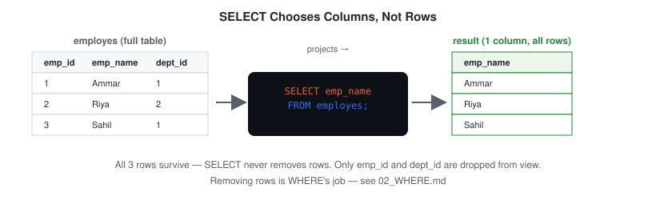
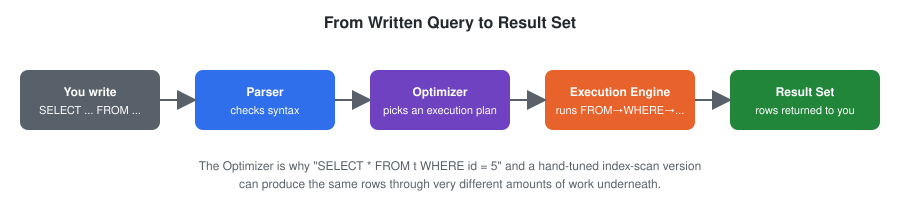

# SELECT

## Definition

The `SELECT` statement retrieves data from one or more columns in a table. It is the starting point of virtually every SQL query — before you can filter, sort, or aggregate anything, you first have to tell SQL which columns you want to see.

---

## Syntax

```sql
SELECT column_name
FROM table_name;
```

Multiple columns:

```sql
SELECT column_one, column_two
FROM table_name;
```

All columns:

```sql
SELECT *
FROM table_name;
```

---

## Visual Explanation

`SELECT` is a **projection** — it decides which *columns* survive into the output. It doesn't touch which rows appear; that's `WHERE`'s job (see [`02_WHERE.md`](./02_WHERE.md)). This distinction — projection vs. selection — is easy to blur because SQL's `SELECT` keyword actually performs projection, not "selection" in the relational-algebra sense.






`SELECT` sits in the *middle* of logical execution order, not first — see [Execution Order](#execution-order) below and the full diagram in [`assets/diagrams/execution-order-flow.svg`](./assets/diagrams/execution-order-flow.svg).

---

## Dialect Differences

`SELECT` itself is identical across every major engine. What differs is how each engine treats **unquoted identifiers** (table/column names):

| Engine | Unquoted identifier case handling |
|---|---|
| MySQL | Preserves case as written; case-sensitivity of matching depends on the OS filesystem for table names |
| PostgreSQL | Folds unquoted identifiers to **lowercase** |
| SQL Server | Preserves case as written; matching is case-insensitive by default collation |
| Oracle | Folds unquoted identifiers to **UPPERCASE** |

This is why `SELECT EMP_NAME FROM EMPLOYES;` and `select emp_name from employes;` can both work in one engine and behave differently in another. Quoting an identifier (`"emp_name"`, `` `emp_name` ``) preserves exact case everywhere — see [`05_ALIAS.md`](./05_ALIAS.md) for quoting syntax per engine.

---

## Schema Used

### employes

| Column | Description |
|----------|-------------|
| emp_id | Employee ID |
| emp_name | Employee Name |
| dept_id | Department ID |
| manager_id | Reporting Manager |

---

## Sample Data

| emp_id | emp_name | dept_id | manager_id |
|---------|----------|----------|------------|
| 1 | Ammar | 1 | 3 |
| 2 | Riya | 2 | 3 |
| 3 | Sahil | 1 | NULL |
| 4 | Priya | 3 | 2 |
| 5 | Arjun | 2 | 1 |

---

## Examples

### Example 1: Retrieve a single column

```sql
SELECT emp_name
FROM employes;
```

### Output

| emp_name |
|-----------|
| Ammar |
| Riya |
| Sahil |
| Priya |
| Arjun |

---

### Example 2: Retrieve multiple columns

```sql
SELECT emp_name, dept_id
FROM employes;
```

---

### Example 3: Retrieve every column

```sql
SELECT *
FROM employes;
```

`SELECT *` is convenient for ad-hoc exploration, but it is discouraged in production code — see [Common Mistakes](#common-mistakes).

---

## Business Use Cases

- View employee names for a directory or org chart
- Retrieve customer information for a CRM export
- Pull a subset of order columns to power a dashboard widget
- Generate lightweight reports without exposing every column in a table

---

## Execution Order

`SELECT` is written first, but it is not the first thing SQL evaluates. The logical execution order of a query is:

1. FROM
2. WHERE
3. GROUP BY
4. HAVING
5. **SELECT**
6. ORDER BY
7. LIMIT

This matters because column aliases created in `SELECT` are not yet available to `WHERE` (see [`05_ALIAS.md`](./05_ALIAS.md)) — the engine hasn't reached `SELECT` yet when it evaluates `WHERE`.

---

## Common Mistakes

### Mistake 1: Missing FROM clause

❌ Wrong

```sql
SELECT emp_name;
```

✅ Correct

```sql
SELECT emp_name
FROM employes;
```

---

### Mistake 2: Using `SELECT *` in production code

`SELECT *` returns every column, including ones you don't need. This increases network I/O, breaks if the table schema changes, and makes queries harder to reason about in code review.

❌ Avoid in production

```sql
SELECT *
FROM employes;
```

✅ Prefer

```sql
SELECT emp_id, emp_name
FROM employes;
```

`SELECT *` is acceptable for quick, one-off exploration of a table you don't know yet.

---

## Edge Cases

- **Querying a table with zero rows** — `SELECT * FROM employes;` on an empty table returns a valid, empty result set (0 rows), not an error. Contrast with querying a table that doesn't exist at all, which *is* an error (`relation "x" does not exist` / `Table 'x' doesn't exist` depending on engine).
- **Duplicate column names in output** — `SELECT emp_name, emp_name FROM employes;` is valid; the same column appears twice in the output, which is rarely useful but not blocked by the parser. This is one reason `SELECT *` combined with a `JOIN` on tables sharing a column name (e.g. both tables having an `id`) produces ambiguous, easy-to-misread output — see [`05_ALIAS.md`](./05_ALIAS.md).

---

## Interview Tip

`SELECT` determines which columns appear in the final output — but it executes logically **after** `FROM`, `WHERE`, `GROUP BY`, and `HAVING`. Interviewers frequently test this by asking why you can't reference a `SELECT` alias inside a `WHERE` clause in the same query. The answer: because `WHERE` runs before `SELECT` is evaluated.

---

## Practice Questions

### Easy

1. Retrieve the name of every employee.
2. Retrieve the employee ID and department ID for every employee.
3. Retrieve every column for every employee.

### Intermediate

4. Retrieve employee name and manager ID, ordered logically for a report (you'll need `ORDER BY` — see [`03_ORDER_BY.md`](./03_ORDER_BY.md)).
5. Explain, in your own words, why `SELECT *` is discouraged in application code.

### Advanced

6. Without running it, predict the output column order for `SELECT dept_id, emp_name FROM employes;` and explain why column order in the output always matches the order listed in `SELECT`.

---

## Related Topics

- WHERE
- ORDER BY
- LIMIT
- ALIAS

---

## Further Reading

- [`GLOSSARY.md`](./GLOSSARY.md) — definitions of "projection," "logical execution order," and other terms used above
- [`FAQ.md`](./FAQ.md) — recurring questions, including `SELECT *` and case sensitivity
- [`INTERVIEW_PREP.md`](./INTERVIEW_PREP.md) — consolidated interview question bank for this module
