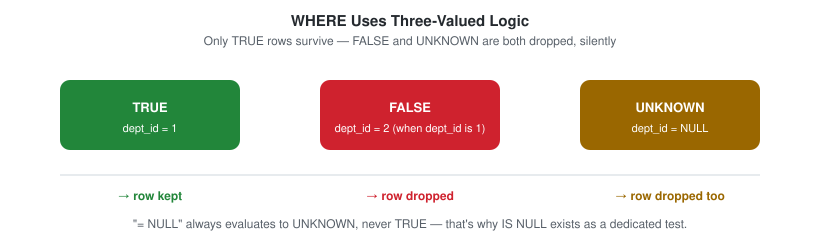
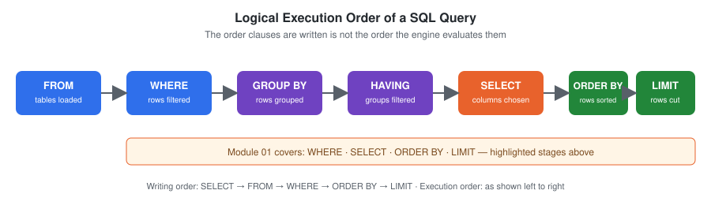
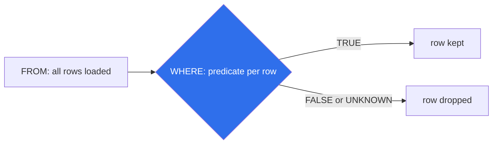

# WHERE Clause

## Definition

The `WHERE` clause is used to filter rows based on a specified condition.

It helps retrieve only the records that satisfy a given requirement before any grouping or aggregation occurs.

---

## Syntax

```sql
SELECT column_name
FROM table_name
WHERE condition;
```

---

## Visual Explanation

`WHERE` filters *rows* using a **predicate** — a condition that resolves to `TRUE`, `FALSE`, or `UNKNOWN` for each row. Only rows where the predicate is `TRUE` survive. `NULL` comparisons resolve to `UNKNOWN`, not `FALSE`, which is why `= NULL` silently matches nothing — see [Common Mistakes](#common-mistakes) below.







---

## Dialect Differences

Standard comparisons (`=`, `<>`, `IS NULL`, `IS NOT NULL`, `AND`/`OR`) behave identically across MySQL, PostgreSQL, SQL Server, and Oracle. Where engines diverge is **null-safe equality** — comparing two columns that might both be `NULL` and treating `NULL = NULL` as a match:

| Engine | Null-safe equality operator |
|---|---|
| MySQL | `<=>` (e.g. `a <=> b`) |
| PostgreSQL | `IS NOT DISTINCT FROM` (e.g. `a IS NOT DISTINCT FROM b`) |
| SQL Server | No dedicated operator — requires `(a = b OR (a IS NULL AND b IS NULL))` |
| Oracle | `DECODE(a, b, 1, 0) = 1` or the same `OR`-based pattern as SQL Server |

`IS NOT DISTINCT FROM` (PostgreSQL) is the closest to an ANSI-standard pattern, though not universally implemented.

---

## Schema Used

### employes

| Column | Description |
|----------|-------------|
| emp_id | Employee ID |
| emp_name | Employee Name |
| dept_id | Department ID |
| manager_id | Reporting Manager |

---

## Sample Data

| emp_id | emp_name | dept_id | manager_id |
|---------|----------|----------|------------|
| 1 | Ammar | 1 | 3 |
| 2 | Riya | 2 | 3 |
| 3 | Sahil | 1 | NULL |
| 4 | Priya | 3 | 2 |
| 5 | Arjun | 2 | 1 |

---

## Examples

### Example 1: Find employees from Data Analytics department

```sql
SELECT *
FROM employes
WHERE dept_id = 1;
```

### Output

| emp_name |
|-----------|
| Ammar |
| Sahil |

---

### Example 2: Find employees who have a manager

```sql
SELECT *
FROM employes
WHERE manager_id IS NOT NULL;
```

---

### Example 3: Find top-level managers

```sql
SELECT *
FROM employes
WHERE manager_id IS NULL;
```

### Output

| emp_name |
|-----------|
| Sahil |

---

## Business Use Cases

- Find employees from a specific department
- Retrieve customers from a specific city
- Find completed orders
- Filter products above a specific price
- Generate department-specific reports

---

## Execution Order

SQL processes queries in the following order:

1. FROM
2. WHERE
3. GROUP BY
4. HAVING
5. SELECT
6. ORDER BY
7. LIMIT

Because `WHERE` runs before `GROUP BY`, it filters rows before aggregation occurs.

---

## Common Mistakes

### Wrong

```sql
SELECT *
FROM employes
WHERE manager_id = NULL;
```

`= NULL` never matches anything, even rows where `manager_id` genuinely is `NULL` — `NULL` is not a value you can compare with `=`, it represents the absence of a value.

### Correct

```sql
SELECT *
FROM employes
WHERE manager_id IS NULL;
```

---

### Wrong

```sql
SELECT dept_id, COUNT(*)
FROM employes
WHERE COUNT(*) > 1
GROUP BY dept_id;
```

`WHERE` cannot use aggregate functions because it executes before `GROUP BY` produces any groups to aggregate.

### Correct

```sql
SELECT dept_id, COUNT(*)
FROM employes
GROUP BY dept_id
HAVING COUNT(*) > 1;
```

---

## Edge Cases

- **`NOT IN` with a `NULL` in the list** — `WHERE dept_id NOT IN (1, NULL)` returns **zero rows**, even for departments that are clearly not `1`. Once any value in a `NOT IN` list is `NULL`, the whole predicate evaluates to `UNKNOWN` for every row. Prefer `NOT EXISTS` (covered in the subqueries module) whenever the list comes from a subquery that might contain `NULL`.
- **String comparisons and collation** — `WHERE emp_name = 'ammar'` may or may not match `'Ammar'` depending on the column's collation setting, which is a database configuration choice, not a SQL-language rule. Don't assume case sensitivity behavior transfers between environments.

---

## Interview Tip

A very common SQL interview question:

### WHERE vs HAVING

| WHERE | HAVING |
|---------|---------|
| Filters rows | Filters groups |
| Executes before GROUP BY | Executes after GROUP BY |
| Cannot use aggregate functions | Can use aggregate functions |

Remember:

**WHERE → Rows**

**HAVING → Groups**

---

## Practice Questions

### Easy

1. Find employees from department 2.
2. Find employees with a manager.
3. Find employees without a manager.

### Intermediate

4. Find employees whose manager is Sahil. (Hint: first find Sahil's `emp_id`, then filter `manager_id` against it — this can be done with a subquery.)
5. Find employees not working in department 1.

### Advanced — Challenge (requires JOIN, covered in `04_Joins`)

6. Find employees working in departments located in Nagpur.
7. Find employees whose department belongs to India.

> Questions 6 and 7 need the `departments` table (see README.md → Datasets) joined to `employes`, which this module doesn't cover yet. Attempt them after completing the joins module, then come back and revisit — it's a useful way to confirm the concept actually stuck.

---

## Related Topics

- SELECT
- GROUP BY
- HAVING
- INNER JOIN
- Subqueries

---

## Further Reading

- [`GLOSSARY.md`](./GLOSSARY.md) — definitions of "predicate" and other terms used above
- [`FAQ.md`](./FAQ.md) — recurring questions
- [`INTERVIEW_PREP.md`](./INTERVIEW_PREP.md) — see "`= NULL` vs `IS NULL`" and "`WHERE` vs `HAVING`"
