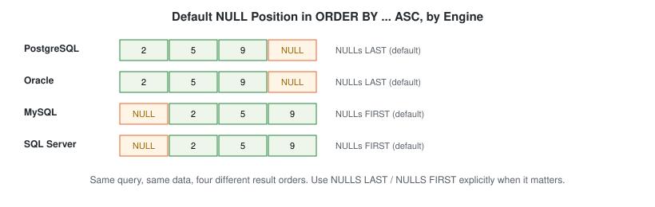

# ORDER BY

## Definition

The `ORDER BY` clause is used to sort query results in ascending (`ASC`) or descending (`DESC`) order.

By default, SQL sorts data in ascending order.

---

## Why Use ORDER BY?

Without `ORDER BY`, SQL does not guarantee the order of returned rows.

Sorting is important for:

- Reports
- Dashboards
- Ranking employees
- Revenue analysis
- Top-N analysis

---

## Syntax

```sql
SELECT column_name
FROM table_name
ORDER BY column_name;
```

Ascending Order:

```sql
SELECT *
FROM employes
ORDER BY emp_name ASC;
```

Descending Order:

```sql
SELECT *
FROM employes
ORDER BY emp_name DESC;
```

---

## Schema Used

### employes

| Column | Description |
|----------|-------------|
| emp_id | Employee ID |
| emp_name | Employee Name |
| dept_id | Department ID |
| manager_id | Manager ID |

---

## Visual Explanation

`ORDER BY` runs near the *end* of logical execution order — after `SELECT` has already chosen the output columns, and right before `LIMIT` cuts the result down.


---

## Dialect Differences

### Where do `NULL`s sort?

This is the single most portability-breaking behavior in `ORDER BY`, and this module's own dataset has `NULL` values in `manager_id` — sorting by `manager_id` will actually surface this difference, not just describe it hypothetically.



| Engine | Default position of `NULL` in `ASC` order |
|---|---|
| PostgreSQL | Last |
| Oracle | Last |
| MySQL | First |
| SQL Server | First |

Make it explicit instead of relying on the default:

```sql
-- PostgreSQL / Oracle — supported directly
SELECT *
FROM employes
ORDER BY manager_id ASC NULLS LAST;

-- MySQL / SQL Server — no NULLS LAST keyword; force it with a CASE
SELECT *
FROM employes
ORDER BY (manager_id IS NULL), manager_id ASC;
```

---

## Sample Data

| emp_id | emp_name | dept_id |
|---------|----------|----------|
| 1 | Ammar | 1 |
| 2 | Riya | 2 |
| 3 | Sahil | 1 |
| 4 | Priya | 3 |
| 5 | Arjun | 2 |

---

## Example 1: Sort Employees Alphabetically

```sql
SELECT *
FROM employes
ORDER BY emp_name;
```

### Output

```text
Ammar
Arjun
Priya
Riya
Sahil
```

---

## Example 2: Sort Employees by ID Descending

```sql
SELECT *
FROM employes
ORDER BY emp_id DESC;
```

### Output

```text
5 Arjun
4 Priya
3 Sahil
2 Riya
1 Ammar
```

---

## Example 3: Sort by Department

```sql
SELECT *
FROM employes
ORDER BY dept_id;
```

---

## Example 4: Multiple Column Sorting

```sql
SELECT *
FROM employes
ORDER BY dept_id, emp_name;
```

SQL first sorts by department and then alphabetically within each department.

---

## Business Use Cases

### HR Analytics

Show newest employees first.

```sql
ORDER BY joining_date DESC
```

### Sales Dashboard

Show highest revenue first.

```sql
ORDER BY revenue DESC
```

### Customer Analytics

Show top spending customers.

```sql
ORDER BY total_spent DESC
```

### Management Reporting

Show departments by employee count.

```sql
ORDER BY employee_count DESC
```

---

## Common Mistakes

### Mistake 1

Assuming SQL automatically returns sorted data.

❌ Wrong Thinking

```sql
SELECT *
FROM employes;
```

Result order is not guaranteed.

✅ Correct

```sql
SELECT *
FROM employes
ORDER BY emp_name;
```

---

### Mistake 2

Using LIMIT before ORDER BY.

❌ Wrong

```sql
SELECT *
FROM employes
LIMIT 3
ORDER BY emp_name;
```

✅ Correct

```sql
SELECT *
FROM employes
ORDER BY emp_name
LIMIT 3;
```

---

## Edge Cases

- **Sorting by a column not in `SELECT`** — `SELECT emp_name FROM employes ORDER BY dept_id;` is valid in most engines even though `dept_id` isn't in the output, because `ORDER BY` has access to the full row, not just the projected columns. Some engines restrict this when `DISTINCT` is also used, since deduplication happens before a column not in the output could be used to sort.
- **Sorting `NULL`s** — see [Dialect Differences](#dialect-differences) above; don't assume a default without checking your engine if the sort order of `NULL`s matters to the result.

---

## Execution Order

SQL executes queries in this order:

1. FROM
2. WHERE
3. GROUP BY
4. HAVING
5. SELECT
6. ORDER BY
7. LIMIT

---

## Interview Tip

### Difference Between ORDER BY ASC and DESC

ASC = Small → Large

```sql
ORDER BY emp_id ASC;
```

DESC = Large → Small

```sql
ORDER BY emp_id DESC;
```

---

## Practice Questions

### Easy

1. Sort employees by name.
2. Sort employees by department ID.
3. Sort employees by employee ID descending.

### Intermediate

4. Sort employees by department and then employee name.
5. Show departments alphabetically.

### Advanced

6. Show departments with employee counts sorted from highest to lowest.
7. Show cities sorted alphabetically.

---

## Related Topics

- SELECT
- WHERE
- LIMIT
- GROUP BY
- HAVING

---

## Further Reading

- [`GLOSSARY.md`](./GLOSSARY.md) — "collation" and "deterministic" definitions
- [`FAQ.md`](./FAQ.md) — "why does my query return rows in a different order every time?"
- [`INTERVIEW_PREP.md`](./INTERVIEW_PREP.md) — see "Does `ORDER BY` put `NULL`s first or last?"
