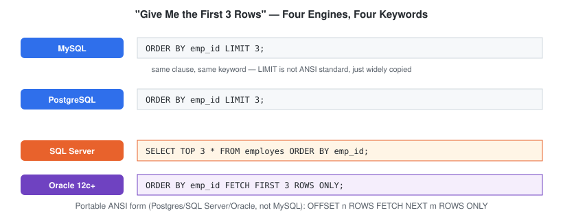

# LIMIT

## Definition

`LIMIT` restricts the number of rows a query returns. It's applied after every other clause — `FROM`, `WHERE`, `GROUP BY`, `HAVING`, `SELECT`, and `ORDER BY` all run first, and `LIMIT` simply truncates the final result set.

---

## Syntax

```sql
SELECT *
FROM table_name
LIMIT 5;
```

Pagination with `OFFSET` — skip the first N rows, then return the next M:

```sql
SELECT *
FROM table_name
LIMIT 5 OFFSET 10;
```

---

## Visual Explanation

`LIMIT` is the last stage of logical execution order — everything else has already run by the time it truncates the result set.


---

## Dialect Differences

`LIMIT` is the **least portable clause covered in this entire module** — it's a MySQL/PostgreSQL extension, not part of the ANSI SQL standard. Writing pagination logic that needs to run on more than one engine means knowing all four of these:



| Engine | "First 3 rows" | "Skip 2, take 3" (pagination) |
|---|---|---|
| MySQL | `LIMIT 3` | `LIMIT 3 OFFSET 2` |
| PostgreSQL | `LIMIT 3` | `LIMIT 3 OFFSET 2` |
| SQL Server | `SELECT TOP 3 * FROM employes ORDER BY emp_id;` | `ORDER BY emp_id OFFSET 2 ROWS FETCH NEXT 3 ROWS ONLY` |
| Oracle (12c+) | `FETCH FIRST 3 ROWS ONLY` | `OFFSET 2 ROWS FETCH NEXT 3 ROWS ONLY` |
| Oracle (legacy, pre-12c) | `WHERE ROWNUM <= 3` | Nested subquery with `ROWNUM` — no direct `OFFSET` equivalent |

The **ANSI-standard, portable form** — supported by PostgreSQL, SQL Server, and modern Oracle, though not by MySQL — is:

```sql
SELECT *
FROM employes
ORDER BY emp_id
OFFSET 2 ROWS
FETCH NEXT 3 ROWS ONLY;
```

If a query needs to run unmodified across engines, this is the form to reach for instead of `LIMIT`.

---

## Schema Used

### employes

| Column | Description |
|----------|-------------|
| emp_id | Employee ID |
| emp_name | Employee Name |
| dept_id | Department ID |
| manager_id | Reporting Manager |

---

## Sample Data

| emp_id | emp_name | dept_id | manager_id |
|---------|----------|----------|------------|
| 1 | Ammar | 1 | 3 |
| 2 | Riya | 2 | 3 |
| 3 | Sahil | 1 | NULL |
| 4 | Priya | 3 | 2 |
| 5 | Arjun | 2 | 1 |

---

## Examples

### Example 1: Return only the first 3 rows

```sql
SELECT *
FROM employes
LIMIT 3;
```

Without `ORDER BY`, which 3 rows come back is not guaranteed — see [Common Mistakes](#common-mistakes).

---

### Example 2: Top-N — highest employee IDs first

```sql
SELECT *
FROM employes
ORDER BY emp_id DESC
LIMIT 3;
```

---

### Example 3: Pagination — page 2, 2 rows per page

```sql
SELECT *
FROM employes
ORDER BY emp_id
LIMIT 2 OFFSET 2;
```

Page 1 is `LIMIT 2 OFFSET 0`, page 2 is `LIMIT 2 OFFSET 2`, page 3 is `LIMIT 2 OFFSET 4`, and so on.

---

## Business Use Cases

- Top 10 highest-spending customers
- First 5 most recent orders on a dashboard
- Paginated results for an API or admin panel
- Sampling a large table during data exploration

---

## Execution Order

SQL executes queries in this order:

1. FROM
2. WHERE
3. GROUP BY
4. HAVING
5. SELECT
6. ORDER BY
7. **LIMIT**

`LIMIT` runs last — it truncates whatever the fully sorted, filtered result set looks like at that point.

---

## Common Mistakes

### Mistake 1: LIMIT does not sort data

`LIMIT` only cuts off rows — it has no opinion on *which* rows come first unless you tell it via `ORDER BY`.

❌ Wrong — "first 3" is undefined without a sort

```sql
SELECT *
FROM employes
LIMIT 3;
```

✅ Correct — deterministic "top 3"

```sql
SELECT *
FROM employes
ORDER BY emp_id
LIMIT 3;
```

---

### Mistake 2: Writing LIMIT before ORDER BY

❌ Wrong — syntax error in MySQL

```sql
SELECT *
FROM employes
LIMIT 3
ORDER BY emp_name;
```

✅ Correct

```sql
SELECT *
FROM employes
ORDER BY emp_name
LIMIT 3;
```

---

## Edge Cases

- **`LIMIT` larger than the table** — `LIMIT 1000` against a 5-row table returns all 5 rows silently; it's not an error to ask for more rows than exist.
- **`LIMIT 0`** — returns zero rows, but the query still runs (useful in application code to validate query syntax/columns without transferring data).
- **`OFFSET` past the end of the data** — `LIMIT 3 OFFSET 100` against a 5-row table returns an empty result set, not an error.

---

## Interview Tip

Interviewers often ask: *"Write a query to find the 2nd highest salary."* The naive answer reaches for `LIMIT 1 OFFSET 1` after sorting descending — which works, but breaks silently on duplicate values (two employees tied for highest salary push the "2nd highest" down incorrectly). Knowing when `LIMIT`/`OFFSET` is the right tool versus when you need `DENSE_RANK()` (covered in the window functions module) is what separates a syntax-level answer from an engineering-level one.

---

## Practice Questions

### Easy

1. Return the first 3 employees (by `emp_id`, ascending).
2. Return the 2 employees with the highest `emp_id`.
3. Return the first 2 departments.

### Intermediate

4. Return employees 3 and 4 when sorted alphabetically by name (i.e. skip the first 2).
5. Design a pagination query returning page 3 of a 2-row-per-page employee listing.

### Advanced

6. Explain why `LIMIT` without `ORDER BY` is considered non-deterministic, and what could cause the same query to return different rows on different runs.

---

## Related Topics

- SELECT
- ORDER BY
- WHERE
- OFFSET

---

## Further Reading

- [`GLOSSARY.md`](./GLOSSARY.md) — "deterministic," "pagination," "ANSI SQL" definitions
- [`FAQ.md`](./FAQ.md) — "do I need `ORDER BY` before I can use `LIMIT`?"
- [`INTERVIEW_PREP.md`](./INTERVIEW_PREP.md) — see "Is `LIMIT` part of the ANSI SQL standard?" and "2nd highest salary"
