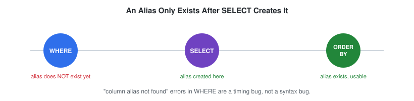

# ALIAS

## Definition

An alias gives a column or table a temporary name for the duration of a query. Column aliases make output more readable; table aliases make multi-table queries (joins, subqueries) shorter and less repetitive.

---

## Syntax

Column alias:

```sql
SELECT emp_name AS employee_name
FROM employes;
```

Table alias:

```sql
SELECT e.emp_name
FROM employes AS e;
```

The `AS` keyword is optional in MySQL — `emp_name employee_name` works identically to `emp_name AS employee_name` — but including it is the convention this handbook follows, since it makes queries easier to scan.

---

## Visual Explanation

An alias is scoped to a single query — it exists from the moment `SELECT` creates it until the query finishes, and is invisible to any clause that runs before `SELECT` in logical execution order.




See the full 7-stage picture in [`assets/diagrams/execution-order-flow.svg`](./assets/diagrams/execution-order-flow.svg) — this is the same rule from [`01_SELECT.md`](./01_SELECT.md) applied specifically to aliases.

---

## Dialect Differences

### Is `AS` required?

| Engine | Column alias | Table alias |
|---|---|---|
| MySQL | Optional | Optional (but `AS` is **not** allowed before a table alias in some MySQL versions — use `employes e`, not `employes AS e`, for maximum compatibility) |
| PostgreSQL | Optional | Optional |
| SQL Server | Optional | `AS` **not allowed** before a table alias (`employes e`, never `employes AS e`) |
| Oracle | Optional | `AS` **not allowed** before a table alias (same restriction as SQL Server) |

This handbook uses `AS` consistently for column aliases (readability), but omits it for table aliases in examples involving joins, since that form is universally accepted.

### Quoting an alias that needs it (reserved words, spaces)

| Engine | Quote character |
|---|---|
| MySQL | `` `backticks` `` |
| PostgreSQL | `"double quotes"` |
| SQL Server | `[square brackets]` or `"double quotes"` |
| Oracle | `"double quotes"` |

Avoiding aliases that need quoting at all (`employee_name` instead of `Employee Name`) sidesteps this inconsistency entirely — the convention this handbook follows.

---

## Schema Used

### employes

| Column | Description |
|----------|-------------|
| emp_id | Employee ID |
| emp_name | Employee Name |
| dept_id | Department ID |
| manager_id | Reporting Manager |

### departments

| Column | Description |
|----------|-------------|
| dept_id | Department ID |
| dept_name | Department Name |
| city | Department city |
| country | Department country |

---

## Examples

### Example 1: Column alias for a cleaner report header

```sql
SELECT
    emp_name AS employee_name,
    dept_id  AS department_id
FROM employes;
```

---

### Example 2: Column alias on an aggregate

```sql
SELECT COUNT(*) AS total_employees
FROM employes;
```

Without the alias, most clients label this column `COUNT(*)`, which is awkward to reference in application code or a BI tool.

---

### Example 3: Table alias in a join (preview)

```sql
SELECT
    e.emp_name,
    d.dept_name
FROM employes AS e
JOIN departments AS d
    ON e.dept_id = d.dept_id;
```

Table aliases (`e`, `d`) remove the need to repeat full table names on every column reference — this becomes essential once queries involve three or more tables. Joins are covered in full in `04_Joins`; this example is here purely to show why table aliasing matters.

---

## Business Use Cases

- Cleaner column headers in reports and dashboards
- Shorter, more readable multi-table queries
- Renaming cryptic database column names (`emp_nm`, `dt_id`) into business-friendly labels for BI tools
- Disambiguating columns with the same name across joined tables (e.g. both `employes` and `departments` could have a `name` column)

---

## Common Mistakes

### Mistake 1: Using a SELECT alias inside WHERE

`WHERE` executes before `SELECT` (see the execution order in [`01_SELECT.md`](./01_SELECT.md)), so an alias defined in `SELECT` doesn't exist yet when `WHERE` runs.

❌ Wrong — errors in MySQL

```sql
SELECT emp_name AS employee_name
FROM employes
WHERE employee_name = 'Ammar';
```

✅ Correct — filter on the real column name

```sql
SELECT emp_name AS employee_name
FROM employes
WHERE emp_name = 'Ammar';
```

---

### Mistake 2: Forgetting to quote aliases containing spaces

```sql
SELECT emp_name AS Employee Name   -- ❌ invalid — parsed as two tokens
FROM employes;
```

```sql
SELECT emp_name AS `Employee Name`   -- ✅ backtick-quoted (MySQL)
FROM employes;
```

Prefer aliases without spaces (`employee_name`) wherever possible — they're portable across databases and don't need quoting.

---

## Edge Cases

- **Aliasing to an existing column name** — `SELECT dept_id AS emp_id FROM employes;` is legal; the output column is labeled `emp_id` but holds `dept_id`'s values. This is legal but actively misleading — avoid it outside of deliberate testing.
- **Same alias used twice** — `SELECT emp_name AS x, dept_id AS x FROM employes;` runs in most engines, but produces two output columns both labeled `x`, making the result ambiguous to consume programmatically.

---

## Interview Tip

A common follow-up question: *"Can you use a column alias in `ORDER BY`?"* Yes — unlike `WHERE`, `ORDER BY` executes **after** `SELECT` in the logical order, so the alias already exists by the time `ORDER BY` runs:

```sql
SELECT emp_name AS employee_name
FROM employes
ORDER BY employee_name;   -- ✅ valid
```

Knowing exactly which clauses can and can't see a `SELECT` alias is a direct test of whether you understand SQL's execution order, not just its syntax.

---

## Practice Questions

### Easy

1. Alias `emp_name` as `full_name`.
2. Alias `COUNT(*)` as `employee_count`.
3. Give the `employes` table the alias `e` and select `e.emp_name`.

### Intermediate

4. Write a query with a column alias, then explain why that alias cannot be reused in the same query's `WHERE` clause.
5. Alias both `employes` and `departments` in a join and select one column from each (preview — full joins covered in `04_Joins`).

### Advanced

6. Explain why table aliases become necessary (not just convenient) once a query joins the same table to itself (a self-join, e.g. matching employees to their managers within `employes`).

---

## Related Topics

- SELECT
- WHERE
- ORDER BY
- JOIN

---

## Further Reading

- [`GLOSSARY.md`](./GLOSSARY.md) — "alias" and "identifier" definitions
- [`FAQ.md`](./FAQ.md) — see the `WHERE`/`ORDER BY` alias-scope question
- [`INTERVIEW_PREP.md`](./INTERVIEW_PREP.md) — see "Why can't I use a `SELECT` alias in `WHERE`?"
