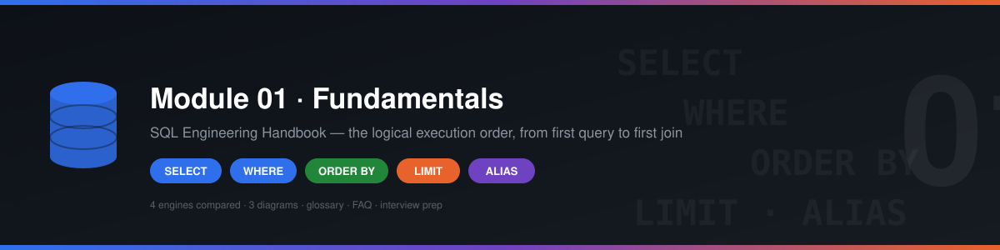
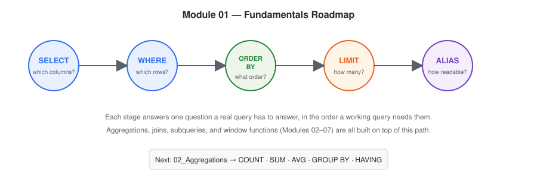

<a id="top"></a>

<p align="center">
  
</p>

<h1 align="center">01 — SQL Fundamentals</h1>

<p align="center">
  <b>Module 1 of the SQL Engineering Handbook</b><br>
  The foundation every advanced SQL concept — aggregations, joins, subqueries, window functions, and CTEs — is built on top of.
</p>

<p align="center">
  <a href="#"></a>
  <a href="#"></a>
  <a href="#"></a>
  <a href="#"></a>
  <a href="#"></a>
  <a href="../CONTRIBUTING.md"></a>
</p>

<p align="center">
  <a href="#-quick-start">Quick Start</a> ·
  <a href="#-topics-covered">Topics</a> ·
  <a href="#-dialect-coverage">Dialects</a> ·
  <a href="#-reference-files">Glossary / FAQ / Interview Prep</a> ·
  <a href="../02_Aggregations">Next Module →</a>
</p>

---

## 📑 Table of Contents

- [Quick Start](#-quick-start)
- [Overview](#-overview)
- [Visual Explanation](#-visual-explanation)
- [Learning Objectives](#-learning-objectives)
- [Datasets Used in This Module](#-datasets-used-in-this-module)
- [Topics Covered](#-topics-covered)
- [Dialect Coverage](#-dialect-coverage)
- [Reference Files](#-reference-files)
- [Folder Structure](#-folder-structure)
- [Recommended Learning Order](#-recommended-learning-order)
- [Skills Developed](#-skills-developed)
- [Real-World Applications](#-real-world-applications)
- [Best Practices](#-best-practices)
- [Prerequisites](#-prerequisites)
- [How to Use This Module](#-how-to-use-this-module)
- [Next Section](#-next-section)

---

## ⚡ Quick Start

New here? Three ways in, pick whichever fits how you learn:

```bash
# 1. Set up the shared dataset (any of these engines work)
psql -f ../00_Schema/01_CREATE_TABLES.sql
psql -f ../00_Schema/02_INSERT_DATA.sql
```

| I want to... | Go to |
|---|---|
| Learn topic by topic, in order | Start with [`01_SELECT.md`](./01_SELECT.md) |
| See the whole module as one picture first | [Visual Explanation](#-visual-explanation) below |
| Look up a term I don't recognize | [`GLOSSARY.md`](./GLOSSARY.md) |
| Cram before an interview | [`INTERVIEW_PREP.md`](./INTERVIEW_PREP.md) |
| Write SQL for SQL Server or Oracle, not MySQL/Postgres | [Dialect Coverage](#-dialect-coverage) below |

---

## 🔎 Overview

This module introduces the **core SQL statements** used to retrieve, filter, sort, and organize data — the four operations that underpin nearly every query you will ever write:

```
SELECT → WHERE → ORDER BY → LIMIT
```

Every advanced topic in this handbook — aggregations, joins, subqueries, window functions, and CTEs — is a layer built on top of these fundamentals. Mastering this module first means every subsequent module will click faster.

---

## 🗺 Visual Explanation



Every topic in this module is a stage in the same underlying process — a written query becoming a result set:


...and within that Execution Engine stage, clauses run in a fixed logical order that does **not** match the order you type them in. This single diagram is referenced from every topic file in this module instead of being redrawn five times:


---

## 🎯 Learning Objectives

By the end of this module, you will be able to:

- [ ] Retrieve data from one or more tables using `SELECT`
- [ ] Filter records efficiently using `WHERE`
- [ ] Sort query results with `ORDER BY`
- [ ] Limit and paginate returned rows using `LIMIT`
- [ ] Improve query readability with column and table aliases (`AS`)
- [ ] Understand how a SQL query is logically executed step by step
- [ ] Write clean, readable, and maintainable SQL

---

## 🗄 Datasets Used in This Module

Every file in this module queries the same two tables so examples stay consistent as you move between topics. Later modules (joins, aggregations) build directly on this same schema.

### `employes`

| Column | Type | Description |
|---|---|---|
| `emp_id` | INT, PK | Unique employee identifier |
| `emp_name` | VARCHAR | Employee full name |
| `dept_id` | INT, FK → `departments.dept_id` | Department the employee belongs to |
| `manager_id` | INT, FK → `employes.emp_id`, nullable | Reporting manager's `emp_id`. `NULL` means top-level (no manager) |

| emp_id | emp_name | dept_id | manager_id |
|---|---|---|---|
| 1 | Ammar | 1 | 3 |
| 2 | Riya | 2 | 3 |
| 3 | Sahil | 1 | NULL |
| 4 | Priya | 3 | 2 |
| 5 | Arjun | 2 | 1 |

### `departments`

| Column | Type | Description |
|---|---|---|
| `dept_id` | INT, PK | Unique department identifier |
| `dept_name` | VARCHAR | Department name |
| `city` | VARCHAR | Department's office city |
| `country` | VARCHAR | Department's office country |

| dept_id | dept_name | city | country |
|---|---|---|---|
| 1 | Data Analytics | Nagpur | India |
| 2 | Marketing | Mumbai | India |
| 3 | Human Resources | Pune | India |

> Questions that need both tables together (e.g. "employees in departments located in Nagpur") require a `JOIN`, which is covered in `04_Joins`. Where this module's practice questions reach that far, they're flagged as **challenge / forward-reference** problems — attempt them once you've completed the joins module.

> **Note on schema simplification:** the tables above are a deliberately small subset of the handbook's canonical schema in [`00_Schema`](../00_Schema) (50 rows across 10 departments and 5 locations), flattened here to 5 rows and a single `departments` table with `city`/`country` columns instead of a separate `locations` table joined by `location_id`. This keeps the *entire* result set of any example small enough to read at a glance while you're learning what each individual clause does in isolation. Once you reach `03_Joins`, you'll work with the full canonical schema — the flattened version here is not the one used for joins, and isn't meant to be a physical migration path to it.

---

## 📖 Topics Covered

| No. | Topic | Description | Files |
|----|-------|--------------|-------|
| 01 | **SELECT** | Retrieve columns and records from a table | [`01_SELECT.md`](./01_SELECT.md) · [`01_SELECT.sql`](./01_SELECT.sql) |
| 02 | **WHERE** | Filter rows using logical conditions | [`02_WHERE.md`](./02_WHERE.md) · [`02_WHERE.sql`](./02_WHERE.sql) |
| 03 | **ORDER BY** | Sort results in ascending or descending order | [`03_ORDER_BY.md`](./03_ORDER_BY.md) · [`03_ORDER_BY.sql`](./03_ORDER_BY.sql) |
| 04 | **LIMIT** | Return only the required number of rows | [`04_LIMIT.md`](./04_LIMIT.md) · [`04_LIMIT.sql`](./04_LIMIT.sql) |
| 05 | **ALIAS** | Improve query readability using temporary names | [`05_ALIAS.md`](./05_ALIAS.md) · [`05_ALIAS.sql`](./05_ALIAS.sql) |

Each `.md` file explains the **concept, syntax, and reasoning**, while the paired `.sql` file contains **runnable, annotated examples** against the shared `employes` / `departments` dataset above.

---

## 🌐 Dialect Coverage

Every topic file in this module includes a **Dialect Differences** section comparing MySQL, PostgreSQL, SQL Server, and Oracle. Most of `SELECT`/`WHERE`/`ORDER BY`/`ALIAS` is portable as written — `LIMIT` is the exception and the highest-value comparison in the module:

| Topic | What varies by engine |
|---|---|
| SELECT | Unquoted identifier case-folding (preserved / lowercased / uppercased) |
| WHERE | Null-safe equality operator (`<=>` / `IS NOT DISTINCT FROM` / no dedicated operator) |
| ORDER BY | Default `NULL` sort position (first vs. last) |
| LIMIT | Entirely different keyword: `LIMIT` / `TOP` + `OFFSET...FETCH` / `ROWNUM` + `FETCH FIRST` |
| ALIAS | Whether `AS` is permitted before a table alias; identifier quoting character |

---

## 📚 Reference Files

Beyond the five topic files, this module includes three cross-cutting references:

| File | Purpose |
|---|---|
| [`GLOSSARY.md`](./GLOSSARY.md) | Terms used across topic files (predicate, projection, collation, dialect...), defined once |
| [`FAQ.md`](./FAQ.md) | Recurring beginner questions that don't belong to one specific topic |
| [`INTERVIEW_PREP.md`](./INTERVIEW_PREP.md) | Every topic file's "Interview Tip" consolidated into one pre-interview review sheet, with likely follow-up questions |

---

## 📂 Folder Structure

<details>
<summary>Click to expand — 20 files, all one flat level deep</summary>

```
01_Fundamentals/
│
├── README.md
├── GLOSSARY.md
├── FAQ.md
├── INTERVIEW_PREP.md
│
├── 01_SELECT.md
├── 01_SELECT.sql
├── 02_WHERE.md
├── 02_WHERE.sql
├── 03_ORDER_BY.md
├── 03_ORDER_BY.sql
├── 04_LIMIT.md
├── 04_LIMIT.sql
├── 05_ALIAS.md
├── 05_ALIAS.sql
│
└── assets/
    ├── README.md
    ├── SVG_SPECIFICATION.md
    └── diagrams/
        ├── hero-banner.svg
        ├── module-roadmap.svg
        ├── query-lifecycle.svg
        ├── execution-order-flow.svg
        ├── select-projection.svg
        ├── predicate-truth-values.svg
        ├── nulls-sort-order.svg
        ├── limit-dialect-comparison.svg
        └── alias-scope-timeline.svg
```

</details>

---

## 📌 Recommended Learning Order

Each topic builds on the one before it — work through them in sequence rather than jumping around:

```
1. SELECT     → what data can I see?
2. WHERE      → which rows matter?
3. ORDER BY   → in what order should I see them?
4. LIMIT      → how many do I actually need?
5. ALIAS      → how do I make this readable?
```

---

## 🧠 Skills Developed

Working through this module strengthens your ability to:

- Read and understand relational datasets
- Write syntactically correct, logically sound SQL queries
- Improve query readability through consistent formatting and aliasing
- Apply filtering and sorting techniques to answer real business questions
- Build a solid foundation for joins, aggregations, and advanced querying

---

## 💼 Real-World Applications

These fundamentals are used daily by:

`Data Analysts` · `Business Analysts` · `Analytics Engineers` · `Data Engineers` · `Backend Developers` · `Database Administrators`

**Typical use cases:**
- Retrieving customer records
- Filtering sales transactions
- Finding top-performing products
- Exploring and profiling new datasets
- Powering reports and dashboards

---

## 💡 Best Practices

> A query that *works* isn't the same as a query that's *good*. As you go through this module, hold yourself to these standards:

- ✅ Always format SQL for readability (consistent casing, indentation, line breaks)
- ✅ Use meaningful, descriptive aliases — not `a`, `b`, `t1`
- ✅ Avoid `SELECT *` in production queries — select only what you need
- ✅ Write queries that answer a **business question**, not just demonstrate syntax
- ✅ Understand *why* a query works — not just *that* it returns a result

---

## 🎯 Prerequisites

**None.** This module is designed for complete beginners and serves as the entry point to the SQL Engineering Handbook.

---

## 🛠 How to Use This Module

1. Read the `.md` file for a topic to understand the concept and syntax.
2. Create the `employes` and `departments` tables from the [Datasets](#-datasets-used-in-this-module) section above in a database of your choice (PostgreSQL, MySQL, or SQLite all work).
3. Open the matching `.sql` file and run the examples against that data.
4. Modify the queries — change conditions, columns, and sort orders — to see how behavior changes.
5. Move to the next topic only once you're comfortable explaining the current one out loud.
6. On SQL Server or Oracle instead? Each topic file's **Dialect Differences** section gives the equivalent syntax — this matters most for `04_LIMIT.md`, since `LIMIT` itself doesn't exist on either engine.

> ⏱ **Estimated time:** 2–3 hours for the lessons and examples, plus additional time for hands-on practice.

---

## 🚀 Next Section

Once you've completed this module, continue to:

➡️ **[`02_Aggregations`](../02_Aggregations)** — learn to summarize, group, and analyze data using `COUNT()`, `SUM()`, `AVG()`, `MIN()`, `MAX()`, `GROUP BY`, and `HAVING`.

---

## 🙌 Found a Mistake or Have a Better Example?

This handbook is open source and improves through contributions. Before opening a PR against this module:

- Check [`../STYLE_GUIDE.md`](../STYLE_GUIDE.md) for formatting conventions this module already follows
- Check [`../CONTRIBUTING.md`](../CONTRIBUTING.md) for the PR process
- Small fixes (typos, broken links, a clearer example) are always welcome without prior discussion; larger structural changes are easier to land if opened as an issue first

---

<table align="center">
<tr>
<td align="center">⬅️<br><b>Previous</b><br><sub>None — this is the first module</sub></td>
<td align="center">🏠<br><b><a href="../">Handbook Home</a></b><br><sub>All modules</sub></td>
<td align="center">➡️<br><b><a href="../02_Aggregations">Next</a></b><br><sub>02_Aggregations</sub></td>
</tr>
</table>

<p align="center">
  <sub>Part of the <a href="../">SQL Engineering Handbook</a> · <a href="#top">Back to top ↑</a></sub>
</p>
