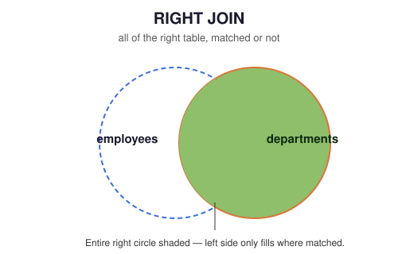

# 03 — RIGHT JOIN

> Keep every row from the right table; fill in `NULL` where the left table has no match.

**Difficulty:** Beginner · **Estimated time:** 20–30 min · **Prerequisites:** `02_LEFT_JOIN.md`

---

## 📑 Contents

- [Learning Objectives](#learning-objectives)
- [Concept Overview](#concept-overview)
- [Business Context](#business-context)
- [Syntax](#syntax)
- [Execution Flow](#execution-flow)
- [Engineering Notes](#engineering-notes)
- [Vendor Notes](#vendor-notes)
- [Edge Cases](#edge-cases)
- [Common Mistakes](#common-mistakes)
- [Best Practices](#best-practices)
- [Interview Questions](#interview-questions)
- [Practice Challenges](#practice-challenges)
- [Further Reading](#further-reading)

---

## Learning Objectives

1. Explain RIGHT JOIN as the mirror image of LEFT JOIN, and rewrite any RIGHT JOIN as an equivalent LEFT JOIN with table order swapped.
2. Justify, with a concrete example, why most style guides discourage RIGHT JOIN in new code even though it's fully standard SQL.
3. Prove — not just assert — that an unmatched right-side row is preserved, by writing a query whose result *demonstrates* the preservation rather than merely returning columns that look the same either way.

---

## Concept Overview

<p align="center">
  
</p>

RIGHT JOIN (`RIGHT OUTER JOIN`) is LEFT JOIN with the preserved side flipped: every row from the **right** table appears in the result, matched or not, with `NULL` filling any column pulled from the left table for unmatched rows.

RIGHT JOIN adds no new capability to SQL — anything expressible with `A RIGHT JOIN B` is identically expressible as `B LEFT JOIN A`. It exists for readability in cases where the "table I care about preserving" happens to already be second in a query you're extending, not because it does anything LEFT JOIN can't.

## Business Context

**Where companies use it:** genuinely, rarely, by deliberate choice. It shows up most often when a query is being incrementally built — someone has a working multi-table `LEFT JOIN` chain and needs to add "preserve this other table too" without restructuring the whole `FROM` clause. It's also common to encounter in **legacy or generated SQL** (ORM output, older reporting tools) rather than hand-written queries.

**Why most style guides avoid it:** a codebase mixing LEFT and RIGHT JOIN forces every reader to track two different mental models for "which side is preserved." Standardizing on LEFT JOIN only, and reordering tables in the `FROM` clause instead, means "the preserved table is always the one on the left" is a rule with zero exceptions — which is worth far more than the four characters saved by writing `RIGHT` instead of reordering.

---

## Syntax

```sql
SELECT
    e.emp_name,
    d.dept_name
FROM employees e
RIGHT JOIN departments d
    ON e.dept_id = d.dept_id;
```

Here `departments` (right table) is fully preserved — every department appears, even one with zero employees. This is the **exact same result set** as:

```sql
SELECT
    e.emp_name,
    d.dept_name
FROM departments d
LEFT JOIN employees e
    ON e.dept_id = d.dept_id;
```

---

## Execution Flow

```
FROM employees e             (left — only matched rows survive)
    │
    ▼
RIGHT JOIN departments d ON e.dept_id = d.dept_id   ← unmatched RIGHT rows kept,
    │                                                   left-side columns become NULL
    ▼
SELECT e.emp_name, d.dept_name
```

### Step-by-Step Walkthrough — Proving Preservation

The original version of this file's query returned only `emp_name, dept_name` — which cannot actually distinguish "a department with one employee" from "a department with none," since both produce exactly one visible row. That's a documentation bug on its own terms: it asserts a behavior without a query that proves it. Here's a query that does:

```sql
SELECT
    d.dept_name,
    e.emp_name,
    COUNT(*) OVER (PARTITION BY d.dept_id) AS matching_rows_for_this_dept
FROM employees e
RIGHT JOIN departments d
    ON e.dept_id = d.dept_id
ORDER BY d.dept_name;
```

Run against the seed data, **Legal** (`dept_id = 60`, zero employees) appears as a single row with `emp_name = NULL` and `matching_rows_for_this_dept = 1` — proof that RIGHT JOIN produced a row for it despite no match, rather than the row simply not existing in the output at all.

---

## Engineering Notes

The `ON`-vs-`WHERE` placement trap from `02_LEFT_JOIN.md` applies identically here, mirrored: filtering the **left** table's columns in `WHERE` (instead of `ON`) silently drops unmatched right rows, degrading the RIGHT JOIN to an INNER JOIN. Same rule, opposite side.

## Vendor Notes

- **ANSI SQL / PostgreSQL / SQL Server / Oracle:** `RIGHT JOIN` is fully standard and behaves identically across these.
- **MySQL:** supported identically — no deviation. (MySQL's real outer-join limitation is `FULL OUTER JOIN`, covered in `04_FULL_OUTER_JOIN.md`, not `RIGHT JOIN`.)

---

## Edge Cases

Identical NULL, duplicate-row, and cardinality behavior to LEFT JOIN, mirrored to the opposite side. See `02_LEFT_JOIN.md` for the full treatment — repeating it here would just be the same rules with "left" and "right" swapped.

---

## Common Mistakes

**❌ Writing a RIGHT JOIN whose SELECT list can't actually prove which rows were preserved** — this is precisely the bug in this file's original query, and it's worth internalizing as a general documentation/code-review habit: if a query's claimed behavior depends on rows you can't distinguish in the output, the query (or the accompanying comment) is incomplete.

**❌ Mixing LEFT and RIGHT JOIN in the same multi-table query without a strong reason** — readable in isolation, genuinely hard to reason about once a third or fourth table is chained on. See `07_MULTI_TABLE_JOINS.md`.

---

## Best Practices

- Default to LEFT JOIN with reordered tables rather than RIGHT JOIN, unless you're modifying an existing query where reordering would create a larger, riskier diff.
- If you do use RIGHT JOIN, add a comment stating which table is being preserved — readers scan for `LEFT` out of habit and can miss a `RIGHT` mid-query.
- When proving a join's behavior (in documentation, tests, or code review), select or count something that can only exist if the "preserved" behavior actually happened — not just columns that happen to look identical either way.

---

## Interview Questions

1. **"Rewrite this RIGHT JOIN as a LEFT JOIN without changing the result."** — swap the `FROM` and `JOIN` table order; this is asked specifically to confirm the candidate understands RIGHT JOIN isn't a distinct concept, just a mirrored one.

2. **"Why do most SQL style guides recommend avoiding RIGHT JOIN?"** — readability/consistency, not correctness; see [Business Context](#business-context).

3. **"Find all departments with zero employees, using RIGHT JOIN."**
   ```sql
   SELECT d.dept_name
   FROM employees e
   RIGHT JOIN departments d ON e.dept_id = d.dept_id
   WHERE e.emp_id IS NULL;
   ```

---

## Summary

RIGHT JOIN preserves the right table exactly as LEFT JOIN preserves the left — it's a readability choice, not a distinct capability, and any RIGHT JOIN can be rewritten as a LEFT JOIN with the tables swapped. Most production style guides standardize on LEFT JOIN only for consistency; know RIGHT JOIN well enough to read it in legacy code, but default to LEFT JOIN in anything you write.

## Practice Challenges

1. Find every department with zero employees, using RIGHT JOIN — then rewrite the identical query using LEFT JOIN instead, and confirm both return the same rows.
2. Using `COUNT(e.emp_id)` (not `COUNT(*)`) alongside `GROUP BY d.dept_name`, produce active headcount per department **including departments with zero employees** — explain why `COUNT(e.emp_id)` returns `0` here instead of `NULL` or an error for Legal.
3. Find every location with zero departments assigned to it, if any exist in the current seed data — if none do, explain what you'd need to add to `schema/00_schema_setup.sql` to test this case, and why the module's authors left the data that way.

## Further Reading

- [`02_LEFT_JOIN.md`](./02_LEFT_JOIN.md) — the direct mirror of this file.
- [`04_FULL_OUTER_JOIN.md`](./04_FULL_OUTER_JOIN.md) — LEFT and RIGHT, combined.
