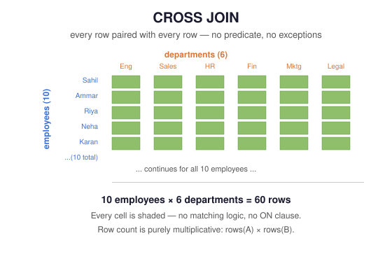

# 05 — CROSS JOIN

> Pair every row of the left table with every row of the right table — no join condition, no matching logic, just the full Cartesian product.

**Difficulty:** Beginner → Intermediate · **Estimated time:** 25–35 min · **Prerequisites:** `01_INNER_JOIN.md`

---

## 📑 Contents

- [Learning Objectives](#learning-objectives)
- [Concept Overview](#concept-overview)
- [Business Context](#business-context)
- [Syntax](#syntax)
- [Execution Flow](#execution-flow)
- [Engineering Notes](#engineering-notes)
- [Vendor Notes](#vendor-notes)
- [Edge Cases](#edge-cases)
- [Common Mistakes](#common-mistakes)
- [Best Practices](#best-practices)
- [Interview Questions](#interview-questions)
- [Practice Challenges](#practice-challenges)
- [Further Reading](#further-reading)

---

## Learning Objectives

1. Explain why CROSS JOIN has no `ON` clause, and calculate its output row count from the two input row counts alone.
2. Distinguish an intentional, well-designed CROSS JOIN (date spines, combinatorial generation) from an accidental one (a forgotten join predicate).
3. Build a date-spine or "every X × every Y" combinatorial report — the single most common legitimate production use of CROSS JOIN.

---

## Concept Overview

<p align="center">
  
</p>

CROSS JOIN produces every possible pairing of rows between two tables — the full Cartesian product, with no filtering at all. If `employees` has 10 rows and `departments` has 6, `employees CROSS JOIN departments` returns exactly **60 rows**, every one of the 10×6 combinations, regardless of whether `dept_id` values line up.

This is the join type every other join in this module is secretly built on top of: INNER JOIN, conceptually, is "compute the CROSS JOIN, then keep only the rows where the `ON` predicate is true." CROSS JOIN is what you get when you skip that filtering step entirely — deliberately.

## Business Context

**Where companies legitimately use it:**
- **Date spines** — generating one row per day/month for a reporting period, then LEFT JOINing actual data onto it, so a chart doesn't have gaps for days/months with zero activity.
- **Combinatorial generation** — "every product × every size" for a retail SKU matrix, "every sales rep × every territory" for a coverage-planning grid.
- **Test data generation** — quickly generating N×M rows of synthetic data for load testing.

**Where it shows up by accident:** almost everywhere else. A forgotten `WHERE` clause on an implicit comma-join (`FROM a, b`), or a missing `ON` clause typo, silently produces a CROSS JOIN instead of the INNER JOIN the author intended — this is covered exhaustively in `01_INNER_JOIN.md`'s Common Mistakes section, and it's worth re-reading here with CROSS JOIN's row-count math in mind: on real table sizes, an accidental CROSS JOIN doesn't just return "extra rows," it can return billions of rows and take down a database.

---

## Syntax

```sql
SELECT
    e.emp_name,
    d.dept_name
FROM employees e
CROSS JOIN departments d;
```

No `ON` clause — that's not an omission, it's the defining feature. Some dialects also allow the comma form (`FROM employees e, departments d`) to mean the same thing, but **never use the comma form**: it's visually indistinguishable from a forgotten `INNER JOIN` predicate, whereas `CROSS JOIN` unambiguously signals "this Cartesian product is intentional" to every future reader.

---

## Execution Flow

```
FROM employees e            (10 rows)
    │
    ▼
CROSS JOIN departments d    (6 rows)   ← no predicate; every pairing is kept
    │
    ▼
SELECT e.emp_name, d.dept_name          → 10 × 6 = 60 rows
```

There is no "matched vs. unmatched" concept for CROSS JOIN — every row on both sides participates in every output row exactly once per counterpart.

---

## Engineering Notes

**Row count is purely multiplicative:** `rows(A) × rows(B)`, with no dependency on data values at all — unlike every other join in this module, you can compute the exact output row count from the two input counts alone, before running the query or looking at any data.

**CROSS JOIN with a WHERE clause is a legitimate, common pattern** — and it's worth recognizing this isn't "secretly an INNER JOIN in disguise" so much as it *is*, definitionally, one valid way to write one:

```sql
-- Equivalent to an INNER JOIN, written via CROSS JOIN + WHERE.
-- Legal and occasionally seen in generated SQL, but prefer explicit
-- INNER JOIN ... ON for anything hand-written — it states intent directly.
SELECT e.emp_name, d.dept_name
FROM employees e
CROSS JOIN departments d
WHERE e.dept_id = d.dept_id;
```

## Vendor Notes

- **ANSI SQL / PostgreSQL / MySQL / SQL Server / Oracle:** `CROSS JOIN` syntax and behavior is standard and identical across all four.
- **PostgreSQL / SQL Server:** both offer `generate_series()` / a numbers/tally table respectively, frequently paired with `CROSS JOIN` to build date spines — see the practice challenges below.

---

## Edge Cases

**Zero rows on either side:** a CROSS JOIN where either table is empty returns zero rows — `0 × N = 0` — which is the one case where the multiplicative row-count rule can surprise someone expecting "at least some" output.

**Duplicate rows:** not really a distinct "edge case" for CROSS JOIN the way it is for the other joins — every duplicate row on one side simply multiplies through normally, exactly as the row-count formula predicts. There's no matching logic to be confused by duplicates in the first place.

---

## Common Mistakes

**❌ An accidental CROSS JOIN from a missing predicate**, which on production-sized tables is a genuine incident, not a cosmetic bug — a 10,000-row table CROSS JOINed against a 5,000-row table produces 50,000,000 rows, easily enough to exhaust memory or lock up a shared database for every other query running against it.

**❌ Using CROSS JOIN for a genuinely relational question** (i.e., you actually do have a foreign key relating the two tables) — if a join predicate exists in your data model, express it with `INNER JOIN ... ON`, not `CROSS JOIN ... WHERE`. The explicit form documents the relationship for the next reader; the CROSS JOIN + WHERE form hides it.

---

## Best Practices

- Write `CROSS JOIN` explicitly, never the bare-comma form — the keyword itself is the safeguard against an accidental Cartesian product being mistaken for an intended one.
- Before running a CROSS JOIN against real (not seed/test) data, compute `rows(A) × rows(B)` by hand or with a quick `SELECT COUNT(*)` on each side first — it costs one extra query and prevents a genuinely dangerous accident.
- If you're building a date spine or combinatorial matrix, generate the smaller "dimension" side (e.g., dates, sizes) programmatically rather than hardcoding it, so it stays correct as the reporting window changes.

---

## Interview Questions

1. **"Table A has 500 rows, table B has 30. How many rows does `A CROSS JOIN B` return?"** — exactly 15,000, always, regardless of data values.
2. **"What's the difference between `CROSS JOIN` and an `INNER JOIN` with an always-true condition (`ON 1=1`)?"** — none functionally; `ON 1=1` is a way of writing a CROSS JOIN using `INNER JOIN` syntax, occasionally seen in generated SQL, but `CROSS JOIN` states the same intent more clearly.
3. **"Give a real production use case for CROSS JOIN that isn't a mistake."** — a date spine or combinatorial matrix; see [Business Context](#business-context) and the practice challenges.

---

## Summary

CROSS JOIN produces the unfiltered Cartesian product of two tables — `rows(A) × rows(B)`, always. It's dangerous by accident (a missing predicate on large tables) and genuinely useful by design (date spines, combinatorial matrices). The keyword itself, used explicitly rather than via comma-join, is what separates "I meant to do this" from "I forgot a WHERE clause" in code review.

## Practice Challenges

1. Compute, without running anything, the exact row count of `employees CROSS JOIN locations` using the seed data's row counts, then verify with `SELECT COUNT(*)`.
2. Build a "coverage matrix" showing every department paired with every location, with a `TRUE`/`FALSE` (or `1`/`0`) column indicating whether that department is actually assigned to that location — this requires a CROSS JOIN plus a `CASE` comparing against the real `departments.location_id`.
3. Research your database's date/number-generation function (`generate_series()` in PostgreSQL, a recursive CTE or tally table in MySQL/SQL Server) and sketch — in comments, no need to run it — a query that CROSS JOINs a 12-month date spine against `departments` to produce one row per department per month, ready for a LEFT JOIN onto real monthly headcount data.

## Further Reading

- [`01_INNER_JOIN.md`](./01_INNER_JOIN.md) — Common Mistakes section covers the accidental-CROSS-JOIN failure mode in detail.
- [`07_MULTI_TABLE_JOINS.md`](./07_MULTI_TABLE_JOINS.md) — combining CROSS JOIN with other join types in a single query.
