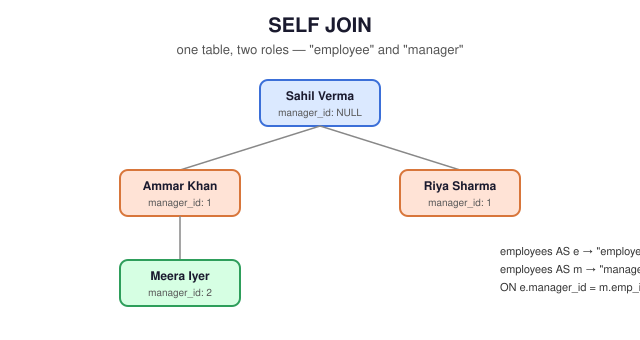

# 06 — SELF JOIN

> Join a table to itself, treating the two references as if they were separate tables — the standard technique for modeling relationships between rows in the same table.

**Difficulty:** Intermediate · **Estimated time:** 30–40 min · **Prerequisites:** `01_INNER_JOIN.md`, `02_LEFT_JOIN.md`

---

## 📑 Contents

- [Learning Objectives](#learning-objectives)
- [Concept Overview](#concept-overview)
- [Business Context](#business-context)
- [Syntax](#syntax)
- [Execution Flow](#execution-flow)
- [Engineering Notes](#engineering-notes)
- [Vendor Notes](#vendor-notes)
- [Edge Cases](#edge-cases)
- [Common Mistakes](#common-mistakes)
- [Best Practices](#best-practices)
- [Interview Questions](#interview-questions)
- [Practice Challenges](#practice-challenges)
- [Further Reading](#further-reading)

---

## Learning Objectives

1. Explain why a self join requires two distinct aliases for the same physical table, and why the query would be ambiguous (or invalid) without them.
2. Choose correctly between `INNER JOIN` and `LEFT JOIN` for a self join, based on whether "no match" (e.g., no manager) is a valid business state to preserve.
3. Extend a single-level self join (employee → direct manager) toward multi-level hierarchy traversal, and explain why a plain self join can't answer "how many levels deep does this org chart go" on its own.

---

## Concept Overview

A self join is not a distinct SQL feature — it's an ordinary `JOIN` where both sides of the `FROM`/`JOIN` clause reference the *same* table, distinguished only by alias. The database has no idea it's "the same table twice"; from its perspective, `employees e` and `employees m` are simply two row sources that happen to share a physical table on disk.

This technique is how SQL expresses relationships between rows *within* one table — most commonly, hierarchies (employee → manager, category → parent category, comment → parent comment) where a foreign key points back into the same table it lives in.

## Schema Example

<p align="center">
  
</p>

```
employees

| emp_id | emp_name     | manager_id |
|--------|--------------|------------|
| 1      | Sahil Verma  | NULL       |  ← top of hierarchy, no manager
| 2      | Ammar Khan   | 1          |
| 3      | Riya Sharma  | 1          |
| 10     | Meera Iyer   | 2          |  ← reports to Ammar, who reports to Sahil
```

`manager_id` is a foreign key referencing `employees.emp_id` — the same table it belongs to. That self-reference is what makes this a self join scenario rather than an ordinary two-table join.

## Business Context

**Where companies use it:** any reporting-line or parent-child hierarchy — org charts, category trees (a "Laptops" product category nested under "Electronics"), threaded comments/replies, bill-of-materials structures (a sub-assembly that's itself made of other parts). Every one of these is modeled the same way: a foreign key on a table that points back to that table's own primary key.

---

## Syntax

```sql
SELECT
    e.emp_name  AS employee,
    m.emp_name  AS manager
FROM employees e
LEFT JOIN employees m
    ON e.manager_id = m.emp_id;
```

### Syntax Breakdown

| Clause | Purpose |
|---|---|
| `FROM employees e` | The "employee" role — every row represents a person being reported on. |
| `LEFT JOIN employees m` | The "manager" role — the *same table*, aliased differently, representing the person being reported *to*. |
| `ON e.manager_id = m.emp_id` | The self-referencing relationship: this employee's `manager_id` must equal that manager-row's `emp_id`. |

**LEFT JOIN, not INNER JOIN, is the correct default here** — Sahil Verma has `manager_id = NULL` (he's the top of the org). An INNER JOIN would silently drop him from the result entirely, which is almost never what a hierarchy report actually wants.

---

## Execution Flow

```
FROM employees e            (every employee, in the "report" role)
    │
    ▼
LEFT JOIN employees m ON e.manager_id = m.emp_id     ← same table, "manager" role;
    │                                                    NULL manager_id preserved
    ▼
SELECT e.emp_name AS employee, m.emp_name AS manager
```

### Step-by-Step Walkthrough

Against the seed data, Sahil Verma (`manager_id = NULL`) produces one row: `employee = 'Sahil Verma', manager = NULL`. Ammar Khan (`manager_id = 1`) produces `employee = 'Ammar Khan', manager = 'Sahil Verma'`. All 10 employees appear exactly once, since each `manager_id` value matches at most one row in the manager role.

---

## Engineering Notes

**Aliasing is not optional here — it's structurally required.** Without two distinct aliases, `SELECT emp_name FROM employees JOIN employees ON manager_id = emp_id` is ambiguous (which `employees.emp_name`?) or an outright syntax error in most dialects, since the table would be referenced twice with no way to distinguish the references. This is the one join type in this module where forgetting aliases isn't a style violation — it's a correctness requirement.

**Multi-level hierarchy traversal is a different problem.** The query above answers "who is this person's *direct* manager" — one level. It cannot answer "how many levels of management exist between this employee and the CEO" or "list every person in Sahil Verma's reporting chain, at any depth" — that requires a **recursive CTE**, a separate technique outside this module's scope (see `Further Reading`). A common interview trap is asking for "the full management chain" and expecting the candidate to recognize that a single self join only gets one level deep.

## Vendor Notes

- **ANSI SQL / PostgreSQL / MySQL / SQL Server / Oracle:** self joins use identical, fully standard syntax across all four — there's no vendor deviation in the join itself. (Recursive traversal beyond one level *does* have vendor-specific syntax — `WITH RECURSIVE` in Postgres/MySQL 8+, `WITH` in SQL Server/Oracle — but that's outside this file's scope.)

---

## Edge Cases

**NULL behavior:** a `NULL manager_id` (top of the hierarchy) is a legitimate business state, not missing data — this is precisely why LEFT JOIN, not INNER JOIN, is the correct default for self joins on hierarchy data.

**One-to-one within one-to-many:** each employee has *at most one* direct manager (one-to-one from the "report" side), but each manager can have *many* direct reports (one-to-many from the "manager" side) — the same self join, read in the opposite direction (`FROM employees m LEFT JOIN employees e ON e.manager_id = m.emp_id`), answers "list this manager's direct reports" instead of "find this employee's manager."

**Circular references:** nothing in this schema prevents `manager_id` from eventually forming a cycle (A manages B, B manages A) — a single-level self join won't detect this, and a naive recursive CTE without a cycle guard will loop forever. Worth knowing this risk exists even though this module's seed data doesn't contain one.

---

## Common Mistakes

**❌ Using INNER JOIN and silently losing the top of the hierarchy:**

```sql
-- ❌ Drops Sahil Verma (manager_id IS NULL) entirely
SELECT e.emp_name AS employee, m.emp_name AS manager
FROM employees e
INNER JOIN employees m ON e.manager_id = m.emp_id;
```

**❌ Forgetting which side is which** — it's easy to accidentally swap `e.manager_id = m.emp_id` for `e.emp_id = m.manager_id`, which silently reverses the relationship (producing "direct reports" instead of "manager") without any error. Always sanity-check the output against a row you know the real-world answer for.

---

## Best Practices

- Use role-based aliases (`e`/`m` for employee/manager, or fuller names like `emp`/`mgr` in longer queries) rather than generic `t1`/`t2` — the alias should tell the reader which role each reference plays.
- Default to LEFT JOIN for hierarchy self joins unless you have a specific, stated reason to exclude top-of-hierarchy rows.
- If a business question genuinely needs "how deep" or "the full chain," recognize immediately that a single self join is the wrong tool and a recursive CTE is needed instead — don't try to force multi-level traversal by chaining several self joins together (it only works for a hardcoded, fixed depth, and breaks the moment the org restructures).

---

## Interview Questions

1. **"Write a query showing each employee and their manager's name."** — the canonical self-join question; see [Syntax](#syntax).
2. **"Find all employees who have no manager."**
   ```sql
   SELECT emp_name FROM employees WHERE manager_id IS NULL;
   ```
   (Note: this doesn't require a join at all — a common trap is over-engineering a self join when a simple `WHERE` suffices.)
3. **"Count how many direct reports each manager has."**
   ```sql
   SELECT m.emp_name AS manager, COUNT(e.emp_id) AS direct_reports
   FROM employees m
   LEFT JOIN employees e ON e.manager_id = m.emp_id
   GROUP BY m.emp_name
   ORDER BY direct_reports DESC;
   ```
4. **"How would you find someone's entire management chain, not just their direct manager?"** — a strong answer immediately names a recursive CTE rather than attempting to chain self joins.

---

## Summary

A self join is an ordinary join where both sides reference the same physical table under different aliases — the standard way to model within-table relationships like hierarchies. LEFT JOIN, not INNER JOIN, is almost always the right default, since the "no match" case (no manager, no parent category) is typically a legitimate business state rather than bad data. One self join reaches exactly one level of a hierarchy; deeper traversal needs a recursive CTE.

## Practice Challenges

1. Write a query showing, for each manager, a comma-separated list of their direct reports' names (hint: research your database's string-aggregation function — `STRING_AGG` in Postgres, `GROUP_CONCAT` in MySQL).
2. Find every employee-manager pair where the manager was hired *after* the employee they manage — a plausible data-quality flag (a newer hire managing a longer-tenured employee isn't necessarily wrong, but it's worth a second look).
3. Sketch (in comments, no need to fully implement) how you'd extend the single-level self join in this file into a recursive CTE that lists every person in Sahil Verma's reporting chain at any depth.

## Further Reading

- [`07_MULTI_TABLE_JOINS.md`](./07_MULTI_TABLE_JOINS.md) — combining a self join with other joins in one query.
- PostgreSQL docs: [Recursive Queries (`WITH RECURSIVE`)](https://www.postgresql.org/docs/current/queries-with.html#QUERIES-WITH-RECURSIVE) — the natural next step once one-level self joins feel comfortable.
