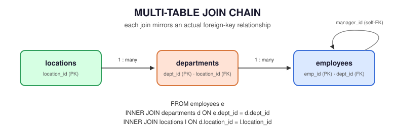

# 07 — Multi-Table Joins

> Chain three or more tables together in a single query — the normal shape of real-world SQL, not a special case.

**Difficulty:** Intermediate · **Estimated time:** 40–50 min · **Prerequisites:** `01_INNER_JOIN.md` through `06_SELF_JOIN.md`

---

## 📑 Contents

- [Learning Objectives](#learning-objectives)
- [Concept Overview](#concept-overview)
- [Business Context](#business-context)
- [Schema Used](#schema-used)
- [Syntax](#syntax)
- [Execution Flow](#execution-flow)
- [Engineering Notes — Join Order](#engineering-notes--join-order)
- [Semi Joins and Anti Joins](#semi-joins-and-anti-joins)
- [Vendor Notes](#vendor-notes)
- [Edge Cases](#edge-cases)
- [Common Mistakes](#common-mistakes)
- [Best Practices](#best-practices)
- [Interview Questions](#interview-questions)
- [Practice Challenges](#practice-challenges)
- [Further Reading](#further-reading)

---

## Learning Objectives

1. Build a three-table join incrementally, verifying row counts at each step rather than writing the full chain at once.
2. Explain why the join graph's structure — a chain vs. a star vs. a mix of INNER/LEFT — determines how carefully you need to reason about row multiplication.
3. Distinguish semi joins and anti joins from a regular join, and choose the right one for "does a match exist" vs. "give me the matched columns" questions.

---

## Concept Overview

Every join in this module so far has combined exactly two tables. Real schemas are normalized into many small, focused tables precisely so that each table represents one thing cleanly — which means almost every non-trivial business question requires traversing several tables to answer. A multi-table join is not a distinct SQL feature; it's simply multiple `JOIN` clauses chained in one `FROM` clause, each with its own `ON` predicate, evaluated left to right (logically, though not necessarily physically — see [Join Order](#engineering-notes--join-order)).

## Business Context

This is, in practical terms, **the most common shape of query in production analytics and reporting code.** A two-table join is a stepping stone; a three-, four-, or five-table join answering "which employees, in which departments, in which cities, hired in which quarter, are earning above their department's median" is what actual dashboards and reports look like.

---

## Schema Used

<p align="center">
  
</p>

```
locations (1) ──────< departments (1) ──────< employees
                                                   │
                                                   │ manager_id (self-FK)
                                                   └──────┘
```

Every query in this file traverses `employees → departments → locations`, optionally folding in the self-referencing `manager_id` from `06_SELF_JOIN.md`.

---

## Syntax

```sql
SELECT
    e.emp_name,
    d.dept_name,
    l.city
FROM employees e
INNER JOIN departments d
    ON e.dept_id = d.dept_id
INNER JOIN locations l
    ON d.location_id = l.location_id;
```

Each `JOIN` clause only ever references tables already introduced earlier in the `FROM` clause — `locations` is joined against `departments` (already in scope), not against `employees` directly, because that's the actual foreign-key relationship. This is worth stating explicitly: **join predicates should mirror the real foreign-key graph**, not just "any two columns that happen to share a name."

---

## Execution Flow

```
FROM employees e                                          (10 rows)
    │
    ▼
INNER JOIN departments d ON e.dept_id = d.dept_id          (9 rows survive —
    │                                                        Farhan Ali dropped)
    ▼
INNER JOIN locations l ON d.location_id = l.location_id    (rows further reduced
    │                                                        if any dept has no location —
    │                                                        Marketing does, dropping its
    │                                                        1 employee too)
    ▼
SELECT e.emp_name, d.dept_name, l.city
```

### Step-by-Step Walkthrough

Build this incrementally rather than trusting the final row count blind:

1. `employees ⋈ departments`: 9 rows (per `01_INNER_JOIN.md`).
2. Add `⋈ locations`: Marketing has `location_id = NULL`, so its one employee (none currently, but any future Marketing hire) would drop out of an INNER JOIN chain at this step. With the current seed data, this step doesn't remove any additional rows, since no *currently-employed* person sits in Marketing — but it's a live risk the moment someone is hired there, which is exactly why testing each join incrementally (rather than writing all three tables at once and trusting the final count) matters in practice, not just as a learning exercise.

---

## Engineering Notes — Join Order

**Logical order vs. physical order.** SQL's `FROM ... JOIN ... JOIN ...` reads top-to-bottom, and it's tempting to assume the engine executes it in that literal sequence. It usually doesn't — the query optimizer is free to reorder joins based on cost estimates (table sizes, available indexes, selectivity of each predicate), as long as the *result* is identical to what the written order would produce for INNER JOINs. **This reordering freedom does not extend to LEFT/RIGHT JOIN chains** — mixing outer and inner joins changes what the optimizer is allowed to reorder, because swapping the order of an outer join can change the result. See `08_JOIN_PERFORMANCE.md` for reading `EXPLAIN` output to see the actual chosen order.

**Build incrementally, not all at once.** The single highest-leverage habit for multi-table joins: write and run the two-table join first, confirm the row count matches your mental model, *then* add the third table and re-check, rather than writing a five-table join in one pass and debugging an unexpected row count with no idea which join introduced the problem.

---

## Semi Joins and Anti Joins

Not every multi-table question needs columns from every table — sometimes you only need to know **whether a match exists**, without pulling any data from the other side. These are semi joins (does a match exist) and anti joins (does *no* match exist) — SQL has no dedicated keyword for either; they're expressed via `EXISTS`/`NOT EXISTS`, `IN`/`NOT IN`, or the `LEFT JOIN ... IS NULL` pattern from `02_LEFT_JOIN.md`.

```sql
-- SEMI JOIN: departments that have at least one employee earning > 150000
-- (a plain JOIN would duplicate the department once per qualifying employee —
-- EXISTS returns each department at most once)
SELECT d.dept_name
FROM departments d
WHERE EXISTS (
    SELECT 1 FROM employees e
    WHERE e.dept_id = d.dept_id AND e.salary > 150000
);

-- ANTI JOIN: departments with NO employees earning > 150000
SELECT d.dept_name
FROM departments d
WHERE NOT EXISTS (
    SELECT 1 FROM employees e
    WHERE e.dept_id = d.dept_id AND e.salary > 150000
);
```

**Three ways to write an anti join — only two are safe:**

| Pattern | Safe with NULLs in the subquery column? |
|---|---|
| `NOT EXISTS (SELECT 1 FROM ... WHERE ...)` | ✅ Always safe — recommended default |
| `LEFT JOIN ... WHERE right.key IS NULL` | ✅ Always safe |
| `WHERE col NOT IN (SELECT nullable_col FROM ...)` | ❌ **Broken if `nullable_col` can contain `NULL`** — silently returns zero rows for every input row |

This `NOT IN` NULL trap is one of the most consequential gotchas in this entire module: `x NOT IN (1, 2, NULL)` evaluates to `NULL` (not `TRUE`) for *any* `x`, because SQL's three-valued logic means "is x equal to NULL" is never resolvable to false. If the subquery's column has even one `NULL` value anywhere, the entire `NOT IN` filter silently matches nothing. Always prefer `NOT EXISTS` or `LEFT JOIN ... IS NULL` for anti joins in production code.

## Vendor Notes

- **ANSI SQL / PostgreSQL / MySQL / SQL Server / Oracle:** `EXISTS`/`NOT EXISTS` and multi-table `JOIN` chains are fully standard across all four. Query optimizers differ in *how* they cost and reorder joins internally, but the SQL you write is portable.

---

## Edge Cases

**Cardinality compounds across the chain.** If `employees ⋈ departments` is one-to-many and `departments ⋈ locations` is many-to-one, the combined three-table join's row count is still driven by the `employees` side — but if a fourth table introduced a genuine many-to-many relationship anywhere in the chain (e.g., a hypothetical `employee_skills` bridge table), row counts can multiply unexpectedly at that step specifically. Always verify at the join where a new table enters the chain, not just at the end.

**Mixing INNER and LEFT JOIN in one chain** changes which upstream table's "gaps" get preserved. `employees LEFT JOIN departments ... INNER JOIN locations ...` behaves differently from `employees LEFT JOIN departments ... LEFT JOIN locations ...` — an unmatched employee (no department) flows through with `NULL` department and location either way, but a matched employee whose department has no location gets dropped entirely by the second form's `INNER JOIN` and preserved (with `NULL` city) by the `LEFT JOIN` form. Decide this deliberately per join, not by habit.

---

## Common Mistakes

**❌ Joining a table against the wrong upstream table** because two columns happen to share a name — e.g., joining `locations` directly against `employees` on some coincidental shared column instead of via `departments`, which doesn't reflect the actual foreign-key relationship and will silently produce a nonsensical result if the columns happen to be type-compatible.

**❌ Using `NOT IN` for an anti join without checking the subquery column for NULLs first** — see [Semi Joins and Anti Joins](#semi-joins-and-anti-joins) above.

**❌ Writing the full multi-table chain before testing any of it** — makes debugging an unexpected row count far harder than it needs to be.

---

## Best Practices

- Build multi-table joins one join at a time, checking row counts against your expectations at each step.
- Mirror the actual foreign-key graph in your join order and predicates — don't join tables together just because a column name matches.
- Default to `NOT EXISTS` (or `LEFT JOIN ... IS NULL`) for anti joins; treat `NOT IN` against a nullable column as a bug waiting to happen.
- When mixing INNER and LEFT JOIN in a chain, be able to state out loud which upstream gaps you're deliberately preserving and which you're deliberately dropping.

---

## Interview Questions

1. **"Write a query joining three tables to answer [some business question]."** — the most common multi-table interview format; practice building it incrementally out loud, narrating each join as you add it.
2. **"What's wrong with using `NOT IN` for an anti join here?"** — the NULL trap; be ready to name it immediately and propose `NOT EXISTS` instead.
3. **"Does SQL execute your joins in the order you wrote them?"** — no, for INNER JOIN chains the optimizer can reorder freely based on cost; this constraint loosens/tightens with outer joins mixed in. See [Join Order](#engineering-notes--join-order).

---

## Summary

Multi-table joins are the normal shape of real analytical SQL, not an advanced special case — build them incrementally, verify row counts as you go, and mirror the real foreign-key graph rather than joining on coincidentally-matching column names. Semi and anti joins (`EXISTS`/`NOT EXISTS`) answer "does a match exist" questions more safely and often more efficiently than a regular join followed by filtering — and `NOT IN` against a nullable column is one of the highest-value gotchas to have memorized cold.

## Practice Challenges

1. Extend the three-table join in this file to also show whether each employee's manager (via `manager_id`) works in the same city — this requires joining `employees` a second time through the `departments`/`locations` chain, via a different alias path.
2. Write a semi join finding every location that has at least one department with budget over 1,000,000, and an anti join finding every location with no such department — using `EXISTS`/`NOT EXISTS` for both.
3. Deliberately introduce a `NOT IN` NULL-trap bug against `departments.location_id` (which does contain a `NULL`, for Marketing) by writing `SELECT dept_name FROM departments WHERE location_id NOT IN (SELECT location_id FROM departments WHERE location_id IS NOT NULL... )` variants until you reproduce the empty-result trap firsthand, then fix it with `NOT EXISTS`.

## Further Reading

- [`08_JOIN_PERFORMANCE.md`](./08_JOIN_PERFORMANCE.md) — reading `EXPLAIN` to see the optimizer's actual chosen join order.
- [`09_BUSINESS_CASES.md`](./09_BUSINESS_CASES.md) — full worked scenarios combining everything in this module.
