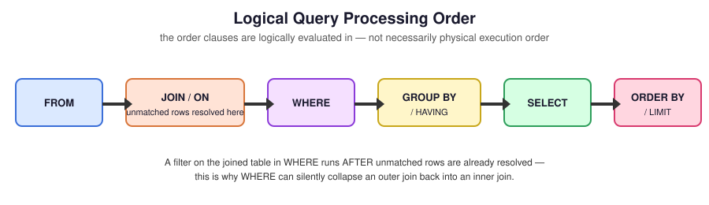
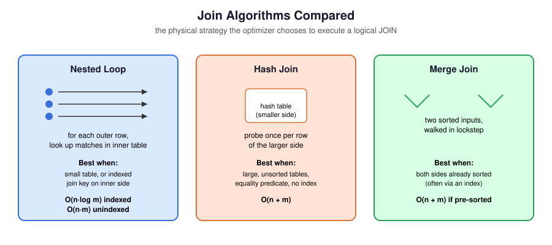

# 08 — Join Performance

> Everything before this file taught correctness. This file teaches speed — reading execution plans, choosing indexes, and recognizing the query shapes that scale and the ones that don't.

**Difficulty:** Intermediate → Advanced · **Estimated time:** 45–60 min · **Prerequisites:** `01_INNER_JOIN.md` through `07_MULTI_TABLE_JOINS.md`

---

## 📑 Contents

- [Learning Objectives](#learning-objectives)
- [Concept Overview](#concept-overview)
- [Reading EXPLAIN](#reading-explain)
- [Join Algorithms, Revisited](#join-algorithms-revisited)
- [Index Strategy for Joins](#index-strategy-for-joins)
- [Join Elimination, Reordering, and Predicate Pushdown](#join-elimination-reordering-and-predicate-pushdown)
- [Star Schema and Fact/Dimension Joins](#star-schema-and-factdimension-joins)
- [Vendor Notes](#vendor-notes)
- [Common Mistakes](#common-mistakes)
- [Best Practices](#best-practices)
- [Interview Questions](#interview-questions)
- [Practice Challenges](#practice-challenges)
- [Further Reading](#further-reading)

---

## Learning Objectives

1. Read `EXPLAIN` (or `EXPLAIN ANALYZE`) output well enough to identify which join algorithm actually ran and whether an index was used.
2. Explain, with real cost trade-offs, when to add an index for a join predicate and when it wouldn't help.
3. Describe join elimination, join reordering, and predicate pushdown as optimizer behaviors — not things you write, but things you can enable or block by how you write a query.
4. Recognize a star-schema fact/dimension join shape and know why it's typically the cheapest kind of multi-table join to execute.

---

## Concept Overview

<p align="center">
  
</p>

Every query in this module up to now has run correctly against ten employees and six departments without any thought to performance — at that scale, every join algorithm finishes in microseconds regardless of which one the optimizer picks. That stops being true the moment tables reach production scale: hundreds of thousands or millions of rows, joined across several tables, running dozens of times a minute. At that point, the difference between a well-indexed hash join and an unindexed nested loop isn't a rounding error — it's the difference between a dashboard that loads and one that times out.

This file is about the layer beneath the SQL you write: how the engine actually executes it, and what you can do to influence that.

---

## Reading EXPLAIN

`EXPLAIN` shows the query plan the optimizer chose, without running the query; `EXPLAIN ANALYZE` (PostgreSQL) actually executes it and reports real timing alongside the plan. Always prefer `EXPLAIN ANALYZE` when available and safe to run (careful with it on write queries or expensive reads against production) — the *estimated* costs in a plain `EXPLAIN` can be badly wrong if the table's statistics are stale.

```sql
EXPLAIN ANALYZE
SELECT e.emp_name, d.dept_name
FROM employees e
INNER JOIN departments d
    ON e.dept_id = d.dept_id
WHERE e.status = 'active';
```

What to look for in the output (PostgreSQL terminology; MySQL/SQL Server/Oracle use different labels for the same underlying concepts — see [Vendor Notes](#vendor-notes)):

| Look for | What it tells you |
|---|---|
| `Nested Loop` / `Hash Join` / `Merge Join` | Which physical algorithm was chosen — see the next section for how to interpret this |
| `Seq Scan` on a table you expect to be filtered/joined via an index | A missing or unused index — the single most common actionable finding |
| `Index Scan` / `Index Only Scan` | The join or filter is using an index as expected |
| Estimated rows vs. actual rows (in `ANALYZE` output) | A large mismatch means the optimizer's statistics are stale (run `ANALYZE table_name`) or the query has a correlation the optimizer can't model — either way, a signal to investigate |
| Total cost / actual time | The bottom-line number, but the *shape* of the plan (which scans, which joins) usually matters more than the raw number for diagnosing a specific slow query |

---

## Join Algorithms, Revisited

<p align="center">
  
</p>

`01_INNER_JOIN.md` introduced these three; here's what actually triggers each one in practice:

**Nested Loop Join** is chosen when one side is small (or has been filtered down to a small number of rows before the join) and the other side has a usable index on the join key — the engine loops over the small side and does an indexed lookup into the large side per row. This is often the *fastest* option at small-to-medium scale, not a fallback to avoid; the reputation "nested loop = slow" only holds when it's an **unindexed** nested loop (a full scan of the inner table per outer row), which degrades to O(n·m).

**Hash Join** is chosen for large, roughly equal-sized, unsorted inputs on an equality predicate — the optimizer builds an in-memory (or spill-to-disk, if it doesn't fit) hash table on the smaller side, then streams the larger side through a single probe pass. This is usually the right choice for big analytical joins with no useful index, and it's the algorithm you want to confirm is running for a large fact-to-dimension join (see [Star Schema](#star-schema-and-factdimension-joins) below).

**Merge Join** is chosen when both inputs are already sorted on the join key — most often because an index on that column provides the sort order for free. It's efficient (a single linear pass over both sorted inputs) but requires that sort to already exist or be cheap to produce; forcing a sort specifically to enable a merge join is sometimes *more* expensive than a hash join would have been, and the optimizer generally accounts for this correctly on its own.

**The practical takeaway:** you rarely choose the algorithm directly (though most engines offer optimizer hints as an escape hatch) — you influence the choice through indexing, table statistics, and query shape, then verify with `EXPLAIN` that the engine chose what you expected.

---

## Index Strategy for Joins

- **Index every foreign key used as a join predicate**, full stop. `schema/00_schema_setup.sql` does this for `employees.dept_id`, `employees.manager_id`, and `departments.location_id` — this is not incidental; it's the single highest-leverage indexing decision for a join-heavy schema.
- **Composite indexes matter when a join predicate is combined with a filter.** If most queries join `employees` to `departments` on `dept_id` *and* filter on `status = 'active'`, a composite index on `(dept_id, status)` can let the engine satisfy both the join and the filter from one index scan, rather than an index scan plus a separate filter step.
- **An index doesn't help a join predicate that isn't an equality (or a small set of supported operators) on indexed, comparably-typed columns.** Joining `ON e.hire_date > d.founded_date` against a plain B-tree index on `hire_date` alone won't produce the same clean lookup an equality join gets — range-predicate joins are inherently more expensive, and it's worth recognizing that up front rather than being surprised by `EXPLAIN` output.
- **Type mismatches silently defeat indexes.** Joining an `INT` column to a `VARCHAR` column (or vice versa) usually forces an implicit cast on one side, which can make the index on that column unusable for the join. This is a genuine, common production performance bug, and it produces no error — only a slow query and a `Seq Scan` in the plan where you expected an `Index Scan`.

---

## Join Elimination, Reordering, and Predicate Pushdown

These are optimizer behaviors, not syntax you write — understanding them explains *why* two differently-written but logically equivalent queries can produce identical plans, and why some rewrites you might expect to help actually don't.

**Join elimination:** if a joined table's columns aren't referenced anywhere in the `SELECT` list, `WHERE`, or `GROUP BY`, and the join is guaranteed not to change the row count or duplicate rows (e.g., an INNER JOIN on a unique, non-nullable foreign key with no other predicate), some optimizers can eliminate the join entirely — it never touches the second table at runtime. This mostly matters for generated SQL (ORMs, views) that join tables defensively "just in case" a column is needed.

**Join reordering:** covered in `07_MULTI_TABLE_JOINS.md` — the optimizer is free to execute INNER JOINs in a different order than written, based on cost estimates, as long as the result is identical.

**Predicate pushdown:** a filter written in an outer query (or applied to a view/CTE) can be "pushed down" to run earlier, closer to the table scan, rather than after all the joins complete — dramatically reducing the number of rows that flow through subsequent join steps. This is why `WHERE e.status = 'active'` in a query joining three tables can sometimes be pushed all the way down to the `employees` scan itself, filtering before any join happens at all, even though it's written at the end of the query. Modern optimizers do this automatically for simple cases; it becomes less reliable across `UNION`, some window function usage, and some CTE materialization behaviors (particularly older PostgreSQL versions, which historically treated every CTE as an optimization fence — this changed in PostgreSQL 12+).

---

## Star Schema and Fact/Dimension Joins

Analytical (as opposed to transactional) schemas are frequently organized as a **star schema**: one large **fact table** (e.g., `order_line_items`, one row per event) surrounded by several smaller **dimension tables** (e.g., `customers`, `products`, `dates`) that the fact table's foreign keys point to.

```
                    dim_customers
                          │
dim_products ─────  fact_order_line_items  ───── dim_dates
                          │
                    dim_locations
```

This shape is specifically favorable for join performance: each fact-to-dimension join is typically a large table joined to a much smaller one on an indexed (often surrogate integer) key — exactly the profile a hash join or index-nested-loop handles well, and exactly the reason star schemas remain the dominant modeling pattern in data warehouses despite "just normalize everything" being the transactional-database default. `09_BUSINESS_CASES.md` includes a worked star-schema example.

## Vendor Notes

- **PostgreSQL:** `EXPLAIN ANALYZE` is the standard diagnostic tool; `pg_stat_statements` for aggregate query performance over time.
- **MySQL:** `EXPLAIN` (add `ANALYZE` in MySQL 8.0.18+ for real execution stats); the `type` column (`ALL`, `index`, `range`, `ref`, `eq_ref`, `const`) is MySQL's terminology for scan/join efficiency, roughly analogous to Postgres's scan node types.
- **SQL Server:** `SET STATISTICS IO, TIME ON` alongside the graphical execution plan; look for "Index Seek" (good) vs. "Table Scan"/"Index Scan" (investigate) on large tables.
- **Oracle:** `EXPLAIN PLAN FOR ...` followed by querying `PLAN_TABLE`, or `DBMS_XPLAN.DISPLAY`; look for `NESTED LOOPS`, `HASH JOIN`, `MERGE JOIN` operations directly in the plan tree.

---

## Common Mistakes

**❌ Adding an index and assuming it's being used** — always confirm with `EXPLAIN`. An index can exist and still be ignored by the optimizer (stale statistics, a type mismatch, a function wrapped around the indexed column, or the optimizer correctly deciding a full scan is actually cheaper for a small table).

**❌ Over-indexing** — every index speeds up reads on that column but slows down every write to the table (the index must be maintained on every `INSERT`/`UPDATE`/`DELETE`). Index the columns actually used as join predicates and frequent filter conditions, not defensively every column.

**❌ Wrapping a joined or filtered column in a function** (`WHERE UPPER(e.emp_name) = 'AMMAR KHAN'`, or joining `ON YEAR(e.hire_date) = d.fiscal_year`) — this typically prevents a plain B-tree index from being used at all, forcing a full scan. Prefer normalizing data at write time (a stored, indexed `emp_name_upper` column, or a computed/functional index if your database supports one) over wrapping the predicate at read time.

---

## Best Practices

- Run `EXPLAIN ANALYZE` (or your vendor's equivalent) on any join query touching a table over roughly 10,000 rows before shipping it — don't guess.
- Index every foreign key used in a join predicate as a matter of course, not as an afterthought once something is slow.
- When a join is slow, check in this order: (1) is the join predicate on indexed, type-matched columns, (2) are table statistics current, (3) is a wrapped/function-based predicate defeating an otherwise-good index, (4) does the query genuinely need to touch this much data, or would an earlier filter (predicate pushdown, or a pre-aggregated table) reduce the join's input size.
- For analytical workloads with a genuine fact/dimension shape, model it as a star schema rather than deeply normalizing — the join performance and query simplicity gains are substantial at scale.

---

## Interview Questions

1. **"A join query is slow. Walk me through how you'd diagnose it."** — `EXPLAIN ANALYZE` first, check for `Seq Scan` where an `Index Scan` was expected, check for a type mismatch or wrapped predicate, check whether statistics are stale.
2. **"When would a nested loop join outperform a hash join?"** — when one side is small and the other has a usable index on the join key; nested loop's reputation for being slow only applies to the *unindexed* case.
3. **"What is predicate pushdown, and can you rely on it happening automatically?"** — the optimizer moving a filter earlier in execution to reduce rows flowing into a join; mostly automatic for simple queries, less reliable across older CTE materialization behavior, `UNION`, and some window function usage — always verify with `EXPLAIN` rather than assuming.

---

## Summary

Correctness is necessary but not sufficient — the same logically correct join can run in milliseconds or minutes depending on indexing, table statistics, and the algorithm the optimizer chooses. `EXPLAIN`/`EXPLAIN ANALYZE` is how you stop guessing: confirm which algorithm ran, confirm indexes are actually used, and understand that join elimination, reordering, and predicate pushdown mean the plan you get is often not the literal sequence you wrote — which is a feature, as long as you can verify it's doing what you expect.

## Practice Challenges

1. Run `EXPLAIN ANALYZE` on the three-table join from `07_MULTI_TABLE_JOINS.sql` Q1, and identify which join algorithm was chosen for each of the two joins.
2. Temporarily drop `idx_employees_dept_id` (`DROP INDEX idx_employees_dept_id;`), rerun the same `EXPLAIN ANALYZE`, and compare the plan — then recreate the index from `schema/00_schema_setup.sql`.
3. Sketch a composite index that would best serve a query joining `employees` to `departments` on `dept_id` while also filtering `WHERE e.status = 'active'` — and explain, in a comment, why column order within the composite index matters for whether it's usable.

## Further Reading

- [`09_BUSINESS_CASES.md`](./09_BUSINESS_CASES.md) — a worked star-schema fact/dimension example.
- PostgreSQL docs: [Using EXPLAIN](https://www.postgresql.org/docs/current/using-explain.html)
- PostgreSQL docs: [Planner Statistics](https://www.postgresql.org/docs/current/planner-stats.html)
