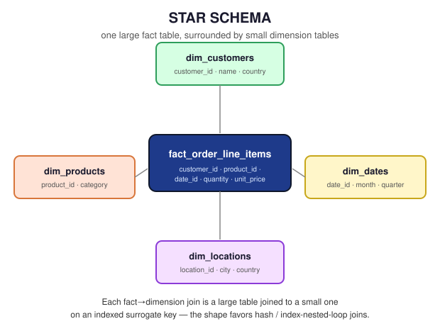

# 09 — Business Cases

> Capstone module: full worked business scenarios that combine everything in `01`–`08`, plus a star-schema e-commerce example to connect this module's HR schema to the analytical fact/dimension pattern from `08_JOIN_PERFORMANCE.md`.

**Difficulty:** Advanced · **Estimated time:** 45–60 min · **Prerequisites:** all preceding files in this module

---

## 📑 Contents

- [Learning Objectives](#learning-objectives)
- [Why This File Exists](#why-this-file-exists)
- [Scenario A — HR: Compensation Equity Review](#scenario-a--hr-compensation-equity-review)
- [Scenario B — E-Commerce: Star Schema Sales Analysis](#scenario-b--e-commerce-star-schema-sales-analysis)
- [Scenario C — Data Migration Reconciliation](#scenario-c--data-migration-reconciliation)
- [Interview Questions](#interview-questions)
- [Practice Challenges](#practice-challenges)
- [Further Reading](#further-reading)

---

## Learning Objectives

1. Combine joins with `GROUP BY`, window functions, and CTEs to answer a business question that no single join type alone can answer.
2. Read an unfamiliar star-schema fact/dimension diagram and write the correct fact-to-dimension joins without being told the foreign keys explicitly.
3. Take a real (if simplified) ambiguous business request and translate it into a precise, joinable SQL question — the actual day-to-day skill this entire module has been building toward.

---

## Why This File Exists

Every prior file in this module isolated one concept — one join type, one technique — against the same small HR schema. Real tickets don't arrive labeled "this is a LEFT JOIN problem." They arrive as a Slack message from a stakeholder, and the first job is figuring out *which* join type(s), aggregation, and filtering actually answer the question being asked. This file works through three such scenarios end to end, including the schema-reading step, not just the final query.

---

## Scenario A — HR: Compensation Equity Review

**The request, as it actually arrives:** *"Can you pull department-level salary stats, but I only care about departments with more than one person, and flag anyone earning more than 20% above their department's average — that's usually where we find equity issues."*

**Translating the ask:** this needs (1) per-department aggregate stats, (2) a `HAVING` filter on headcount, (3) a way to compare each individual employee's salary against their *own department's* average — which requires either a self-join back to a pre-aggregated subquery, or a window function.

```sql
-- Step 1: department stats with the headcount filter, as a CTE
WITH dept_stats AS (
    SELECT
        dept_id,
        COUNT(*)         AS headcount,
        AVG(salary)       AS avg_salary
    FROM employees
    WHERE status = 'active'
    GROUP BY dept_id
    HAVING COUNT(*) > 1
)
-- Step 2: join individual employees back to their department's stats
SELECT
    e.emp_name,
    d.dept_name,
    e.salary,
    ROUND(ds.avg_salary, 2)                         AS dept_avg_salary,
    ROUND((e.salary - ds.avg_salary) / ds.avg_salary * 100, 1) AS pct_above_avg
FROM employees e
INNER JOIN dept_stats ds
    ON e.dept_id = ds.dept_id
INNER JOIN departments d
    ON e.dept_id = d.dept_id
WHERE e.salary > ds.avg_salary * 1.2
ORDER BY pct_above_avg DESC;
```

**Engineering notes:** the CTE (`dept_stats`) is doing exactly what a subquery in the `FROM` clause would, but named — this matters for readability once a query has multiple layers, which this one does. The `HAVING COUNT(*) > 1` filter belongs in the CTE, not the outer query, because by the time the outer query runs, the aggregation has already collapsed — you can't `HAVING` on a column that's no longer grouped.

**Alternative using a window function** (often preferred in modern analytical SQL — avoids the CTE + re-join entirely):

```sql
SELECT emp_name, dept_name, salary, pct_above_avg
FROM (
    SELECT
        e.emp_name,
        d.dept_name,
        e.salary,
        ROUND(
            (e.salary - AVG(e.salary) OVER (PARTITION BY e.dept_id))
            / AVG(e.salary) OVER (PARTITION BY e.dept_id) * 100, 1
        ) AS pct_above_avg,
        COUNT(*) OVER (PARTITION BY e.dept_id) AS dept_headcount
    FROM employees e
    INNER JOIN departments d ON e.dept_id = d.dept_id
    WHERE e.status = 'active'
) sub
WHERE dept_headcount > 1 AND pct_above_avg > 20
ORDER BY pct_above_avg DESC;
```

`AVG(...) OVER (PARTITION BY e.dept_id)` computes each department's average *without collapsing the row-per-employee grain* — no separate aggregation step or re-join required. This is generally the more idiomatic modern approach; the CTE version above is included because recognizing both forms, and the tradeoff between them, is itself a common interview and code-review skill.

---

## Scenario B — E-Commerce: Star Schema Sales Analysis

**The request:** *"What's our monthly revenue by product category, for customers in each country, for the last quarter?"* This is intentionally a different domain and a different schema shape than the rest of this module, to demonstrate that everything learned so far transfers directly to an unfamiliar star schema.

**Schema (fact/dimension, not covered elsewhere in this module — sketched here for this scenario only):**

<p align="center">
  
</p>

```
              dim_customers (customer_id, name, country)
                     │
dim_products ── fact_order_line_items ── dim_dates (date_id, month, quarter)
(product_id,          │
 category)      (line_item_id, order_id, customer_id,
                 product_id, date_id, quantity, unit_price)
```

```sql
SELECT
    dc.country,
    dp.category,
    dd.month,
    SUM(f.quantity * f.unit_price) AS revenue
FROM fact_order_line_items f
INNER JOIN dim_customers dc ON f.customer_id = dc.customer_id
INNER JOIN dim_products  dp ON f.product_id  = dp.product_id
INNER JOIN dim_dates     dd ON f.date_id     = dd.date_id
WHERE dd.quarter = 'Q1-2024'
GROUP BY dc.country, dp.category, dd.month
ORDER BY dc.country, revenue DESC;
```

**Join order discussion:** `fact_order_line_items` is written first here deliberately — it's the largest table (one row per line item, potentially millions of rows), and every dimension join is a large-table-to-small-table lookup on an indexed surrogate key, exactly the shape `08_JOIN_PERFORMANCE.md` identified as favorable for hash or index-nested-loop joins. This is the practical payoff of understanding star schemas: the join *shape itself* is chosen to be cheap to execute, not just logically correct.

---

## Scenario C — Data Migration Reconciliation

**The request:** *"Before we cut over to the new HRIS, confirm every current employee and department maps cleanly — flag anything on either side that won't have a match."*

This is a direct, real-world application of `04_FULL_OUTER_JOIN.md`'s reconciliation use case:

```sql
SELECT
    e.emp_name,
    d.dept_name,
    CASE
        WHEN e.emp_id IS NULL THEN 'department with no employees — verify before cutover'
        WHEN d.dept_id IS NULL THEN 'employee with no department — will fail migration validation'
        ELSE 'clean'
    END AS migration_status
FROM employees e
FULL OUTER JOIN departments d
    ON e.dept_id = d.dept_id
WHERE e.emp_id IS NULL OR d.dept_id IS NULL
ORDER BY migration_status;
```

**Business framing matters here as much as the SQL:** the two mismatch types have different real-world severity — an employee with no department will likely fail a hard validation rule in the new system, while a department with zero employees might be entirely fine (it could be a newly-created cost center). A good engineering response to this ticket doesn't just deliver the query — it flags which category of mismatch actually blocks the migration.

---

## Interview Questions

1. **"Walk me through how you'd approach a vague stakeholder request like 'pull department-level salary stats and flag outliers.'"** — a strong answer names the translation step explicitly (what does "outlier" mean, precisely, in SQL terms?) before writing any code; see [Scenario A](#scenario-a--hr-compensation-equity-review).
2. **"Given an unfamiliar star schema diagram, how do you know which table to put first in your `FROM` clause?"** — the fact table, generally, both for readability (the joins read as "for each event, look up its context") and because it's usually the largest table, making it a natural driving table for the joins the optimizer will consider.
3. **"When would you choose a window function over a CTE + re-join for a 'compare to group average' problem?"** — when you don't need to break the row-per-entity grain of the base query; a window function keeps everything in one pass without a second join back.

---

## Summary

Real business questions rarely map to a single join type — they require combining what this module taught in isolation: choosing the right join type, adding aggregation or window functions, reasoning about NULLs and reconciliation, and reading an unfamiliar schema quickly. The three scenarios here are deliberately drawn from different business domains (HR, e-commerce, data migration) specifically to demonstrate that the underlying join reasoning transfers — the schema changes, the technique doesn't.

## Practice Challenges

1. Extend Scenario A to also show, for each flagged employee, how many other employees in their department are also above the department average — you'll need a second window function or a second pass over the same partition.
2. Extend Scenario B to compute each country's revenue as a percentage of total quarterly revenue across all countries — research `SUM(...) OVER ()` (an unpartitioned window) as the tool for the denominator.
3. Take Scenario C's reconciliation query and adapt it to a three-way reconciliation across `employees`, `departments`, and `locations` in a single query — decide, and justify in a comment, whether this needs two chained FULL OUTER JOINs or a different structure entirely.

## Further Reading

- [`04_FULL_OUTER_JOIN.md`](./04_FULL_OUTER_JOIN.md) · [`08_JOIN_PERFORMANCE.md`](./08_JOIN_PERFORMANCE.md) — the two files this module draws together most directly.
- This is the final file in `03_Joins` — continue to [`04_Subqueries`](../04_Subqueries) per the module [README](./README.md).
