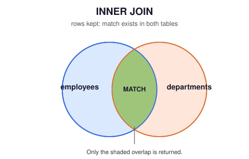
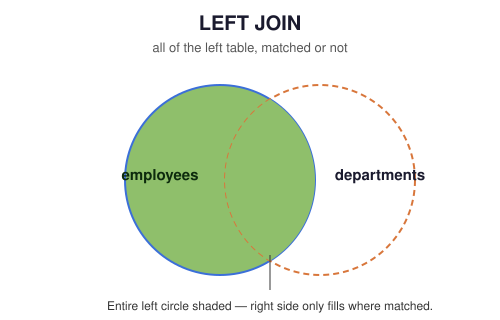
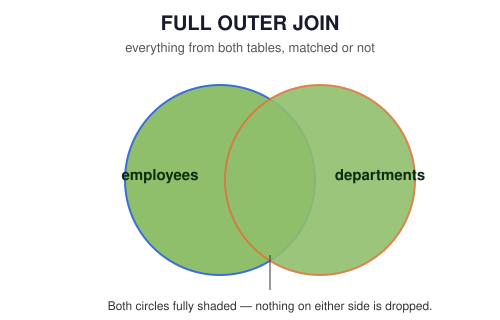

<div align="center">


<br/>

[]()
[]()
[]()
[]()
[]()
[]()
[]()
[]()

**Module 3 of the [SQL Engineering Handbook](../)** · Authored & maintained by [**Mohammad Ammar**](https://github.com/theammarngp-makes)

<sub>Part of an open-source effort to build the most rigorous, production-grade SQL reference on GitHub — corrections and additions genuinely welcome, see <a href="./CONTRIBUTOR_CHECKLIST.md">CONTRIBUTOR_CHECKLIST.md</a>.</sub>

</div>

---

## 📑 Table of Contents

- [Overview](#-overview)
- [Why Joins Matter](#-why-joins-matter)
- [Topics Covered](#-topics-covered)
- [Folder Structure](#-folder-structure)
- [Recommended Learning Order](#-recommended-learning-order)
- [Schema Used](#-schema-used)
- [How Joins Actually Work](#%EF%B8%8F-how-joins-actually-work)
- [Join Algorithms at a Glance](#-join-algorithms-at-a-glance)
- [NULL Handling — The Core Mental Model](#-null-handling--the-core-mental-model)
- [Skills Developed](#-skills-developed)
- [Business Applications](#-business-applications)
- [Interview Importance](#-interview-importance)
- [Best Practices](#-best-practices)
- [Common Mistakes](#-common-mistakes)
- [Prerequisites](#-prerequisites)
- [Quick Start](#-quick-start)
- [How to Use This Module](#-how-to-use-this-module)
- [Career Relevance](#-career-relevance)
- [Contributing](#-contributing)
- [Previous / Next Module](#-previous--next-module)
- [Further Reading](#-further-reading)

---

## 🔎 Overview

SQL **joins** combine data from multiple tables using a related column. In real-world systems, data is normalized and spread across many tables — employees in one table, departments in another, locations in a third, sales facts in a fourth surrounded by dimension tables. Joins are what let you reconnect that data and ask questions that span across it, like *"which employees work in which locations, under which managers, and how does that compare to a full org reconciliation ahead of a system migration?"*

This is the module where SQL stops being about *one table* and starts being about *your entire database* — and where correctness alone stops being enough, because the same logically correct join can run in milliseconds or minutes depending on how it's written and indexed.

## 💡 Why Joins Matter

Every analytics dashboard, every report, every API endpoint backed by a relational database is, underneath, a chain of joins. A data model normalized into clean, single-purpose tables is only useful if you can reliably and efficiently put it back together — that's the entire discipline this module teaches.

---

## 📖 Topics Covered

### The Five Join Types

| No. | Topic | Description | Files |
|:--:|-------|--------------|-------|
| 01 | **INNER JOIN** | Return only matching rows from both tables | [`.md`](./01_INNER_JOIN.md) · [`.sql`](./01_INNER_JOIN.sql) |
| 02 | **LEFT JOIN** | Return all rows from the left table, matched or not | [`.md`](./02_LEFT_JOIN.md) · [`.sql`](./02_LEFT_JOIN.sql) |
| 03 | **RIGHT JOIN** | Return all rows from the right table, matched or not | [`.md`](./03_RIGHT_JOIN.md) · [`.sql`](./03_RIGHT_JOIN.sql) |
| 04 | **FULL OUTER JOIN** | Return all rows from both tables, matched or not | [`.md`](./04_FULL_OUTER_JOIN.md) · [`.sql`](./04_FULL_OUTER_JOIN.sql) |
| 05 | **CROSS JOIN** | Every row of one table paired with every row of the other | [`.md`](./05_CROSS_JOIN.md) · [`.sql`](./05_CROSS_JOIN.sql) |

### Composition & Application

| No. | Topic | Description | Files |
|:--:|-------|--------------|-------|
| 06 | **SELF JOIN** | Join a table to itself — hierarchies, org charts | [`.md`](./06_SELF_JOIN.md) · [`.sql`](./06_SELF_JOIN.sql) |
| 07 | **MULTI-TABLE JOINS** ⭐ | Chain 3+ tables; semi/anti joins; the `NOT IN` NULL trap | [`.md`](./07_MULTI_TABLE_JOINS.md) · [`.sql`](./07_MULTI_TABLE_JOINS.sql) |
| 08 | **JOIN PERFORMANCE** 🚀 | `EXPLAIN`, indexing, join algorithms, star schemas | [`.md`](./08_JOIN_PERFORMANCE.md) · [`.sql`](./08_JOIN_PERFORMANCE.sql) |
| 09 | **BUSINESS CASES** ⭐ | Capstone: real multi-domain scenarios end to end | [`.md`](./09_BUSINESS_CASES.md) · [`.sql`](./09_BUSINESS_CASES.sql) |

Each `.md` file explains the **concept, execution flow, algorithms, vendor differences, and reasoning**; the paired `.sql` file contains **runnable, multi-question, annotated examples** against the shared schema.

---

## 📂 Folder Structure

```
03_Joins/
│
├── README.md
├── ENGINEERING_AUDIT_REPORT.md
├── CONTRIBUTOR_CHECKLIST.md
│
├── schema/
│   └── 00_schema_setup.sql          ← run this first — canonical CREATE TABLE + seed data
│
├── 01_INNER_JOIN.md            01_INNER_JOIN.sql
├── 02_LEFT_JOIN.md             02_LEFT_JOIN.sql
├── 03_RIGHT_JOIN.md            03_RIGHT_JOIN.sql
├── 04_FULL_OUTER_JOIN.md       04_FULL_OUTER_JOIN.sql
├── 05_CROSS_JOIN.md            05_CROSS_JOIN.sql
├── 06_SELF_JOIN.md             06_SELF_JOIN.sql
├── 07_MULTI_TABLE_JOINS.md     07_MULTI_TABLE_JOINS.sql
├── 08_JOIN_PERFORMANCE.md      08_JOIN_PERFORMANCE.sql
├── 09_BUSINESS_CASES.md        09_BUSINESS_CASES.sql
│
└── assets/
    └── diagrams/
        ├── inner-join.svg
        ├── left-join.svg
        ├── right-join.svg
        ├── full-outer-join.svg
        ├── cross-join.svg
        ├── self-join.svg
        ├── multi-table-chain.svg
        ├── join-execution-order.svg
        ├── join-algorithms.svg
        └── star-schema.svg
```

> 📎 Every topic file (`01`–`09`) embeds its own diagram inline — you'll see the relevant Venn diagram, hierarchy tree, join chain, or schema diagram right at the top of each file's Concept Overview, not just here in the README.

---

## 📌 Recommended Learning Order

```
1. INNER JOIN         → only the rows that match in both tables
2. LEFT JOIN           → everything on the left, matched or not
3. RIGHT JOIN          → everything on the right, matched or not
4. FULL OUTER JOIN     → both of those, combined — plus the MySQL UNION workaround
5. CROSS JOIN          → every pairing, no predicate — date spines & combinatorics
6. SELF JOIN           → a table joined to itself (hierarchies)
7. MULTI-TABLE JOINS    → chaining everything above across 3+ tables, plus semi/anti joins
8. JOIN PERFORMANCE     → EXPLAIN, indexing, join algorithms, star schemas
9. BUSINESS CASES       → capstone: real multi-domain scenarios end to end
```

> 💡 `04_FULL_OUTER_JOIN` is deliberately placed right after `LEFT`/`RIGHT` — it's easiest to understand as "both of those, combined," and grouping the four core join types together before branching into composition (self joins, multi-table chains) keeps the mental model tight.

---

## 🗂 Schema Used

**Run [`schema/00_schema_setup.sql`](./schema/00_schema_setup.sql) once before working through any topic file.** Every query in this module runs against this exact schema — it's the single source of truth for table structure and seed data.

```
locations (1) ──────< departments (1) ──────< employees
                                                   │
                                                   │ manager_id (self-FK)
                                                   └──────┘
```

- `locations` → offices; `departments` → linked via `location_id` (nullable — some departments are remote-first)
- `employees` → linked to `departments` via `dept_id` (nullable — some employees are unassigned)
- `employees.manager_id` → self-referencing FK to `employees.emp_id` (used in `06_SELF_JOIN`)
- `09_BUSINESS_CASES.sql` additionally introduces a small, self-contained e-commerce star schema for its dimensional-modeling scenario — it does not modify the core HR schema above.

One connected schema across eight of the nine topics means you're learning *join logic*, not re-learning a new dataset every lesson — and the ninth topic deliberately switches domains once, on purpose, to test whether that logic actually transfers.

---

## ⚙️ How Joins Actually Work

Every join answers the same underlying question: **for each row in table A, what row(s) in table B share a value that makes the `ON` predicate true?**

<table>
<tr>
<td width="25%" align="center"></td>
<td width="25%" align="center"></td>
<td width="25%" align="center"></td>
<td width="25%" align="center"></td>
</tr>
</table>

| Join Type | Keeps unmatched rows from... |
|---|---|
| `INNER JOIN` | Neither table — only matches survive |
| `LEFT JOIN` | The left table |
| `RIGHT JOIN` | The right table |
| `FULL OUTER JOIN` | Both tables |
| `CROSS JOIN` | N/A — no predicate; every pairing is kept, matched or not |
| `SELF JOIN` | Same rules as INNER/LEFT/RIGHT — it's a role, not a distinct join type |
| Multi-table | Depends on which join type chains each pair |

> 🔑 **Key mental model:** unmatched rows from the "kept" side appear with `NULL` in every column that comes from the other table. This is the #1 source of confusion when debugging join results — always check what `NULL` is telling you, and see [NULL Handling](#-null-handling--the-core-mental-model) below.

Every clause in a join query is also evaluated in a specific **logical order** — understanding it is what explains why filtering an outer-joined table in `WHERE` behaves differently from filtering it in `ON`:

<p align="center">
  
</p>

---

## 🧮 Join Algorithms at a Glance

The SQL you write is a request, not an execution plan — the engine chooses one of three physical strategies:

<p align="center">
  
</p>

| Algorithm | Best when |
|---|---|
| **Nested Loop** | One side is small, or there's a usable index on the join key |
| **Hash Join** | Large, unsorted tables, equality predicate, no useful index |
| **Merge Join** | Both sides already sorted (often via an index) on the join key |

Full treatment, including how to confirm which one actually ran, is in [`08_JOIN_PERFORMANCE.md`](./08_JOIN_PERFORMANCE.md).

---

## 🕳 NULL Handling — The Core Mental Model

`NULL` never equals anything — not a value, not another `NULL`. This single fact explains almost every join surprise in this module:

- An employee with `dept_id = NULL` never matches any department in an INNER JOIN, even hypothetically against another `NULL`.
- `NOT IN (SELECT nullable_column FROM ...)` silently returns zero rows if that column contains even one `NULL` — covered in depth in [`07_MULTI_TABLE_JOINS.md`](./07_MULTI_TABLE_JOINS.md).
- A `NOT NULL` column in its own table can still show `NULL` in a join's result set, when it comes from the unmatched side of an outer join.

---

## 🧠 Skills Developed

- Combine tables based on relationships, not just structure
- Reason precisely about matched vs. unmatched rows, including which join type preserves which side
- Query across 3+ tables in a single, readable, incrementally-verified statement
- Distinguish semi joins, anti joins, and regular joins, and choose correctly between them
- Read `EXPLAIN` output and reason about index usage and join algorithm choice
- Recognize and correctly join a star-schema fact/dimension model on sight
- Translate an ambiguous business request into a precise, joinable SQL question

---

## 💼 Business Applications

| Use Case | Example Question Answered |
|---|---|
| **Employee reporting** | Which department and location does each employee belong to? |
| **Data quality audits** | Which employees or departments are missing an expected relationship? |
| **Workforce planning** | Which departments are funded but currently unstaffed? |
| **Migration reconciliation** | Which records in either system have no counterpart in the other? |
| **Analytical / BI reporting** | Monthly revenue by category and country, from a star-schema fact table |
| **Manager hierarchy analysis** | Who reports to whom, and how does compensation compare within teams? |

---

## 🎤 Interview Importance

Joins are among the **most frequently asked SQL interview topics**, and this module is deliberately weighted toward the sub-topics that most reliably separate strong candidates: the `ON`-vs-`WHERE` placement trap for outer joins, the `NOT IN` NULL trap for anti joins, the MySQL `FULL OUTER JOIN` gap, and the ability to read an `EXPLAIN` plan and name the join algorithm that ran. Interviewers frequently test this by asking you to **predict row counts before running a query**, or to spot what's silently wrong with a query that looks correct.

---

## 💡 Best Practices

- ✅ Always know *which table* you expect to lose rows from before writing `LEFT`/`RIGHT`/`INNER` — don't guess
- ✅ Use table aliases for every join, always
- ✅ Join on indexed, type-matched foreign keys — never join on unindexed or type-mismatched columns if avoidable
- ✅ Build multi-table joins one join at a time, checking row counts at each step
- ✅ Default to `NOT EXISTS` (or `LEFT JOIN ... IS NULL`) for anti joins — never `NOT IN` against a possibly-nullable column
- ✅ Run `EXPLAIN`/`EXPLAIN ANALYZE` on any join touching a non-trivial table before shipping it

## ⚠️ Common Mistakes

- ❌ Filtering the outer-joined table's columns in `WHERE` instead of `ON`, silently collapsing an outer join into an inner join
- ❌ Using `NOT IN` against a subquery column that can contain `NULL`
- ❌ Assuming `FULL OUTER JOIN` works in MySQL without the `UNION` emulation
- ❌ Writing a full multi-table join chain before testing any of it incrementally
- ❌ Wrapping a joined or filtered column in a function, defeating an otherwise-usable index

---

## 🎯 Prerequisites

Completion of **[`01_Fundamentals`](../01_Fundamentals)** and **[`02_Aggregations`](../02_Aggregations)**. You'll frequently combine joins with `GROUP BY`, `HAVING`, window functions, and CTEs — especially in `08_JOIN_PERFORMANCE` and `09_BUSINESS_CASES`.

---

## ⚡ Quick Start

```bash
# 1. Clone the handbook (if you haven't already)
git clone https://github.com/theammarngp-makes/SQL-Engineering-Handbook.git
cd SQL-Engineering-Handbook/03_Joins

# 2. Spin up a scratch PostgreSQL database (or point psql at an existing one)
createdb sql_joins_practice
psql -d sql_joins_practice -f schema/00_schema_setup.sql

# 3. Work through the topics in order, running each .sql file as you go
psql -d sql_joins_practice -f 01_INNER_JOIN.sql
```

> MySQL users: `schema/00_schema_setup.sql` is ANSI-compatible and runs unmodified on MySQL 8.0+ — load it with `mysql your_db < schema/00_schema_setup.sql`. Watch for the MySQL-specific call-outs in `04_FULL_OUTER_JOIN.md` and `08_JOIN_PERFORMANCE.md`.

---

## 🛠 How to Use This Module

1. Run [`schema/00_schema_setup.sql`](./schema/00_schema_setup.sql) once, against a scratch database.
2. Read the `.md` file for a topic to understand the concept, execution flow, algorithms, and vendor differences.
3. Run the matching `.sql` file's queries one at a time, checking the "EXPECTED OUTPUT" comment against what you actually get.
4. For any outer join, deliberately move a right-table filter from `ON` to `WHERE` (or vice versa) and compare row counts — this is the fastest way to internalize the single most commonly misunderstood join behavior.
5. For `07_MULTI_TABLE_JOINS` and `09_BUSINESS_CASES`, build each query incrementally: one join or one CTE layer at a time, confirming row counts before adding the next.

> ⏱ **Estimated time:** 6–8 hours for the lessons and examples, plus additional time for the practice challenges in each file.

---

## 💼 Career Relevance

Join fluency is a baseline expectation, not a differentiator, for Data Analyst, Data Engineer, Analytics Engineer, and BI Developer roles — but the *specific* sub-skills this module emphasizes (outer join filter placement, NULL-safe anti joins, reading execution plans, recognizing star schemas) are exactly what separates a candidate who can write a join from one who can be trusted to write joins against production data without a senior engineer reviewing every query.

---

## 🤝 Contributing

This module is held to a high bar deliberately — see [`ENGINEERING_AUDIT_REPORT.md`](./ENGINEERING_AUDIT_REPORT.md) for the standard it was built against. Before opening a PR against any file here:

1. Read [`CONTRIBUTOR_CHECKLIST.md`](./CONTRIBUTOR_CHECKLIST.md) in full.
2. Run your changed `.sql` file against a freshly-seeded database (`schema/00_schema_setup.sql`) and confirm every `EXPECTED OUTPUT` comment still matches reality.
3. If you're adding a new concept, follow the section structure of an existing `.md` file in this module rather than inventing a new shape.

Found a bug, a stale comment, or a gap this audit missed? Issues and PRs are genuinely welcome — that's the whole point of building this in the open.

---

## 🚀 Previous / Next Module

⬅️ **[`02_Aggregations`](../02_Aggregations)**
➡️ **[`04_Subqueries`](../04_Subqueries)** — nest queries inside other queries to answer multi-step business questions; several patterns in `09_BUSINESS_CASES.md` (the CTE-based compensation query) are a direct preview.

---

## 📚 Further Reading

- PostgreSQL docs: [Joined Tables](https://www.postgresql.org/docs/current/queries-table-expressions.html#QUERIES-JOIN)
- PostgreSQL docs: [Using EXPLAIN](https://www.postgresql.org/docs/current/using-explain.html)
- [`ENGINEERING_AUDIT_REPORT.md`](./ENGINEERING_AUDIT_REPORT.md) — the audit that produced this module's current structure, for context on *why* it's organized this way.

---

## ✍️ About the Author

<table>
<tr>
<td width="90"></td>
<td>
<b>Mohammad Ammar</b> — Co-Founder @ <a href="https://github.com/Apex-Analyticx-group">Apex Analyticx</a>, Data Analytics Engineer, author of the <a href="https://github.com/theammarngp-makes/SQL-Engineering-Handbook">SQL Engineering Handbook</a> (20+ modules). Based in Nagpur, India.
</td>
</tr>
</table>

[](https://theammarngp-makes.github.io)
[](https://www.linkedin.com/in/mohammad-ammar-ngp/)
[](https://x.com/theammarngp)
[](mailto:theammarngp@gmail.com)

---

<div align="center">

<i>Part of the <a href="../">SQL Engineering Handbook</a></i><br/>
<sub>⭐ If this module helped you, consider starring the repo — it helps other engineers find it.</sub>


</div>
