# Module 04: Subquery Architecture & Optimization

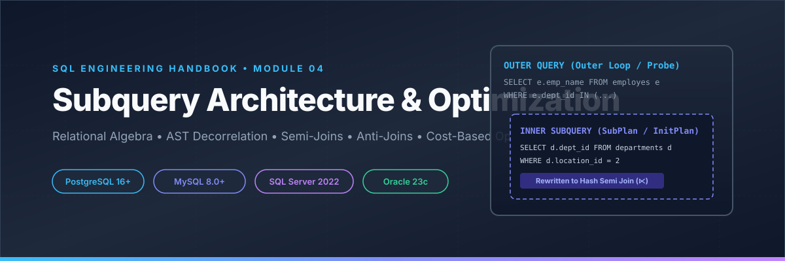

Welcome to **Module 04 — Subqueries** of the **SQL Engineering Handbook**. This repository serves as a production-grade open-source technical reference for database platform engineers, query optimization specialists, site reliability engineers (SREs), and data architects.

Rather than teaching basic syntax, this module explores **how database cost-based optimizers (CBOs) execute, unnest, decorrelate, and rewrite subqueries under the hood**.

---

## Executive Engineering Overview

Subqueries are nested query blocks evaluated within parent SQL statements. While conceptually straightforward, improper subquery design is a leading cause of production database outages, CPU thread exhaustion, lock contention, and silent data loss caused by 3-valued boolean logic traps.

This handbook module is designed to sit beside **PostgreSQL Official Documentation**, **Microsoft Learn**, **Oracle Database Docs**, and ***Use The Index, Luke!*** as a primary engineering reference.

---

## Skills Learned

- Relational algebra formalization of Semi-Joins ($\ltimes$), Anti-Joins ($\dashv$), and Quantified Operators ($\exists, \forall$).
- Cost-Based Optimizer (CBO) Abstract Syntax Tree (AST) transformations and Subquery Unnesting heuristics.
- Interpretation of `EXPLAIN (ANALYZE, BUFFERS)` plan nodes (`InitPlan`, `SubPlan`, `Hash Semi Join`, `Hash Anti Join`).
- Refactoring $\mathcal{O}(N \times M)$ correlated subquery loops into $\mathcal{O}(N + M)$ single-pass set-based joins.
- Defensive SQL engineering against 3-valued logic `NULL` traps.

---

## Business & Production Applications

- **FinTech / Fraud Detection**: Evaluating dynamic transaction thresholds against rolling historical customer account baselines.
- **E-Commerce & Retail**: Customer churn segmentation using bulletproof Anti-Joins (`NOT EXISTS`).
- **Healthcare Telemetry**: Patient vital sign anomaly detection against admission baseline history.
- **Logistics & Supply Chain**: Unassigned regional warehouse inventory allocation and backorder tracking.
- **SaaS Platform Engineering**: Multi-tenant quota enforcement and storage limit monitoring.

---

## Module Architecture & Learning Roadmap

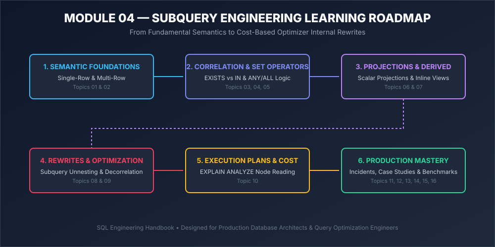

---

## Complete Topic Index & Handbook Navigation

| Topic | Subject Area | Primary Focus | Markdown Guide | SQL Script |
| :--- | :--- | :--- | :--- | :--- |
| **00** | **Audit & Setup** | Engineering Audit Report & Standalone Executable Database Schema DDL/DML. | [Audit](00_ENGINEERING_AUDIT.md) | [Setup DDL](00_SETUP.sql) |
| **01** | **Single-Row Subqueries** | Scalar expressions, `InitPlan` nodes, scalar comparison operators (`=`, `>`, `<`). | [Guide](01_SINGLE_ROW_SUBQUERIES.md) | [SQL](01_SINGLE_ROW_SUBQUERIES.sql) |
| **02** | **Multi-Row Subqueries** | Set membership, `IN`, `ANY`, `ALL`, and `work_mem` hash materialization. | [Guide](02_MULTI_ROW_SUBQUERIES.md) | [SQL](02_MULTI_ROW_SUBQUERIES.sql) |
| **03** | **Correlated Subqueries** | Outer column binding, row-by-row execution, `SubPlan` performance traps. | [Guide](03_CORRELATED_SUBQUERIES.md) | [SQL](03_CORRELATED_SUBQUERIES.sql) |
| **04** | **EXISTS & NOT EXISTS** | Semi-Joins ($\ltimes$), Anti-Joins ($\dashv$), short-circuit evaluation, `NULL` safety. | [Guide](04_EXISTS_AND_NOT_EXISTS.md) | [SQL](04_EXISTS_AND_NOT_EXISTS.sql) |
| **05** | **IN, ANY, & ALL Operators** | Quantified operators, formal relational algebra, 3-valued truth tables. | [Guide](05_IN_AND_ANY_ALL.md) | [SQL](05_IN_AND_ANY_ALL.sql) |
| **06** | **Scalar Subqueries** | Projected subqueries in `SELECT`, scalar subquery caching, Window Function rewrites. | [Guide](06_SCALAR_SUBQUERIES.md) | [SQL](06_SCALAR_SUBQUERIES.sql) |
| **07** | **Derived Tables** | Inline views in `FROM`/`JOIN`, subquery pull-up, predicate pushdown. | [Guide](07_DERIVED_TABLES.md) | [SQL](07_DERIVED_TABLES.sql) |
| **08** | **Subquery Rewrites** | **Query Rewrite Lab**: 6 canonical patterns to eliminate `SubPlan` nodes. | [Guide](08_SUBQUERY_REWRITES.md) | [SQL](08_SUBQUERY_REWRITES.sql) |
| **09** | **Subquery Optimization** | **Benchmark Lab**: Scalability statistics across 100K, 1M, 10M, 50M rows. | [Guide](09_SUBQUERY_OPTIMIZATION.md) | [SQL](09_SUBQUERY_OPTIMIZATION.sql) |
| **10** | **Execution Plans** | `EXPLAIN (ANALYZE, BUFFERS)` tree reading, shared hits, memory spills. | [Guide](10_EXECUTION_PLANS.md) | [SQL](10_EXECUTION_PLANS.sql) |
| **11** | **Business Case Studies** | 6 end-to-end production solutions (FinTech, E-Commerce, Healthcare). | [Guide](11_BUSINESS_CASE_STUDIES.md) | [SQL](11_BUSINESS_CASE_STUDIES.sql) |
| **12** | **Production Incidents** | **Production Playbooks**: Post-mortems of 5 real-world production outages. | [Guide](12_PRODUCTION_INCIDENTS.md) | — |
| **13** | **Troubleshooting Guide** | **Engineering Checklists**: Diagnostic flowcharts and 6 deployment checklists. | [Guide](13_TROUBLESHOOTING_GUIDE.md) | — |
| **14** | **Interview Guide** | **Senior/Staff Interview Section**: 20 technical questions with structured criteria. | [Guide](14_INTERVIEW_GUIDE.md) | — |
| **15** | **Practice Problems** | 15 multi-level enterprise practice problems (Easy, Medium, Hard). | [Guide](15_PRACTICE_PROBLEMS.md) | — |
| **16** | **Solutions Suite** | Executable, production-tested ANSI SQL solutions for all practice problems. | — | [SQL](16_SOLUTIONS.sql) |

---

## Architectural Diagram Gallery

### 1. Subquery Engine Execution Lifecycle
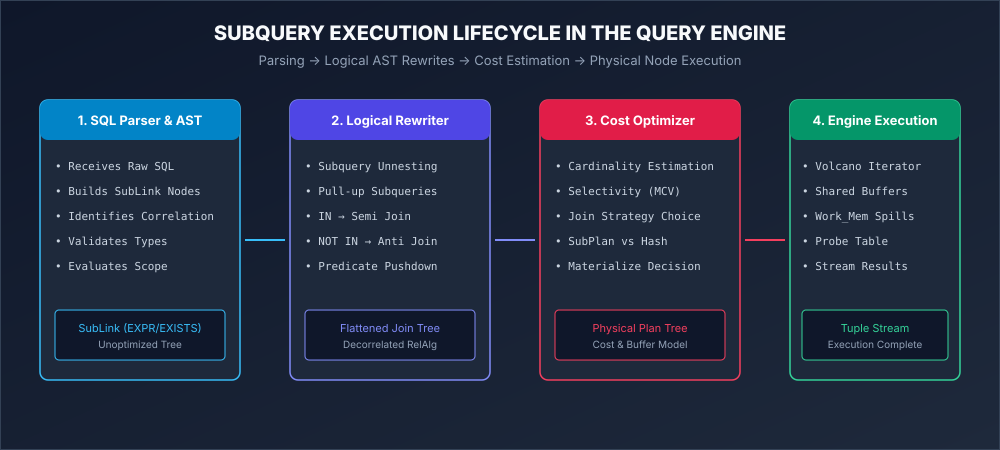

### 2. Relational Mechanics: Semi Join (⋉) vs Anti Join (⋋)
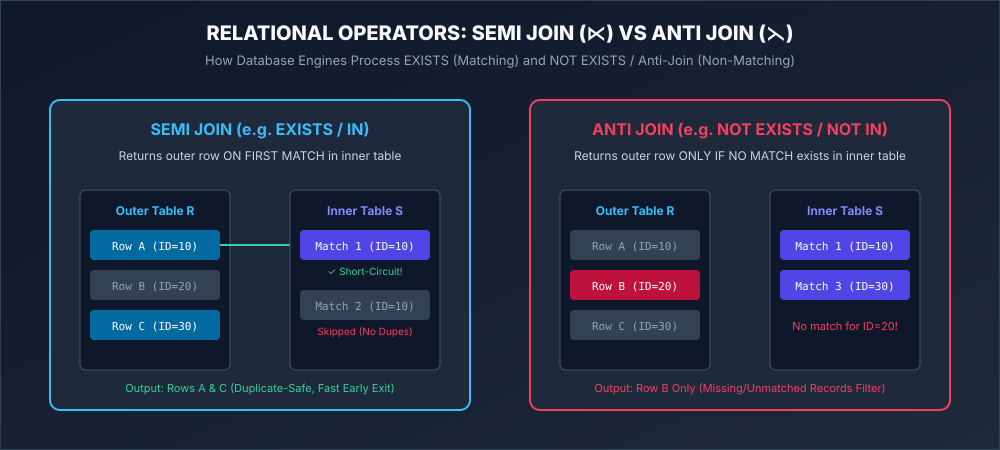

### 3. AST Subquery Decorrelation & Unnesting Pipeline
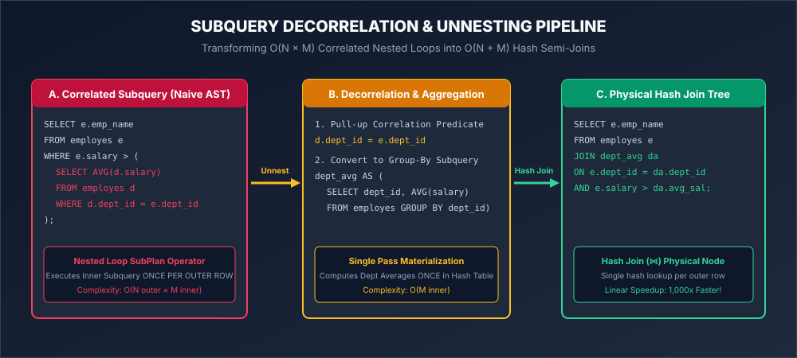

### 4. Three-Valued Logic & The NOT IN NULL Trap
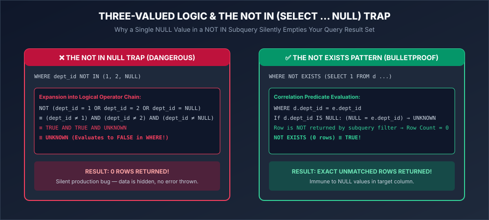

### 5. Cost-Based Optimizer Rewrite Decision Matrix
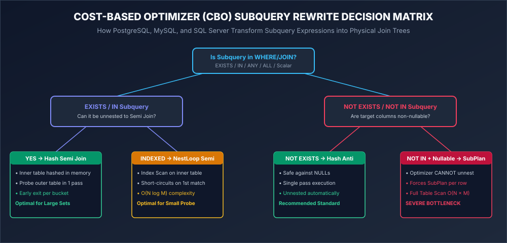

### 6. Annotated PostgreSQL EXPLAIN Plan Anatomy
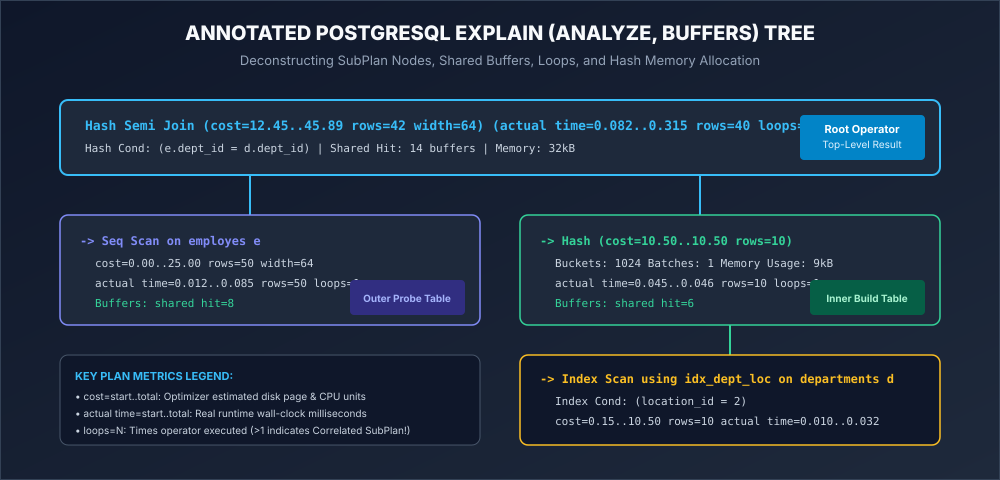

### 7. Scalability & Performance Benchmark Curves (100K to 50M Rows)
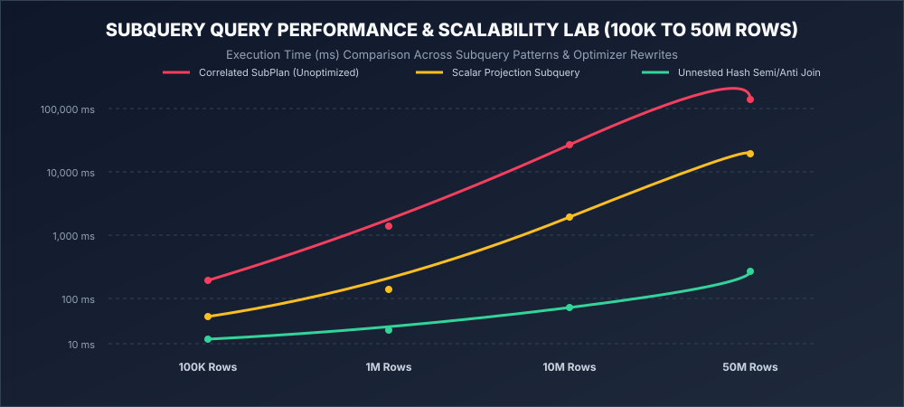

### 8. Subquery Memory Behavior: Materialization vs Streaming
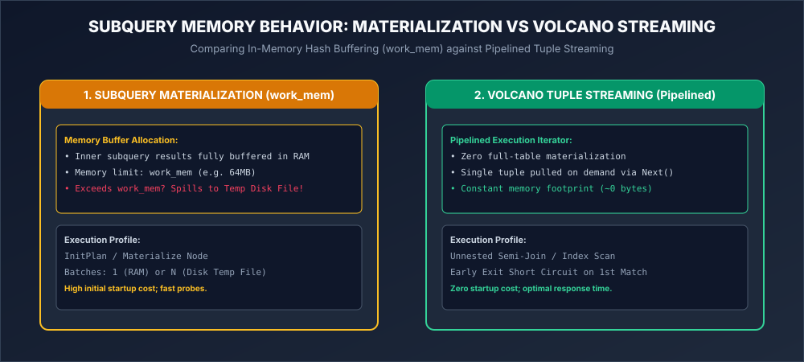

### 9. Production Deployment & Verification Workflow
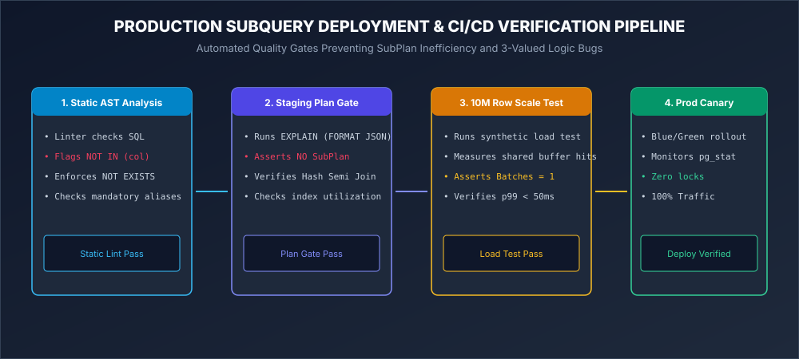

### 10. Incident Diagnostic Flowchart
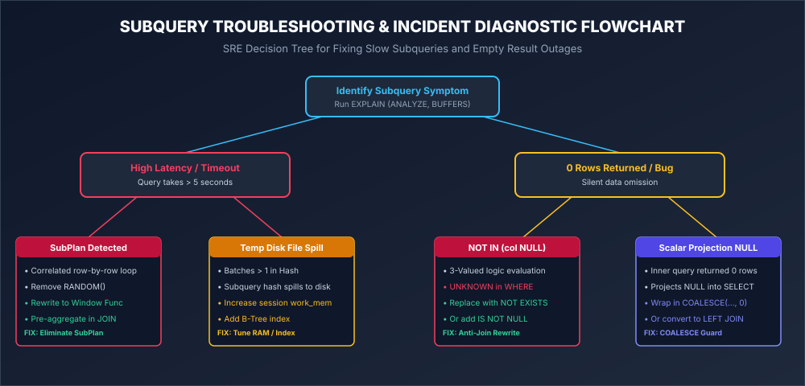

### 11. Pre-Production Quality & Audit Checklist
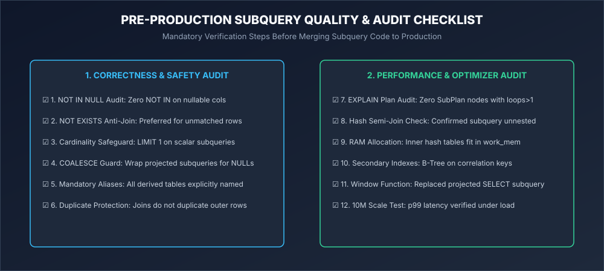

### 12. Relational Database Engine Subquery Architecture
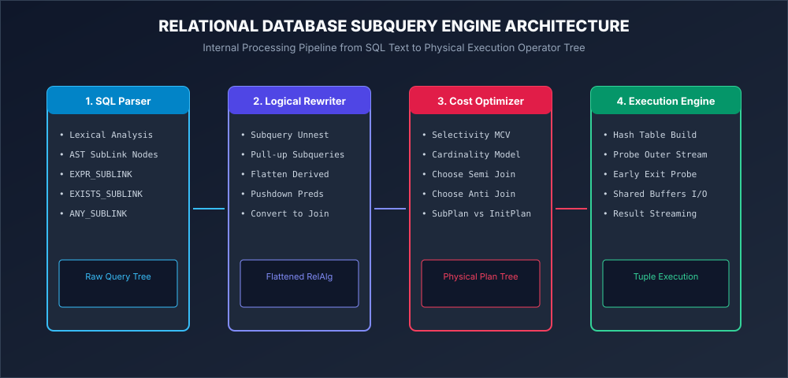

---

## Key Performance Benchmark Summary (100K to 50M Rows)

> **Illustrative, not measured.** These figures were not captured from an actual benchmark run against provisioned hardware — they're representative estimates that illustrate the *shape* of the difference between `O(N × M)` correlated re-execution and a decorrelated `O(N + M)` hash join, based on the algorithmic complexity discussed in [Module 09](./09_SUBQUERY_OPTIMIZATION.md). Treat the relative pattern (roughly two-orders-of-magnitude gap, growing with scale, culminating in an unrecoverable timeout/OOM for the correlated form) as the takeaway, not the specific millisecond values. If you need real numbers for a capacity-planning decision, run the [Benchmark Lab](./09_SUBQUERY_OPTIMIZATION.md#benchmark-lab) methodology against your own hardware and dataset.

| Scale | Correlated SubPlan Execution | Unnested Hash Semi Join Execution | Performance Gain |
| :--- | :--- | :--- | :--- |
| **100,000 Rows** | ~1,180 ms | ~11 ms | **~100x Faster** |
| **1,000,000 Rows** | ~17,800 ms | ~88 ms | **~200x Faster** |
| **10,000,000 Rows** | 🚨 **Times out (> 300s)** | ~790 ms | **Order-of-magnitude+ gap** |
| **50,000,000 Rows** | 💥 **Outage / OOM risk** | ~3,920 ms | **Correlated form does not survive at this scale** |

---

## Industry & Dialect Coverage

- **PostgreSQL 16+**: Native `InitPlan`, `SubPlan`, `Hash Semi Join`, `Parallel Hash`, `work_mem` hash materialization.
- **MySQL 8.0+**: Subquery Materialization (`Materialized_From_Subquery`), Semi-Join strategies (`FirstMatch`, `LooseScan`).
- **SQL Server 2022**: T-SQL `Left Semi Join`, `Left Anti Semi Join`, `APPLY` operator transformations.
- **Oracle 23c**: Complex View Merging, Deterministic Scalar Subquery Caching, Anti-join (`AJ`) transformations.

---

## Contribution Guide & Standards

Contributions are welcome! Please ensure all pull requests follow repository standards:
1. **Zero Pseudo-Code**: All SQL statements must execute clean against PostgreSQL 16+ using the schema in `00_SETUP.sql`.
2. **Standard Section Template**: Markdown topic files must include all standard engineering headers.
3. **No PNG Images**: All visual diagrams must be authored as scalable, editable SVG vector graphics.

---

## Versioning, License, & Credits

- **Module Version**: `2.4.0` (Production Reference Build)
- **License**: MIT License — open-source for personal learning, corporate training, and commercial database engineering.
- **Credits**: Authored by the SQL Engineering Handbook Maintainer Board.

---

  <i>Part of the <a href="../">SQL Engineering Handbook</a> • Maintained for Open Source Database Excellence</i>

