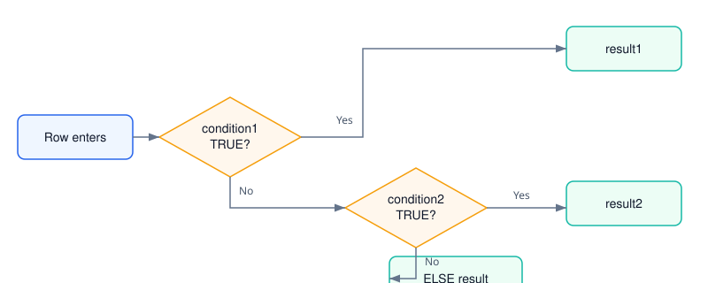
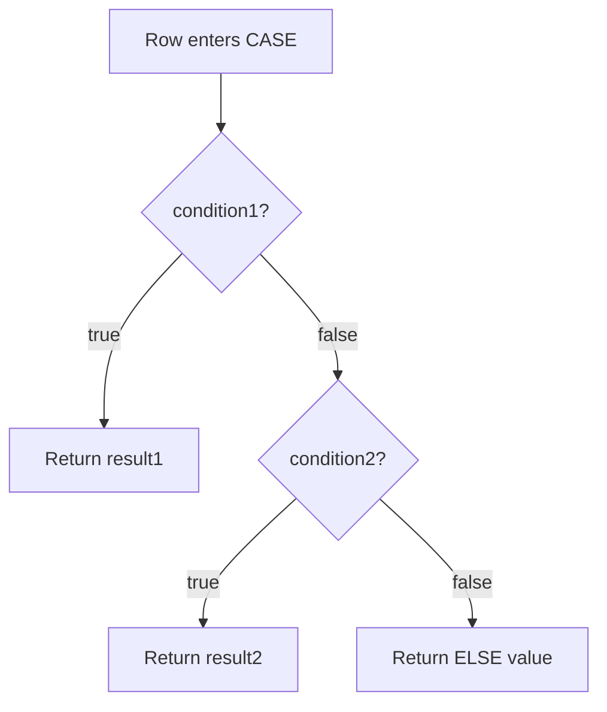

# 01 · Basic CASE WHEN

> Difficulty: Beginner · Estimated time: 15 min
> Schema: [`00_Sample_Schema.sql`](./00_Sample_Schema.sql)



## Introduction

`CASE WHEN` is SQL's conditional expression. It lets a query return a
different value depending on data, without leaving SQL for
application code. Every dashboard filter, every "status" column you've
ever seen in a BI tool, and most feature-engineering pipelines lean on
this one expression.

## Learning Objectives

By the end of this lesson you will be able to:
- Write both the **simple** and **searched** forms of `CASE`
- Explain the difference between them and when to use each
- Predict what happens when no `WHEN` matches and `ELSE` is omitted
- Use `CASE` inside a plain `SELECT` to derive a business-readable column

## Business Context

Raw data is rarely how business users think. A `manager_id` column is
a database implementation detail; "Has Manager" / "No Manager" is a
sentence a stakeholder can act on. Translating raw values into
business language, directly in the query, is the single most common
reason `CASE` exists in production SQL.

## Syntax

**Searched CASE** — evaluates arbitrary boolean conditions:

```sql
CASE
    WHEN condition1 THEN result1
    WHEN condition2 THEN result2
    ELSE result_default
END
```

**Simple CASE** — compares one expression against a list of exact
values (shorter, but less flexible — no ranges, no `IS NULL`, no
compound conditions):

```sql
CASE column_name
    WHEN value1 THEN result1
    WHEN value2 THEN result2
    ELSE result_default
END
```

## Syntax Breakdown

| Clause | Required? | Notes |
|---|---|---|
| `CASE` | Yes | Opens the expression |
| `WHEN ... THEN ...` | At least one | Evaluated top to bottom |
| `ELSE` | No, but strongly recommended | If omitted and nothing matches, the result is `NULL` |
| `END` | Yes | Closes the expression |

## Visual Explanation

```
                 ┌────────────────────────┐
 row enters ───► │ WHEN condition1 TRUE?  │──Yes──► result1
                 └───────────┬────────────┘
                              │ No
                 ┌───────────▼────────────┐
                 │ WHEN condition2 TRUE?  │──Yes──► result2
                 └───────────┬────────────┘
                              │ No
                              ▼
                        ELSE result_default
```



## Engineering Notes

- **CASE is an expression, not a statement.** It returns a single
  value and can be used anywhere a column, literal, or expression is
  valid: `SELECT`, `WHERE`, `ORDER BY`, `GROUP BY`, `HAVING`, inside
  aggregates, inside `JOIN ... ON`, and inside `UPDATE ... SET`.
- **Evaluation is short-circuiting and ordered.** SQL checks `WHEN`
  clauses top to bottom and stops at the first `TRUE`. Order your
  conditions from most specific to least specific — a common bug is
  writing a broad condition first that silently "steals" rows meant
  for a later, more specific branch.
- **All result expressions must share a compatible type.** Mixing
  `'High'` (text) with `1` (integer) across branches will either raise
  a type error or force an implicit cast, depending on dialect.

## Production Applications

- Deriving `manager_status`, `is_active`, `account_tier` style flag
  columns consumed directly by BI tools (Looker, Tableau, Power BI)
  without any transformation layer in between.
- The exact pattern used in dbt staging models to normalize raw
  source values into clean, documented categories.

## SQL

See [`01_Basic_CASE_WHEN.sql`](./01_Basic_CASE_WHEN.sql) for the runnable example against the shared schema.

## Best Practices

- Always include `ELSE`, even if it just re-states `'Unknown'` — an
  unhandled `NULL` in a downstream `GROUP BY` or dashboard filter is a
  common source of "missing" rows that are actually silently bucketed
  as `NULL`.
- Alias the `CASE` expression (`AS manager_status`) — an un-aliased
  `CASE` renders as `case` or `?column?` depending on dialect, which
  is unreadable in any client tool.

## Common Mistakes

| Mistake | Consequence |
|---|---|
| Omitting `ELSE` | Unmatched rows return `NULL`, not an error — easy to miss in QA |
| Comparing `NULL` with `=` inside a searched CASE | `x = NULL` is never `TRUE` in standard SQL; use `x IS NULL` |
| Assuming `WHEN` order doesn't matter | It does — first match wins, always |

## Edge Cases

- `WHEN manager_id = NULL THEN ...` never matches, even for rows where
  `manager_id` actually is `NULL`, because `NULL = NULL` evaluates to
  `NULL` (unknown), not `TRUE`. Use `IS NULL` instead.
- An empty string `''` is not `NULL` in most dialects — a condition
  written for one will not catch the other.

## Dialect Differences

| Dialect | Notes |
|---|---|
| PostgreSQL / SQL Server / Oracle / MySQL | `CASE ... WHEN ... END` syntax is identical (ANSI SQL) |
| SQL Server | Also offers `IIF(condition, true_val, false_val)` as shorthand for a two-branch CASE |
| BigQuery | Identical `CASE` syntax; also supports `IF(condition, true_val, false_val)` |
| Oracle | Also offers `DECODE(expr, val1, res1, val2, res2, default)` — older, value-equality only, no ranges |

## Performance Notes

`CASE` itself adds negligible overhead — it's evaluated per row in
memory. Performance problems arise when a `CASE` expression wraps an
indexed column inside a `WHERE` clause, since that usually prevents
index usage. Keep `CASE` in the `SELECT` list for derived columns; keep
raw column comparisons in `WHERE` where possible.

## Interview Questions

1. What's the difference between simple and searched `CASE`?
2. What does `CASE` return when no `WHEN` matches and there's no `ELSE`?
3. Does `CASE` evaluate all branches or stop at the first match?
4. Why does `WHEN x = NULL` never match?

<details><summary>Answers</summary>

1. Simple CASE compares one expression against exact values only; searched CASE evaluates arbitrary boolean conditions (ranges, `IS NULL`, `AND`/`OR`).
2. `NULL`.
3. It stops at the first `TRUE` condition (short-circuit, top to bottom).
4. Because `NULL` represents "unknown," and any equality comparison against an unknown value is itself unknown (`NULL`), never `TRUE`. Use `IS NULL`.

</details>

## Summary

`CASE WHEN` is SQL's inline conditional expression — evaluated top to
bottom, first match wins, always include `ELSE`. It's the foundation
every later lesson in this module builds on.

## Further Reading / Cross References

- Next: [`02_Department_Categorization.md`](./02_Department_Categorization.md) — CASE combined with `GROUP BY` and aggregates
- [`03_Aggregations`](../03_Aggregations/README.md)
- [`07_Window_Functions`](../07_Window_Functions/README.md) — CASE inside window functions, covered in [`06_Advanced_CASE_Patterns.md`](./06_Advanced_CASE_Patterns.md)
