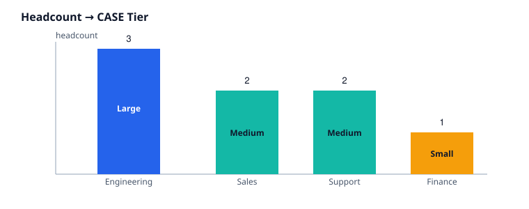
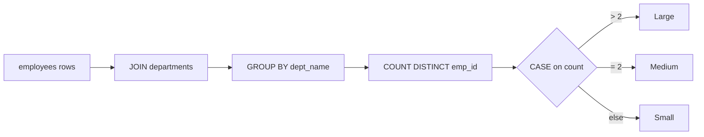

# 02 · Department Categorization

> Difficulty: Intermediate · Estimated time: 20 min
> Schema: [`00_Sample_Schema.sql`](./00_Sample_Schema.sql)



## Introduction

This lesson wraps `CASE` around an **aggregate function** — the first
place most learners get tripped up, because `CASE` now runs *after*
`GROUP BY` collapses rows, not per raw row.

## Learning Objectives

- Combine `CASE` with `COUNT()`, `GROUP BY`, and `HAVING`
- Understand SQL's logical execution order and why it matters for CASE
- Build a multi-tier classification (3+ branches) correctly ordered

## Business Context

Workforce planning teams don't think in raw headcounts — they think in
"large / medium / small" department tiers to decide where to hire,
freeze, or restructure. This is the same shape of logic behind
inventory tiers, revenue bands, and risk buckets you'll see later in
this module.

## Syntax

```sql
SELECT
    group_column,
    CASE
        WHEN AGG(...) > threshold_high THEN 'Large'
        WHEN AGG(...) > threshold_low  THEN 'Medium'
        ELSE 'Small'
    END AS tier
FROM ...
GROUP BY group_column;
```

## Engineering Notes

- **Logical order matters.** SQL conceptually executes
  `FROM → JOIN → WHERE → GROUP BY → HAVING → SELECT → ORDER BY`.
  Because `CASE` here lives in `SELECT`, it only runs *after*
  grouping — it sees the aggregated `COUNT()`, not individual rows.
  This is why `CASE` can reference `COUNT(DISTINCT e.emp_id)` directly.
- **Branch order defines the boundaries.** `> 2` then `= 2` then
  `ELSE` is equivalent to `> 2` / `> 1` / `ELSE` — but the explicit
  `= 2` is more self-documenting for a 3-tier system. For continuous
  ranges (revenue, age, tenure) prefer strict inequalities in
  descending order so there's no ambiguity about boundary rows.
- **`HAVING` vs `CASE` in `SELECT`:** `HAVING` *filters* grouped rows
  out of the result; `CASE` in `SELECT` *labels* every grouped row
  without removing any. Don't reach for `HAVING` when the actual need
  is a label — you'd lose the "Small" departments from the report
  entirely.

## Visual Explanation



## Production Applications

- Headcount-tier dashboards for finance/HR planning
- The identical pattern classifies order volume per store, ticket
  volume per support queue, or transaction count per merchant

## Best Practices

- Extract repeated aggregate expressions into a CTE first so `CASE`
  reads cleanly, especially once you have 4+ tiers:

```sql
WITH dept_counts AS (
    SELECT d.dept_name, COUNT(DISTINCT e.emp_id) AS headcount
    FROM departments d
    JOIN employees e ON d.dept_id = e.dept_id
    GROUP BY d.dept_name
)
SELECT dept_name,
       CASE
           WHEN headcount > 2 THEN 'Large'
           WHEN headcount = 2 THEN 'Medium'
           ELSE 'Small'
       END AS department_status
FROM dept_counts;
```

## Common Mistakes

| Mistake | Consequence |
|---|---|
| Referencing an aggregate alias inside the same `SELECT`'s `CASE` (`CASE WHEN headcount > 2 ...` where `headcount` was just aliased in the same list) | Most dialects reject this — aliases aren't visible to sibling expressions in the same `SELECT`. Use a subquery/CTE instead. |
| Departments with zero employees | An `INNER JOIN` silently drops them from the report entirely — use `LEFT JOIN` if empty departments should still show as "Small" |
| Boundary confusion (`>= 2` vs `> 2`) | Off-by-one tier assignment — always write down the exact boundary rule before coding it |

## Dialect Differences

All major dialects support `CASE` over aggregates identically. BigQuery
and Snowflake additionally support `QUALIFY` for post-aggregate
filtering, which can sometimes replace a `HAVING` + `CASE` combo.

## Interview Questions

1. Can a `CASE` expression in `SELECT` reference an aggregate that was aliased earlier in the same `SELECT` list?
2. What's the difference between using `HAVING` and using `CASE` to express a threshold?
3. Why would `INNER JOIN` silently under-report department counts here?

<details><summary>Answers</summary>

1. No — sibling `SELECT`-list aliases aren't visible to each other in standard SQL; use a CTE or subquery.
2. `HAVING` removes grouped rows from the result; `CASE` keeps every row and labels it.
3. Departments with no matching employee rows are excluded entirely by an inner join, so they never appear to be labeled at all — not even as "Small."

</details>

## Summary

Aggregating before classifying is a two-step mental model: first
compute the number, then label the number. Keeping those steps
separate (via a CTE) is what keeps multi-tier `CASE` logic readable.

## Cross References

- Previous: [`01_Basic_CASE_WHEN.md`](./01_Basic_CASE_WHEN.md)
- Next: [`03_City_Analysis.md`](./03_City_Analysis.md)
- [`03_Aggregations`](../03_Aggregations/README.md) · [`06_CTEs`](../06_CTEs/README.md)
