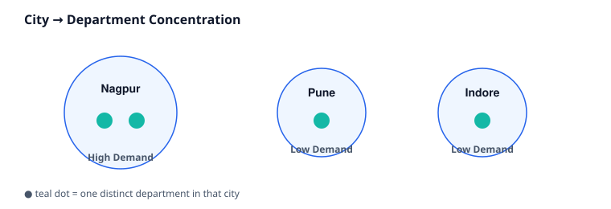

# 03 · City Analysis

> Difficulty: Intermediate · Estimated time: 15 min
> Schema: [`00_Sample_Schema.sql`](./00_Sample_Schema.sql)

## Introduction

Same shape as Lesson 02 (`CASE` over an aggregate), applied to a
**multi-table join** across `locations → departments`. This lesson
focuses on what happens to `CASE` classification when the underlying
join can fan out or drop rows.

## Learning Objectives

- Apply `CASE` after a `GROUP BY` that spans two joined tables
- Recognize when `JOIN` choice (`INNER` vs `LEFT`) silently changes classification results
- Use `CASE` output to drive business decisions (expansion planning)

## Business Context

Expansion and resource-allocation decisions ("should we open a second
office in this city?") are often driven by exactly this kind of
department-concentration metric.

## SQL

See [`03_City_Analysis.sql`](./03_City_Analysis.sql).

## Engineering Notes

- `COUNT(DISTINCT d.dept_id) > 1` is a **binary** classifier (High/Low
  Demand) — a good reminder that `CASE` doesn't need 3+ branches to
  be useful; sometimes a clean boolean label is exactly what's needed
  instead of a raw count.
- Because this is an `INNER JOIN`, a city with zero departments (e.g.
  a new office location added to `locations` before any department is
  assigned) won't appear in the result at all — not even as "Low
  Demand." This is the same trap as Lesson 02, worth internalizing
  because it recurs constantly in real reporting.

## Best Practices

- When a `CASE` threshold is a single cutoff (High vs Low), consider
  naming the cutoff as a well-known business term in the alias
  (`city_status`) and documenting the exact number (`> 1`) in a
  comment — thresholds drift, and future maintainers need to know why
  `1` was chosen, not just that it was.

## Common Mistakes

- Assuming "Low Demand" means "we checked and it's low" — with an
  `INNER JOIN`, cities that never got any department at all are
  invisible, which is a different (and often more urgent) business
  situation than "low but present."

## Interview Questions

1. Why might a city with genuinely zero departments not appear in this report at all?
2. How would you rewrite the query so every city always appears, even with zero departments?

Answers

1. The `INNER JOIN` between `locations` and `departments` requires a match; a city with no departments produces no joined rows and is dropped before `GROUP BY` even runs.
2. Switch to `LEFT JOIN locations l ... departments d ON l.location_id = d.location_id`, and wrap the count with `COALESCE(COUNT(d.dept_id), 0)` so it doesn't null out.

## Cross References

- Previous: [`02_Department_Categorization.md`](./02_Department_Categorization.md)
- Next: [`04_Employee_Labelling.md`](./04_Employee_Labelling.md)
