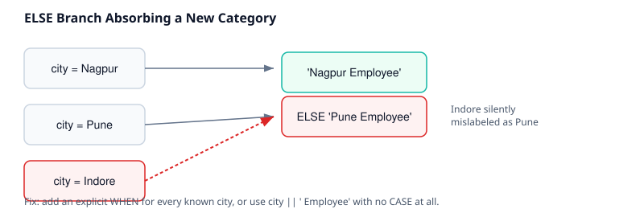

# 04 · Employee Labelling

> Difficulty: Intermediate · Estimated time: 15 min
> Schema: [`00_Sample_Schema.sql`](./00_Sample_Schema.sql)

## Introduction

A three-table join (`employees → departments → locations`) used to
build a human-readable label column. This lesson's real lesson is
**scalability of `WHEN` branches** — the original two-city version
doesn't generalize, and that's the point.

## Learning Objectives

- Build `CASE` labels across a multi-hop join
- Recognize when hardcoded `WHEN` branches become a maintenance liability
- Refactor a hardcoded CASE into a scalable pattern using `CONCAT`

## Business Context

HR dashboards and workforce reports are read by people, not systems —
"Nagpur Employee" is a label a regional VP can scan in a table of 500
rows; `location_id = 1` is not.

## SQL

See [`04_Employee_Labelling.sql`](./04_Employee_Labelling.sql).

## Engineering Notes

- The original version of this query only ever produces two labels —
  `'Nagpur Employee'` and `'Pune Employee'` — because it has an
  explicit `WHEN` for Nagpur and dumps *everything else* into `ELSE
  'Pune Employee'`. Once a third city (`Indore`, present in the seed
  data) enters the picture, every Indore employee is **mislabeled as
  Pune**. This is flagged explicitly here because it's a very common
  production bug: an `ELSE` branch that was written when only two
  categories existed silently absorbs every new category added later.
- The fix isn't more `WHEN` branches — it's recognizing that
  `city || ' Employee'` needs no `CASE` at all when the label is a
  pure, mechanical transformation of an existing column.

## Best Practices

- Reach for `CASE` when the mapping from input to output is not a
  1:1 mechanical transformation (i.e. there's real business logic:
  thresholds, groupings, exceptions). When it *is* 1:1, string
  concatenation is simpler, automatically correct for new values, and
  easier to read.
- If a fixed, closed set of categories truly is the business
  requirement (say, only Nagpur/Pune/Mumbai are ever valid regional
  hubs and everything else should be flagged), make the fallback
  explicit and honest: `ELSE 'Other Location'`, never a valid-sounding
  city name.

## Common Mistakes

| Mistake | Consequence |
|---|---|
| `ELSE` re-using a real value ('Pune Employee') as the fallback | Every new/unanticipated category is silently mislabeled as an existing one — the most dangerous kind of `CASE` bug because it produces no error, just wrong data |
| Hardcoding every known value as a `WHEN` branch | Doesn't scale; breaks the moment a new value is added upstream |

## Interview Questions

1. What's wrong with using a real category name as the `ELSE` fallback?
2. When should you prefer string concatenation over `CASE` for a labelling task?

Answers

1. It makes every future, unanticipated category silently indistinguishable from that one hardcoded category — a mislabeling bug that produces no error and is easy to miss in QA.
2. When the output is a pure, mechanical function of the input column (e.g. appending a fixed suffix) with no actual business rule or exception — CASE adds no value there and actively hides a bug for new inputs.

## Cross References

- Previous: [`03_City_Analysis.md`](./03_City_Analysis.md)
- Next: [`05_Business_Rules.md`](./05_Business_Rules.md)
- [`10_String_Functions`](../10_String_Functions/README.md)
