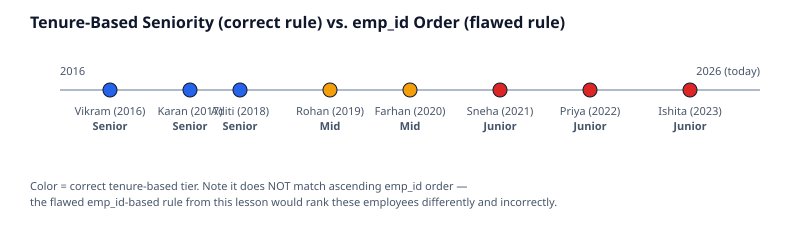

# 05 · Business Rules with CASE WHEN

> Difficulty: Intermediate · Estimated time: 20 min
> Schema: [`00_Sample_Schema.sql`](./00_Sample_Schema.sql)

## Introduction

This lesson exposes a subtle but important flaw in a common pattern:
using a surrogate key (`emp_id`) as a stand-in for a *business*
attribute (seniority) it wasn't designed to represent.

## Learning Objectives

- Recognize when a `CASE` rule is encoding an accidental correlation instead of a real business rule
- Rebuild the same classification against a column that actually means what the label claims
- Practice a 3-tier `CASE` with correctly ordered, non-overlapping ranges

## Business Context

"Seniority" in a real HR system is a function of tenure
(`hire_date`) or role level — never of primary key order, which
merely reflects insertion order into the database and carries no
business meaning at all.

## SQL

See [`05_Business_Rules.sql`](./05_Business_Rules.sql).

## Engineering Notes

- `WHEN emp_id <= 2 THEN 'Senior'` happens to "work" on 8 rows of demo
  data only because low IDs were inserted first. It is not a business
  rule — it's coincidence dressed up as logic. In production this
  breaks the moment employee records are deleted, re-inserted,
  migrated, or merged from another system, none of which preserve ID
  order as a meaningful signal.
- The engineering-correct version of this rule uses `hire_date`, which
  actually means "how long has this person been here." Tenure-based
  tiers are also **relative to the query's run date**, so they should
  be computed against `CURRENT_DATE`, not hardcoded years.

## Best Practices

- Before writing a `CASE` classification, ask: *"Does this column's
  data type and meaning actually justify this business label?"* A
  surrogate/primary key almost never does.
- For date-driven tiers, compute the difference explicitly
  (`CURRENT_DATE - hire_date`, or `DATEDIFF` depending on dialect)
  rather than hardcoding absolute cutoff dates that go stale.

## Common Mistakes

| Mistake | Consequence |
|---|---|
| Classifying by primary key value | Rule breaks on any reordering, deletion, or re-insertion of rows |
| Hardcoding absolute cutoff dates (`hire_date < '2020-01-01'`) | Correct today, silently wrong a year from now as "senior" should mean something relative to *now* |
| Overlapping range boundaries | Ambiguous or wrong classification for boundary values |

## Dialect Differences

| Dialect | "Days since" expression |
|---|---|
| PostgreSQL | `CURRENT_DATE - hire_date` (returns integer days) |
| MySQL | `DATEDIFF(CURDATE(), hire_date)` |
| SQL Server | `DATEDIFF(day, hire_date, GETDATE())` |
| BigQuery | `DATE_DIFF(CURRENT_DATE(), hire_date, DAY)` |

## Interview Questions

1. Why is classifying employees by `emp_id` a fragile business rule, even if it produces the "right" result on today's data?
2. How would you make a tenure-based `CASE` rule stay correct over time instead of needing yearly updates?

Answers

1. `emp_id` encodes insertion order, not any business fact — the rule only coincidentally matches seniority on the current dataset and will break under deletions, re-inserts, or data migrations that don't preserve ID order.
2. Compute the classification against a relative expression (`CURRENT_DATE - hire_date`) instead of hardcoded absolute dates, so the same query produces correct results every time it's run, indefinitely.

## Cross References

- Previous: [`04_Employee_Labelling.md`](./04_Employee_Labelling.md)
- Next: [`06_Advanced_CASE_Patterns.md`](./06_Advanced_CASE_Patterns.md)
- [`09_Date_Functions`](../09_Date_Functions/README.md)
