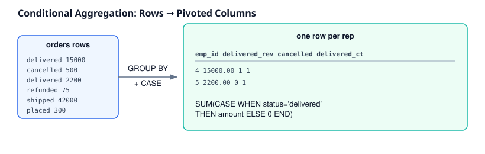

# 06 · Advanced CASE Patterns

> Difficulty: Advanced · Estimated time: 30 min
> Schema: [`00_Sample_Schema.sql`](./00_Sample_Schema.sql)



## Introduction

Lessons 01–05 covered `CASE` in a flat `SELECT`. This lesson covers
every other place `CASE` shows up in real engineering work: inside
aggregates (conditional aggregation), inside window functions, nested
`CASE`, and how `CASE` compares to its cousins (`COALESCE`, `IIF`,
`DECODE`).

## Learning Objectives

- Write conditional aggregation (`SUM(CASE WHEN ...)`) to pivot rows into columns
- Combine `CASE` with window functions for per-row *and* per-group logic in one query
- Nest `CASE` expressions correctly without losing readability
- Choose between `CASE`, `COALESCE`, `IIF`, and `DECODE` for a given task

## 1 · Conditional Aggregation

The single most valuable production pattern in this lesson. Instead of
running one query per category, `SUM`/`COUNT` combined with `CASE`
turns rows into columns in a single pass — the SQL equivalent of a
pivot table.

```sql
SELECT
    e.emp_id,
    e.emp_name,
    SUM(CASE WHEN o.order_status = 'delivered' THEN o.order_amount ELSE 0 END) AS delivered_revenue,
    SUM(CASE WHEN o.order_status = 'cancelled' THEN 1 ELSE 0 END)              AS cancelled_orders,
    COUNT(CASE WHEN o.order_status = 'delivered' THEN 1 END)                   AS delivered_count
FROM employees e
JOIN orders o ON e.emp_id = o.emp_id
GROUP BY e.emp_id, e.emp_name;
```

**Engineering note:** `SUM(CASE ... ELSE 0 END)` and
`COUNT(CASE ... END)` (no `ELSE`) are both common, but they behave
differently — `SUM` needs an explicit `ELSE 0` because
`SUM(NULL, NULL, NULL)` returns `NULL`, not `0`. `COUNT(expression)`
already ignores `NULL`s by definition, so omitting `ELSE` there is
intentional, not a bug.

## 2 · CASE with Window Functions

```sql
SELECT
    e.emp_name,
    e.dept_id,
    e.salary,
    CASE
        WHEN e.salary = MAX(e.salary) OVER (PARTITION BY e.dept_id) THEN 'Top Earner'
        ELSE 'Standard'
    END AS pay_tier
FROM employees e;
```

This runs `CASE` *after* the window function computes the per-department
maximum, giving you row-level logic that's aware of group-level
context — without collapsing rows the way `GROUP BY` would.

## 3 · Nested CASE

```sql
SELECT
    e.emp_name,
    CASE
        WHEN e.performance_score IS NULL THEN 'Not Yet Reviewed'
        ELSE
            CASE
                WHEN e.performance_score >= 4 THEN 'High Performer'
                WHEN e.performance_score >= 2 THEN 'Meets Expectations'
                ELSE 'Needs Improvement'
            END
    END AS performance_label
FROM employees e;
```

**Engineering note:** nested `CASE` is legitimate when the outer
condition is a genuinely different *kind* of check (here: "does a
score even exist?") from the inner ranking logic. If both levels are
just more thresholds on the same value, flatten them into one `CASE`
with more `WHEN` branches instead — nesting for its own sake hurts
readability.

## 4 · CASE inside ORDER BY, GROUP BY, HAVING, JOIN, UPDATE

```sql
-- ORDER BY: custom sort order not achievable with a plain column sort
SELECT emp_name, dept_id
FROM employees
ORDER BY CASE WHEN dept_id = 1 THEN 0 ELSE 1 END, emp_name;

-- GROUP BY: bucket rows into custom ranges before aggregating
SELECT
    CASE WHEN salary >= 150000 THEN 'High' ELSE 'Standard' END AS salary_band,
    COUNT(*) AS headcount
FROM employees
GROUP BY CASE WHEN salary >= 150000 THEN 'High' ELSE 'Standard' END;

-- HAVING: filter groups by a classification computed post-aggregation
SELECT dept_id, COUNT(*) AS headcount
FROM employees
GROUP BY dept_id
HAVING COUNT(*) > CASE WHEN dept_id = 1 THEN 2 ELSE 1 END;

-- JOIN condition: rare, but valid -- e.g. different join keys per data source
-- UPDATE: apply the same classification logic to persist a column
UPDATE employees
SET performance_score = CASE
    WHEN performance_score IS NULL THEN 3   -- default unreviewed employees to 'meets expectations'
    ELSE performance_score
END;
```

## Comparison Table — CASE vs Its Alternatives

| Function | Purpose | Branch limit | Portable? |
|---|---|---|---|
| `CASE` | General conditional logic, any boolean expression | Unlimited | Yes — ANSI SQL, all dialects |
| `COALESCE(a, b, c)` | Return first non-NULL argument | N/A (not conditional logic, just NULL fallback) | Yes — ANSI SQL |
| `IIF(cond, t, f)` | Shorthand two-branch CASE | 2 | SQL Server, BigQuery only |
| `DECODE(expr, v1, r1, v2, r2, default)` | Exact-value lookup, like simple CASE | Unlimited but equality-only | Oracle only |
| `CHOOSE(index, v1, v2, ...)` | Return the Nth value by position | Fixed list | SQL Server only |

**Rule of thumb:** use `COALESCE` for pure NULL-fallback logic (it's
shorter and clearer intent than `CASE WHEN x IS NULL THEN y ELSE x
END`). Use `CASE` for everything else — it's the only one of these
that's both fully general and portable across every dialect.

## Interview Questions

1. Why does `SUM(CASE WHEN ... THEN amount ELSE 0 END)` need an explicit `ELSE 0`, but `COUNT(CASE WHEN ... THEN 1 END)` doesn't?
2. When is nested `CASE` justified vs when should it be flattened?
3. What's the practical difference between `COALESCE(x, 0)` and `CASE WHEN x IS NULL THEN 0 ELSE x END`?
4. Why would you put a `CASE` expression in `ORDER BY` instead of just sorting by a column?

<details><summary>Answers</summary>

1. `SUM` over an all-`NULL` set returns `NULL`, so unmatched rows must explicitly contribute `0`. `COUNT(expr)` already skips `NULL`s by definition, so no `ELSE` is needed to get a correct count.
2. Justified when the outer and inner conditions check genuinely different things (e.g. "does data exist" vs "what tier does it fall into"). Otherwise, flatten into one CASE with more branches — nesting purely for style reduces readability.
3. They're functionally identical for this simple case; `COALESCE` is shorter and immediately signals "NULL-fallback" intent to any reader, which is why it's preferred when that's literally all you need.
4. When the desired sort order is a custom business priority (e.g. "my department first, then alphabetical") that doesn't correspond to any single column's natural sort order.

</details>

## Cross References

- Previous: [`05_Business_Rules.md`](./05_Business_Rules.md)
- Next: [`07_Business_Case_Studies.md`](./07_Business_Case_Studies.md)
- [`07_Window_Functions`](../07_Window_Functions/README.md) · [`06_CTEs`](../06_CTEs/README.md) · [`12_Advanced_Aggregations`](../12_Advanced_Aggregations/README.md)
