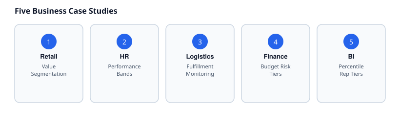

# 07 · Business Case Studies

> Difficulty: Advanced · Estimated time: 40 min
> Schema: [`00_Sample_Schema.sql`](./00_Sample_Schema.sql)

## Introduction

Five realistic, end-to-end business scenarios. Each follows the same
structure — problem, dataset, rule, engineering decision, SQL,
alternative, performance/production notes — so you can use this as a
template for classification logic you'll write on the job. Depth was
chosen over breadth: five scenarios done properly teach more than
twenty done superficially.

Runnable SQL for all five is in
[`07_Business_Case_Studies.sql`](./07_Business_Case_Studies.sql).

---

## Case Study 1 — Customer/Order Value Segmentation (Retail / E-commerce)

**Business problem:** Marketing wants to target high-value customers
differently from low-value ones for a loyalty campaign, using order
history rather than a single order.

**Business rule:**
- Lifetime delivered revenue ≥ 40,000 → `'VIP'`
- Lifetime delivered revenue ≥ 10,000 → `'Regular'`
- Otherwise → `'New / Low Value'`

**Engineering decision:** This requires conditional aggregation
(Lesson 06, Pattern 1) followed by a `CASE` over the aggregated total
— two logical steps, best expressed with a CTE so the threshold logic
stays readable and testable independent of the aggregation.

**Common mistake:** Segmenting on `order_amount` per row instead of
lifetime revenue per customer conflates "placed one big order" with
"is a valuable customer" — very different business realities.

---

## Case Study 2 — Employee Performance Bands (HR)

**Business problem:** Annual review cycle needs performance bands that
correctly separate "not yet reviewed" from "reviewed and low" — HR
cannot treat missing data as bad data without risking real complaints.

**Business rule:** see nested `CASE` pattern in Lesson 06, Pattern 3.

**Engineering decision:** `NULL` is checked first, explicitly, before
any numeric threshold — this ordering is not optional. Reversing it
(numeric thresholds first) would make `NULL >= 4` etc. evaluate to
`NULL`/false and silently fall through to `ELSE`, mislabeling
unreviewed employees as "Needs Improvement," a materially worse
outcome than the intended "Not Yet Reviewed."

---

## Case Study 3 — Order Status / Fulfillment Monitoring (Logistics / SaaS)

**Business problem:** Ops wants a single dashboard query that shows,
per rep, how orders are distributed across their lifecycle — placed,
shipped, delivered, cancelled, refunded — without five separate
queries.

**Business rule:** one column per status, counted via conditional
aggregation.

**Engineering decision:** This is the textbook conditional-aggregation
pivot (Lesson 06, Pattern 1). The alternative — a `PIVOT` operator
where the dialect supports one, or five separate `COUNT(*) ... WHERE
status = X` queries `UNION`ed together — is strictly worse: more
scans, more code, harder to keep in sync when a new status is added.

**Performance note:** conditional aggregation requires only a single
pass over `orders`; five separate filtered queries would each scan
the table independently unless the optimizer is unusually aggressive
about query folding.

---

## Case Study 4 — Department Budget Risk Tiers (Finance)

**Business problem:** Finance wants departments flagged by how their
actual headcount compares to what their budget "should" support,
to catch over- or under-staffed teams before the quarterly review.

**Business rule (illustrative):**
- `budget / headcount < 200000` → `'Overstaffed Relative to Budget'`
- `budget / headcount > 800000` → `'Understaffed Relative to Budget'`
- Otherwise → `'Balanced'`

**Engineering decision:** This combines two lessons' worth of
technique — conditional aggregation for headcount (Lesson 02) plus a
derived ratio classified by `CASE` (this lesson). It's also a good
example of a **divide-by-zero risk**: any department with zero
employees needs an explicit guard before the ratio is computed.

**Common mistake:** computing `budget / headcount` without first
checking `headcount = 0`, causing a runtime division error in
dialects that don't return `NULL`/`inf` for divide-by-zero (e.g.
standard PostgreSQL raises an error; some warehouses instead return
`NULL` or `Infinity` — always check your dialect's behavior).

---

## Case Study 5 — Sales Rep Performance Tiers with Window Functions (BI / Executive Reporting)

**Business problem:** An executive dashboard needs each sales rep
ranked against their peers, not just against a fixed number — "top
20% of reps by delivered revenue" is a relative, cohort-based label.

**Business rule:** use `NTILE()` or `PERCENT_RANK()` as a window
function, then apply `CASE` to the resulting rank/percentile.

**Engineering decision:** This is why Lesson 06's Pattern 2 (`CASE` +
window function) matters at the executive level — fixed-threshold
tiers (Case Study 1's approach) don't work when the business question
is inherently relative ("top X% this quarter"), because thresholds
that made sense last quarter go stale as the whole business grows or
shrinks.

---

## Cross References

- Previous: [`06_Advanced_CASE_Patterns.md`](./06_Advanced_CASE_Patterns.md)
- Next: [`08_Interview_Prep.md`](./08_Interview_Prep.md)
- [`18_Business_Case_Studies`](../18_Business_Case_Studies/README.md) (module-wide case study index)
