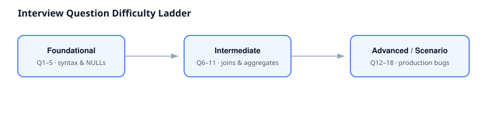

# 08 · Interview Preparation

> Consolidated from every lesson in this module, plus scenario-based
> questions not covered elsewhere. Organized by difficulty.

## Foundational

1. **What is `CASE WHEN` and where can it be used in a query?**
   An expression, not a statement — valid anywhere a value is valid:
   `SELECT`, `WHERE`, `ORDER BY`, `GROUP BY`, `HAVING`, inside
   aggregates, `JOIN ... ON`, `UPDATE ... SET`.

2. **Simple vs searched CASE — what's the difference?**
   Simple compares one expression to exact values only. Searched
   evaluates arbitrary boolean conditions (ranges, `IS NULL`, `AND`/`OR`).

3. **What happens if no `WHEN` matches and there's no `ELSE`?**
   Returns `NULL`. No error is raised.

4. **Does CASE evaluate every branch, or stop early?**
   Stops at the first `TRUE` condition, evaluated top to bottom.

5. **Why does `WHEN x = NULL THEN ...` never match?**
   `NULL` represents "unknown"; any equality comparison against
   unknown is itself unknown, never `TRUE`. Use `IS NULL`.

## Intermediate

6. **Why can't a `CASE` expression reference an aggregate alias defined earlier in the same `SELECT` list?**
   SELECT-list aliases aren't visible to sibling expressions in
   standard SQL evaluation order — use a CTE or repeat the expression.

7. **Difference between filtering with `HAVING` and labelling with `CASE` in `SELECT`?**
   `HAVING` removes grouped rows from the result. `CASE` in `SELECT`
   keeps every row and assigns a label — no rows are lost.

8. **Why might `INNER JOIN` cause a `CASE`-based report to silently under-represent a category (e.g. "zero" never appears)?**
   Rows with no match are excluded entirely before `GROUP BY`/`CASE`
   ever run. Use `LEFT JOIN` with `COALESCE`/`0`-handling if absence
   itself is a meaningful category.

9. **What's the danger of an `ELSE` branch re-using a value that also appears as a real category (e.g. `ELSE 'Pune Employee'`)?**
   Any new/unanticipated input silently gets mislabeled as that
   category instead of flagged — a bug that produces no error and is
   easy to miss in QA.

10. **Why does `SUM(CASE WHEN ... THEN amount ELSE 0 END)` need an explicit `ELSE 0`, while `COUNT(CASE WHEN ... THEN 1 END)` doesn't?**
    `SUM` over an all-`NULL` input returns `NULL`. `COUNT(expr)`
    already ignores `NULL`s by definition.

11. **When would you use `COALESCE` instead of `CASE`?**
    When the only goal is a NULL fallback — `COALESCE` states that
    intent more directly and portably than a `CASE WHEN x IS NULL`.

## Advanced / Scenario-Based

12. **You need to classify customers into "Top 20% by revenue." Why won't a fixed dollar threshold work as well as `PERCENT_RANK()` + `CASE`?**
    Fixed thresholds go stale as the business grows or shrinks;
    percentile-based tiers stay meaningful relative to the current
    cohort automatically.

13. **You're asked to classify departments by `budget / headcount`. What production bug must you guard against?**
    Division by zero when `headcount = 0` — add an explicit `WHEN
    headcount = 0 THEN ...` branch before the division.

14. **Given a nested `CASE` distinguishing "no score yet" (`NULL`) from "low score," why must the `NULL` check come first?**
    If numeric comparisons run first, `NULL >= 4` etc. evaluate to
    unknown/false and fall through to `ELSE`, silently mislabeling
    unreviewed records as the worst category instead of "not yet
    reviewed" — a materially different (and often legally/HR-sensitive)
    distinction.

15. **A `CASE` classification was working correctly, then started producing wrong results after a database migration where employee IDs were reassigned. What's the likely root cause, and how do you prevent it?**
    The classification was almost certainly built on a surrogate key
    (like `emp_id`) instead of a real business attribute (like
    `hire_date`). Prevent it by never classifying on primary/surrogate
    keys — verify the column's actual business meaning first.

16. **How would you rewrite five separate `COUNT(*) WHERE status = X` queries, unioned together, into a single more efficient query?**
    Conditional aggregation: one `SELECT` with `SUM(CASE WHEN status =
    X THEN 1 ELSE 0 END)` per status, single pass over the table.

17. **Why is `CASE` inside a `WHERE` clause on an indexed column often a performance problem?**
    Wrapping an indexed column in an expression usually prevents the
    optimizer from using an index range scan on that column, forcing
    a full scan. Prefer raw column comparisons in `WHERE`; keep `CASE`
    for derived `SELECT` columns.

18. **What's the tradeoff between hardcoding every known category as a `WHEN` branch vs. a mechanical transformation like string concatenation?**
    Hardcoded branches are correct for genuinely closed, validated
    sets where new/unexpected values should be flagged. Mechanical
    transformation (no `CASE` at all) is correct for open sets where
    the label is purely cosmetic — using the wrong one either creates
    a silent mislabeling bug or hides data-quality signals that should
    have been surfaced.

## Common Traps Interviewers Look For

- Forgetting `ELSE` and not realizing the result is `NULL`, not an error
- Writing `= NULL` instead of `IS NULL`
- Assuming branch order doesn't matter
- Classifying on a surrogate key instead of a real business column
- Not considering `INNER` vs `LEFT JOIN` impact on a classification's completeness
- Missing the `ELSE 0` requirement inside `SUM(CASE ...)`

## Cross References

- Previous: [`07_Business_Case_Studies.md`](./07_Business_Case_Studies.md)
- [`17_SQL_Interview_Questions`](../17_SQL_Interview_Questions/README.md) (module-wide interview bank)
