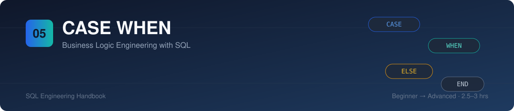
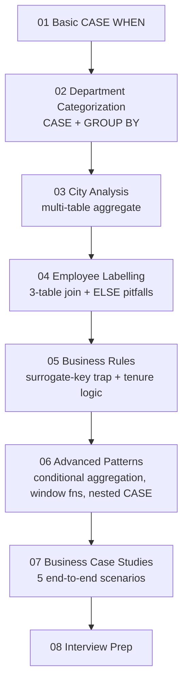
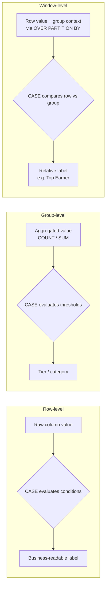

# 05 · CASE WHEN — Business Logic Engineering with SQL

> Part of the [SQL Engineering Handbook](../README.md)
> Difficulty: Beginner → Advanced · Estimated study time: 2.5–3 hours

## Module Files

| # | Lesson | Concept | SQL Lab |
|---|---|---|---|
| 00 | [Sample Schema](./00_Sample_Schema.sql) | Shared schema + seed data | — |
| 01 | [Basic CASE WHEN](./01_Basic_CASE_WHEN.md) | Simple vs searched CASE | [.sql](./01_Basic_CASE_WHEN.sql) |
| 02 | [Department Categorization](./02_Department_Categorization.md) | CASE + GROUP BY + aggregates | [.sql](./02_Department_Categorization.sql) |
| 03 | [City Analysis](./03_City_Analysis.md) | CASE over a multi-table aggregate | [.sql](./03_City_Analysis.sql) |
| 04 | [Employee Labelling](./04_Employee_Labelling.md) | 3-table join, ELSE pitfalls | [.sql](./04_Employee_Labelling.sql) |
| 05 | [Business Rules](./05_Business_Rules.md) | Surrogate-key trap, tenure rules | [.sql](./05_Business_Rules.sql) |
| 06 | [Advanced CASE Patterns](./06_Advanced_CASE_Patterns.md) | Conditional aggregation, window functions, nested CASE | [.sql](./06_Advanced_CASE_Patterns.sql) |
| 07 | [Business Case Studies](./07_Business_Case_Studies.md) | 5 end-to-end business scenarios | [.sql](./07_Business_Case_Studies.sql) |
| 08 | [Interview Prep](./08_Interview_Prep.md) | Consolidated Q&A bank | — |
| — | [Credits & Acknowledgments](./CREDITS.md) | Module authorship and audit history | — |

## Module Overview

`CASE WHEN` looks like a small piece of syntax. In production, it's
the mechanism that turns raw rows into the categories, tiers, and
flags every dashboard, report, and feature-engineering pipeline
depends on. This module treats it as what it actually is: **business
logic engineering with SQL**, not a syntax tutorial.

## Business Motivation

Business users, dashboards, and downstream models don't consume raw
columns — they consume categories: *High Value Customer*, *Overdue
Invoice*, *Top Earner*, *Fraud Risk*. Every one of those labels is a
`CASE` expression, and getting them wrong (silent mislabeling, missing
`ELSE`, classifying on the wrong column) produces wrong business
decisions with no error message to catch it.

## Learning Objectives

By the end of this module you will be able to:
- Write correct simple and searched `CASE` expressions
- Combine `CASE` with `GROUP BY`, aggregates, and window functions
- Recognize and avoid the classification bugs that ship silently to production
- Build multi-tier business rules (segmentation, risk, performance) end-to-end
- Answer CASE-related questions at a senior analyst / analytics engineer interview level

## Module Roadmap



## Folder Structure

```text
05_CASE_WHEN/
├── README.md                          You are here
├── CREDITS.md                          Authorship & audit acknowledgments
├── 00_Sample_Schema.sql                Shared schema + seed data for every lesson
├── 01_Basic_CASE_WHEN.md / .sql        Simple vs searched CASE
├── 02_Department_Categorization.md/.sql CASE + GROUP BY + aggregates
├── 03_City_Analysis.md / .sql          CASE over a multi-table aggregate
├── 04_Employee_Labelling.md / .sql     3-table join, ELSE pitfalls
├── 05_Business_Rules.md / .sql         Surrogate-key trap, tenure-based rules
├── 06_Advanced_CASE_Patterns.md/.sql   Conditional aggregation, window functions, nested CASE
├── 07_Business_Case_Studies.md/.sql    5 end-to-end business scenarios
├── 08_Interview_Prep.md                Consolidated Q&A bank
└── assets/                             SVG banner, ERD, and per-lesson diagrams
    ├── banner.svg
    ├── 00_schema_erd.svg
    ├── 01_case_evaluation_flow.svg
    ├── 02_department_tiers.svg
    ├── 03_city_demand.svg
    ├── 04_labelling_bug.svg
    ├── 05_tenure_timeline.svg
    ├── 06_conditional_aggregation.svg
    ├── 07_case_studies_grid.svg
    └── 08_interview_roadmap.svg
```

## Learning Flow

Each lesson pairs a `.md` (concept, business context, engineering
notes, interview questions) with a `.sql` (runnable lab against the
shared schema, alternative solutions, production notes). Run
`00_Sample_Schema.sql` once first — every later lesson depends on it.

## Decision Logic Architecture



## Production Applications

| Context | How CASE is used |
|---|---|
| dbt staging models | Normalize raw source values into clean, documented categories |
| BI dashboards | Derive tier/segment columns consumed directly by Looker/Tableau/Power BI |
| Data warehouses | Feature engineering — turning continuous values into buckets for downstream models |
| Reporting | Conditional aggregation to pivot status/category counts into columns |
| Data quality | Flagging nulls, out-of-range values, and unexpected categories explicitly |

## Skills Learned

Conditional logic · business rule implementation · data categorization
· conditional aggregation · CASE with window functions · nested CASE ·
NULL-handling discipline · dialect portability awareness ·
production-bug pattern recognition (surrogate-key traps, absorbing
`ELSE` branches, divide-by-zero guards)

## Difficulty & Prerequisites

- **Prerequisites:** comfort with `SELECT`, `JOIN`, `GROUP BY`, and basic aggregates ([`01_Fundamentals`](../01_Fundamentals/README.md), [`03_Aggregations`](../03_Aggregations/README.md))
- **Difficulty curve:** Lessons 01–03 (Beginner/Intermediate) → 04–05 (Intermediate, bug-focused) → 06–08 (Advanced)

## Engineering Checklist

Before shipping a `CASE` expression to production, verify:

- [ ] Every branch has been checked against `NULL` inputs explicitly
- [ ] `ELSE` is present and does **not** silently reuse a real category name as a fallback
- [ ] Branch order is correct — most specific condition first
- [ ] The classification is built on a column that actually carries the business meaning (not a surrogate key)
- [ ] `INNER` vs `LEFT JOIN` choice has been deliberately considered for completeness
- [ ] `SUM(CASE ...)` includes `ELSE 0`; `COUNT(CASE ...)` intentionally omits it
- [ ] Thresholds are documented with their business meaning, not just raw numbers
- [ ] Division inside a `CASE` branch is guarded against zero denominators

## Best Practices

- Alias every `CASE` expression
- Extract repeated aggregate expressions into a CTE before wrapping them in `CASE`
- Prefer `COALESCE` over `CASE` for pure NULL-fallback logic
- Prefer mechanical string transformation over `CASE` when the mapping is 1:1 with no real business rule

## Common Mistakes

See each lesson's "Common Mistakes" section for the specific bug it
demonstrates. In summary: missing `ELSE`, `= NULL` instead of `IS
NULL`, classifying on surrogate keys, absorbing `ELSE` branches, and
unguarded division.

## Related Modules

[`01_Fundamentals`](../01_Fundamentals/README.md) ·
[`02_Aggregations`](../02_Aggregations/README.md) ·
[`03_Joins`](../3_Joins/README.md) .
[`04_Subqueries`](../04Subqueries/README.md) ·
[`06_CTEs`](../06_CTEs/README.md) ·
[`07_Window_Functions`](../07_Window_Functions/README.md) ·
[`09_Date_Functions`](../09_Date_Functions/README.md) ·
[`10_STRING_FUNCTIONS`](../10_STRING_FUNCTIONS/README.md) ·
[`11_NULL_HANDLING_AND_DATA_CLEANING`](../11_NULL_HANDLING_AND_DATA_CLEANING/README.md) ·
[`12_ADVANCED_AGGREGATIONS`](../12_ADVANCED_AGGREGATIONS/README.md) ·
[`14_VIEWS`](../14_VIEWS/README.md) ·
[`16_Query_Optimization`](../16_Query_Optimization/README.md) ·
[`17_SQL_Interview_Questions`](../17_SQL_Interview_Questions/README.md) ·
[`18_Business_Case_Studies`](../18_Business_Case_Studies/README.md) ·
[`20_SQL_Cheatsheets`](../20_SQL_Cheatsheets/README.md)

## Contributor Guide

Contributions welcome — this module intentionally keeps every lesson
to the same structure (concept → business context → engineering notes
→ SQL lab → interview questions) so new lessons stay consistent.

**To add a new lesson:**
1. Follow the existing `NN_Topic_Name.md` / `.sql` naming pattern
2. Use `00_Sample_Schema.sql` rather than introducing a new schema, unless the lesson genuinely needs new tables — if so, add them to the schema file with an `INSERT` block and document why
3. Every `.md` should include: Introduction, Learning Objectives, Business Context, Engineering Notes, SQL reference, Common Mistakes, Interview Questions, Cross References
4. Every `.sql` should include: scenario comment, business rule comment, primary solution, at least one alternative/production note, and 1–2 "Further Experiments" prompts
5. Prefer a real, demonstrable production bug over an invented one — several lessons in this module (04, 05) are built around bugs that were actually present in an earlier draft, kept intentionally as teaching examples rather than silently fixed

## Credits & Acknowledgments

Authored and maintained by
[theammarngp-makes](https://github.com/theammarngp-makes) as part of
the SQL Engineering Handbook. Full module credits are in
[`CREDITS.md`](./CREDITS.md).

## Key Takeaway

`CASE WHEN` is the boundary where raw data becomes business meaning.
Every lesson in this module is really about the same underlying
discipline: know exactly what a `NULL`, a surrogate key, a join type,
or a missing `ELSE` will actually do to your classification — because
in production, a wrong `CASE` doesn't throw an error, it just quietly
produces the wrong business decision.
