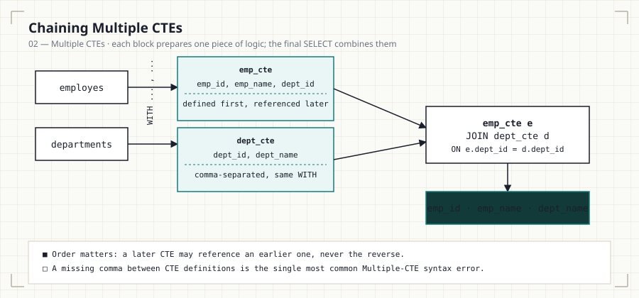

# 02 — Multiple CTEs

<p align="center">
  
</p>

> **In this file:** defining more than one CTE in a single `WITH` clause,
> the rules for chaining and comma-separating them, and joining two staged
> CTEs together for the first time.

---

## Business Question

How can multiple temporary datasets be prepared independently, then combined
in one final query — instead of writing one query that does everything at
once?

## Why This Matters

Real reporting queries rarely touch a single table. The moment a query needs
employees **and** departments **and** locations, a single monolithic
`SELECT` becomes hard to reason about: which `JOIN` filters which rows? A
`WITH` clause holding several CTEs lets you build the query the same way you
would explain it out loud — "first get the employees, then get the
departments, then join them" — with each stage isolated and independently
testable.

## SQL Solution

See [`02_Multiple_CTEs.sql`](02_Multiple_CTEs.sql) for all three queries.

```sql
WITH emp_cte AS (
    SELECT emp_id, emp_name, dept_id
    FROM employes
),
dept_cte AS (
    SELECT dept_id, dept_name
    FROM departments
)
SELECT
    e.emp_id,
    e.emp_name,
    d.dept_name
FROM emp_cte e
JOIN dept_cte d
    ON d.dept_id = e.dept_id;
```

## Explanation

Multiple CTEs live inside **one** `WITH` keyword, separated by commas — not
repeated `WITH` statements:

```sql
WITH first_cte AS ( ... ),
     second_cte AS ( ... ),
     third_cte AS ( ... )
SELECT ...
```

Two rules govern how they interact:

- **Ordering is directional.** A CTE defined later in the list may
  reference one defined earlier (this is how File 03 builds a three-way
  join). A CTE can never reference one that comes *after* it.
- **Each CTE is scoped to the same statement** as the others — they all
  disappear together once the final `SELECT` finishes.

This file takes that pattern from two CTEs (`emp_cte`, `dept_cte`) to three
(adding `locations_cte`), previewing the join pattern the rest of the module
builds on.

## Finding

Employee and department data were separated into individual, reusable
blocks and combined only in the final `SELECT`. Each block can be read,
tested, and debugged on its own — comment out the final `JOIN` and run
`SELECT * FROM emp_cte` in isolation to confirm it looks right before
trusting the combined result. This is the core habit that makes large SQL
queries maintainable: isolate a stage, verify it, then compose.

## Common Mistakes

- Using duplicate CTE names within the same `WITH` clause — this raises a
  syntax or ambiguity error depending on the engine.
- Referencing a CTE **before** it's defined in the list (see the ordering
  rule above).
- Missing the comma between CTE definitions — the single most common typo
  in a Multiple-CTE query, and one that produces a confusing syntax error
  far from its actual cause.
- Forgetting to alias joined columns (`e.emp_id` vs. `d.dept_id`) once two
  CTEs share a column name like `dept_id`.

## Interview Tips

Multiple CTEs are the backbone of most real-world reporting and dashboard
queries. Interviewers use this pattern to test whether you can decompose a
vague business ask ("show me headcount by department and city") into
discrete, joinable stages — rather than attempting one sprawling query in a
single pass.

## Practice Questions

1. Add a third CTE for locations and join all three (this is exactly what
   File 03 does next — try it before reading ahead).
2. Filter departments **before** joining, inside `dept_cte` itself, rather
   than filtering the final result — compare the two approaches.
3. Rewrite the query using a single CTE and a subquery in place of the
   second CTE. Which version is easier to read?

---

**Previous:** [`01_Basic_CTE.md`](01_Basic_CTE.md) · **Next:**
[`03_CTE_Joins.md`](03_CTE_Joins.md) — extending this pattern to a full
three-table join.
