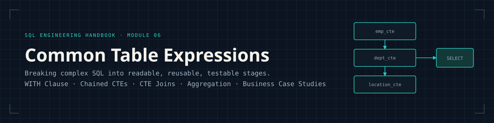
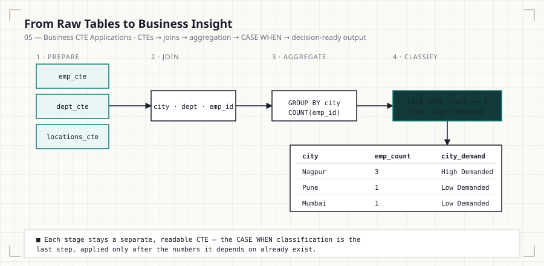
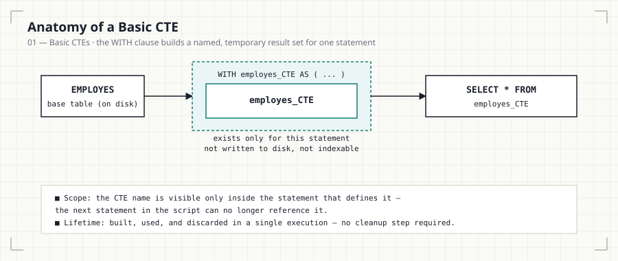
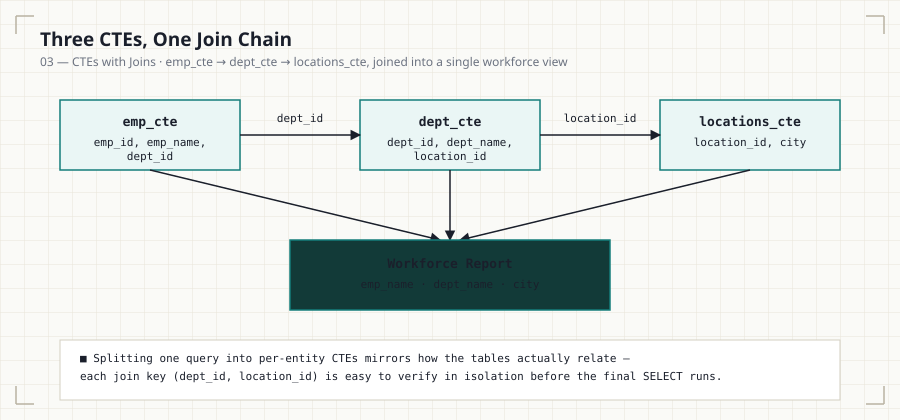
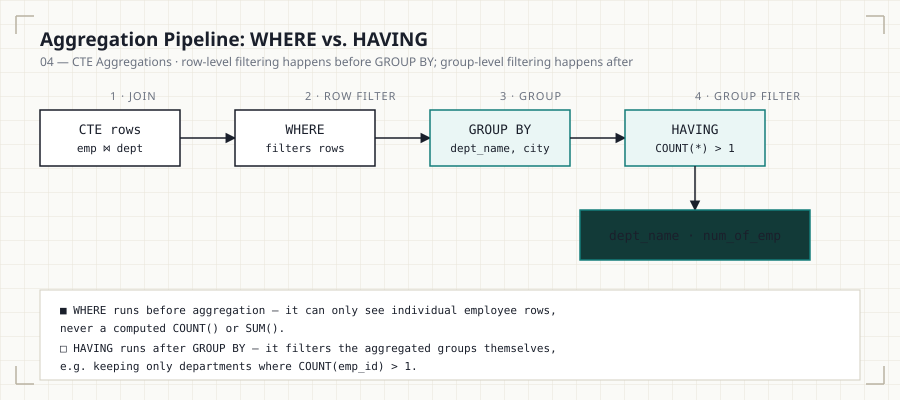

<p align="center">
  
</p>

<p align="center">
  
  
  
  
  
  
</p>

<p align="center"><i>Part of the <a href="../README.md">SQL Engineering Handbook</a></i></p>

---

## Why This Module Exists

Every prior module in this handbook teaches SQL that runs against one flat
shape — a single `SELECT`, a single `JOIN`, a single aggregation. Real
analytical work rarely fits that shape. It fits the shape of a pipeline:
prepare this dataset, then that one, then combine them, then aggregate, then
classify. **Common Table Expressions are how SQL expresses that pipeline
without leaving the language** — no temp tables to clean up, no procedural
code, just a `WITH` clause that turns one unreadable nested query into a
sequence of named, individually verifiable steps.

This module exists to build that instinct: given a business question, break
it into CTE-sized stages before writing a single line of the final query.

<p align="center">
  
</p>

## Who This Is For

Learners who've completed [`05_CASE_WHEN`](../05_CASE_WHEN/) and are
comfortable with `JOIN` ([`03_Joins`](../03_Joins/)) and `GROUP BY` /
`HAVING` ([`02_Aggregations`](../02_Aggregations/)). No prior CTE or
subquery experience is assumed — this module builds the concept from a
single-CTE `WITH` clause up to a five-stage business pipeline.

## Quick Start

This module runs against the shared practice schema defined in
[`00_Schema`](../00_Schema/):

```bash
mysql -u root -p your_database < ../00_Schema/01_CREATE_TABLES.sql
mysql -u root -p your_database < ../00_Schema/02_INSERT_DATA.sql
mysql -u root -p your_database < 01_Basic_CTE.sql
```

Each `.sql` file below runs independently against that schema — no
additional setup required between files.

## What This Module Covers

| # | File | Focus | Diagram | Lines | Size |
|---|------|-------|---------|------:|-----:|
| 01 | [Basic CTEs](01_Basic_CTE.md) · [`.sql`](01_Basic_CTE.sql) | The `WITH` clause, CTE scope & lifetime, CTE vs. subquery vs. view | [basic-cte-flow.svg](assets/diagrams/basic-cte-flow.svg) | 128 | 4.8 KB |
| 02 | [Multiple CTEs](02_Multiple_CTEs.md) · [`.sql`](02_Multiple_CTEs.sql) | Chaining CTEs in one `WITH`, ordering rules, first join across two CTEs | [chained-ctes.svg](assets/diagrams/chained-ctes.svg) | 117 | 3.9 KB |
| 03 | [CTEs With Joins](03_CTE_Joins.md) · [`.sql`](03_CTE_Joins.sql) | Three-way CTE join chain (employee → department → location) | [cte-join-flow.svg](assets/diagrams/cte-join-flow.svg) | 119 | 4.3 KB |
| 04 | [CTE Aggregations](04_CTE_Aggregations.md) · [`.sql`](04_CTE_Aggregation.sql) | `GROUP BY`, `COUNT`, `HAVING` vs. `WHERE` on top of a CTE join | [cte-aggregation-pipeline.svg](assets/diagrams/cte-aggregation-pipeline.svg) | 109 | 4.0 KB |
| 05 | [Business CTE Applications](05_Buisness_CTEs.md) · [`.sql`](05_Buisness_CTEs.sql) | `CASE WHEN` classification, `LEFT JOIN` correctness, five workforce-planning case studies | [business-cte-pipeline.svg](assets/diagrams/business-cte-pipeline.svg) | 141 | 5.2 KB |

**Totals:** 5 `.md` files, 5 `.sql` files, 5 diagrams — 1,337 combined lines,
~32.8 KB of documentation and runnable SQL.

Each `.md` file is paired with a `.sql` file containing the runnable,
commented queries referenced in the text. SQL is written against MySQL
8.0+ syntax, with PostgreSQL, SQL Server, and Oracle notes called out
wherever CTE behavior diverges (see File 01's optimization-fence note in
particular).

## The Diagrams

Every diagram in this module is rendered as a standalone SVG in
[`assets/diagrams/`](assets/diagrams/) and embedded directly in its
corresponding file — no external image hosting, so they render correctly on
GitHub, cloned locally, or in any markdown viewer (including GitHub Pages).

<p align="center">
  
  
</p>
<p align="center">
  
  
</p>

## Business Questions Solved

This module answers practical business questions such as:

- Which department has the highest workforce?
- Which city has the largest employee base?
- Which departments are active or inactive?
- Which cities have high workforce demand?
- How can multiple datasets be combined into reusable analytical pipelines?

## Learning Objectives

After completing this module you should be able to:

- Create a basic Common Table Expression and explain its scope and lifetime.
- Chain multiple CTEs together inside a single `WITH` clause.
- Join CTEs to each other, not just to base tables.
- Aggregate data prepared by CTEs using `GROUP BY`, `COUNT`, and `HAVING`.
- Correctly choose `LEFT JOIN` vs. `INNER JOIN` when a business question
  depends on rows with no match existing.
- Classify aggregated results into business-readable tiers with `CASE WHEN`.
- Explain the difference between a CTE, a subquery, and a view.

## SQL Concepts Covered

`WITH` · Multiple CTEs · `INNER JOIN` · `LEFT JOIN` · `GROUP BY` ·
`HAVING` · `CASE WHEN` · `ORDER BY` · `LIMIT` · `COUNT()`

## Business Insights Generated

Using CTEs, this module's queries surface insights such as:

- Workforce distribution by city
- Department size analysis
- High-demand operational locations
- Department activity monitoring (active vs. inactive)
- Organizational and workforce planning reports

## Common Mistakes (Module-Wide)

- Forgetting the `WITH` keyword, or the CTE's `AS` alias.
- Referencing a CTE from a later, separate statement — its scope ends with
  the statement that defines it.
- Missing a comma between multiple CTE definitions.
- Selecting a column that isn't exposed by the CTE it's pulled from.
- Filtering aggregates with `WHERE` instead of `HAVING`.
- Using `INNER JOIN` where the business question specifically requires
  `LEFT JOIN` to keep unmatched rows (see File 05).
- Treating a CTE as a permanent, cached object rather than a
  statement-scoped, potentially-inlined query.

## Interview Tips (Module-Wide)

Be prepared to answer:

- What is a Common Table Expression?
- CTE vs. subquery — what's actually different, and what isn't?
- CTE vs. temporary table — scope, persistence, and performance.
- What are the advantages of using CTEs over deeply nested subqueries?
- When should CTEs be avoided in favor of a simpler query?
- Can a CTE reference another CTE defined earlier in the same `WITH` clause?
- What is a recursive CTE, and how does it differ from the CTEs in this
  module? *(Recursive CTEs are covered as their own topic beyond this
  module — see the Roadmap note below.)*
- `WHERE` vs. `HAVING` — which runs first, and why does it matter?

## Best Practices

- Use meaningful CTE names (`active_departments`, not `cte1`).
- Keep each CTE focused on one table or one piece of logic.
- Avoid unnecessary nesting — if a CTE just wraps a table with no
  transformation, ask whether it earns its place.
- Break complex reports into logical stages, and verify each stage in
  isolation before trusting the composed result.
- Write readable SQL first; only reach for `MATERIALIZED` /
  optimizer hints once `EXPLAIN` shows an actual problem.
- Document business thresholds (`>= 3`, `> 1`) as named rules, not
  unexplained magic numbers inside a `CASE` expression.

## Practice Challenges

Try solving these without looking at previous queries:

1. Find the department with the highest employee count.
2. Identify cities with more than two departments.
3. Rank departments by workforce size.
4. Build a reusable CTE for employee reporting.
5. Create department performance categories using `CASE WHEN`.
6. Find employees working in the largest department.
7. Build a complete workforce summary report combining all five files'
   techniques.

## Module Checklist

- [x] Every `.sql` file runs cleanly against the shared
      [`00_Schema`](../00_Schema/) setup
- [x] Every `.md` file follows the same documentation template: Business
      Question → SQL Solution → Explanation → Finding → Common Mistakes →
      Interview Tips → Practice Questions
- [x] Every file has a matching, embedded SVG diagram in
      [`assets/diagrams/`](assets/diagrams/) — not just linked, rendered
- [x] Cross-engine notes present where CTE behavior genuinely diverges
      (PostgreSQL materialization, in particular)
- [x] `WHERE` vs. `HAVING` and `INNER JOIN` vs. `LEFT JOIN` treated as
      first-class correctness topics, not footnotes

## Key Takeaways

After completing this module, you should be comfortable using CTEs to
organize SQL queries into reusable, verifiable analytical pipelines — and,
just as importantly, able to explain *why* a CTE was the right tool versus
a subquery or a view.

This knowledge is the foundation for:

- **Window Functions** ([`07_Window_Functions`](../07_Window_Functions/)) —
  ranking, running totals, and cohort analysis, often built on top of a CTE.
- **Recursive CTEs** — hierarchical and graph-shaped queries (org charts,
  bill-of-materials), a natural extension of the `WITH` clause covered here.
- **Query Optimization** ([`15_INDEXES`](../15_INDEXES/)) — understanding
  when a CTE is inlined vs. materialized directly affects execution plans.
- **Analytical Reporting & BI Dashboards** — the CTE pipeline pattern in
  File 05 is the standard shape of a production reporting query.

---

## Handbook Navigation

This module is one part of the full **SQL Engineering Handbook** — a
16-module, progressively-built curriculum sharing a single practice schema
([`00_Schema`](../00_Schema/)) end to end.

| # | Module | Contents | Status |
|---|--------|----------|:---:|
| — | [Resources](../Resources/) | Books, blogs, docs, certifications, communities, datasets | ✅ |
| 00 | [Schema](../00_Schema/) | Practice database DDL, seed data, and ERD used by every later module | ✅ |
| 01 | [Fundamentals](../01_Fundamentals/) | `SELECT`, `WHERE`, `ORDER BY`, `LIMIT`, aliasing | ✅ |
| 02 | [Aggregations](../02_Aggregations/) | `COUNT`, `SUM`, `AVG`, `MIN`/`MAX`, `GROUP BY`, `HAVING` | ✅ |
| 03 | [Joins](../03_Joins/) | Inner, left, right, full, cross, self joins + performance audit | ✅ |
| 04 | [Subqueries](../04_Subqueries/) | Scalar, correlated, `EXISTS`, derived tables, subquery-to-join rewrites | ✅ |
| 05 | [CASE WHEN](../05_CASE_WHEN/) | Conditional logic and business-rule encoding | ✅ |
| **06** | **CTEs (this module)** | **Common Table Expressions, staged pipelines, business classification** | ✅ |
| 07 | [Window Functions](../07_Window_Functions/) | `ROW_NUMBER`, `RANK`, `LAG`/`LEAD`, `PARTITION BY` | ✅ |
| 08 | [Window Business Cases](../08_WINDOW_BUSINESS_CASES/) | Applied window-function scenarios (running totals, cohorts, rankings) | ✅ |
| 09 | [Date Functions](../09_Date_Functions/) | Date arithmetic, formatting, range queries | ✅ |
| 10 | [String Functions](../10_STRING_FUNCTIONS/) | String manipulation and data cleaning | ✅ |
| 11 | [NULL Handling & Data Cleaning](../11_NULL_HANDLING_AND_DATA_CLEANING/) | `COALESCE`, `NULLIF`, data-quality patterns | ✅ |
| 12 | [Advanced Aggregations](../12_ADVANCED_AGGREGATIONS/) | Conditional and multi-level aggregation | ✅ |
| 13 | [Set Operators](../13_SET_OPERATORS/) | `UNION`, `INTERSECT`, `EXCEPT`, reconciliation queries | ✅ |
| 14 | [Views](../14_VIEWS/) | Views, security, updatable views, performance | ✅ |
| 15 | [Indexes](../15_INDEXES/) | B-Tree, composite, covering indexes, reading `EXPLAIN` | ✅ |

## How to Use This Module

1. Read [File 01](01_Basic_CTE.md) first, even if you've used CTEs before —
   the CTE-vs-subquery-vs-view table and the PostgreSQL materialization note
   correct a common misconception about CTE performance.
2. Work through Files 02–04 in order — each one adds exactly one new idea
   (chaining, joining, aggregating) on top of the last.
3. Attempt each file's **Practice Questions** before moving to the next
   file; File 02's third question directly previews File 03's content.
4. Finish with [File 05](05_Buisness_CTEs.md), then try rebuilding its five
   business answers from scratch, from memory, before checking your SQL
   against [`05_Buisness_CTEs.sql`](05_Buisness_CTEs.sql).
5. Continue to [`07_Window_Functions`](../07_Window_Functions/) — several
   of its running-total and ranking patterns are commonly written as a CTE
   feeding a window function.

---

<p align="center"><i>⬅ <a href="../05_CASE_WHEN/">05 — CASE WHEN</a> &nbsp;·&nbsp; <a href="../README.md">Handbook Home</a> &nbsp;·&nbsp; <a href="../07_Window_Functions/">07 — Window Functions</a> ➡</i></p>
