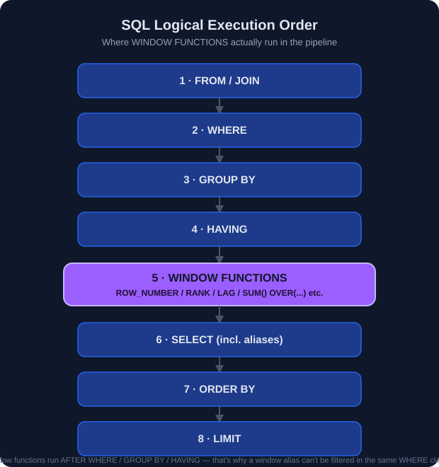
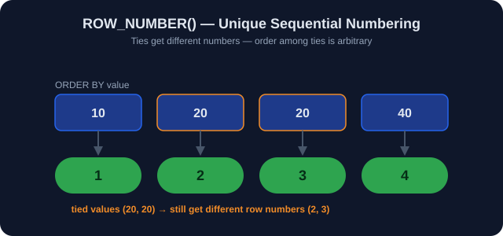
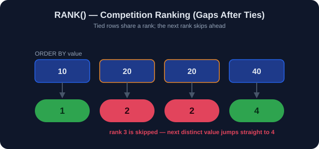
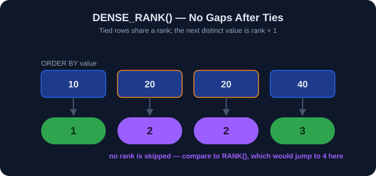
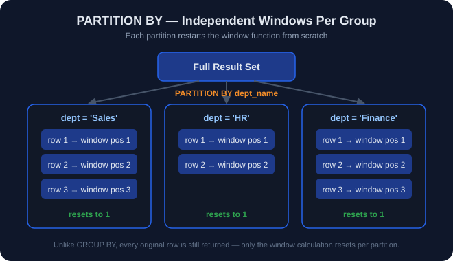
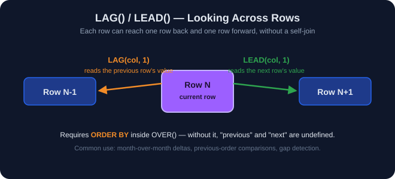
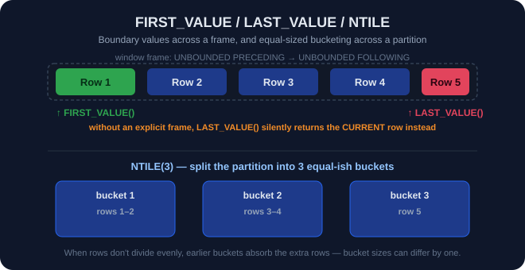
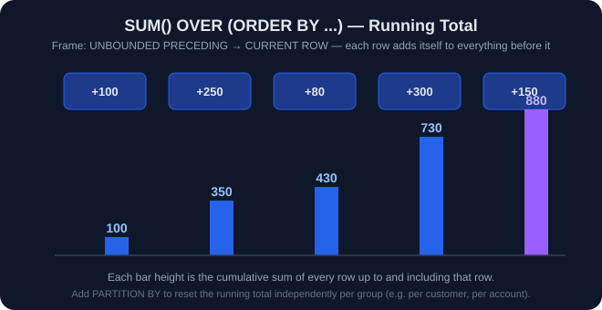

<div align="center">


<br/>

[]()
[]()
[]()
[]()
[]()
[]()
[]()
[]()

**Module 7 of the [SQL Engineering Handbook](../)** &#183; Authored & maintained by [**Mohammad Ammar**](https://github.com/theammarngp-makes)

<sub>Part of an open-source effort to build the most rigorous, production-grade SQL reference on GitHub &#8212; corrections and additions genuinely welcome.</sub>

</div>

---

## &#128218; Module Navigation

| # | Lesson | Function(s) | Open |
|:--:|--------|-------------|------|
| 01 | ROW_NUMBER | `ROW_NUMBER()` | [`.md`](./01_ROW_NUMBER.md) &#183; [`.sql`](./01_ROW_NUMBER.sql) |
| 02 | RANK | `RANK()` | [`.md`](./02_RANK.md) &#183; [`.sql`](./02_RANK.sql) |
| 03 | DENSE_RANK | `DENSE_RANK()` | [`.md`](./03_DENSE_RANK.md) &#183; [`.sql`](./03_DENSE_RANK.sql) |
| 04 | PARTITION BY | `PARTITION BY` | [`.md`](./04_PARTITION_BY.md) &#183; [`.sql`](./04_PARTITION_BY.sql) |
| 05 | LAG / LEAD | `LAG()` / `LEAD()` | [`.md`](./05_LAG_LEAD.md) &#183; [`.sql`](./05_LAG_LEAD.sql) |
| 06 | FIRST/LAST/NTILE | `FIRST_VALUE()` / `LAST_VALUE()` / `NTILE()` | [`.md`](./06_FIRST_LAST_NTILE.md) &#183; [`.sql`](./06_FIRST_LAST_NTILE.sql) |
| 07 | Running Totals | `SUM() OVER()` / `AVG() OVER()` | [`.md`](./07_RUNNING_TOTALS.md) &#183; [`.sql`](./07_RUNNING_TOTALS.sql) |

---

## &#128209; Table of Contents

- [Introduction](#-introduction)
- [What Is a Window Function?](#-what-is-a-window-function)
- [Why Learn Window Functions?](#-why-learn-window-functions)
- [Syntax Overview](#-syntax-overview)
- [Folder Structure](#-folder-structure)
- [Business Scenarios Covered](#-business-scenarios-covered)
- [Learning Objectives](#-learning-objectives)
- [Visual Learning](#-visual-learning)
- [Practice Checklist](#-practice-checklist)
- [Common Mistakes](#%EF%B8%8F-common-mistakes)
- [Interview Questions](#-interview-questions)
- [Resources](#-resources)
- [Prerequisites](#-prerequisites)
- [About the Author](#%EF%B8%8F-about-the-author)

---

## &#128161; Introduction

Window functions let you perform calculations across a set of rows that are
related to the current row, **without collapsing the result set** the way
`GROUP BY` does. They are the single most important tool for turning a
raw SQL developer into someone who can answer real analytics questions:
rankings, leaderboards, running totals, period-over-period comparisons, and
department-wise breakdowns &#8212; all in one query.

## &#10067; What Is a Window Function?

A window function operates over a "window" of rows defined by an `OVER()`
clause. Unlike aggregate functions used with `GROUP BY`, window functions
**do not reduce the number of rows returned**. Each row keeps its identity
while also gaining access to a calculation performed across its window.

```sql
<function_name>(<arguments>) OVER (
    [PARTITION BY <column_list>]
    [ORDER BY <column_list>]
    [<frame_clause>]
)
```

<p align="center">
  
</p>

## &#128161; Why Learn Window Functions?

- They are asked in almost every mid-to-senior Data Analyst / Data Engineer
  interview.
- They replace fragile, slow correlated subqueries with a single readable
  pass over the data.
- They are the backbone of real business reporting: leaderboards, cohort
  analysis, growth rates, running balances, and top-N-per-group queries.

## &#9878;&#65039; Syntax Overview

```sql
SELECT
    column_a,
    column_b,
    WINDOW_FUNCTION() OVER (
        PARTITION BY grouping_column
        ORDER BY sort_column
    ) AS result_column
FROM table_name;
```

---

## &#128193; Folder Structure

```
07_Window_Functions/
│
├── README.md
│
├── 01_ROW_NUMBER.md          01_ROW_NUMBER.sql
├── 02_RANK.md                02_RANK.sql
├── 03_DENSE_RANK.md          03_DENSE_RANK.sql
├── 04_PARTITION_BY.md        04_PARTITION_BY.sql
├── 05_LAG_LEAD.md            05_LAG_LEAD.sql
├── 06_FIRST_LAST_NTILE.md    06_FIRST_LAST_NTILE.sql
├── 07_RUNNING_TOTALS.md      07_RUNNING_TOTALS.sql
│
└── assets/
    └── diagrams/
        ├── window-execution-order.svg
        ├── row-number-assignment.svg
        ├── rank-gaps.svg
        ├── dense-rank-no-gaps.svg
        ├── partition-by-split.svg
        ├── lag-lead-offset.svg
        ├── first-last-ntile.svg
        └── running-totals-accumulation.svg
```

> &#128206; Every lesson file embeds its own diagram inline, right at the top of the file, not just here in the README.

---

## &#128188; Business Scenarios Covered

| Domain | Use Case |
|---|---|
| HR | Employee seniority ranking, department leaderboards |
| Finance | Running balances, month-over-month growth |
| Retail | Top-N products per category |
| Banking | Rolling averages for risk monitoring |
| E-commerce | Customer order sequencing, cohort tiers |

## &#127919; Learning Objectives

By the end of this module you will be able to:

1. Explain the difference between `ROW_NUMBER()`, `RANK()`, and `DENSE_RANK()`.
2. Use `PARTITION BY` to compute per-group metrics without `GROUP BY`.
3. Retrieve previous/next row values using `LAG()`/`LEAD()`.
4. Retrieve boundary values with `FIRST_VALUE()` / `LAST_VALUE()`.
5. Bucket rows into equal groups using `NTILE()`.
6. Build running totals and running averages with frame clauses.
7. Know why `WHERE` cannot filter directly on a window function result, and
   how to work around it with a CTE or subquery.

---

## &#128065;&#65039; Visual Learning

| Diagram | Concept |
|---|---|
|  | SQL logical execution order &#8212; where window functions run in the pipeline |
|  | `ROW_NUMBER()` &#8212; unique sequential numbering |
|  | `RANK()` &#8212; competition ranking with gaps after ties |
|  | `DENSE_RANK()` &#8212; no gaps after ties |
|  | `PARTITION BY` &#8212; independent windows per group |
|  | `LAG()` / `LEAD()` &#8212; looking across rows |
|  | `FIRST_VALUE()` / `LAST_VALUE()` / `NTILE()` &#8212; boundaries and bucketing |
|  | `SUM() OVER()` &#8212; running total accumulation |

---

## &#9989; Practice Checklist

- [ ] I can write `ROW_NUMBER()` with and without `PARTITION BY`.
- [ ] I can explain the ranking gap behavior of `RANK()` vs `DENSE_RANK()`.
- [ ] I can filter window function output using a CTE.
- [ ] I can compute a running total with `SUM() OVER (ORDER BY ...)`.
- [ ] I can compute month-over-month style deltas using `LAG()`.

## &#9888;&#65039; Common Mistakes

- Trying to reference a window function alias directly in `WHERE` (illegal &#8212;
  window functions are evaluated after `WHERE`, so wrap in a CTE/subquery).
- Forgetting `ORDER BY` inside `OVER()` when using `LAG()`/`LEAD()`, which
  makes row order (and therefore the result) undefined.
- Using `LAST_VALUE()` without an explicit frame clause
  (`ROWS BETWEEN UNBOUNDED PRECEDING AND UNBOUNDED FOLLOWING`), which
  silently returns the *current* row instead of the true last row.
- Confusing `RANK()` (leaves gaps) with `DENSE_RANK()` (no gaps).

---

## &#127908; Interview Questions

1. What is the difference between a window function and a `GROUP BY` aggregate?
2. Why can't you filter directly on a window function alias in `WHERE`?
3. Walk through `ROW_NUMBER()`, `RANK()`, and `DENSE_RANK()` on a tied dataset.
4. How would you find the second-highest salary per department?
5. How would you calculate a 3-month moving average in SQL?

## &#128218; Resources

- [PostgreSQL Window Functions Documentation](https://www.postgresql.org/docs/current/tutorial-window.html)
- [MySQL Window Functions Reference](https://dev.mysql.com/doc/refman/8.0/en/window-functions.html)

## &#127919; Prerequisites

- `06_CTEs` (Common Table Expressions)
- `03_Joins`
- `02_Aggregations`

---

## &#9989;&#65039; About the Author

<table>
<tr>
<td width="90"></td>
<td>
<b>Mohammad Ammar</b> &#8212; Co-Founder @ <a href="https://github.com/Apex-Analyticx-group">Apex Analyticx</a>, Data Analytics Engineer, author of the <a href="https://github.com/theammarngp-makes/SQL-Engineering-Handbook">SQL Engineering Handbook</a> (20+ modules). Based in Nagpur, India.
</td>
</tr>
</table>

[](https://theammarngp-makes.github.io)
[](https://www.linkedin.com/in/mohammad-ammar-ngp/)
[](https://x.com/theammarngp)
[](mailto:theammarngp@gmail.com)

---

<div align="center">

<i>Part of the <a href="../">SQL Engineering Handbook</a></i><br/>
<sub>&#11088; If this module helped you, consider starring the repo &#8212; it helps other engineers find it.</sub>


</div>
