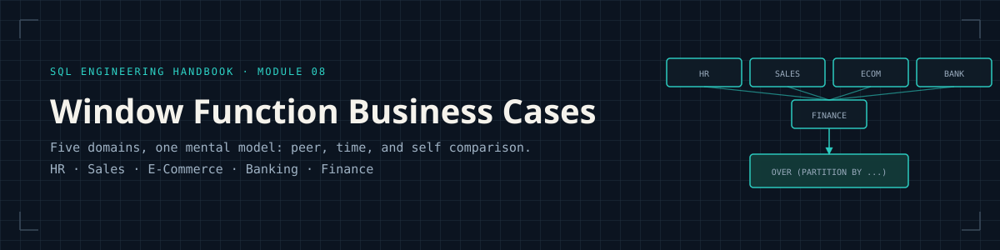
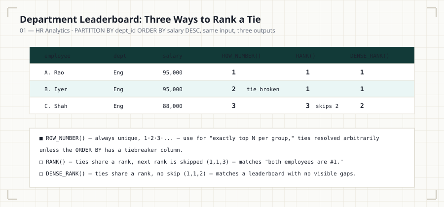
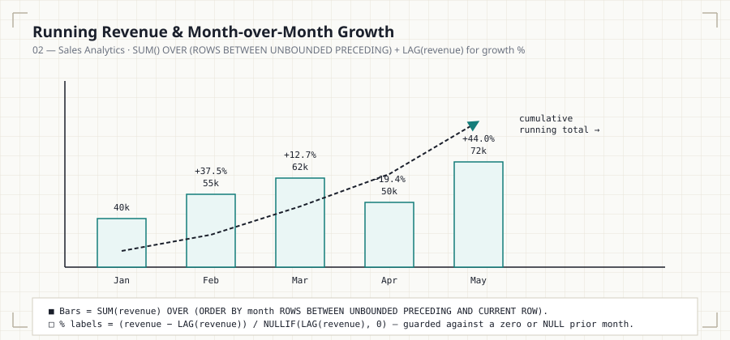
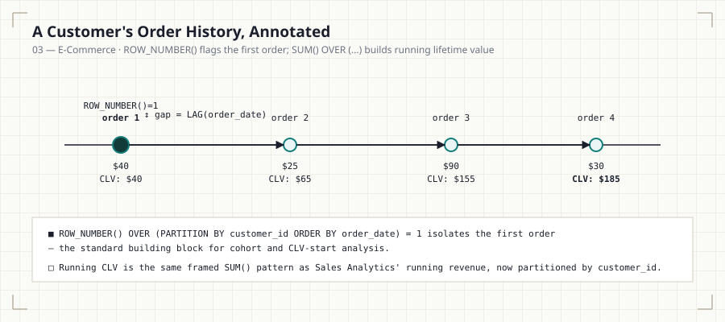
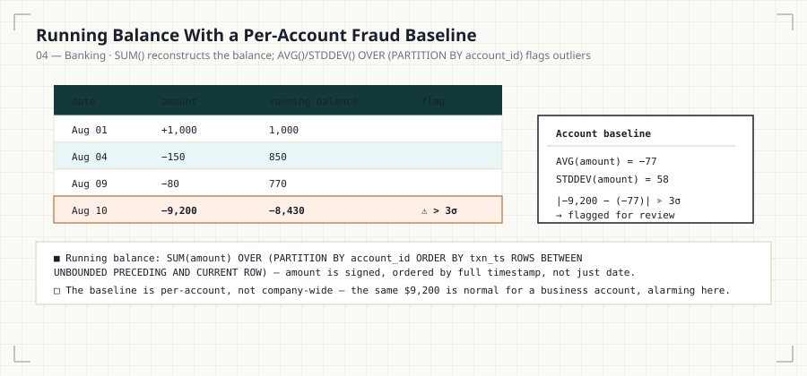
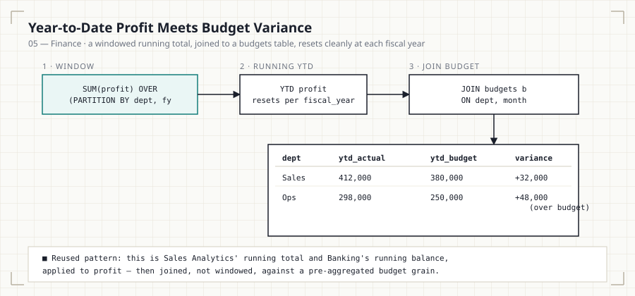

<p align="center">
  
</p>

<p align="center">
  
  
  
  
  
  
</p>

<p align="center"><i>Part of the <a href="../README.md">SQL Engineering Handbook</a></i></p>

> **Bridging syntax and real-world analytics.**
> This module does not teach you *what* a window function is — [Module 07](../07_Window_Functions/) already did that. This module teaches you *where, why, and how* window functions are used inside real companies — in HR systems, sales pipelines, e-commerce platforms, banking cores, and finance departments.

---

## Why This Module Exists

Every SQL engineer eventually learns the syntax of `ROW_NUMBER()`, `RANK()`,
`LAG()`, and `SUM() OVER (...)`. Very few are taught **why an analytics
team would reach for one over the other**, or **what business question
each pattern actually answers**.

That gap is why candidates who can recite window function syntax in an
interview still struggle to write a query that solves an actual leadership
request like:

- "Show me the top 2 earners in every department."
- "What's our running revenue this quarter, and how does it compare to
  last year?"
- "Flag any account with unusually large transactions relative to its own
  history."

Window functions are the backbone of modern analytics engineering because
they let you **compare a row to its peers, its past, and its group —
without collapsing the dataset**. Unlike `GROUP BY`, which flattens data
into summaries, window functions preserve row-level granularity while
attaching aggregate, ranking, and offset context to each row — exactly the
shape of data that feeds dashboards, leaderboards, cohort reports, and
anomaly-detection systems.

This module is organized around **five business domains** that, together,
cover the vast majority of window function use cases you'll encounter in
industry: HR, Sales, E-Commerce, Banking, and Finance. One structural
pattern — peer comparison, time comparison, or self comparison — repeats
across all five; only the business vocabulary changes.

<p align="center">
  
</p>

## Who This Is For

Learners who've completed [Module 07 — Window Functions](../07_Window_Functions/)
and are fluent, not just familiar, with:

- Ranking functions: `ROW_NUMBER()`, `RANK()`, `DENSE_RANK()`, `NTILE()`
- Offset functions: `LAG()`, `LEAD()`
- Aggregate window functions: `SUM()`, `AVG()`, `COUNT()`, `MIN()`, `MAX()`
  used with `OVER (...)`
- `PARTITION BY` and `ORDER BY` inside a window specification
- Basic frame clauses: `ROWS BETWEEN ... AND ...`
- Joins, CTEs ([Module 06](../06_CTEs/)), and subqueries

If any of these feel unfamiliar, revisit Module 07 before continuing — this
module assumes fluency, not familiarity.

## Quick Start

This module runs against the shared practice schema defined in
[`00_Schema`](../00_Schema/):

```bash
mysql -u root -p your_database < ../00_Schema/01_CREATE_TABLES.sql
mysql -u root -p your_database < ../00_Schema/02_INSERT_DATA.sql
mysql -u root -p your_database < 01_HR_ANALYTICS.sql
```

Each domain's `.sql` file runs independently — no setup is required between
chapters, though working through them in order (01 → 05) is strongly
recommended, since each chapter explicitly reuses a pattern from the one
before it.

## What This Module Covers

| # | Domain | File | Diagram | Lines | Size |
|---|--------|------|---------|------:|-----:|
| 01 | **HR Analytics** | [`.md`](01_HR_ANALYTICS.md) · [`.sql`](01_HR_ANALYTICS.sql) | [hr-leaderboard-tiebreak.svg](assets/diagrams/hr-leaderboard-tiebreak.svg) | 136 + 268 | 8.9 KB + 9.0 KB |
| 02 | **Sales Analytics** | [`.md`](02_SALES_ANALYTICS.md) · [`.sql`](02_SALES_ANALYTICS.sql) | [sales-running-total-growth.svg](assets/diagrams/sales-running-total-growth.svg) | 134 + 232 | 8.3 KB + 7.7 KB |
| 03 | **E-Commerce** | [`.md`](03_ECOMMERCE.md) · [`.sql`](03_ECOMMERCE.sql) | [ecommerce-customer-lifecycle.svg](assets/diagrams/ecommerce-customer-lifecycle.svg) | 131 + 244 | 8.2 KB + 7.9 KB |
| 04 | **Banking** | [`.md`](04_BANKING.md) · [`.sql`](04_BANKING.sql) | [banking-balance-outlier.svg](assets/diagrams/banking-balance-outlier.svg) | 129 + 241 | 9.3 KB + 8.7 KB |
| 05 | **Finance** | [`.md`](05_FINANCE.md) · [`.sql`](05_FINANCE.sql) | [finance-ytd-variance.svg](assets/diagrams/finance-ytd-variance.svg) | 128 + 277 | 9.0 KB + 10.2 KB |

**Totals:** 5 `.md` files, 5 `.sql` files, 6 diagrams (5 topic diagrams + 1
banner) — 1,920 combined lines, ~87.2 KB of documentation and runnable SQL.

Each `.md` file explains the business context, KPIs, dashboards, and
reasoning; each paired `.sql` file contains the fully commented,
production-quality query chapter for that domain.

## The Diagrams

Every diagram in this module is a standalone SVG in
[`assets/diagrams/`](assets/diagrams/), embedded directly in its
corresponding chapter — no external image hosting, so they render correctly
on GitHub, cloned locally, or on GitHub Pages.

<p align="center">
  
  
</p>
<p align="center">
  
  
</p>

## Business Domains Covered

| # | Domain | Core Business Questions |
|---|---|---|
| 01 | HR Analytics | Who are our top performers? Who's eligible for promotion? How is compensation distributed by department? |
| 02 | Sales Analytics | Who is our top salesperson this month? What's our revenue trend? How does this quarter compare to last year? |
| 03 | E-Commerce | Who are our highest-LTV customers? What's our repeat purchase rate? Which products dominate each category? |
| 04 | Banking | What are our largest transactions? Is this account behaving abnormally? What's the running balance over time? |
| 05 | Finance | Are we over budget? What's our running profit? How volatile is our expense variance month to month? |

## Learning Objectives

By the end of this module, you will be able to:

- Map a business requirement ("leaderboard," "running total," "cohort
  comparison") directly to the correct window function pattern.
- Choose correctly between `ROW_NUMBER()`, `RANK()`, and `DENSE_RANK()`
  based on how ties should be handled in a business context.
- Build running totals, moving averages, and period-over-period growth
  metrics (MoM, QoQ, YoY) used in real dashboards.
- Use `LAG()` / `LEAD()` to build comparison reports (previous transaction,
  next event, sequential gap analysis).
- Apply window functions to detect anomalies and outliers (e.g., fraud
  signals in banking data).
- Reason about the **performance implications** of partitioning, ordering,
  and frame clauses at scale.
- Answer window-function interview questions with business framing, not
  just syntax recall.

## Window Functions Used Across This Module

| Function | Primary Use Case in This Module |
|---|---|
| `ROW_NUMBER()` | Unique sequencing, deduplication, "top N per group" |
| `RANK()` | Leaderboards where ties should share a rank and skip subsequent ranks |
| `DENSE_RANK()` | Leaderboards where ties should share a rank without skipping |
| `NTILE()` | Percentile buckets (e.g., performance quartiles, customer tiers) |
| `LAG()` / `LEAD()` | Period-over-period comparisons, transaction gap analysis, sequential trend detection |
| `SUM() OVER (...)` | Running totals, running balances, cumulative revenue |
| `AVG() OVER (...)` | Moving averages, smoothed trend lines, per-account statistical baselines |
| `COUNT() OVER (...)` | Group-level counts without collapsing row-level detail |
| `FIRST_VALUE()` / `LAST_VALUE()` | Baseline comparisons (e.g., first transaction vs. most recent) |

## Skills Gained

| Skill Category | What You Will Practice |
|---|---|
| Analytics Engineering | Translating KPIs into window function queries |
| Data Engineering | Writing performant, partition-aware SQL over large tables |
| Business Analysis | Understanding what each metric means to a stakeholder |
| SQL Architecture | Structuring multi-CTE, multi-scenario analytical queries |
| Interview Readiness | Explaining tradeoffs, not just producing correct output |

## Learning Path

Work through the domains in order — each one reinforces the previous while
introducing a new analytical pattern:

1. **[HR Analytics](01_HR_ANALYTICS.md)** — foundational ranking,
   leaderboard, and peer-comparison patterns.
2. **[Sales Analytics](02_SALES_ANALYTICS.md)** — time-based patterns:
   running totals, MoM/YoY growth, moving averages.
3. **[E-Commerce](03_ECOMMERCE.md)** — customer-centric patterns: lifetime
   value, repeat behavior, basket analysis.
4. **[Banking](04_BANKING.md)** — sequential and anomaly patterns: running
   balances, transaction gaps, fraud signals.
5. **[Finance](05_FINANCE.md)** — variance and budget patterns: running
   profit, budget-to-actual tracking; the capstone that reuses every prior
   pattern.

Each `.sql` file is organized into scenarios, and each scenario opens with
a business explanation before progressively more advanced queries.

## Estimated Completion Time

| Domain | Estimated Time |
|---|---|
| HR Analytics | 60–75 minutes |
| Sales Analytics | 75–90 minutes |
| E-Commerce | 75–90 minutes |
| Banking | 60–75 minutes |
| Finance | 60–75 minutes |
| **Total Module** | **~6–7 hours** |

## Difficulty

**Intermediate → Advanced.** This module assumes syntax fluency and focuses
entirely on **application, judgment, and performance reasoning**.
Difficulty increases within each file as scenarios move from single-
partition ranking to multi-metric, multi-window analytical reports.

## Best Practices Reinforced in This Module

- Always define an explicit `ORDER BY` inside `OVER (...)` when using
  ranking or offset functions — undefined order produces non-deterministic
  results.
- Prefer `ROW_NUMBER()` over `RANK()` / `DENSE_RANK()` when you need
  exactly one row per group ("top 1 per department"), since ties in
  `RANK()` can return more rows than expected.
- Be explicit about frame clauses (`ROWS BETWEEN ...`) when computing
  running totals or moving averages — the default frame can silently
  produce incorrect results when `ORDER BY` is present.
- Filter the output of a window function using a CTE or subquery — window
  functions cannot be referenced directly in a `WHERE` clause.
- Partition only on columns that reflect the actual business grouping —
  over-partitioning fragments the window and under-partitioning produces
  misleading aggregates.
- Index the columns used in `PARTITION BY` and `ORDER BY` where possible;
  window functions still benefit heavily from sort-friendly access paths.

## Common Mistakes (Module-Wide)

- Using `RANK()` where the business wants exactly N rows per group — ties
  can silently return more than N.
- Omitting an explicit frame clause and assuming `SUM() OVER (...)` always
  returns the full partition total.
- Applying a single company-wide baseline (average, standard deviation) for
  anomaly detection instead of a per-entity baseline — see Banking's
  per-account fraud screen.
- Trying to filter directly on a window function in the same `SELECT`'s
  `WHERE` clause — this requires a CTE or subquery.
- Forgetting that a running total needs to reset at a natural boundary
  (fiscal year, per-customer) — see Finance's YTD partitioning note.

## Real-World Applications

Window functions in this module map directly to systems you will build or
maintain on the job:

- **HR dashboards** showing department leaderboards and promotion
  eligibility lists.
- **Sales performance dashboards** used in weekly and monthly business
  reviews.
- **Customer analytics platforms** computing lifetime value and cohort
  retention.
- **Fraud detection pipelines** flagging transactions that deviate from a
  customer's own history.
- **Financial reporting systems** tracking budget variance and running
  profit for leadership review.

## How This Module Prepares You

**For Data Analytics** — you'll independently translate a stakeholder's
question into a correct, efficient window function query, the single most
common analytics interview and on-the-job task.

**For Data Engineering** — you'll understand the performance cost of
partitioning and ordering at scale, which directly informs how you design
tables, indexes, and materialized views feeding these queries.

**For Analytics Engineering** — you'll be able to build reusable,
well-documented SQL models (dbt-style) where window functions form the core
transformation logic for a metrics layer.

**For SQL Interviews** — you'll be ready for the most commonly asked
interview pattern across FAANG and mid-size tech companies — *"Write a
query to find the top N per group"* — along with its many variations
(running totals, YoY growth, gap analysis).

## Module Checklist

- [x] Every `.sql` file runs cleanly against the shared
      [`00_Schema`](../00_Schema/) setup
- [x] Every `.md` file follows a consistent template: Introduction →
      Business Background → KPIs → Dashboards → Business Problems → Why
      Window Functions Are Needed → Functions Used → SQL Concepts
      Reinforced → Performance Notes → Common Mistakes → Interview
      Questions → Summary → Further Practice
- [x] Every chapter has a matching, embedded SVG diagram in
      [`assets/diagrams/`](assets/diagrams/) — rendered inline, not just
      linked
- [x] Each domain explicitly cross-references the pattern it reuses from an
      earlier chapter (e.g., Finance names exactly which prior chapter each
      of its patterns comes from)
- [x] Performance notes present in every chapter — partitioning cost,
      indexing guidance, and when to materialize vs. recompute

## Further Reading

- PostgreSQL Documentation — Window Functions
- *Use The Index, Luke* — Window Functions and Performance
- *SQL for Data Analysis* (O'Reilly) — chapters on window functions and
  cohort analysis
- Your database vendor's official execution-plan documentation, to study
  how window functions are physically executed (sort, partition, and
  window-aggregate nodes)

---

## Handbook Navigation

This module is one part of the full **SQL Engineering Handbook** — a
16-module, progressively-built curriculum sharing a single practice schema
([`00_Schema`](../00_Schema/)) end to end.

| # | Module | Contents | Status |
|---|--------|----------|:---:|
| — | [Resources](../Resources/) | Books, blogs, docs, certifications, communities, datasets | ✅ |
| 00 | [Schema](../00_Schema/) | Practice database DDL, seed data, and ERD used by every later module | ✅ |
| 01 | [Fundamentals](../01_Fundamentals/) | `SELECT`, `WHERE`, `ORDER BY`, `LIMIT`, aliasing | ✅ |
| 02 | [Aggregations](../02_Aggregations/) | `COUNT`, `SUM`, `AVG`, `MIN`/`MAX`, `GROUP BY`, `HAVING` | ✅ |
| 03 | [Joins](../03_Joins/) | Inner, left, right, full, cross, self joins + performance audit | ✅ |
| 04 | [Subqueries](../04_Subqueries/) | Scalar, correlated, `EXISTS`, derived tables, subquery-to-join rewrites | ✅ |
| 05 | [CASE WHEN](../05_CASE_WHEN/) | Conditional logic and business-rule encoding | ✅ |
| 06 | [CTEs](../06_CTEs/) | Common Table Expressions, staged pipelines, business classification | ✅ |
| 07 | [Window Functions](../07_Window_Functions/) | `ROW_NUMBER`, `RANK`, `LAG`/`LEAD`, `PARTITION BY` | ✅ |
| **08** | **Window Business Cases (this module)** | **HR, Sales, E-Commerce, Banking, and Finance window-function case studies** | ✅ |
| 09 | [Date Functions](../09_Date_Functions/) | Date arithmetic, formatting, range queries | ✅ |
| 10 | [String Functions](../10_STRING_FUNCTIONS/) | String manipulation and data cleaning | ✅ |
| 11 | [NULL Handling & Data Cleaning](../11_NULL_HANDLING_AND_DATA_CLEANING/) | `COALESCE`, `NULLIF`, data-quality patterns | ✅ |
| 12 | [Advanced Aggregations](../12_ADVANCED_AGGREGATIONS/) | Conditional and multi-level aggregation | ✅ |
| 13 | [Set Operators](../13_SET_OPERATORS/) | `UNION`, `INTERSECT`, `EXCEPT`, reconciliation queries | ✅ |
| 14 | [Views](../14_VIEWS/) | Views, security, updatable views, performance | ✅ |
| 15 | [Indexes](../15_INDEXES/) | B-Tree, composite, covering indexes, reading `EXPLAIN` | ✅ |

---

<p align="center"><i>⬅ <a href="../07_Window_Functions/">07 — Window Functions</a> &nbsp;·&nbsp; <a href="../README.md">Handbook Home</a> &nbsp;·&nbsp; <a href="../09_Date_Functions/">09 — Date Functions</a> ➡</i></p>
