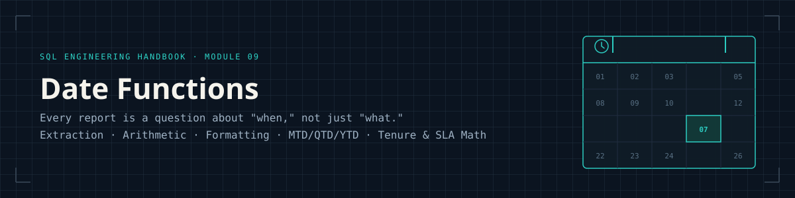
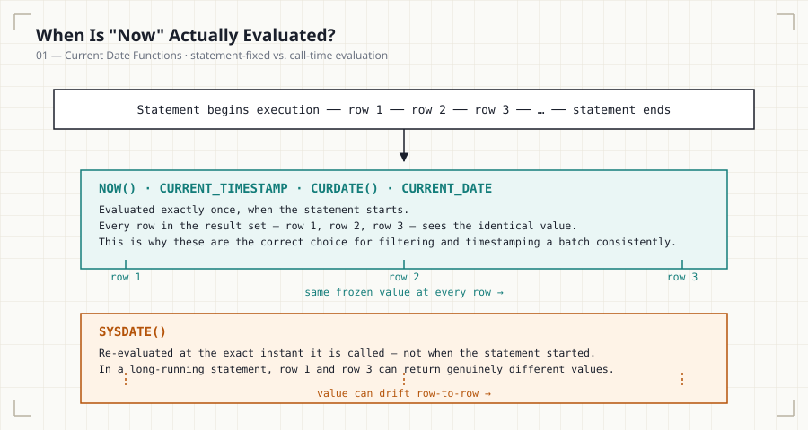
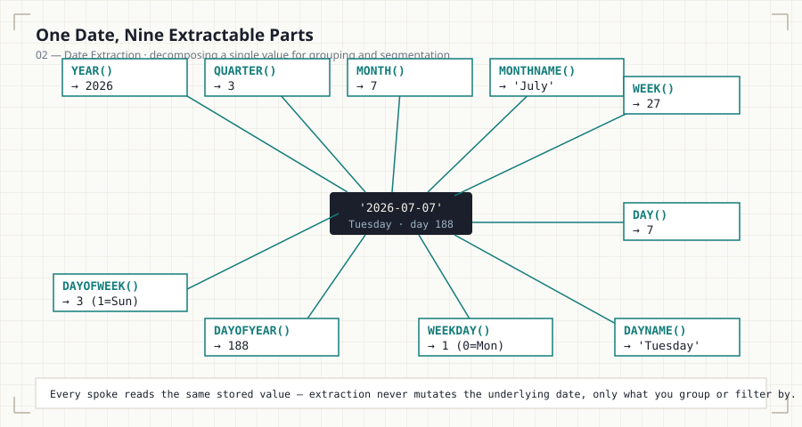
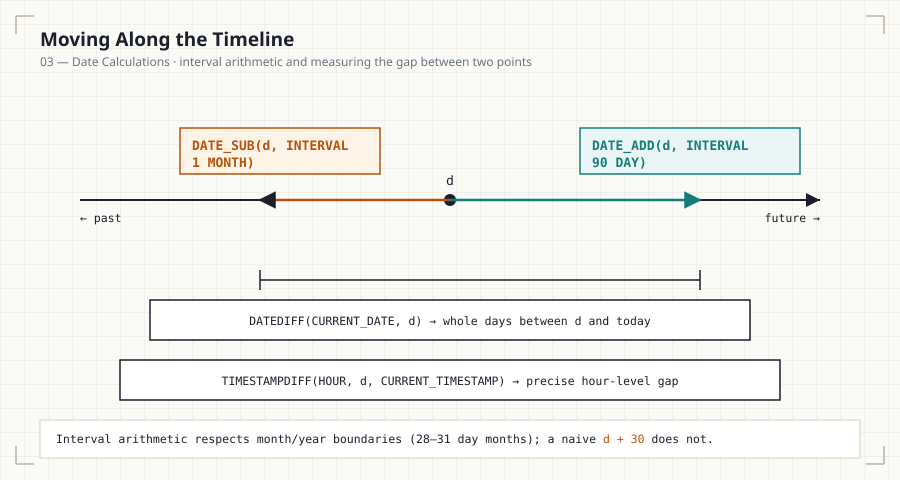
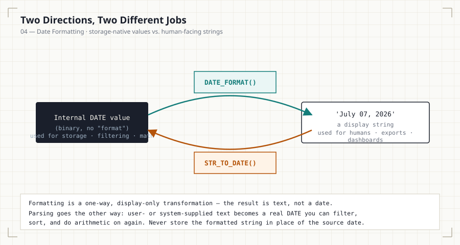
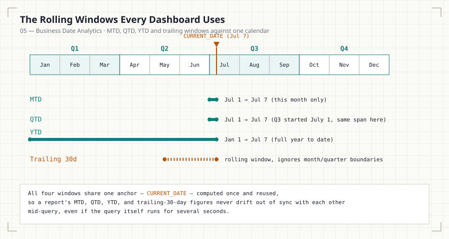

<p align="center">
  
</p>

<p align="center">
  
  
  
  
  
  
  
</p>

<p align="center"><i>Part of the <a href="../README.md">SQL Engineering Handbook</a></i></p>

---

## Table of Contents

1. [Why This Module Exists](#why-this-module-exists)
2. [Who This Is For](#who-this-is-for)
3. [Prerequisites](#prerequisites)
4. [What This Module Covers](#what-this-module-covers)
5. [The Diagrams](#the-diagrams)
6. [Functions Covered](#functions-covered)
7. [Learning Roadmap](#learning-roadmap)
8. [Business Domains](#business-domains)
9. [Difficulty & Estimated Time](#difficulty--estimated-time)
10. [Real Dashboards This Module Powers](#real-dashboards-this-module-powers)
11. [Performance Tips](#performance-tips)
12. [Best Practices](#best-practices)
13. [Common Mistakes](#common-mistakes)
14. [Build Status](#build-status)
15. [Module Checklist](#module-checklist)
16. [How to Use This Module](#how-to-use-this-module)
17. [Interview Preparation](#interview-preparation)
18. [Career Relevance](#career-relevance)
19. [Further Reading](#further-reading)
20. [Module Navigation](#module-navigation)

---

## Why This Module Exists

Every mature analytics organization runs on a calendar. Finance closes
the books monthly. Sales reports quarterly. HR tracks tenure in days.
Marketing measures campaign lift over a 7-day or 30-day window. None of
this is possible without a working, production-grade command of SQL
date and time functions.

This is the point in the handbook where you stop writing queries that
merely *filter* data and start writing queries that *reason about
time*. You will learn not just the syntax of `DATEDIFF()` or
`DATE_FORMAT()`, but the engineering judgment behind when to compute a
date in SQL versus in the application layer, why storing derived date
columns is sometimes the correct architectural choice, and how naive
date logic silently corrupts dashboards in production.

Consider what breaks if date logic is wrong:

- A **"Last 30 Days"** dashboard filter that uses `> CURDATE() - 30`
  instead of `>= CURDATE() - INTERVAL 30 DAY` silently drops or
  includes an extra day, and nobody notices until finance
  reconciliation fails.
- An **employee tenure** calculation that ignores time zones reports
  employees as "hired tomorrow" in some regions.
- A **cohort retention** query that groups by `hire_date` instead of
  `DATE_TRUNC('month', hire_date)` produces one row per calendar day
  instead of one row per cohort month, making the report unusable.
- An **SLA breach** report using `DATEDIFF()` (which only counts whole
  days) instead of `TIMESTAMPDIFF(HOUR, ...)` masks late deliveries
  that occurred within the same calendar day.

Dates are deceptively simple and operationally dangerous. This module
exists to close that gap before it costs you in production — or in an
interview.

## Who This Is For

Aspiring Data Analysts and Analytics Engineers who have finished
Modules 00–08 and are ready to move from "queries that filter data" to
"queries that reason about time." No prior scheduling or calendar-math
background is assumed — every pattern (rolling windows, fiscal
periods, tenure math) is built up from the raw extraction and
arithmetic functions first.

## Prerequisites

Before starting this module, you should be comfortable with:

- `SELECT`, `WHERE`, `GROUP BY`, `ORDER BY` (Module 01–02)
- Aggregate functions: `COUNT`, `SUM`, `AVG`, `MIN`, `MAX` (Module 03)
- `JOIN` types and multi-table queries (Module 04)
- `CASE` expressions (Module 05)
- Subqueries (Module 06)
- Common Table Expressions — `WITH` (Module 07)
- Window functions — `ROW_NUMBER()`, `RANK()`, `OVER()` (Module 08)

If any of these feel shaky, revisit the relevant module first. Date
functions are frequently combined with window functions and CTEs in
this module's later scenarios.

## What This Module Covers

| # | File | Focus | Size | Diagram |
|---|------|-------|------|---------|
| 01 | [Current Date Functions](01_CURRENT_DATE_FUNCTIONS.md) · [.sql](01_CURRENT_DATE_FUNCTIONS.sql) | Session-safe retrieval of "now"; `NOW()` vs. `CURDATE()` vs. `SYSDATE()` evaluation timing | 9.3 KB · 7.3 KB | [now vs. sysdate](assets/diagrams/now-vs-sysdate.svg) |
| 02 | [Date Extraction](02_DATE_EXTRACTION.md) · [.sql](02_DATE_EXTRACTION.sql) | Decomposing a date into year, quarter, month, week, weekday, day-of-year for grouping | 8.5 KB · 8.2 KB | [part extraction](assets/diagrams/date-part-extraction.svg) |
| 03 | [Date Calculations](03_DATE_CALCULATIONS.md) · [.sql](03_DATE_CALCULATIONS.sql) | Interval-based addition, subtraction, and differencing — day-count vs. calendar-unit | 10.0 KB · 10.6 KB | [arithmetic timeline](assets/diagrams/date-arithmetic-timeline.svg) |
| 04 | [Date Formatting](04_DATE_FORMATTING.md) · [.sql](04_DATE_FORMATTING.sql) | Converting between internal date types and human/system string representations | 9.9 KB · 8.1 KB | [format/parse cycle](assets/diagrams/format-parse-cycle.svg) |
| 05 | [Business Date Analytics](05_BUSINESS_DATE_ANALYTICS.md) · [.sql](05_BUSINESS_DATE_ANALYTICS.sql) | MTD/QTD/YTD, rolling windows, fiscal periods, tenure, SLA monitoring, cohort foundations | 10.2 KB · 12.3 KB | [MTD/QTD/YTD windows](assets/diagrams/mtd-qtd-ytd-windows.svg) |
| — | **README.md** (this file) | Module map, diagrams, roadmap, and navigation | — | [hero banner](assets/images/hero-banner.svg) |

Each numbered pair (`.md` + `.sql`) is self-contained: read the concept
file first, then work through the paired SQL file scenario by
scenario. Sizes above are the current on-disk file sizes, listed so
you know what you're opening before you click.

## The Diagrams

Every diagram in this module (5 total, one per concept file) is
rendered as a standalone SVG in
[`assets/diagrams/`](assets/diagrams/) and embedded directly in its
corresponding file — no external image hosting, so they render
correctly whether you're reading on GitHub, cloned locally, in any
markdown viewer, or on the handbook's GitHub Pages site.

<p align="center">
  
  
</p>
<p align="center">
  
  
</p>
<p align="center">
  
</p>

[`assets/DIAGRAM_SPECS.md`](assets/DIAGRAM_SPECS.md) documents exactly
what exists, what each diagram shows, and what was deliberately left
out (and why) — kept accurate against the actual asset folder, not
aspirational.

## Functions Covered

### Current Date / Time
`CURRENT_DATE` · `CURRENT_TIME` · `CURRENT_TIMESTAMP` · `NOW()` · `SYSDATE()` · `CURDATE()`

### Extraction
`YEAR()` · `MONTH()` · `DAY()` · `DAYNAME()` · `MONTHNAME()` · `QUARTER()` · `WEEK()` · `WEEKDAY()` · `DAYOFYEAR()` · `DAYOFWEEK()`

### Arithmetic
`DATE_ADD()` · `DATE_SUB()` · `DATEDIFF()` · `TIMESTAMPDIFF()` · `ADDDATE()` · `SUBDATE()`

### Formatting & Conversion
`DATE_FORMAT()` · `STR_TO_DATE()` · `CAST()` · `CONVERT()`

### Business & Composite Patterns
Rolling windows (trailing 7/30/90 days) · MTD · QTD · YTD · fiscal-period calculations · tenure/age/duration math · SLA delay measurement

> **Cross-dialect note:** This handbook is written and tested against
> **MySQL 8**. Wherever a function is MySQL-specific, the
> corresponding Markdown file includes a callout with the
> **PostgreSQL** and **SQL Server (T-SQL)** equivalent, since
> production teams rarely work in a single dialect for their entire
> career.

## Learning Roadmap

```
 01_CURRENT_DATE_FUNCTIONS
        │   "What is right now, and how do I ask for it safely?"
        ▼
 02_DATE_EXTRACTION
        │   "How do I break a date into reportable parts?"
        ▼
 03_DATE_CALCULATIONS
        │   "How do I move forward/backward in time and measure gaps?"
        ▼
 04_DATE_FORMATTING
        │   "How do I present dates to humans and parse dates from them?"
        ▼
 05_BUSINESS_DATE_ANALYTICS
        │   "How do real companies combine all of the above into reports?"
        ▼
   Module 10 — String Functions →
```

Each file builds on the last. Extraction depends on knowing what
"current date" even means in a session; calculations depend on
extraction; formatting depends on calculations; and business analytics
is the synthesis of all four.

## Business Domains

| Domain | Representative Problems in This Module |
|---|---|
| **HR** | Tenure calculation, promotion eligibility windows, attrition timing, hiring trend analysis, payroll period boundaries |
| **Sales** | Daily/weekly/monthly/quarterly revenue, moving averages, period-over-period growth |
| **Finance** | Budget periods, fiscal quarters, invoice due dates, accounting cycle boundaries |
| **E-commerce** | Delivery delay tracking, customer lifetime, repeat-purchase windows, order aging |
| **Banking** | Transaction aging, statement generation periods, interest accrual windows |
| **Healthcare** | Length of stay, appointment scheduling gaps, admission trend analysis |
| **Manufacturing** | Production schedule adherence, downtime duration, quality-check intervals |
| **Marketing** | Campaign window analysis, attribution lookback periods |

## Difficulty & Estimated Time

| File | Difficulty | Estimated Time |
|---|---|---|
| 01_CURRENT_DATE_FUNCTIONS | Beginner | 30–40 min |
| 02_DATE_EXTRACTION | Beginner–Intermediate | 45–60 min |
| 03_DATE_CALCULATIONS | Intermediate | 60–75 min |
| 04_DATE_FORMATTING | Intermediate | 45–60 min |
| 05_BUSINESS_DATE_ANALYTICS | Intermediate–Advanced | 90–120 min |
| **Module Total** | **Intermediate** | **~4.5–6 hours** |

## Real Dashboards This Module Powers

- A **monthly revenue trend chart** driven by `DATE_FORMAT(order_date, '%Y-%m')` grouping.
- An **employee tenure and attrition board** driven by `TIMESTAMPDIFF(MONTH, hire_date, COALESCE(termination_date, CURDATE()))`.
- An **SLA compliance panel** driven by `TIMESTAMPDIFF(HOUR, order_date, delivered_date)` against a threshold.
- A **rolling 30-day active users** widget driven by a trailing-window filter with a stable, sargable date boundary.
- A **cohort retention grid**, whose foundation (bucketing users by signup month) is introduced here and formalized in the Window Functions and Cohort Analysis modules.

## Performance Tips

- **Never wrap an indexed date column in a function inside `WHERE`.**
  `WHERE YEAR(order_date) = 2024` prevents index usage; prefer a
  sargable range: `WHERE order_date >= '2024-01-01' AND order_date <
  '2025-01-01'`.
- **Prefer half-open interval ranges** (`>= start AND < end`) over
  `BETWEEN` for date ranges — `BETWEEN` is inclusive on both ends and
  silently mishandles timestamp precision (e.g., excludes
  `23:59:59.500` on the end date).
- **Materialize a calendar/date dimension table** for high-volume
  reporting instead of computing fiscal periods or holiday flags
  inline on every query.
- **Avoid computing the same derived date expression multiple times**
  in one query — compute it once in a CTE and reference it downstream.
- **Be deliberate about `DATEDIFF()` vs. `TIMESTAMPDIFF()`.**
  `DATEDIFF()` truncates to whole calendar days and ignores
  time-of-day, which is usually wrong for SLA or duration reporting on
  timestamp columns.

## Best Practices

- Store dates and timestamps in proper native types (`DATE`,
  `DATETIME`, `TIMESTAMP`) — never as strings.
- Be explicit about time zones for any `TIMESTAMP` column in a
  distributed or multi-region system.
- Use `INTERVAL` arithmetic (`DATE_ADD(d, INTERVAL 1 MONTH)`) instead
  of naive day-count approximations (`d + 30`) — months are not a
  fixed number of days.
- Name derived date columns clearly: `order_month`, `fiscal_quarter`,
  `days_since_signup` — not `d1`, `x`, `tmp`.
- Document any assumption about fiscal year start, business-day-only
  logic, or timezone handling directly in the query as a comment.
- When a report will run daily against production, prefer computing
  the "as of" boundary once (e.g., in a CTE) so all downstream logic
  is consistent within a single execution.

## Common Mistakes

| Mistake | Why It's Wrong | Correct Approach |
|---|---|---|
| `WHERE order_date = '2024-05-01'` on a `DATETIME` column | Matches only exact midnight; silently drops same-day rows with a time component | Use a half-open range: `>= '2024-05-01' AND < '2024-05-02'` |
| `hire_date + 30` for "30 days later" | Works only if the dialect supports implicit day arithmetic; unclear and non-portable | `DATE_ADD(hire_date, INTERVAL 30 DAY)` |
| Using `DATEDIFF()` for hour-level SLA checks | `DATEDIFF()` only counts whole days, hiding same-day delays | `TIMESTAMPDIFF(HOUR, start, end)` |
| `YEAR(col) = 2024` in `WHERE` | Non-sargable — disables index usage on `col` | Range filter on the raw column |
| Assuming every month has 30 days | Breaks at month boundaries (28/29/30/31-day months) | Let `INTERVAL ... MONTH` arithmetic handle it |
| Ignoring time zones on `TIMESTAMP` columns | Produces off-by-one-day errors across regions | Normalize to UTC in storage; convert at the presentation layer |
| Confusing calendar quarter with fiscal quarter | Produces incorrect quarter labels for non-January fiscal years | Compute fiscal quarter explicitly relative to the fiscal year start |

## Build Status

✅ **Complete and diagram-reviewed.** All 5 content files, their
paired SQL, and every diagram referenced from those files are
published and embedded. Module navigation links have been verified
against the live repository folder names (not an assumed or outdated
structure), and file sizes in the table above are read directly off
disk rather than estimated.

## Module Checklist

- [x] Every `.sql` file is paired 1:1 with its `.md` concept file
- [x] Every file follows the handbook documentation template
      (Introduction → ... → Practice Challenges → Further Reading)
- [x] Every diagram referenced in a file exists in
      `assets/diagrams/` and is embedded, not just linked
- [x] Cross-engine notes (MySQL/PostgreSQL/SQL Server) present where
      a function is dialect-specific
- [x] `assets/DIAGRAM_SPECS.md` kept accurate against the actual
      asset folder
- [x] Module navigation links point to the real, live folder names
      (`08_WINDOW_BUSINESS_CASES`, `10_STRING_FUNCTIONS`)

## How to Use This Module

1. Read the `.md` file for a topic before opening its `.sql` file —
   the concepts (why a date function behaves the way it does) matter
   more than memorizing syntax.
2. Work through each `.sql` file scenario by scenario; don't just
   read the solution — attempt the stated business question yourself
   first.
3. Complete the **Practice Challenges** at the end of every Markdown
   file before moving to the next numbered file.
4. Repeat for files `02` through `05`, in order — each file assumes
   mastery of the previous one (see the [Learning Roadmap](#learning-roadmap)).
5. After finishing `05_BUSINESS_DATE_ANALYTICS`, attempt to build one
   dashboard-style query from scratch using only the business
   scenario, without referencing the solutions.

## Interview Preparation

Date-function questions are a favorite in SQL technical screens
because they reveal whether a candidate understands *edge cases*, not
just syntax. Expect questions such as:

- "Find the number of active days for each user in the last 30 days."
- "Calculate each employee's tenure in full years and months."
- "Write a query to find the last day of the previous month."
- "Identify orders that breached a 48-hour delivery SLA."
- "Compute month-to-date revenue as of yesterday, correctly handling
  the first day of the month."
- "Explain why `WHERE YEAR(created_at) = 2023` is a performance
  anti-pattern."

Each Markdown file in this module includes a dedicated **Interview
Questions** section (3 questions per file, 15 total) addressing
patterns like these in depth.

## Career Relevance

Date logic appears in essentially every analytics, data engineering,
and backend engineering role:

- **Data Analysts** use it daily for recurring reporting cadences.
- **Data Engineers** use it to build calendar dimension tables and
  partition pipelines by date.
- **Backend Engineers** use it for SLA enforcement, subscription
  billing cycles, and session expiry logic.
- **Product Analysts** use it for retention, cohort, and engagement
  analysis.

Fluency here is one of the fastest ways to distinguish a candidate who
has "learned SQL syntax" from one who has "engineered with SQL in
production."

## Further Reading

- [MySQL 8.0 Reference Manual — Date and Time Functions](https://dev.mysql.com/doc/refman/8.0/en/date-and-time-functions.html)
- [PostgreSQL Documentation — Date/Time Functions and Operators](https://www.postgresql.org/docs/current/functions-datetime.html)
- [Microsoft Learn — Date and Time Data Types and Functions (Transact-SQL)](https://learn.microsoft.com/en-us/sql/t-sql/functions/date-and-time-data-types-and-functions-transact-sql)
- [MySQL 8.0 Reference Manual — Date and Time Type Storage Requirements](https://dev.mysql.com/doc/refman/8.0/en/storage-requirements.html)
- Curated further reading also lives in the handbook root:
  [books](../Resources/books.md),
  [engineering blogs](../Resources/blogs.md),
  [official documentation](../Resources/documentation.md),
  [interview prep](../Resources/interview-resources.md).

## Module Navigation

| Previous | Current | Next |
|---|---|---|
| [← Module 08: Window Business Cases](../08_WINDOW_BUSINESS_CASES/README.md) | **Module 09: Date Functions** | [Module 10: String Functions →](../10_STRING_FUNCTIONS/README.md) |

---

*Part of the [SQL Engineering Handbook](../README.md) — a production-grade curriculum for engineering SQL the way real companies use it.*
