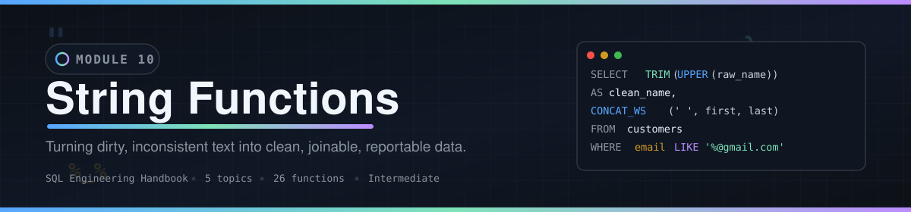
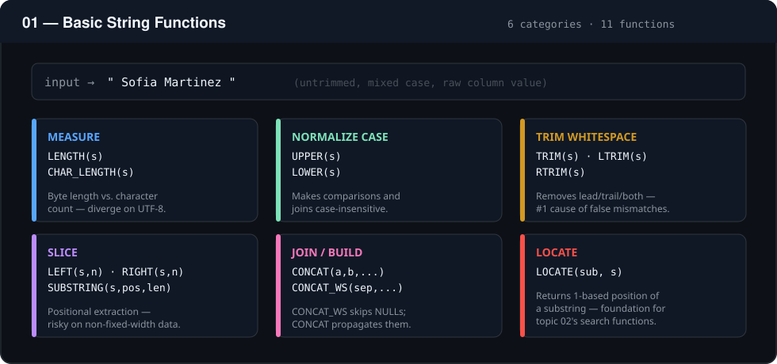
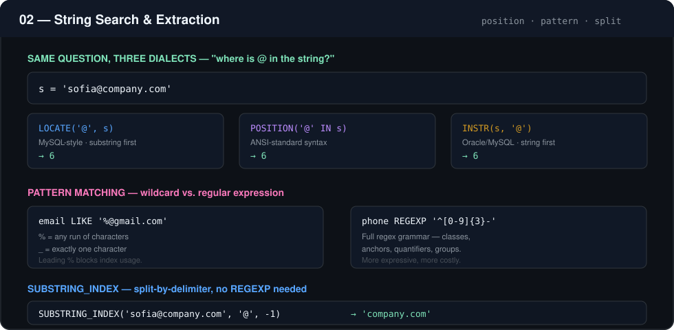
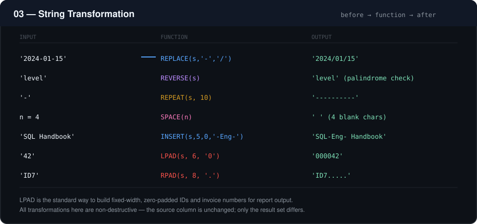
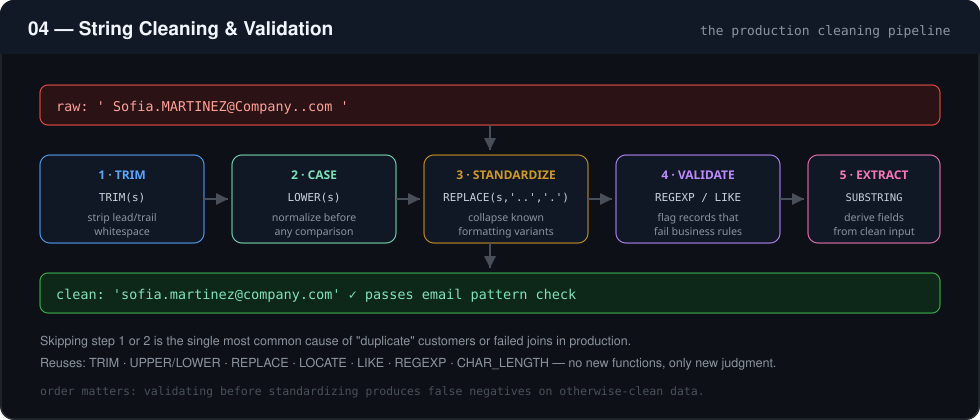
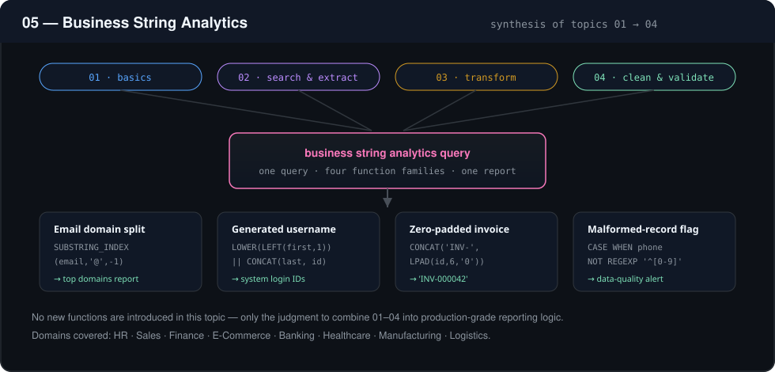
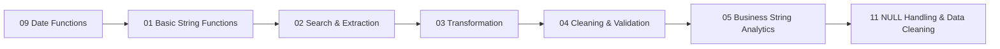

<div align="center">



[](../README.md)
[](../ROADMAP.md)
[](#difficulty--time)
[](#-module-contents)
[](#-function-reference)
[](../LICENSE)

**Turning dirty, inconsistent text into clean, joinable, reportable data.**

[◀ Module 09 — Date Functions](../09_Date_Functions/README.md) · [Live Handbook Site](https://theammarngp-makes.github.io/SQL-Engineering-Handbook) · [Module 11 — NULL Handling ▶](../11_NULL_HANDLING_AND_DATA_CLEANING/README.md)

</div>

---

## Table of Contents

1. [Overview](#overview)
2. [Why String Functions Matter](#why-string-functions-matter)
3. [Learning Objectives](#learning-objectives)
4. [Skills Gained](#skills-gained)
5. [Prerequisites](#prerequisites)
6. [Folder Structure](#folder-structure)
7. [Module Contents](#-module-contents)
8. [Topic Walkthrough](#-topic-walkthrough)
   - [01 — Basic String Functions](#01--basic-string-functions)
   - [02 — String Search & Extraction](#02--string-search--extraction)
   - [03 — String Transformation](#03--string-transformation)
   - [04 — String Cleaning & Validation](#04--string-cleaning--validation)
   - [05 — Business String Analytics](#05--business-string-analytics)
9. [Function Reference](#-function-reference)
10. [Data Cleaning Pipeline](#data-cleaning-pipeline)
11. [Learning Workflow](#learning-workflow)
12. [Performance Tips](#performance-tips)
13. [Best Practices](#best-practices)
14. [Common Mistakes](#common-mistakes)
15. [Interview Preparation](#interview-preparation)
16. [Career Relevance](#career-relevance)
17. [Difficulty & Time](#difficulty--time)
18. [Full Handbook Map](#-full-handbook-map)
19. [Further Reading](#further-reading)
20. [Navigation](#navigation)

---

## Overview

Text is the least structured data type SQL routinely has to work with, and the most error-prone. Names arrive mixed-case, addresses arrive with inconsistent whitespace, phone numbers arrive in a dozen formats, and product codes arrive concatenated when they should be split. This module is about writing SQL that turns that mess into something a report, a dashboard, or a downstream system can trust.

This module does **not** teach string function syntax as a list of definitions to memorize. It teaches the engineering judgment behind *when* a given transformation belongs in the query layer versus the application layer, what it costs in performance, and how it fails silently if you're not careful.

## Why String Functions Matter

Almost every production database has text columns that were never validated at the point of entry — free-text form fields, third-party imports, legacy migrations, manual data entry. String functions are the primary tool for:

- Making inconsistent data comparable (`UPPER`, `TRIM`, `REPLACE`)
- Deriving structured fields from unstructured ones (`SUBSTRING`, `LEFT`, `RIGHT`, `LOCATE`)
- Building human-readable output for reports and exports (`CONCAT`, `CONCAT_WS`, `LPAD`)
- Enforcing data quality rules before data reaches analytics or downstream systems

Get this wrong and you get double-counted customers, broken joins on "the same" value stored two different ways, and reports that silently drop rows because a `WHERE` clause assumed clean data that never existed.

## Learning Objectives

By the end of this module, you will be able to:

1. Select the correct string function for a given cleaning, extraction, or formatting task
2. Reason about the performance cost of string operations in `WHERE`, `JOIN`, and `GROUP BY` clauses
3. Identify when string logic belongs in SQL versus the application/ETL layer
4. Write string transformations that are correct on edge cases (NULLs, empty strings, multi-byte characters, leading/trailing whitespace)
5. Recognize and avoid the most common string-handling mistakes seen in code review

## Skills Gained

- Text cleaning and standardization for analytics-ready data
- Parsing and extracting structured values from unstructured text
- Building derived identifiers (usernames, SKUs, reference codes) from source columns
- Writing string-safe `WHERE` clauses that don't silently break on dirty data
- Diagnosing why a string comparison or join "should match but doesn't"

## Prerequisites

This module assumes completion of:

| Module | Why it's needed here |
|---|---|
| `01–07` | `SELECT`, filtering, sorting, aggregation, joins, `CASE`, subqueries/CTEs — string logic is written *inside* these constructs, not instead of them |
| [`08_WINDOW_BUSINESS_CASES`](../08_WINDOW_BUSINESS_CASES/README.md) | Window functions applied to business problems |
| [`09_Date_Functions`](../09_Date_Functions/README.md) | Temporal data handling |

String functions are typically combined with all of the above in production queries, so this module leans on that foundation rather than re-explaining it.

## Folder Structure

```
10_STRING_FUNCTIONS/
├── README.md                                 ← you are here
├── assets/                                    ← diagrams used in this README
│   ├── banner.svg
│   ├── 01_basic_string_functions.svg
│   ├── 02_string_search_and_extraction.svg
│   ├── 03_string_transformation.svg
│   ├── 04_string_cleaning_and_validation.svg
│   └── 05_business_string_analytics.svg
├── 01_BASIC_STRING_FUNCTIONS.md
├── 01_BASIC_STRING_FUNCTIONS.sql
├── 02_STRING_SEARCH_AND_EXTRACTION.md
├── 02_STRING_SEARCH_AND_EXTRACTION.sql
├── 03_STRING_TRANSFORMATION.md
├── 03_STRING_TRANSFORMATION.sql
├── 04_STRING_CLEANING_AND_VALIDATION.md
├── 04_STRING_CLEANING_AND_VALIDATION.sql
├── 05_BUSINESS_STRING_ANALYTICS.md
└── 05_BUSINESS_STRING_ANALYTICS.sql
```

---

## 📋 Module Contents

Every file in this module, its role, and its size — so you know what you're committing to before you open it.

| # | Topic (`.md`) | New Functions | `.md` lines | `.sql` lines | Combined size | Difficulty |
|---|---|---|---:|---:|---:|:---:|
| 01 | [Basic String Functions](01_BASIC_STRING_FUNCTIONS.md) · [`.sql`](01_BASIC_STRING_FUNCTIONS.sql) | 11 | 162 | 296 | 22.5 KB | 🟢 Foundational |
| 02 | [String Search & Extraction](02_STRING_SEARCH_AND_EXTRACTION.md) · [`.sql`](02_STRING_SEARCH_AND_EXTRACTION.sql) | 6 | 145 | 202 | 16.8 KB | 🟡 Intermediate |
| 03 | [String Transformation](03_STRING_TRANSFORMATION.md) · [`.sql`](03_STRING_TRANSFORMATION.sql) | 7 | 143 | 196 | 16.6 KB | 🟡 Intermediate |
| 04 | [String Cleaning & Validation](04_STRING_CLEANING_AND_VALIDATION.md) · [`.sql`](04_STRING_CLEANING_AND_VALIDATION.sql) | 0 *(synthesis)* | 136 | 207 | 18.2 KB | 🟠 Applied |
| 05 | [Business String Analytics](05_BUSINESS_STRING_ANALYTICS.md) · [`.sql`](05_BUSINESS_STRING_ANALYTICS.sql) | 0 *(synthesis)* | 136 | 193 | 16.4 KB | 🔴 Applied+ |
| — | **Total** | **26 unique** | **722** | **1,094** | **~90.5 KB** | — |

> Every `.md` file follows the same 20-section anatomy — Introduction → Concept Overview → Business Motivation → Functions Covered → Syntax → Parameters → Return Values → ASCII Visual Explanation → Step-by-Step Examples → Production Considerations → Performance Notes → Edge Cases → Common Mistakes → Best Practices → Interview Questions → Practice Challenges → Summary → Further Reading — so once you know the shape of one file, you know the shape of all five.

---

## 🧭 Topic Walkthrough

### 01 — Basic String Functions



The entry point: six function families — measure, normalize case, trim, slice, join, and locate — that every later topic in this module builds on. Covers `LENGTH()`, `CHAR_LENGTH()`, `UPPER()`, `LOWER()`, `LEFT()`, `RIGHT()`, `SUBSTRING()`/`MID()`, `CONCAT()`, `CONCAT_WS()`, `TRIM()`/`LTRIM()`/`RTRIM()`, and `LOCATE()`.

📄 [`01_BASIC_STRING_FUNCTIONS.md`](01_BASIC_STRING_FUNCTIONS.md) · 🗄️ [`01_BASIC_STRING_FUNCTIONS.sql`](01_BASIC_STRING_FUNCTIONS.sql)

---

### 02 — String Search & Extraction



The same question — "where is this substring?" — answered three different ways across SQL dialects (`LOCATE`, `POSITION`, `INSTR`), followed by pattern matching with `LIKE`/`REGEXP` and delimiter-based splitting with `SUBSTRING_INDEX()`.

📄 [`02_STRING_SEARCH_AND_EXTRACTION.md`](02_STRING_SEARCH_AND_EXTRACTION.md) · 🗄️ [`02_STRING_SEARCH_AND_EXTRACTION.sql`](02_STRING_SEARCH_AND_EXTRACTION.sql)

---

### 03 — String Transformation



Non-destructive, input-to-output transformations: `REPLACE()`, `REVERSE()`, `REPEAT()`, `SPACE()`, `INSERT()`, and the fixed-width formatting workhorses `LPAD()`/`RPAD()` — the standard way to build zero-padded IDs and invoice numbers.

📄 [`03_STRING_TRANSFORMATION.md`](03_STRING_TRANSFORMATION.md) · 🗄️ [`03_STRING_TRANSFORMATION.sql`](03_STRING_TRANSFORMATION.sql)

---

### 04 — String Cleaning & Validation



Introduces no new functions — this topic is where `TRIM`, case normalization, `REPLACE`, `LOCATE`, `LIKE`, and `REGEXP` are assembled into the five-stage production cleaning pipeline: **trim → normalize case → standardize → validate → extract**.

📄 [`04_STRING_CLEANING_AND_VALIDATION.md`](04_STRING_CLEANING_AND_VALIDATION.md) · 🗄️ [`04_STRING_CLEANING_AND_VALIDATION.sql`](04_STRING_CLEANING_AND_VALIDATION.sql)

---

### 05 — Business String Analytics



The capstone: topics 01–04 converge into real reporting logic — deriving email domains for a marketing report, generating usernames, formatting zero-padded invoice numbers, and flagging malformed records for a data-quality dashboard — across HR, Sales, Finance, E-Commerce, Banking, Healthcare, Manufacturing, and Logistics scenarios.

📄 [`05_BUSINESS_STRING_ANALYTICS.md`](05_BUSINESS_STRING_ANALYTICS.md) · 🗄️ [`05_BUSINESS_STRING_ANALYTICS.sql`](05_BUSINESS_STRING_ANALYTICS.sql)

---

## 🔤 Function Reference

Every function taught in this module, grouped by what it does rather than the order it appears in.

<details open>
<summary><b>Measure · Case · Trim · Slice · Join</b> (Topic 01)</summary>

| Function | Purpose |
|---|---|
| `LENGTH()` | Byte length of a string |
| `CHAR_LENGTH()` | Character count (safe for multi-byte text) |
| `UPPER()` / `LOWER()` | Case conversion |
| `LEFT()` / `RIGHT()` | Leftmost / rightmost N characters |
| `SUBSTRING()` / `MID()` | Substring from a given position |
| `CONCAT()` | Joins strings (NULL-propagating) |
| `CONCAT_WS()` | Joins with a separator, NULL-safe |
| `TRIM()` / `LTRIM()` / `RTRIM()` | Removes leading/trailing/both whitespace |
| `LOCATE()` | Position of a substring |

</details>

<details>
<summary><b>Search & Pattern Match</b> (Topic 02)</summary>

| Function | Purpose |
|---|---|
| `POSITION()` | ANSI-standard position search |
| `INSTR()` | Position search (Oracle/MySQL-style) |
| `LIKE` | Wildcard pattern match (`%`, `_`) |
| `REGEXP` | Regular-expression pattern match |
| `SUBSTRING_INDEX()` | Substring before/after the Nth delimiter occurrence |

</details>

<details>
<summary><b>Transform & Format</b> (Topic 03)</summary>

| Function | Purpose |
|---|---|
| `REPLACE()` | Replace all occurrences of a substring |
| `REVERSE()` | Reverse character order |
| `REPEAT()` | Repeat a string N times |
| `SPACE()` | Return N spaces |
| `INSERT()` | Insert a substring at a position |
| `LPAD()` / `RPAD()` | Pad to a target length, left or right |

</details>

> Topics 04 and 05 introduce no new functions — they are entirely about combining the functions above correctly. See [Data Cleaning Pipeline](#data-cleaning-pipeline) below.

---

## Data Cleaning Pipeline

A typical production cleaning sequence, in order:

1. **Trim** — remove leading/trailing whitespace introduced by manual entry or CSV imports
2. **Case-normalize** — apply `UPPER`/`LOWER` consistently before comparison or joining
3. **Standardize** — collapse known formatting variants (e.g., phone separators) via `REPLACE`
4. **Validate** — apply pattern checks (`LIKE`/`REGEXP`) to flag records that fail business rules
5. **Extract/derive** — build downstream fields (usernames, initials, codes) only after the above steps guarantee clean input

Skipping step 1 or 2 is the single most common cause of "duplicate" customers or failed joins in production systems. See the [Topic 04 diagram](#04--string-cleaning--validation) above for the full before/after walkthrough.

## Learning Workflow

1. Read the topic's Markdown file in full before opening the `.sql` file — the business context explains *why* the query is written the way it is.
2. Run each scenario's query against the sample schema and compare your output to the documented **Expected Output**.
3. Read the **Engineering Notes** and **Performance Notes** even if your query already produced the right result — correctness and production-readiness are different bars.
4. Attempt the **Practice Challenges** at the end of each Markdown file before moving to the next topic.



## Performance Tips

- Applying a function to a column in a `WHERE` clause (`WHERE UPPER(email) = 'X'`) typically prevents the query planner from using a standard index on that column. Prefer storing normalized data or using a functional/expression index if your database supports one.
- `LIKE '%value%'` (leading wildcard) cannot use a standard B-tree index and forces a full scan on large tables. Trailing-wildcard patterns (`'value%'`) can.
- String concatenation inside a `JOIN` condition should be avoided where possible — join on raw keys and format for display afterward.
- `REGEXP` is powerful but generally more expensive than `LIKE` or `LOCATE` for simple pattern checks; reserve it for genuinely variable patterns.

## Best Practices

- Normalize once, upstream, rather than repeating the same `TRIM(UPPER(...))` in every query that touches a column.
- Always account for `NULL` in string logic — most string functions return `NULL` if any input is `NULL`, which silently drops rows from concatenated output.
- Prefer `CONCAT_WS()` over `CONCAT()` with manual separators — it skips `NULL` values gracefully and reduces separator bugs.
- Document any business rule embedded in a string transformation (e.g., "usernames are first 3 letters + employee ID") directly in the query as a comment — these rules are rarely obvious from the SQL alone.

## Common Mistakes

- Assuming `LENGTH()` and `CHAR_LENGTH()` are interchangeable — they diverge on multi-byte (e.g., UTF-8) characters.
- Forgetting that `CONCAT('a', NULL, 'b')` returns `NULL` in most engines, not `'ab'`.
- Using `SUBSTRING`/`LEFT`/`RIGHT` with hard-coded positions on data whose format isn't guaranteed to be fixed-width.
- Comparing strings without normalizing case or whitespace, then blaming the join or filter logic instead of the data.

## Interview Preparation

Interviewers commonly test string functions through data-cleaning scenarios rather than syntax recall: parsing a full name into first/last, extracting a domain from an email, formatting a phone number, or identifying malformed records with `LIKE`/`REGEXP`. Each topic file in this module ends with an **Interview Questions** section modeled on exactly these patterns.

## Career Relevance

String cleaning is one of the most frequently performed tasks by Data Analysts, Analytics Engineers, and BI Engineers — often described informally as "the 80% of the job that isn't modeling." Fluency here signals production readiness to interviewers far more reliably than advanced window function tricks.

## Difficulty & Time

| | |
|---|---|
| **Level** | Intermediate — assumes comfort with joins and CTEs; introduces no new relational concepts, only a new function family and the judgment to apply it correctly |
| **Estimated time** | 6–9 hours across all five sub-modules, including practice challenges |
| **Business domains used** | HR, Sales, Finance, E-Commerce, Banking, Healthcare, Manufacturing, Logistics |

**Production applications:**

- ETL pipelines standardizing incoming data before it lands in a warehouse
- Customer Data Platforms deduplicating records with inconsistent formatting
- Reporting layers producing human-readable labels from normalized source data
- Data quality monitors flagging malformed emails, phone numbers, or codes

---

## 🗂️ Full Handbook Map

Where this module sits in the complete [SQL Engineering Handbook](../README.md):

| # | Module | Contents | Status |
|---|---|---|:---:|
| 00 | [Schema](../00_Schema/) | Practice database DDL, seed data, and ERD used by every later module | ✅ |
| 01 | [Fundamentals](../01_Fundamentals/) | `SELECT`, `WHERE`, `ORDER BY`, `LIMIT`, aliasing | ✅ |
| 02 | [Aggregations](../02_Aggregations/) | `COUNT`, `SUM`, `AVG`, `MIN`/`MAX`, `GROUP BY`, `HAVING` | ✅ |
| 03 | [Joins](../03_Joins/) | Inner, left, right, full, cross, self joins + performance audit | ✅ |
| 04 | [Subqueries](../04_Subqueries/) | Scalar, correlated, `EXISTS`, derived tables, subquery-to-join rewrites | ✅ |
| 05 | [CASE WHEN](../05_CASE_WHEN/) | Conditional logic and business-rule encoding | ✅ |
| 06 | [CTEs](../06_CTEs/) | Common Table Expressions, recursive CTEs | ✅ |
| 07 | [Window Functions](../07_Window_Functions/) | `ROW_NUMBER`, `RANK`, `LAG`/`LEAD`, `PARTITION BY` | ✅ |
| 08 | [Window Business Cases](../08_WINDOW_BUSINESS_CASES/) | Applied window-function scenarios (running totals, cohorts, rankings) | ✅ |
| 09 | [Date Functions](../09_Date_Functions/) | Date arithmetic, formatting, range queries | ✅ |
| **10** | **String Functions** *(this module)* | String manipulation and data cleaning | ✅ |
| 11 | [NULL Handling & Data Cleaning](../11_NULL_HANDLING_AND_DATA_CLEANING/) | `COALESCE`, `NULLIF`, data-quality patterns | ✅ |
| 12 | [Advanced Aggregations](../12_ADVANCED_AGGREGATIONS/) | Conditional and multi-level aggregation | ✅ |
| 13 | [Set Operators](../13_SET_OPERATORS/) | `UNION`, `INTERSECT`, `EXCEPT`, reconciliation queries | ✅ |
| 14 | [Views](../14_VIEWS/) | Views, security, updatable views, performance | ✅ |
| 15 | [Indexes](../15_INDEXES/) | B-Tree, composite, covering indexes, reading `EXPLAIN` | ✅ |
| 16 | [Query Optimization](../16_QUERY_OPTIMIZATION/) | Execution plans, rewrite patterns, anti-patterns | ✅ |
| 17 | [SQL Interview Questions](../17_SQL_INTERVIEW_QUESTIONS/) | Curated question bank with worked answers | 📋 |
| 18 | [SQL Business Case Studies](../18_SQL_BUSINESS_CASE_STUDIES/) | End-to-end analytics scenarios across domains | 📋 |
| 19 | [SQL Projects](../19_SQL_PROJECTS/) | Portfolio-ready guided projects | 📋 |
| 20 | [SQL Cheatsheet](../20_SQL_CHEATSHEET/) | One-page syntax and pattern reference | 📋 |

✅ Complete &nbsp;·&nbsp; 📋 Planned — live status always lives in [`ROADMAP.md`](../ROADMAP.md).

## Further Reading

- [PostgreSQL String Functions and Operators](https://www.postgresql.org/docs/current/functions-string.html)
- [MySQL String Functions Reference](https://dev.mysql.com/doc/refman/8.0/en/string-functions.html)
- [Microsoft Learn — String Functions (Transact-SQL)](https://learn.microsoft.com/en-us/sql/t-sql/functions/string-functions-transact-sql)

---

## Navigation

<div align="center">

[◀ Module 09 — Date Functions](../09_Date_Functions/README.md) &nbsp;·&nbsp; [🏠 Handbook Home](../README.md) &nbsp;·&nbsp; [Module 11 — NULL Handling ▶](../11_NULL_HANDLING_AND_DATA_CLEANING/README.md)

[⬆ Back to top](#table-of-contents)

</div>
