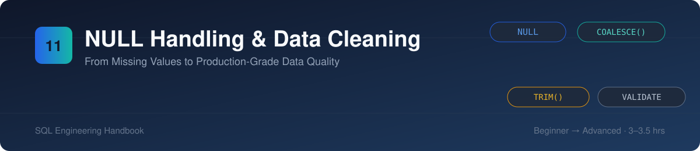
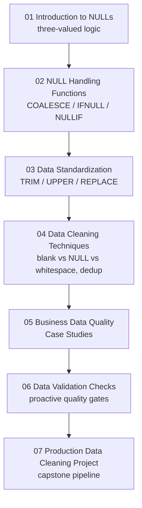
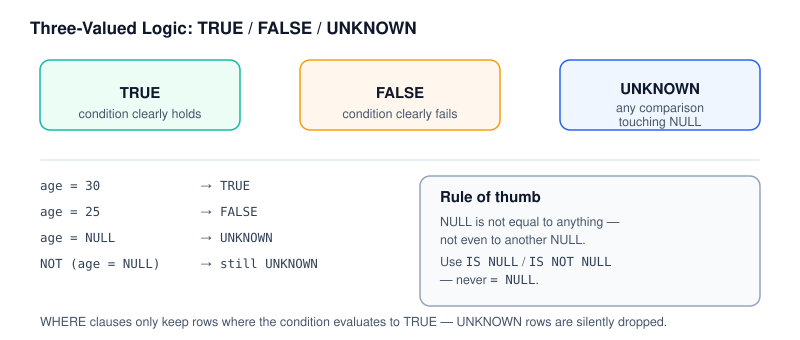
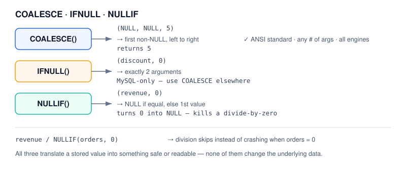
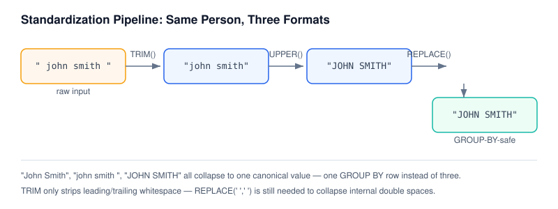
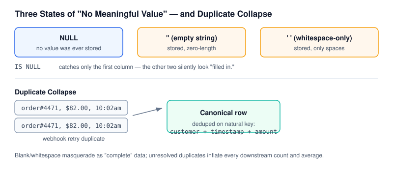
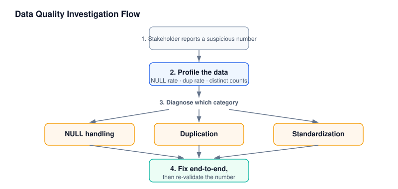
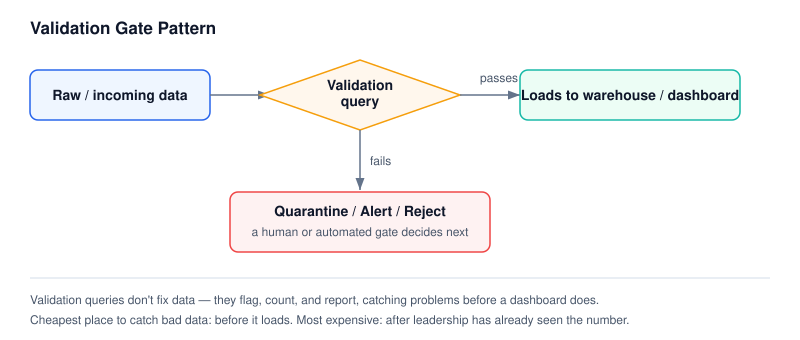
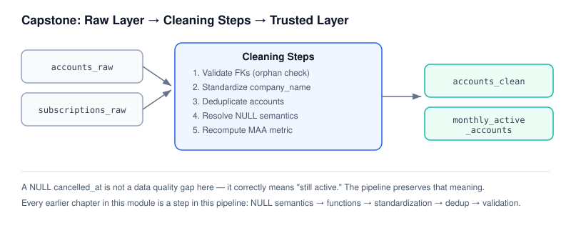

# 11 · NULL Handling & Data Cleaning

> Part of the [SQL Engineering Handbook](../README.md)
> Difficulty: Beginner → Advanced · Estimated study time: 3–3.5 hours

## Table of Contents

- [Module Files](#module-files)
- [Module Overview](#module-overview)
- [Why Data Quality Matters](#why-data-quality-matters)
- [Learning Objectives](#learning-objectives)
- [Module Roadmap](#module-roadmap)
- [Folder Structure](#folder-structure)
- [Repository Footprint](#repository-footprint)
- [Visual Guide](#visual-guide)
- [SQL Functions Covered](#sql-functions-covered)
- [Business Applications](#business-applications)
- [Production Use Cases](#production-use-cases)
- [Analytics Engineering Perspective](#analytics-engineering-perspective)
- [Common Data Quality Problems](#common-data-quality-problems)
- [Best Practices](#best-practices)
- [Common Mistakes](#common-mistakes)
- [Performance Notes](#performance-notes)
- [Difficulty & Prerequisites](#difficulty--prerequisites)
- [Interview Preparation](#interview-preparation)
- [Career Relevance](#career-relevance)
- [Related Modules](#related-modules)
- [Contributor Guide](#contributor-guide)
- [Key Takeaway](#key-takeaway)

## Module Files

| # | Lesson | Concept | Lines (.md) | SQL Lab |
|---|---|---|---|---|
| 01 | [Introduction to NULLs](./01_INTRODUCTION_TO_NULLS.md) | Three-valued logic, `IS NULL` vs `= NULL` | 130 | [.sql](./01_INTRODUCTION_TO_NULLS.sql) |
| 02 | [NULL Handling Functions](./02_NULL_HANDLING_FUNCTIONS.md) | `COALESCE()`, `IFNULL()`, `NULLIF()` | 125 | [.sql](./02_NULL_HANDLING_FUNCTIONS.sql) |
| 03 | [Data Standardization](./03_DATA_STANDARDIZATION.md) | `TRIM()`, `REPLACE()`, `UPPER()`/`LOWER()`, `INITCAP()` | 130 | [.sql](./03_DATA_STANDARDIZATION.sql) |
| 04 | [Data Cleaning Techniques](./04_DATA_CLEANING_TECHNIQUES.md) | Blank vs NULL vs whitespace, duplicate detection & removal | 151 | [.sql](./04_DATA_CLEANING_TECHNIQUES.sql) |
| 05 | [Business Data Quality Case Studies](./05_BUSINESS_DATA_QUALITY_CASE_STUDIES.md) | Multi-technique diagnosis across retail, finance, healthcare | 115 | [.sql](./05_BUSINESS_DATA_QUALITY_CASE_STUDIES.sql) |
| 06 | [Data Validation Checks](./06_DATA_VALIDATION_CHECKS.md) | Orphaned FKs, invalid dates, out-of-range values | 134 | [.sql](./06_DATA_VALIDATION_CHECKS.sql) |
| 07 | [Production Data Cleaning Project](./07_PRODUCTION_DATA_CLEANING_PROJECT.md) | Capstone: multi-table SaaS cleaning pipeline | 112 | [.sql](./07_PRODUCTION_DATA_CLEANING_PROJECT.sql) |

## Module Overview

Every analytics pipeline eventually collides with the same problem: the data is not clean. Customers leave fields blank. Systems migrate and drop values. Integrations write empty strings instead of nulls. Sales reps skip optional form fields. By the time data reaches an analyst, it is never as tidy as the schema diagram suggests.

This module teaches you how to reason about missing, inconsistent, and invalid data the way a production analytics engineer does — not as an annoyance to work around, but as a first-class part of the job. You will learn how SQL represents "unknown," how that representation propagates silently through calculations, and how to build queries and pipelines that catch data quality problems before they reach a dashboard or an executive report.

By the end of this module, NULL will stop being a mysterious edge case and start being a tool you control deliberately.

## Why Data Quality Matters

A query can be syntactically perfect and still produce a wrong answer if the underlying data is dirty. A `SUM()` that silently ignores NULLs, a `COUNT(*)` that overstates completeness, a customer name stored three different ways (`"john smith"`, `"John Smith "`, `"JOHN  SMITH"`) that fragments a single customer into three rows in a `GROUP BY` — these are not rare occurrences. They are the default state of real-world data.

Companies do not lose money because their SQL syntax is wrong. They lose money because a report built on unvalidated data told leadership something that wasn't true. Data quality is not a QA afterthought — it is a prerequisite for trustworthy analytics, and it is one of the most common things analytics engineers are actually hired to fix.

## Learning Objectives

By completing this module, you will be able to:

- Explain what NULL represents in SQL and why it behaves differently from zero, empty string, or "unknown" as a literal value
- Use `IS NULL` / `IS NOT NULL` correctly, and explain why `= NULL` never works
- Apply `COALESCE()`, `IFNULL()`, and `NULLIF()` with correct business logic
- Predict how NULLs affect `COUNT()`, `SUM()`, `AVG()`, and other aggregates
- Standardize inconsistent text data using `TRIM()`, `REPLACE()`, `UPPER()`, `LOWER()`, and related functions
- Detect and handle duplicate records
- Write validation queries that catch incomplete records, invalid dates, negative values, and other data quality violations before they reach downstream reporting
- Design a repeatable data cleaning workflow suitable for an ETL/ELT pipeline

## Module Roadmap



## Folder Structure

```text
11_NULL_HANDLING_AND_DATA_CLEANING/
├── README.md                                  You are here
├── 01_INTRODUCTION_TO_NULLS.md / .sql          Three-valued logic
├── 02_NULL_HANDLING_FUNCTIONS.md / .sql        COALESCE, IFNULL, NULLIF
├── 03_DATA_STANDARDIZATION.md / .sql           TRIM, REPLACE, UPPER/LOWER
├── 04_DATA_CLEANING_TECHNIQUES.md / .sql       Blank/NULL/whitespace, dedup
├── 05_BUSINESS_DATA_QUALITY_CASE_STUDIES.md/.sql  Multi-technique case studies
├── 06_DATA_VALIDATION_CHECKS.md / .sql         Proactive validation queries
├── 07_PRODUCTION_DATA_CLEANING_PROJECT.md/.sql Capstone pipeline
└── assets/                                     Banner + per-lesson SVG diagrams
    ├── banner.svg
    ├── 01_three_valued_logic.svg
    ├── 02_null_functions_flow.svg
    ├── 03_standardization_pipeline.svg
    ├── 04_states_and_duplicates.svg
    ├── 05_investigation_flow.svg
    ├── 06_validation_gate.svg
    └── 07_capstone_pipeline.svg
```

## Repository Footprint

Every file in this module, with size and length — useful for estimating study time or auditing content depth at a glance.

| File | Type | Lines | Size |
|---|---|---|---|
| [01_INTRODUCTION_TO_NULLS.md](./01_INTRODUCTION_TO_NULLS.md) | Lesson | 130 | 12 KB |
| [01_INTRODUCTION_TO_NULLS.sql](./01_INTRODUCTION_TO_NULLS.sql) | SQL Lab | 181 | 8 KB |
| [02_NULL_HANDLING_FUNCTIONS.md](./02_NULL_HANDLING_FUNCTIONS.md) | Lesson | 125 | 12 KB |
| [02_NULL_HANDLING_FUNCTIONS.sql](./02_NULL_HANDLING_FUNCTIONS.sql) | SQL Lab | 199 | 8 KB |
| [03_DATA_STANDARDIZATION.md](./03_DATA_STANDARDIZATION.md) | Lesson | 130 | 12 KB |
| [03_DATA_STANDARDIZATION.sql](./03_DATA_STANDARDIZATION.sql) | SQL Lab | 202 | 12 KB |
| [04_DATA_CLEANING_TECHNIQUES.md](./04_DATA_CLEANING_TECHNIQUES.md) | Lesson | 151 | 12 KB |
| [04_DATA_CLEANING_TECHNIQUES.sql](./04_DATA_CLEANING_TECHNIQUES.sql) | SQL Lab | 225 | 12 KB |
| [05_BUSINESS_DATA_QUALITY_CASE_STUDIES.md](./05_BUSINESS_DATA_QUALITY_CASE_STUDIES.md) | Lesson | 115 | 8 KB |
| [05_BUSINESS_DATA_QUALITY_CASE_STUDIES.sql](./05_BUSINESS_DATA_QUALITY_CASE_STUDIES.sql) | SQL Lab | 205 | 12 KB |
| [06_DATA_VALIDATION_CHECKS.md](./06_DATA_VALIDATION_CHECKS.md) | Lesson | 134 | 8 KB |
| [06_DATA_VALIDATION_CHECKS.sql](./06_DATA_VALIDATION_CHECKS.sql) | SQL Lab | 199 | 8 KB |
| [07_PRODUCTION_DATA_CLEANING_PROJECT.md](./07_PRODUCTION_DATA_CLEANING_PROJECT.md) | Lesson | 112 | 12 KB |
| [07_PRODUCTION_DATA_CLEANING_PROJECT.sql](./07_PRODUCTION_DATA_CLEANING_PROJECT.sql) | SQL Lab | 233 | 12 KB |
| **Total** | **7 lessons + 7 labs** | **2,341** | **~148 KB** |

## Visual Guide

Each lesson has a companion diagram in [`assets/`](./assets/) built to the same visual language as the rest of the handbook — muted slate/blue/teal tones, no neon, designed to read cleanly in both light and dark GitHub themes.

**01 — Three-Valued Logic**

Every comparison touching NULL evaluates to UNKNOWN, not TRUE or FALSE — the root cause of nearly every NULL-related bug.

**02 — COALESCE · IFNULL · NULLIF**

Three functions, three jobs: substitute a fallback, substitute a MySQL-only fallback, or deliberately convert a value into NULL.

**03 — Standardization Pipeline**

`"  john smith "`, `"John Smith"`, and `"JOHN  SMITH"` are three different strings to SQL until a standardization pipeline makes them one.

**04 — States & Duplicates**

`IS NULL` only catches one of three "no meaningful value" states — and unresolved duplicates inflate every count built on top of them.

**05 — Investigation Flow**

A vague "this number looks wrong" ticket resolves through profiling, diagnosis, and a defensible, explainable fix.

**06 — Validation Gate**

Validation queries don't fix anything — they flag, count, and report, so bad rows are caught before a dashboard is.

**07 — Capstone Pipeline**

Every earlier lesson becomes one stage in a single production-shaped pipeline: validate → standardize → deduplicate → resolve NULLs → recompute the metric.

## SQL Functions Covered

| Category | Functions |
|---|---|
| Null checks | `IS NULL`, `IS NOT NULL` |
| Null substitution | `COALESCE()`, `IFNULL()`, `NULLIF()` |
| Text cleaning | `TRIM()`, `LTRIM()`, `RTRIM()`, `REPLACE()` |
| Text casing | `UPPER()`, `LOWER()`, `INITCAP()` (Postgres) |
| Conditional logic | `CASE WHEN` |
| Aggregation | `COUNT()`, `SUM()`, `AVG()` (NULL-aware behavior) |

## Business Applications

| Domain | Where this module applies |
|---|---|
| Retail / E-commerce | Reconciling customer records across online and in-store systems where fields are optional |
| Finance | Ensuring transaction amounts are never silently excluded from totals due to NULL |
| HR | Validating employee records for missing managers, invalid hire dates, or duplicate employee IDs |
| Healthcare | Flagging incomplete patient records before they reach compliance reporting |
| SaaS | Standardizing customer emails and company names for accurate account-level rollups |
| Marketing | Deduplicating leads captured from multiple campaign sources |

## Production Use Cases

- Pre-load validation checks in an ETL/ELT pipeline (reject or quarantine bad rows before they hit the warehouse)
- Data quality dashboards that track completeness and validity over time
- Master data management: deciding a single canonical representation of a customer, product, or account
- Incremental load reconciliation: detecting duplicate inserts after a failed pipeline retry

## Analytics Engineering Perspective

In a modern analytics stack, data cleaning is not a one-time cleanup script — it is a layer. Raw data lands in a `staging` layer untouched; standardization and validation happen in an intermediate layer; only clean, tested data reaches the layer business users query. The patterns in this module are the SQL-level building blocks of that intermediate layer, regardless of whether your stack uses dbt, stored procedures, or plain scheduled SQL.

## Common Data Quality Problems

- Missing values represented three different ways: `NULL`, `''`, and `'N/A'` — often in the same column
- Leading/trailing whitespace that breaks joins and `GROUP BY`
- Inconsistent casing fragmenting what should be one group
- Duplicate records from repeated imports or failed idempotency checks
- Foreign keys pointing to deleted or never-created parent records
- Dates stored as strings with inconsistent formats
- Negative values in columns that should never be negative (quantities, prices, ages)

## Best Practices

- Never assume a NULL check with `=` will work — always use `IS NULL` / `IS NOT NULL`
- Choose `COALESCE` over `IFNULL` when portability across database engines matters
- Validate data quality assumptions before aggregating — check completeness first, then compute
- Standardize text at the earliest layer possible so it doesn't need to be repeated in every downstream query
- Treat data validation queries as part of the codebase, not a one-off task — version and re-run them

## Common Mistakes

- Using `column = NULL` instead of `column IS NULL`
- Assuming `COUNT(*)` and `COUNT(column)` return the same result
- Forgetting that `AVG()` and `SUM()` ignore NULLs rather than treating them as zero
- Using `TRIM()` and assuming it removes internal whitespace (it only removes leading/trailing)
- Deduplicating with `DISTINCT` across the wrong column set, silently keeping unwanted duplicates

## Performance Notes

- `IS NULL` / `IS NOT NULL` can use indexes in most modern engines, but behavior varies (MySQL indexes NULLs; some engines don't) — always verify with `EXPLAIN`
- Wrapping an indexed column in `COALESCE()` in a `WHERE` clause typically prevents index usage — filter on the raw column when possible
- Validation queries that scan full tables should be scheduled thoughtfully in production, not run ad hoc against large fact tables during peak load

## Difficulty & Prerequisites

- **Prerequisites:** comfort with `SELECT`, aggregates, joins, `CASE`, subqueries/CTEs, window functions, and date/string functions — see [`01_Fundamentals`](../01_Fundamentals/README.md) through [`10_STRING_FUNCTIONS`](../10_STRING_FUNCTIONS/README.md)
- **Difficulty curve:** Lessons 01–02 (Beginner — mental model + core toolkit) → 03–04 (Intermediate — text and row-level cleaning) → 05–06 (Intermediate/Advanced — diagnosis and proactive validation) → 07 (Advanced — capstone pipeline)

If any prerequisite feels shaky, revisit the earlier modules before continuing — NULL handling assumes fluency with the fundamentals, since it touches nearly every clause in SQL.

## Interview Preparation

Expect questions like:

- "What's the difference between `COALESCE` and `IFNULL`?"
- "Why does `COUNT(*)` differ from `COUNT(column_name)`?"
- "How would you find duplicate customer records with slightly different formatting?"
- "Write a query to flag orders with missing or invalid data before they're loaded into the warehouse."

This module is designed so that after completing it, these questions become straightforward rather than something to memorize answers for.

## Career Relevance

Data quality work is unglamorous and extremely in-demand. Analytics Engineer and Data Analyst job postings routinely list "data validation," "data cleaning," and "ensuring data quality" as core responsibilities — not nice-to-haves. Demonstrating fluency here, especially in a portfolio project, signals production readiness in a way that a polished dashboard alone does not.

## Related Modules

[`01_Fundamentals`](../01_Fundamentals/README.md) ·
[`02_Aggregations`](../02_Aggregations/README.md) ·
[`03_Joins`](../03_Joins/README.md) ·
[`04_Subqueries`](../04_Subqueries/README.md) ·
[`05_CASE_WHEN`](../05_CASE_WHEN/README.md) ·
[`06_CTEs`](../06_CTEs/README.md) ·
[`07_Window_Functions`](../07_Window_Functions/README.md) ·
[`08_WINDOW_BUSINESS_CASES`](../08_WINDOW_BUSINESS_CASES/README.md) ·
[`09_Date_Functions`](../09_Date_Functions/README.md) ·
[`10_STRING_FUNCTIONS`](../10_STRING_FUNCTIONS/README.md) ·
[`12_ADVANCED_AGGREGATIONS`](../12_ADVANCED_AGGREGATIONS/README.md) ·
[`13_SET_OPERATORS`](../13_SET_OPERATORS/README.md) ·
[`14_VIEWS`](../14_VIEWS/README.md) ·
[`15_INDEXES`](../15_INDEXES/README.md) ·
[`16_QUERY_OPTIMIZATION`](../16_QUERY_OPTIMIZATION/README.md) ·
[`17_SQL_INTERVIEW_QUESTIONS`](../17_SQL_INTERVIEW_QUESTIONS/README.md) ·
[`18_SQL_BUSINESS_CASE_STUDIES`](../18_SQL_BUSINESS_CASE_STUDIES/README.md) ·
[`19_SQL_PROJECTS`](../19_SQL_PROJECTS/README.md) ·
[`20_SQL_CHEATSHEET`](../20_SQL_CHEATSHEET/README.md)

## Contributor Guide

Contributions welcome — this module intentionally keeps every lesson to the same structure (Introduction → Concept Overview → Why This Exists → Business Context → Real Company Examples → Business Problems Solved → Visual Explanation → SQL reference → Common Mistakes → Interview Questions) so new lessons stay consistent.

**To add a new lesson:**
1. Follow the existing `NN_TOPIC_NAME.md` / `.sql` naming pattern
2. Reuse the schema and seed data already established in this module's `.sql` files rather than introducing a new schema, unless the lesson genuinely needs new tables
3. Add a matching SVG to `assets/` in the same muted slate/blue/teal palette as the rest of the module — no neon, no oversaturated fills — and link it from the [Visual Guide](#visual-guide) section
4. Update the [Module Files](#module-files) and [Repository Footprint](#repository-footprint) tables with the new file's line count and size
5. Prefer a real, demonstrable production bug over an invented one when illustrating a common mistake

## Key Takeaway

NULL handling and data cleaning sit at the intersection of SQL syntax and engineering judgment. The functions themselves — `COALESCE`, `IFNULL`, `NULLIF`, `TRIM`, `REPLACE` — are simple. The skill is knowing which one applies to which business situation, and building the habit of validating data before trusting it. In production, dirty data doesn't throw an error — it just quietly produces the wrong business decision.

## Further Reading

- [PostgreSQL: The Nature of NULL Values](https://www.postgresql.org/docs/current/functions-comparison.html)
- [MySQL: Working with NULL Values](https://dev.mysql.com/doc/refman/8.0/en/working-with-null.html)
- [MySQL String Functions Reference](https://dev.mysql.com/doc/refman/8.0/en/string-functions.html)

---

**Previous Module:** [10 — String Functions](../10_STRING_FUNCTIONS/README.md)
**Next Module:** [12 — Advanced Aggregations](../12_ADVANCED_AGGREGATIONS/README.md)
