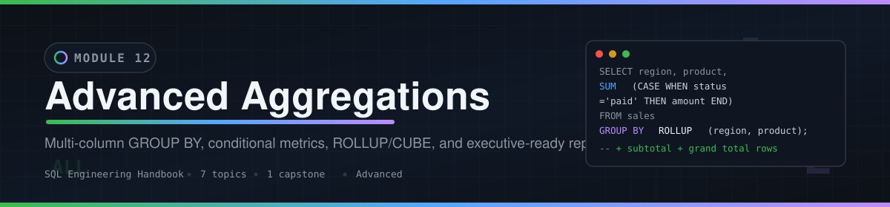
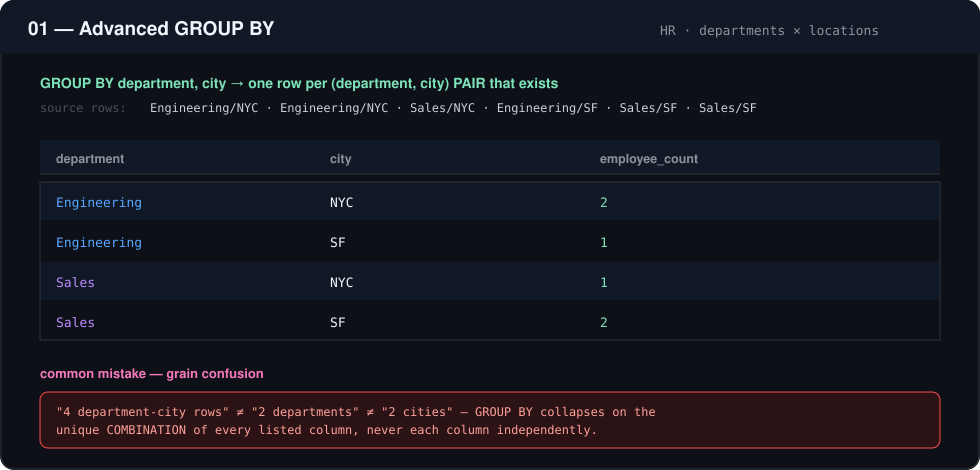
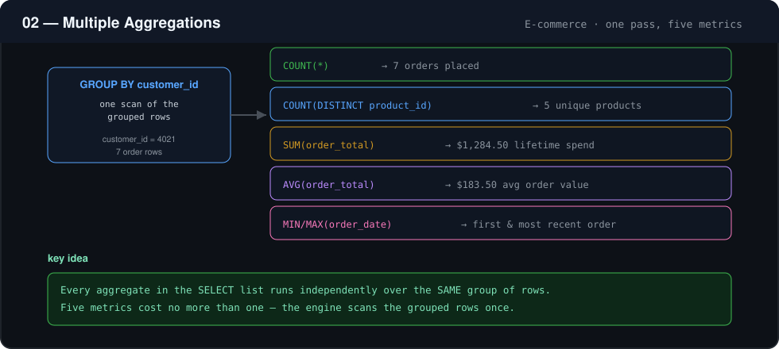
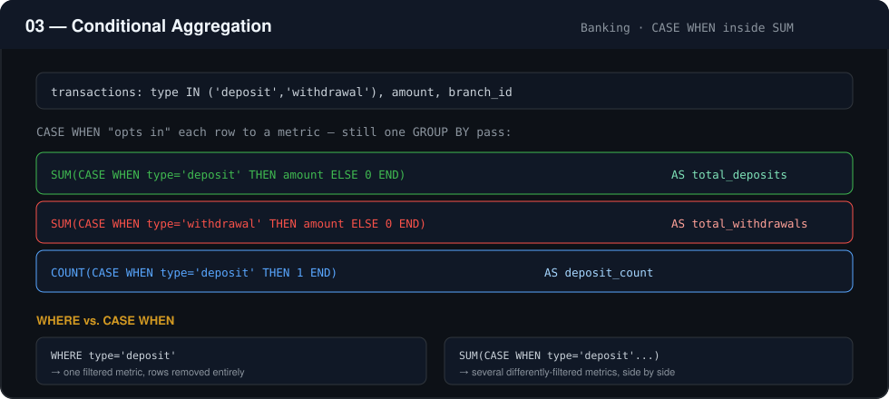
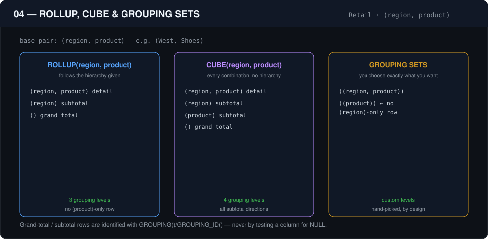
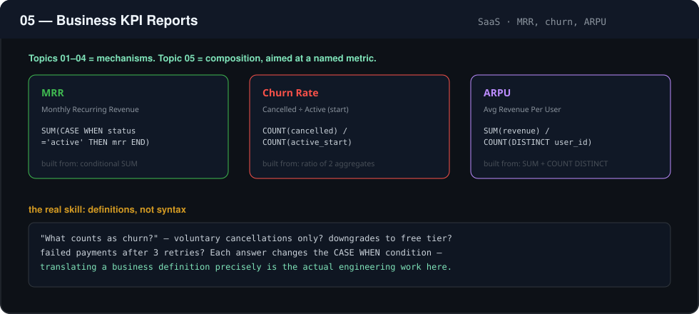
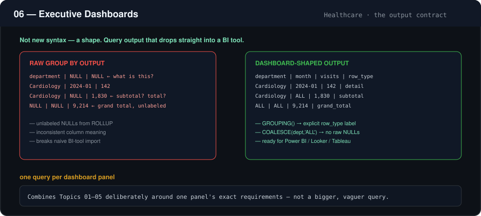
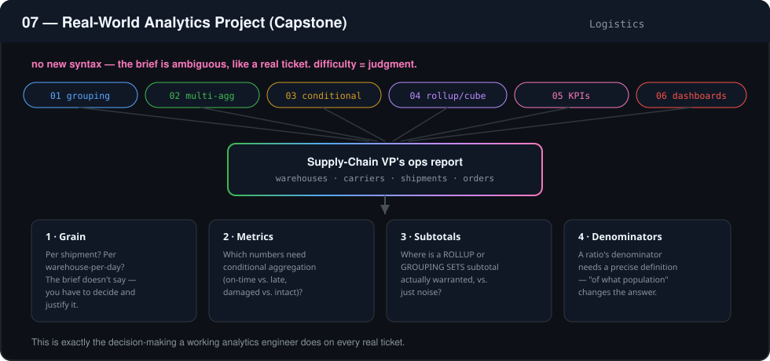

<div align="center">



[](../README.md)
[](../ROADMAP.md)
[](#difficulty--time)
[](#-module-contents)
[](#-function-reference)
[](../LICENSE)

**Multi-column GROUP BY, conditional metrics, ROLLUP/CUBE, and executive-ready SQL reporting.**

[◀ Module 11 — NULL Handling](../11_NULL_HANDLING_AND_DATA_CLEANING/README.md) · [Live Handbook Site](https://theammarngp-makes.github.io/SQL-Engineering-Handbook) · [Module 13 — Set Operators ▶](../13_SET_OPERATORS/README.md)

</div>

---

## Table of Contents

1. [Overview](#overview)
2. [Why Advanced Aggregations Matter](#why-advanced-aggregations-matter)
3. [Learning Objectives](#learning-objectives)
4. [Skills Gained](#skills-gained)
5. [Prerequisites](#prerequisites)
6. [Folder Structure](#folder-structure)
7. [Module Contents](#-module-contents)
8. [Topic Walkthrough](#-topic-walkthrough)
   - [01 — Advanced GROUP BY](#01--advanced-group-by)
   - [02 — Multiple Aggregations](#02--multiple-aggregations)
   - [03 — Conditional Aggregation](#03--conditional-aggregation)
   - [04 — ROLLUP, CUBE & GROUPING SETS](#04--rollup-cube--grouping-sets)
   - [05 — Business KPI Reports](#05--business-kpi-reports)
   - [06 — Executive Dashboards](#06--executive-dashboards)
   - [07 — Real-World Analytics Project (Capstone)](#07--real-world-analytics-project-capstone)
9. [Function Reference](#-function-reference)
10. [Business Applications](#business-applications)
11. [Analytics Engineering Perspective](#analytics-engineering-perspective)
12. [Performance Considerations](#performance-considerations)
13. [Best Practices](#best-practices)
14. [Common Mistakes](#common-mistakes)
15. [Interview Preparation](#interview-preparation)
16. [Career Relevance](#career-relevance)
17. [Difficulty & Time](#difficulty--time)
18. [Full Handbook Map](#-full-handbook-map)
19. [Further Reading](#further-reading)
20. [Navigation](#navigation)

---

## Overview

A single-column `GROUP BY` answers "what's the total per category?" — the first question every analyst learns to write. This module covers everything that happens the moment a stakeholder asks a harder version of that question: a total per category *broken down by a second category*, several differently-defined metrics *in the same row*, a subtotal-and-grand-total report that used to take three separate queries, or a number with an actual business name — MRR, churn rate, ARPU — that leadership already tracks.

None of this is new relational theory. It's the same `GROUP BY` you already know, aimed with more precision and combined with more judgment. That's exactly what separates a beginner analyst's query from an analytics engineer's.

## Why Advanced Aggregations Matter

Almost every dashboard, financial report, and executive summary in a real company is built from queries in this exact family:

- **Multi-dimensional breakdowns** — revenue by region *and* month, not just one or the other
- **Composite metrics in one pass** — count, sum, average, and distinct-count together, computed once
- **Conditional metrics** — new vs. returning, on-time vs. late, paid vs. failed, all in a single `GROUP BY`
- **Hierarchical totals** — subtotal and grand-total rows without stacking multiple queries by hand
- **Named business KPIs** — MRR, churn, ARPU, conversion rate — the specific numbers leadership already has a name for

Get the grain wrong here and a "total" silently becomes a subtotal, a dashboard panel double-counts a row, or a churn number quietly means something different than what the VP thinks it means. This module is about writing aggregation logic that a business can actually rely on.

## Learning Objectives

By the end of this module, you will be able to:

1. Reason correctly about **grain** in multi-column `GROUP BY` queries — what exactly one output row represents
2. Compute several independent metrics over the same group in a single pass, without repeated scans
3. Use `CASE WHEN` inside aggregate functions to compute differently-filtered metrics side by side
4. Choose between `ROLLUP`, `CUBE`, and `GROUPING SETS` for hierarchical and custom subtotal reporting
5. Identify subtotal/grand-total rows with `GROUPING()` instead of fragile `NULL` checks
6. Translate a named business KPI (MRR, churn, ARPU) into precise, correct SQL
7. Shape query output so it can be consumed directly by a BI tool without further transformation
8. Take an ambiguous, real-world reporting brief and make and justify the grain, metric, and denominator decisions it requires

## Skills Gained

- Multi-dimensional reporting query design
- Composite, single-pass metric computation
- Conditional aggregation for breakdown-by-status reporting
- Hierarchical subtotal/grand-total reporting with `ROLLUP`/`CUBE`/`GROUPING SETS`
- Translating business KPI definitions into precise SQL
- Designing BI-tool-ready, dashboard-shaped query output
- Making and defending grain, metric, and denominator decisions on ambiguous reporting briefs

## Prerequisites

This module assumes completion of:

| Module | Why it's needed here |
|---|---|
| `01–07` | `SELECT`, filtering, sorting, basic aggregation, joins, `CASE`, subqueries/CTEs |
| [`05_CASE_WHEN`](../05_CASE_WHEN/README.md) | `CASE WHEN` logic is the mechanism behind every conditional aggregate in this module |
| [`10_STRING_FUNCTIONS`](../10_STRING_FUNCTIONS/README.md) | Formatting derived labels for reporting output |
| [`11_NULL_HANDLING_AND_DATA_CLEANING`](../11_NULL_HANDLING_AND_DATA_CLEANING/README.md) | Distinguishing real `NULL`s in source data from the structural `NULL`s `ROLLUP`/`CUBE` introduce |

## Folder Structure

```
12_ADVANCED_AGGREGATIONS/
├── README.md                                     ← you are here
├── assets/                                        ← diagrams used in this README
│   ├── banner.svg
│   ├── 01_advanced_group_by.svg
│   ├── 02_multiple_aggregations.svg
│   ├── 03_conditional_aggregation.svg
│   ├── 04_rollup_cube_grouping_sets.svg
│   ├── 05_business_kpi_reports.svg
│   ├── 06_executive_dashboards.svg
│   └── 07_real_world_analytics_project.svg
├── 01_ADVANCED_GROUP_BY.md
├── 01_ADVANCED_GROUP_BY.sql
├── 02_MULTIPLE_AGGREGATIONS.md
├── 02_MULTIPLE_AGGREGATIONS.sql
├── 03_CONDITIONAL_AGGREGATION.md
├── 03_CONDITIONAL_AGGREGATION.sql
├── 04_ROLLUP_CUBE_GROUPING_SETS.md
├── 04_ROLLUP_CUBE_GROUPING_SETS.sql
├── 05_BUSINESS_KPI_REPORTS.md
├── 05_BUSINESS_KPI_REPORTS.sql
├── 06_EXECUTIVE_DASHBOARDS.md
├── 06_EXECUTIVE_DASHBOARDS.sql
├── 07_REAL_WORLD_ANALYTICS_PROJECT.md
└── 07_REAL_WORLD_ANALYTICS_PROJECT.sql
```

---

## 📋 Module Contents

Every file in this module, its business domain, and its size — so you know what you're committing to before you open it.

| # | Topic (`.md`) | Domain | `.md` lines | `.sql` lines | Combined size | Difficulty |
|---|---|---|---:|---:|---:|:---:|
| 01 | [Advanced GROUP BY](01_ADVANCED_GROUP_BY.md) · [`.sql`](01_ADVANCED_GROUP_BY.sql) | Human Resources | 212 | 270 | 23.9 KB | 🟢 Foundational |
| 02 | [Multiple Aggregations](02_MULTIPLE_AGGREGATIONS.md) · [`.sql`](02_MULTIPLE_AGGREGATIONS.sql) | E-commerce | 202 | 168 | 19.6 KB | 🟢 Foundational |
| 03 | [Conditional Aggregation](03_CONDITIONAL_AGGREGATION.md) · [`.sql`](03_CONDITIONAL_AGGREGATION.sql) | Banking / Finance | 201 | 210 | 22.8 KB | 🟡 Intermediate |
| 04 | [ROLLUP, CUBE & GROUPING SETS](04_ROLLUP_CUBE_GROUPING_SETS.md) · [`.sql`](04_ROLLUP_CUBE_GROUPING_SETS.sql) | Retail | 214 | 232 | 23.8 KB | 🟠 Advanced |
| 05 | [Business KPI Reports](05_BUSINESS_KPI_REPORTS.md) · [`.sql`](05_BUSINESS_KPI_REPORTS.sql) | SaaS | 194 | 183 | 20.9 KB | 🟠 Advanced |
| 06 | [Executive Dashboards](06_EXECUTIVE_DASHBOARDS.md) · [`.sql`](06_EXECUTIVE_DASHBOARDS.sql) | Healthcare | 203 | 170 | 21.8 KB | 🟠 Advanced |
| 07 | [Real-World Analytics Project (Capstone)](07_REAL_WORLD_ANALYTICS_PROJECT.md) · [`.sql`](07_REAL_WORLD_ANALYTICS_PROJECT.sql) | Logistics / Supply Chain | 202 | 293 | 28.9 KB | 🔴 Capstone |
| — | **Total** | 7 domains | **1,428** | **1,526** | **~161.9 KB** | — |

> Every `.md` file follows the same 19-section anatomy — Introduction → Concept Overview → Business Motivation → Why This Feature Exists → Real Company Examples → Business Problems Solved → Visual Explanation → Syntax → Detailed Walkthrough → Production Workflow → Analytics Engineering Perspective → Performance Considerations → Edge Cases → Common Mistakes → Best Practices → Interview Questions → Summary → Practice Challenges → Further Reading — so once you know the shape of one file, you know the shape of all seven.

---

## 🧭 Topic Walkthrough

### 01 — Advanced GROUP BY



The core upgrade every beginner analyst has to make: from grouping by one column to grouping by a *combination* of columns. `GROUP BY department, city` collapses rows into one group per **(department, city) pair that actually exists** — not one group per department plus one group per city. This topic is entirely about grain discipline.

📄 [`01_ADVANCED_GROUP_BY.md`](01_ADVANCED_GROUP_BY.md) · 🗄️ [`01_ADVANCED_GROUP_BY.sql`](01_ADVANCED_GROUP_BY.sql)

---

### 02 — Multiple Aggregations



`COUNT()`, `COUNT(DISTINCT)`, `SUM()`, `AVG()`, `MIN()`, and `MAX()` computed together in one `GROUP BY` pass. Every aggregate in the `SELECT` list runs independently over the same grouped rows — five metrics cost no more than one, because the engine scans the group once.

📄 [`02_MULTIPLE_AGGREGATIONS.md`](02_MULTIPLE_AGGREGATIONS.md) · 🗄️ [`02_MULTIPLE_AGGREGATIONS.sql`](02_MULTIPLE_AGGREGATIONS.sql)

---

### 03 — Conditional Aggregation



Puts `CASE WHEN` **inside** the aggregate function, so a single query computes several differently-filtered metrics side by side — the technique behind nearly every "breakdown by status" report: new vs. returning, deposits vs. withdrawals, on-time vs. late.

📄 [`03_CONDITIONAL_AGGREGATION.md`](03_CONDITIONAL_AGGREGATION.md) · 🗄️ [`03_CONDITIONAL_AGGREGATION.sql`](03_CONDITIONAL_AGGREGATION.sql)

---

### 04 — ROLLUP, CUBE & GROUPING SETS



The three tools behind every finance report with subtotal rows and a grand total: `ROLLUP` follows the hierarchy of the columns given, `CUBE` produces every possible subtotal combination, and `GROUPING SETS` lets you hand-pick exactly which combinations you want. `GROUPING()` identifies subtotal/grand-total rows — never a `NULL` check.

📄 [`04_ROLLUP_CUBE_GROUPING_SETS.md`](04_ROLLUP_CUBE_GROUPING_SETS.md) · 🗄️ [`04_ROLLUP_CUBE_GROUPING_SETS.sql`](04_ROLLUP_CUBE_GROUPING_SETS.sql)

---

### 05 — Business KPI Reports



Where Topics 01–04 are mechanisms, this topic is composition — combining them deliberately to produce named business metrics: MRR, churn rate, ARPU, conversion rate. The engineering skill is translating a business definition ("what counts as churn?") into a precise SQL condition, not new syntax.

📄 [`05_BUSINESS_KPI_REPORTS.md`](05_BUSINESS_KPI_REPORTS.md) · 🗄️ [`05_BUSINESS_KPI_REPORTS.sql`](05_BUSINESS_KPI_REPORTS.sql)

---

### 06 — Executive Dashboards



A dashboard is a KPI report designed to be consumed directly by a BI tool: predictable columns, no unexplained `NULL`s, subtotal/grand-total rows properly labeled. This topic is about designing the *output contract* — shaping the result set, not computing new numbers.

📄 [`06_EXECUTIVE_DASHBOARDS.md`](06_EXECUTIVE_DASHBOARDS.md) · 🗄️ [`06_EXECUTIVE_DASHBOARDS.sql`](06_EXECUTIVE_DASHBOARDS.sql)

---

### 07 — Real-World Analytics Project (Capstone)



The capstone: every technique from Topics 01–06 comes together in one realistic engineering brief — build the logistics operations report a supply-chain VP would actually ask for. No new SQL syntax; the difficulty is entirely in grain decisions, metric selection, subtotal placement, and denominator definitions.

📄 [`07_REAL_WORLD_ANALYTICS_PROJECT.md`](07_REAL_WORLD_ANALYTICS_PROJECT.md) · 🗄️ [`07_REAL_WORLD_ANALYTICS_PROJECT.sql`](07_REAL_WORLD_ANALYTICS_PROJECT.sql)

---

## 🔤 Function Reference

Every clause and function taught in this module, grouped by what it does.

<details open>
<summary><b>Grouping & Core Aggregates</b> (Topics 01–02)</summary>

| Function / Clause | Purpose |
|---|---|
| `GROUP BY (col1, col2, ...)` | Aggregates across multiple dimensions simultaneously |
| `COUNT()` / `COUNT(DISTINCT)` | Row counts and unique-value counts per group |
| `SUM()` | Additive totals per group |
| `AVG()` | Mean value per group |
| `MIN()` / `MAX()` | Boundary values per group |

</details>

<details>
<summary><b>Conditional & Hierarchical Aggregation</b> (Topics 03–04)</summary>

| Function / Clause | Purpose |
|---|---|
| `CASE WHEN ... THEN ... END` (inside aggregates) | Conditional metrics within a single aggregation pass |
| `ROLLUP(col1, col2, ...)` | Hierarchical subtotals + grand total, one dimension order |
| `CUBE(col1, col2, ...)` | Every combination of subtotals across all listed dimensions |
| `GROUPING SETS (...)` | Explicit, hand-picked set of grouping combinations |
| `GROUPING(col)` | Returns `1` for subtotal/grand-total rows, `0` for detail rows |
| `HAVING` | Filters groups *after* aggregation, unlike `WHERE` |

</details>

> Topics 05, 06, and 07 introduce no new functions — they are entirely about composing the clauses above into named KPIs, BI-ready dashboards, and a real-world reporting brief.

---

## Business Applications

This module's techniques map directly onto reports that exist in nearly every company with a data team:

- **Revenue & finance** — revenue by region × quarter with subtotals, profit margin by product line, budget-vs-actual rollups
- **Retail & e-commerce** — top/bottom performing SKUs, category performance, order-value segmentation
- **Marketing** — campaign performance with conditional conversion metrics, channel attribution summaries
- **Human Resources** — headcount by department × location, attrition rates, tenure distribution reports
- **Banking & finance** — transaction volume by branch × product, fraud-flag rate by conditional aggregation
- **Healthcare** — patient visit counts by department × month, readmission-rate KPIs
- **Supply chain & logistics** — on-time delivery rate by warehouse, shipment volume by carrier × region
- **SaaS** — MRR movement (new, expansion, contraction, churn) as a single conditional-aggregation query

## Analytics Engineering Perspective

A data analyst writes a query to answer one question. An analytics engineer writes a query — or a `dbt` model, or a scheduled report table — that many people will query *against* for months or years. That distinction changes how you should think about everything in this module:

- **Grain discipline.** Know the intended grain of the output before writing a single `GROUP BY`. Multi-column grouping makes it easy to accidentally produce a finer grain than intended, silently duplicating what looked like a total.
- **Idempotent aggregation.** Scheduled reports re-run repeatedly. `ROLLUP`/`CUBE` output should be deterministic and stable — the same inputs must always produce the same subtotal and grand-total rows, in a predictable shape.
- **Reusable metric definitions.** Conditional aggregation logic (e.g., "what counts as a *returning* customer") gets copy-pasted across a dozen reports. In a mature setup, that `CASE` logic belongs in one tested definition — not re-typed slightly differently everywhere.
- **Separation of aggregation from presentation.** SQL should produce correctly aggregated numbers. Formatting and subtotal labeling belong in the BI layer. `GROUPING()` exists so SQL can flag "this is a subtotal row" without hardcoding a label like `'All Regions'` into the data.

## Performance Considerations

- Multi-column `GROUP BY` typically requires sorting or hashing on the full combination of grouped columns — a composite index matching the `GROUP BY` order can avoid an explicit sort step on large tables.
- `ROLLUP`/`CUBE` compute multiple grouping levels in a single query, which is usually far cheaper than running several separate `GROUP BY` queries and `UNION`-ing them — but `CUBE` on many columns grows combinatorially and can be expensive on wide dimension sets.
- `HAVING` filters *after* aggregation — it cannot use an index the way a `WHERE` clause on a raw column can. Filter as much as possible in `WHERE` before the aggregation runs.
- Conditional aggregation (`CASE WHEN` inside `SUM`/`COUNT`) is usually cheaper than the equivalent multiple-`WHERE`-clause `UNION ALL` pattern, since it scans the source table once instead of N times.

## Best Practices

- State the intended grain of a report as a comment above the query — "one row per (region, month)" — before writing the `GROUP BY`.
- Prefer `GROUPING()` over `NULL` checks to identify subtotal/grand-total rows; a real `NULL` in the source data and a structural `NULL` from `ROLLUP` are otherwise indistinguishable.
- Centralize repeated conditional-aggregation logic (e.g., a churn definition) in a view, CTE, or `dbt` macro rather than duplicating the `CASE WHEN` across reports.
- Design KPI and dashboard queries around the output contract the consuming tool expects — labeled row types, no raw `NULL`s, consistent column meaning — not just a correct number.

## Common Mistakes

- Treating `GROUP BY col1, col2` as two independent groupings instead of one grouping on the combined pair.
- Using `WHERE` to filter one metric on a multi-metric report, which removes rows needed by the *other* metrics in the same query — the fix is conditional aggregation, not `WHERE`.
- Testing a `ROLLUP`/`CUBE` column for `NULL` to detect a subtotal row, which breaks the moment the source data legitimately contains `NULL` in that column.
- Defining a ratio's denominator ambiguously ("churn rate") without specifying the population it's measured against, producing a number two people can compute two different — both defensible — ways.

## Interview Preparation

Interviewers commonly test this module through business scenarios rather than syntax recall: "show revenue by region and month with subtotals," "compute new vs. returning customer counts in one query," "what's the difference between `ROLLUP` and `CUBE`," or "how would you calculate churn rate and what assumptions does your definition make." Each topic file in this module ends with an **Interview Questions** section modeled on exactly these patterns.

## Career Relevance

Advanced aggregation is the single most common SQL skill gap between "can write a working query" and "can be trusted with a stakeholder-facing report." Analysts, Analytics Engineers, and BI Engineers write this exact pattern — multi-column `GROUP BY`, conditional metrics, subtotal reporting — multiple times a week in production.

**Production applications:**

- Financial and executive reporting pipelines producing subtotal/grand-total tables on a schedule
- SaaS metrics dashboards computing MRR, churn, and ARPU directly from transactional data
- BI-layer views feeding Power BI, Looker, and Tableau dashboards without further transformation
- Operational reports (logistics, healthcare, retail) segmented by conditional business rules

## Difficulty & Time

| | |
|---|---|
| **Level** | Advanced — assumes fluency with `GROUP BY`, joins, and `CASE WHEN`; introduces hierarchical aggregation (`ROLLUP`/`CUBE`/`GROUPING SETS`) and the judgment to compose it into real reports |
| **Estimated time** | 10–14 hours across all seven sub-modules, including the capstone project |
| **Business domains used** | Human Resources, E-commerce, Banking, Retail, SaaS, Healthcare, Logistics / Supply Chain |

---

## 🗂️ Full Handbook Map

Where this module sits in the complete [SQL Engineering Handbook](../README.md):

| # | Module | Contents | Status |
|---|---|---|:---:|
| 00 | [Schema](../00_Schema/) | Practice database DDL, seed data, and ERD used by every later module | ✅ |
| 01 | [Fundamentals](../01_Fundamentals/) | `SELECT`, `WHERE`, `ORDER BY`, `LIMIT`, aliasing | ✅ |
| 02 | [Aggregations](../02_Aggregations/) | `COUNT`, `SUM`, `AVG`, `MIN`/`MAX`, `GROUP BY`, `HAVING` | ✅ |
| 03 | [Joins](../03_Joins/) | Inner, left, right, full, cross, self joins + performance audit | ✅ |
| 04 | [Subqueries](../04_Subqueries/) | Scalar, correlated, `EXISTS`, derived tables, subquery-to-join rewrites | ✅ |
| 05 | [CASE WHEN](../05_CASE_WHEN/) | Conditional logic and business-rule encoding | ✅ |
| 06 | [CTEs](../06_CTEs/) | Common Table Expressions, recursive CTEs | ✅ |
| 07 | [Window Functions](../07_Window_Functions/) | `ROW_NUMBER`, `RANK`, `LAG`/`LEAD`, `PARTITION BY` | ✅ |
| 08 | [Window Business Cases](../08_WINDOW_BUSINESS_CASES/) | Applied window-function scenarios (running totals, cohorts, rankings) | ✅ |
| 09 | [Date Functions](../09_Date_Functions/) | Date arithmetic, formatting, range queries | ✅ |
| 10 | [String Functions](../10_STRING_FUNCTIONS/) | String manipulation and data cleaning | ✅ |
| 11 | [NULL Handling & Data Cleaning](../11_NULL_HANDLING_AND_DATA_CLEANING/) | `COALESCE`, `NULLIF`, data-quality patterns | ✅ |
| **12** | **Advanced Aggregations** *(this module)* | Multi-column `GROUP BY`, conditional aggregation, `ROLLUP`/`CUBE`, KPI reporting | ✅ |
| 13 | [Set Operators](../13_SET_OPERATORS/) | `UNION`, `INTERSECT`, `EXCEPT`, reconciliation queries | ✅ |
| 14 | [Views](../14_VIEWS/) | Views, security, updatable views, performance | ✅ |
| 15 | [Indexes](../15_INDEXES/) | B-Tree, composite, covering indexes, reading `EXPLAIN` | ✅ |
| 16 | [Query Optimization](../16_QUERY_OPTIMIZATION/) | Execution plans, rewrite patterns, anti-patterns | ✅ |
| 17 | [SQL Interview Questions](../17_SQL_INTERVIEW_QUESTIONS/) | Curated question bank with worked answers | 📋 |
| 18 | [SQL Business Case Studies](../18_SQL_BUSINESS_CASE_STUDIES/) | End-to-end analytics scenarios across domains | 📋 |
| 19 | [SQL Projects](../19_SQL_PROJECTS/) | Portfolio-ready guided projects | 📋 |
| 20 | [SQL Cheatsheet](../20_SQL_CHEATSHEET/) | One-page syntax and pattern reference | 📋 |

✅ Complete &nbsp;·&nbsp; 📋 Planned — live status always lives in [`ROADMAP.md`](../ROADMAP.md).

## Further Reading

- [PostgreSQL — GROUPING SETS, CUBE, and ROLLUP](https://www.postgresql.org/docs/current/queries-table-expressions.html#QUERIES-GROUPING-SETS)
- [MySQL — GROUP BY Modifiers (WITH ROLLUP)](https://dev.mysql.com/doc/refman/8.0/en/group-by-modifiers.html)
- [Microsoft Learn — GROUP BY (Transact-SQL)](https://learn.microsoft.com/en-us/sql/t-sql/queries/select-group-by-transact-sql)

---

## Navigation

<div align="center">

[◀ Module 11 — NULL Handling](../11_NULL_HANDLING_AND_DATA_CLEANING/README.md) &nbsp;·&nbsp; [🏠 Handbook Home](../README.md) &nbsp;·&nbsp; [Module 13 — Set Operators ▶](../13_SET_OPERATORS/README.md)

[⬆ Back to top](#table-of-contents)

</div>
