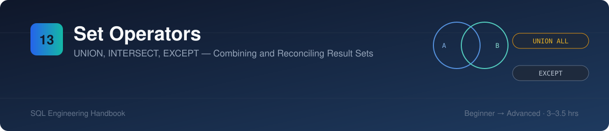
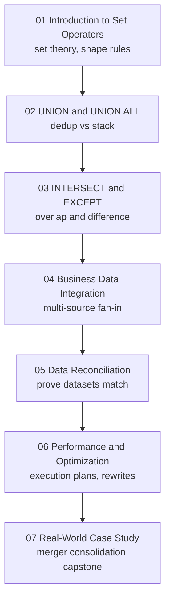
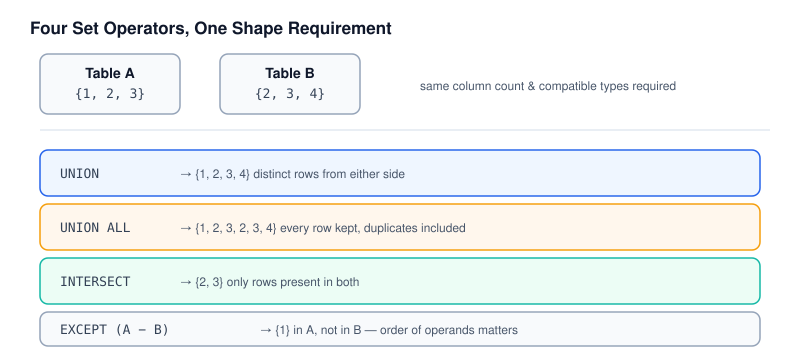
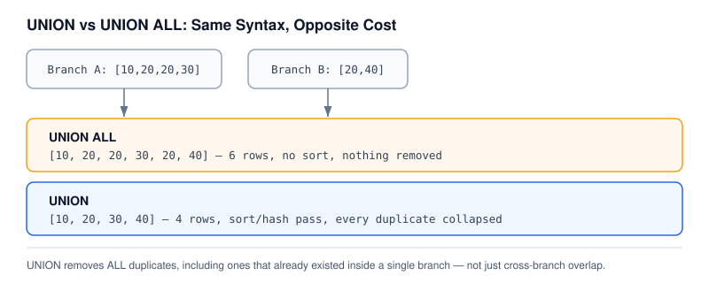
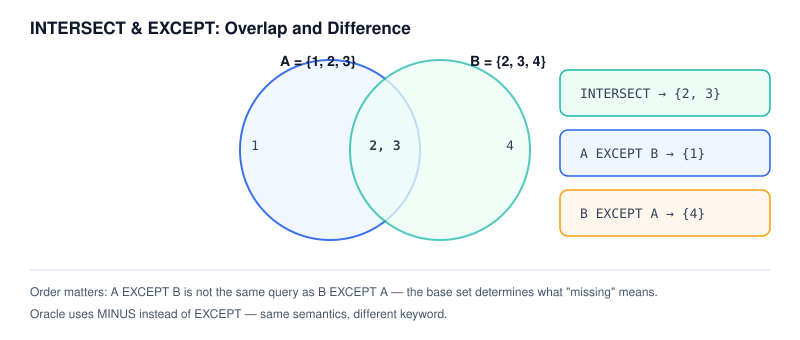
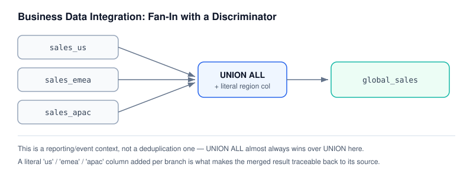
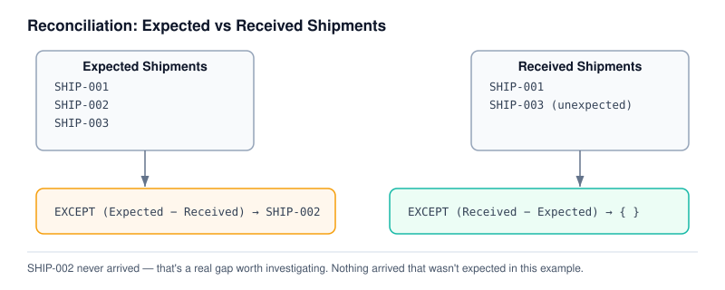
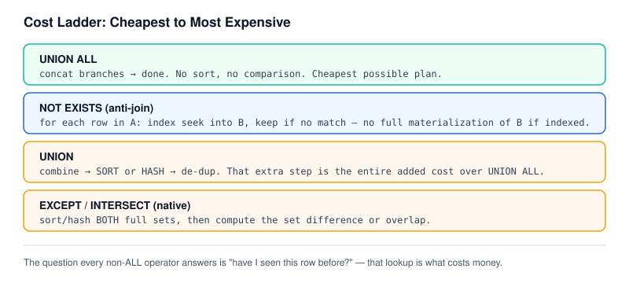
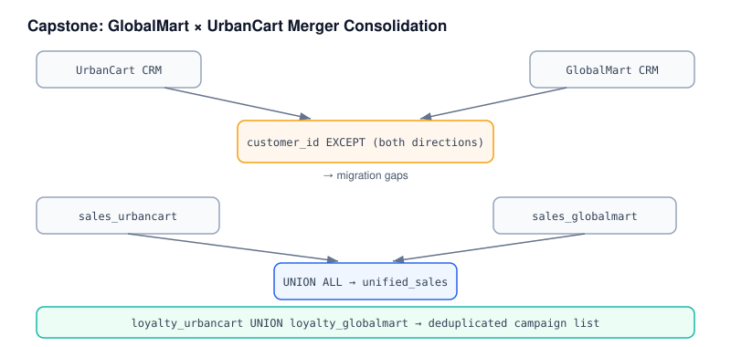

# 13 · Set Operators

> Part of the [SQL Engineering Handbook](../README.md)
> Difficulty: Beginner → Advanced · Estimated study time: 3–3.5 hours

## Table of Contents

- [Module Files](#module-files)
- [Module Overview](#module-overview)
- [Why Set Operators Matter](#why-set-operators-matter)
- [Learning Objectives](#learning-objectives)
- [Module Roadmap](#module-roadmap)
- [Folder Structure](#folder-structure)
- [Repository Footprint](#repository-footprint)
- [Visual Guide](#visual-guide)
- [SQL Operators Covered](#sql-operators-covered)
- [Business Applications](#business-applications)
- [Production Use Cases](#production-use-cases)
- [Analytics Engineering Perspective](#analytics-engineering-perspective)
- [Common Data Integration Problems](#common-data-integration-problems)
- [Best Practices](#best-practices)
- [Common Mistakes](#common-mistakes)
- [Performance Notes](#performance-notes)
- [Difficulty & Prerequisites](#difficulty--prerequisites)
- [Interview Preparation](#interview-preparation)
- [Career Relevance](#career-relevance)
- [Related Modules](#related-modules)
- [Contributor Guide](#contributor-guide)
- [Key Takeaway](#key-takeaway)

## Module Files

| # | Lesson | Concept | Lines (.md) | SQL Lab |
|---|---|---|---|---|
| 01 | [Introduction to Set Operators](./01_INTRODUCTION_TO_SET_OPERATORS.md) | Set theory foundation, shape/type compatibility rules | 165 | [.sql](./01_INTRODUCTION_TO_SET_OPERATORS.sql) |
| 02 | [UNION and UNION ALL](./02_UNION_AND_UNION_ALL.md) | Deduplication vs stacking, cost implications | 144 | [.sql](./02_UNION_AND_UNION_ALL.sql) |
| 03 | [INTERSECT and EXCEPT](./03_INTERSECT_AND_EXCEPT.md) | Overlap and difference, operand order, MINUS (Oracle) | 197 | [.sql](./03_INTERSECT_AND_EXCEPT.sql) |
| 04 | [Business Data Integration](./04_BUSINESS_DATA_INTEGRATION.md) | Multi-source fan-in with discriminator columns | 146 | [.sql](./04_BUSINESS_DATA_INTEGRATION.sql) |
| 05 | [Data Reconciliation](./05_DATA_RECONCILIATION.md) | Proving two datasets match, locating divergence | 164 | [.sql](./05_DATA_RECONCILIATION.sql) |
| 06 | [Performance and Optimization](./06_PERFORMANCE_AND_OPTIMIZATION.md) | Execution plans, JOIN/EXISTS rewrites, when to avoid native operators | 212 | [.sql](./06_PERFORMANCE_AND_OPTIMIZATION.sql) |
| 07 | [Real-World Case Study](./07_REAL_WORLD_CASE_STUDY.md) | Capstone: GlobalMart × UrbanCart merger consolidation | 159 | [.sql](./07_REAL_WORLD_CASE_STUDY.sql) |

## Module Overview

Every query in the modules before this one answered one question against one logical result set. This module introduces a different kind of question: **how do two or more result sets relate to each other?** Set operators — `UNION`, `UNION ALL`, `INTERSECT`, and `EXCEPT` — are the answer, and they show up constantly in real analytics work: merging regional reports into one global view, proving a data migration didn't drop rows, reconciling two systems that are supposed to agree, and consolidating datasets after a company merger.

This module builds from the mechanics (what each operator does, and why `UNION` and `UNION ALL` are opposites despite looking nearly identical) through to a full production-shaped capstone that uses every operator together against one continuous business scenario.

## Why Set Operators Matter

Choosing `UNION` when you meant `UNION ALL` — or the reverse — is one of the most common and most consequential mistakes in production SQL. Silently deduplicating real business data (like legitimately duplicate transactions) can make a revenue report wrong in a way that's hard to notice. Silently keeping duplicates when you meant to dedupe can double-count. And beyond `UNION`, `INTERSECT` and `EXCEPT` are the backbone of reconciliation work — the queries that answer "did we lose any data?" during a migration, or "do these two systems agree?" during an audit. These are not academic set-theory exercises; they are asked for by name in real data engineering tickets.

## Learning Objectives

By completing this module, you will be able to:

- Explain the column-count and data-type compatibility rules that every set operator requires
- Choose correctly between `UNION` and `UNION ALL` based on whether duplicates are meaningful data or noise
- Use `INTERSECT` and `EXCEPT` (or `MINUS` in Oracle) to find overlap and one-sided differences between two datasets
- Build multi-source integration queries that combine several tables into one reporting view with a source discriminator
- Write reconciliation queries that prove two datasets match, or pinpoint exactly where they diverge
- Read an execution plan to understand why `UNION` costs more than `UNION ALL`, and when a `JOIN`, `EXISTS`, or `NOT EXISTS` rewrite outperforms a native set operator
- Combine every operator in this module into a single realistic data consolidation project

## Module Roadmap



## Folder Structure

```text
13_SET_OPERATORS/
├── README.md                                     You are here
├── 01_INTRODUCTION_TO_SET_OPERATORS.md / .sql     Set theory foundation
├── 02_UNION_AND_UNION_ALL.md / .sql               Dedup vs stacking
├── 03_INTERSECT_AND_EXCEPT.md / .sql              Overlap and difference
├── 04_BUSINESS_DATA_INTEGRATION.md / .sql         Multi-source fan-in
├── 05_DATA_RECONCILIATION.md / .sql               Prove datasets match
├── 06_PERFORMANCE_AND_OPTIMIZATION.md / .sql      Execution plans, rewrites
├── 07_REAL_WORLD_CASE_STUDY.md / .sql             Merger consolidation capstone
└── assets/                                        Banner + per-lesson SVG diagrams
    ├── banner.svg
    ├── 01_set_operators_overview.svg
    ├── 02_union_vs_union_all.svg
    ├── 03_intersect_except.svg
    ├── 04_business_integration.svg
    ├── 05_reconciliation_flow.svg
    ├── 06_performance_paths.svg
    └── 07_capstone_merger.svg
```

## Repository Footprint

Every file in this module, with size and length — useful for estimating study time or auditing content depth at a glance.

| File | Type | Lines | Size |
|---|---|---|---|
| [01_INTRODUCTION_TO_SET_OPERATORS.md](./01_INTRODUCTION_TO_SET_OPERATORS.md) | Lesson | 165 | 12 KB |
| [01_INTRODUCTION_TO_SET_OPERATORS.sql](./01_INTRODUCTION_TO_SET_OPERATORS.sql) | SQL Lab | 161 | 8 KB |
| [02_UNION_AND_UNION_ALL.md](./02_UNION_AND_UNION_ALL.md) | Lesson | 144 | 12 KB |
| [02_UNION_AND_UNION_ALL.sql](./02_UNION_AND_UNION_ALL.sql) | SQL Lab | 493 | 20 KB |
| [03_INTERSECT_AND_EXCEPT.md](./03_INTERSECT_AND_EXCEPT.md) | Lesson | 197 | 12 KB |
| [03_INTERSECT_AND_EXCEPT.sql](./03_INTERSECT_AND_EXCEPT.sql) | SQL Lab | 260 | 12 KB |
| [04_BUSINESS_DATA_INTEGRATION.md](./04_BUSINESS_DATA_INTEGRATION.md) | Lesson | 146 | 12 KB |
| [04_BUSINESS_DATA_INTEGRATION.sql](./04_BUSINESS_DATA_INTEGRATION.sql) | SQL Lab | 331 | 12 KB |
| [05_DATA_RECONCILIATION.md](./05_DATA_RECONCILIATION.md) | Lesson | 164 | 12 KB |
| [05_DATA_RECONCILIATION.sql](./05_DATA_RECONCILIATION.sql) | SQL Lab | 251 | 12 KB |
| [06_PERFORMANCE_AND_OPTIMIZATION.md](./06_PERFORMANCE_AND_OPTIMIZATION.md) | Lesson | 212 | 20 KB |
| [06_PERFORMANCE_AND_OPTIMIZATION.sql](./06_PERFORMANCE_AND_OPTIMIZATION.sql) | SQL Lab | 389 | 16 KB |
| [07_REAL_WORLD_CASE_STUDY.md](./07_REAL_WORLD_CASE_STUDY.md) | Lesson | 159 | 12 KB |
| [07_REAL_WORLD_CASE_STUDY.sql](./07_REAL_WORLD_CASE_STUDY.sql) | SQL Lab | 366 | 16 KB |
| **Total** | **7 lessons + 7 labs** | **3,438** | **~176 KB** |

## Visual Guide

Each lesson has a companion diagram in [`assets/`](./assets/) built to the same visual language as the rest of the handbook — muted slate/blue/teal tones, no neon, designed to read cleanly in both light and dark GitHub themes.

**01 — Four Operators, One Shape Requirement**

All four operators require the same column count and compatible types — what differs is purely how they combine matching rows.

**02 — UNION vs UNION ALL**

Same syntax, opposite cost: `UNION ALL` just concatenates; `UNION` adds a full sort/hash pass to remove every duplicate, including ones that already existed inside a single branch.

**03 — INTERSECT & EXCEPT**

`INTERSECT` finds the overlap; `EXCEPT` finds what's missing from one side — and operand order changes the answer.

**04 — Business Data Integration**

Three regional tables fan into one `global_sales` result via `UNION ALL`, with a literal discriminator column tracing every row back to its source.

**05 — Reconciliation Flow**

Two `EXCEPT` queries, run in both directions, turn "do these match?" into an exact, actionable list of what's missing and what's unexpected.

**06 — Performance Ladder**

Every non-`ALL` operator has to answer "have I seen this row before?" — that lookup, not the syntax, is what determines the real cost.

**07 — Capstone: Merger Consolidation**

A full acquisition scenario resolved with the same four operators from Topics 01–06, applied together against a continuous business problem.

## SQL Operators Covered

| Operator | Behavior | Dialect Notes |
|---|---|---|
| `UNION` | Combine rows from two+ queries, remove duplicates | ANSI standard, all major engines |
| `UNION ALL` | Combine rows from two+ queries, keep duplicates | ANSI standard, all major engines |
| `INTERSECT` | Return rows present in both queries | ANSI standard; not in older MySQL versions |
| `EXCEPT` | Return rows from the first query not present in the second | ANSI standard / PostgreSQL / SQL Server |
| `MINUS` | Same as `EXCEPT` | Oracle-specific keyword |

## Business Applications

| Domain | Where this module applies |
|---|---|
| Retail / E-commerce | Merging regional sales tables into one global reporting view |
| Finance | Reconciling two independently computed totals or ledgers |
| HR | Comparing headcount snapshots across systems after a data migration |
| Healthcare | Auditing that patient records migrated between systems without loss |
| SaaS | Combining product usage events from multiple regions or environments |
| Marketing | Deduplicating campaign or loyalty lists pulled from multiple sources |
| Mergers & Acquisitions | Consolidating two companies' customer, sales, and loyalty data |

## Production Use Cases

- Post-migration validation: proving row counts and specific keys match between old and new systems
- Multi-region or multi-tenant reporting rollups with a source/region discriminator column
- Deduplicating lead or contact lists gathered from multiple campaign channels
- Anti-join patterns (`NOT EXISTS`) used as a performant substitute for `EXCEPT` on large indexed tables
- Merger and acquisition data consolidation projects

## Analytics Engineering Perspective

Set operators are often the first tool reached for when combining "the same kind of thing from different places" — but in a mature analytics stack, that fan-in pattern usually lives in a dedicated staging or intermediate model (a dbt model, a scheduled view, a materialized table) rather than being recomputed ad hoc in every downstream query. Reconciliation queries built on `EXCEPT`/`INTERSECT` are equally valuable as scheduled data-quality checks, not just one-off investigations — the same query that answers "do these match today?" can run daily and alert when they stop matching.

## Common Data Integration Problems

- Column order or type mismatches between branches that produce wrong results without throwing an error
- Using `UNION` by default out of habit, paying a needless sort cost when `UNION ALL` was correct
- Forgetting that `ORDER BY` can only appear once, at the end of the combined statement, not per branch
- Missing a source discriminator column, making a merged result impossible to trace back to origin
- Running `EXCEPT` in only one direction during reconciliation and missing rows that exist only on the other side

## Best Practices

- Default to `UNION ALL` unless you have a specific reason to deduplicate — it's cheaper and more explicit about intent
- Always add a literal discriminator column (region, source system, branch) when fanning multiple tables into one result
- Run reconciliation `EXCEPT` queries in both directions — `A EXCEPT B` and `B EXCEPT A` answer different questions
- Check execution plans before assuming a native set operator is the fastest option on large tables
- Keep column lists and aliases explicit and identical across every branch of a set operation for readability

## Common Mistakes

- Using `UNION` when `UNION ALL` was correct, silently and expensively removing legitimate duplicate rows
- Assuming `INTERSECT`/`EXCEPT` are available in every MySQL version without checking (older versions lack them)
- Applying `ORDER BY` to an individual branch instead of the final combined result
- Trusting a single-direction `EXCEPT` as proof that two datasets fully match
- Forgetting `EXCEPT`/`INTERSECT` de-duplicate their output just like `UNION` does

## Performance Notes

- `UNION ALL` never sorts or compares rows — it is always at least as fast as `UNION` on the same inputs
- `UNION`, `INTERSECT`, and native `EXCEPT` typically require materializing and sorting or hashing both full result sets
- On large, well-indexed tables, a `NOT EXISTS` anti-join often outperforms `EXCEPT` because it can use an index seek per row instead of materializing both sides
- Always verify assumptions with `EXPLAIN` — the "faster" rewrite is not universal and depends on table size, indexing, and selectivity

## Difficulty & Prerequisites

- **Prerequisites:** comfort with `SELECT`, joins, subqueries/CTEs, and basic execution-plan reading — see [`03_Joins`](../03_Joins/README.md), [`04_Subqueries`](../04_Subqueries/README.md), and [`06_CTEs`](../06_CTEs/README.md)
- **Difficulty curve:** Lessons 01–03 (Beginner/Intermediate — core operator mechanics) → 04–05 (Intermediate — applied integration and reconciliation) → 06 (Advanced — execution plans and rewrites) → 07 (Advanced — full capstone)

If any prerequisite feels shaky, revisit the earlier modules before continuing — reconciliation and integration patterns assume you're already comfortable combining and filtering data with joins and subqueries.

## Interview Preparation

Expect questions like:

- "What's the difference between `UNION` and `UNION ALL`, and when would you choose each?"
- "How would you find records that exist in one table but not another?"
- "Write a query to reconcile two datasets and report exactly where they differ."
- "When would you rewrite an `EXCEPT` query as a `NOT EXISTS` anti-join, and why?"

This module is designed so that after completing it, these questions become straightforward rather than something to memorize answers for.

## Career Relevance

Reconciliation and data integration work shows up constantly in Data Analyst and Analytics Engineer roles — migrations, mergers, multi-system audits, and multi-region reporting all lean on exactly the patterns in this module. Being able to write and explain a reconciliation query fluently is a concrete, interview-ready skill that maps directly onto real job responsibilities.

## Related Modules

[`01_Fundamentals`](../01_Fundamentals/README.md) ·
[`02_Aggregations`](../02_Aggregations/README.md) ·
[`03_Joins`](../03_Joins/README.md) ·
[`04_Subqueries`](../04_Subqueries/README.md) ·
[`05_CASE_WHEN`](../05_CASE_WHEN/README.md) ·
[`06_CTEs`](../06_CTEs/README.md) ·
[`07_Window_Functions`](../07_Window_Functions/README.md) ·
[`08_WINDOW_BUSINESS_CASES`](../08_WINDOW_BUSINESS_CASES/README.md) ·
[`09_Date_Functions`](../09_Date_Functions/README.md) ·
[`10_STRING_FUNCTIONS`](../10_STRING_FUNCTIONS/README.md) ·
[`11_NULL_HANDLING_AND_DATA_CLEANING`](../11_NULL_HANDLING_AND_DATA_CLEANING/README.md) ·
[`12_ADVANCED_AGGREGATIONS`](../12_ADVANCED_AGGREGATIONS/README.md) ·
[`14_VIEWS`](../14_VIEWS/README.md) ·
[`15_INDEXES`](../15_INDEXES/README.md) ·
[`16_QUERY_OPTIMIZATION`](../16_QUERY_OPTIMIZATION/README.md) ·
[`17_SQL_INTERVIEW_QUESTIONS`](../17_SQL_INTERVIEW_QUESTIONS/README.md) ·
[`18_SQL_BUSINESS_CASE_STUDIES`](../18_SQL_BUSINESS_CASE_STUDIES/README.md) ·
[`19_SQL_PROJECTS`](../19_SQL_PROJECTS/README.md) ·
[`20_SQL_CHEATSHEET`](../20_SQL_CHEATSHEET/README.md)

## Contributor Guide

Contributions welcome — this module intentionally keeps every lesson to a consistent structure (Introduction → Concept Overview → Why This Exists → Business Context → Real Company Examples → Production Use Cases → Visual Explanation → SQL reference → Business Examples → Production Workflow → Performance Notes → Best Practices → Common Mistakes → Interview Questions) so new lessons stay consistent.

**To add a new lesson:**
1. Follow the existing `NN_TOPIC_NAME.md` / `.sql` naming pattern
2. Reuse the schema and seed data already established in this module's `.sql` files rather than introducing a new schema, unless the lesson genuinely needs new tables
3. Add a matching SVG to `assets/` in the same muted slate/blue/teal palette as the rest of the module — no neon, no oversaturated fills — and link it from the [Visual Guide](#visual-guide) section
4. Update the [Module Files](#module-files) and [Repository Footprint](#repository-footprint) tables with the new file's line count and size
5. Prefer a real, demonstrable production scenario over an invented one when illustrating a common mistake

## Key Takeaway

Set operators turn "combine or compare two result sets" from a manual, error-prone exercise into a single declarative statement — but the four operators are not interchangeable, and picking the wrong one is a common, costly mistake. The real skill in this module isn't memorizing syntax; it's recognizing which business question you're actually being asked — merge, dedupe, find overlap, or find difference — and reaching for the operator built for exactly that question.

## Further Reading

- [PostgreSQL: Combining Queries](https://www.postgresql.org/docs/current/queries-union.html)
- [MySQL: UNION Syntax](https://dev.mysql.com/doc/refman/8.0/en/union.html)
- [SQL Server: Set Operators (Transact-SQL)](https://learn.microsoft.com/en-us/sql/t-sql/language-elements/set-operators-except-and-intersect-transact-sql)

---

**Previous Module:** [12 — Advanced Aggregations](../12_ADVANCED_AGGREGATIONS/README.md)
**Next Module:** [14 — Views](../14_VIEWS/README.md)
