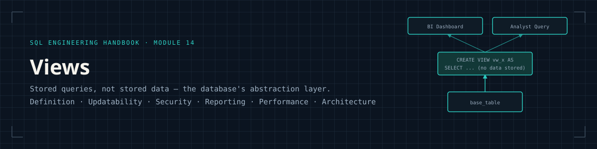
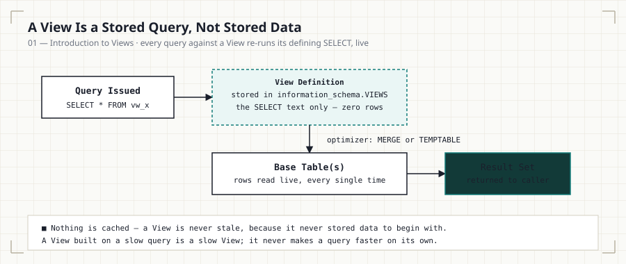
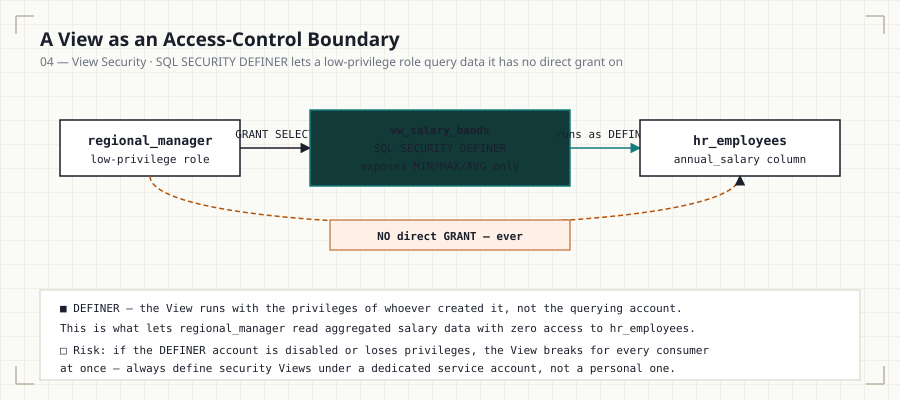
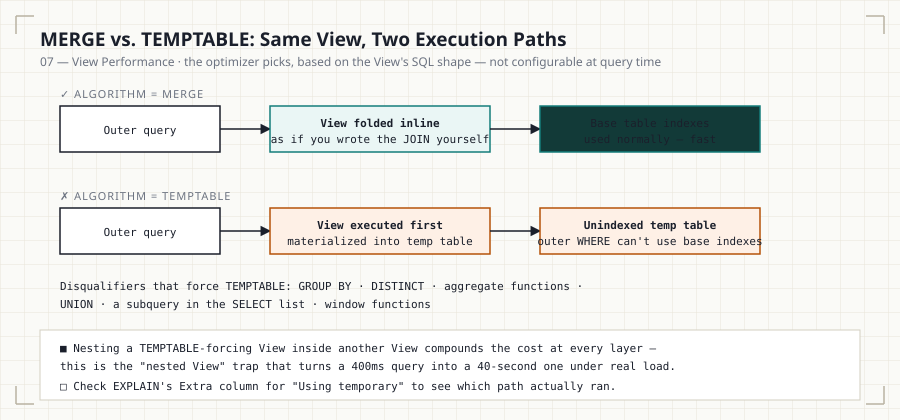
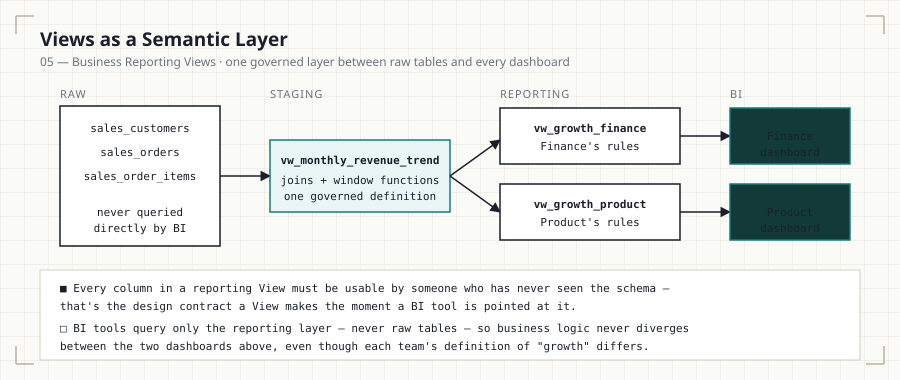
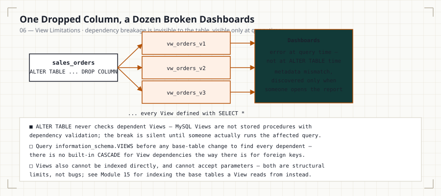
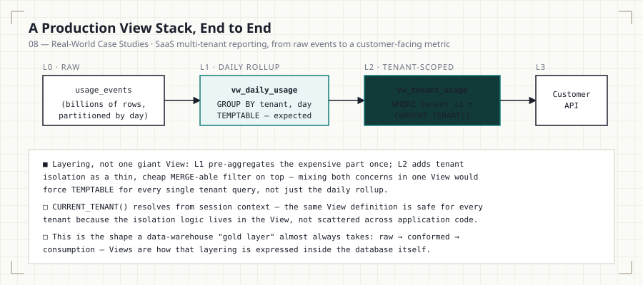

<p align="center">
  
</p>

<p align="center">
  
  
  
  
  
  
</p>

<p align="center"><i>Part of the <a href="../README.md">SQL Engineering Handbook</a></i></p>

> **Track:** SQL Engineering Handbook
> **Prerequisite Module:** [13 — Set Operators](../13_SET_OPERATORS/)
> **Next Module:** [15 — Indexes](../15_INDEXES/)
> **Difficulty:** Intermediate → Advanced
> **Estimated Completion Time:** 5–7 hours

---

## Why Views Matter

Every query you've written in Modules 1–13 has been disposable — you write it,
run it, throw it away. Real analytics engineering doesn't work that way.
Business logic gets reused across dashboards, reports, and downstream
pipelines, and if that logic lives only inside individual `.sql` files
scattered across a team's laptops, it drifts. Two analysts compute "active
customer" differently. A finance report and a sales report disagree on
revenue by $40,000 because one excludes refunds and the other doesn't, and
nobody can find where the discrepancy was introduced.

A **View** is SQL's answer to this problem: a named, reusable,
version-controllable definition of business logic that lives in the
database itself, not in someone's local script. This module is where the
Handbook shifts from "writing queries" to "designing the data layer other
people build on." That shift — thinking about *who consumes what you build,
and how it can break* — is the actual job of a Data Analyst or Analytics
Engineer beyond the interview stage.

Views are also, not coincidentally, one of the most common whiteboard and
take-home topics in Analytics Engineering interviews, because they test
whether a candidate understands abstraction, not just syntax.

<p align="center">
  
</p>

## Learning Objectives

By the end of this module you will be able to:

- Explain what a View is at the engine level (a stored query, not stored
  data) and why that distinction has real performance consequences
- Design Views as a logical abstraction layer over normalized schemas
- Differentiate updatable vs. non-updatable Views and know exactly which
  SQL constructs disqualify updatability
- Use Views for column- and row-level security (restricting access without
  duplicating data)
- Apply `WITH CHECK OPTION` to prevent silent data integrity violations
  through updatable Views
- Build nested Views and reason about dependency chains and their
  maintenance cost
- Diagnose View performance problems, including the "nested View"
  query-planner trap
- Compare Views conceptually to Materialized Views and understand where
  MySQL diverges from Postgres/Snowflake/BigQuery on this
- Recognize how Views map onto real BI/semantic-layer architecture (Looker,
  dbt, Power BI) used in production analytics teams
- Answer View-related interview questions with engineering depth, not
  textbook definitions

## Prerequisites

This module assumes fluency with everything through Module 13:

`SELECT` fundamentals · Aggregations · Joins (all types) · `CASE` ·
Subqueries · CTEs · Window Functions · Date Functions · String Functions ·
NULL handling (`COALESCE`, `IFNULL`, `NULLIF`) · Advanced Aggregations
(`ROLLUP`, `GROUPING SETS`) · `UNION` / `INTERSECT` / `EXCEPT`

If any of the above feels shaky, Views will be frustrating rather than
illuminating — a View is only ever as good as the query inside it. Go back
before continuing.

## Quick Start

This module runs against the shared practice schema defined in
[`00_Schema`](../00_Schema/):

```bash
mysql -u root -p your_database < ../00_Schema/01_CREATE_TABLES.sql
mysql -u root -p your_database < ../00_Schema/02_INSERT_DATA.sql
mysql -u root -p your_database < 01_INTRODUCTION_TO_VIEWS.sql
```

Views are one of the few SQL topics where reading the syntax teaches you
almost nothing — open each `.sql` file in a MySQL 8.0+ client and actually
run every statement. You have to watch a View break to understand why the
rule exists.

## What This Module Covers

| # | Chapter | Diagram | Lines | Size |
|---|---------|---------|------:|-----:|
| 01 | [Introduction to Views](01_INTRODUCTION_TO_VIEWS.md) · [`.sql`](01_INTRODUCTION_TO_VIEWS.sql) | [view-lifecycle.svg](assets/diagrams/view-lifecycle.svg) | 166 + 212 | 8.6 KB + 8.6 KB |
| 02 | [Creating Views](02_CREATING_VIEWS.md) · [`.sql`](02_CREATING_VIEWS.sql) | [view-create-replace.svg](assets/diagrams/view-create-replace.svg) | 124 + 102 | 5.8 KB + 3.7 KB |
| 03 | [Updatable Views](03_UPDATABLE_VIEWS.md) · [`.sql`](03_UPDATABLE_VIEWS.sql) | [view-updatability-check.svg](assets/diagrams/view-updatability-check.svg) | 128 + 98 | 6.9 KB + 4.1 KB |
| 04 | [View Security](04_VIEW_SECURITY.md) · [`.sql`](04_VIEW_SECURITY.sql) | [view-security-definer.svg](assets/diagrams/view-security-definer.svg) | 131 + 101 | 7.2 KB + 4.3 KB |
| 05 | [Business Reporting Views](05_BUSINESS_REPORTING_VIEWS.md) · [`.sql`](05_BUSINESS_REPORTING_VIEWS.sql) | [view-semantic-layer.svg](assets/diagrams/view-semantic-layer.svg) | 127 + 125 | 7.6 KB + 5.3 KB |
| 06 | [View Limitations](06_VIEW_LIMITATIONS.md) · [`.sql`](06_VIEW_LIMITATIONS.sql) | [view-dependency-breakage.svg](assets/diagrams/view-dependency-breakage.svg) | 134 + 116 | 7.4 KB + 4.9 KB |
| 07 | [View Performance](07_VIEW_PERFORMANCE.md) · [`.sql`](07_VIEW_PERFORMANCE.sql) | [view-merge-temptable.svg](assets/diagrams/view-merge-temptable.svg) | 120 + 105 | 7.6 KB + 5.2 KB |
| 08 | [Real-World Case Studies](08_REAL_WORLD_CASE_STUDIES.md) · [`.sql`](08_REAL_WORLD_CASE_STUDIES.sql) | [view-production-stack.svg](assets/diagrams/view-production-stack.svg) | 139 + 155 | 7.8 KB + 6.4 KB |
| 09 | [Interview Guide](09_INTERVIEW_GUIDE.md) | [view-interview-tiers.svg](assets/diagrams/view-interview-tiers.svg) | 96 | 6.1 KB |
| 10 | [Practice Problems](10_PRACTICE_PROBLEMS.md) | [view-practice-ladder.svg](assets/diagrams/view-practice-ladder.svg) | 46 | 3.4 KB |
| 11 | [Solutions](11_SOLUTIONS.sql) | — | 193 | 7.4 KB |

**Totals:** 10 `.md` files, 9 `.sql` files, 11 diagrams (10 topic diagrams +
1 banner) — 2,418 combined lines, ~118.2 KB of documentation and runnable
SQL.

## The Diagrams

Every diagram in this module is a standalone SVG in
[`assets/diagrams/`](assets/diagrams/), embedded directly in its
corresponding chapter — no external image hosting, so they render correctly
on GitHub, cloned locally, or on GitHub Pages.

<p align="center">
  
  
</p>
<p align="center">
  
  
</p>

## Folder Structure

```
14_VIEWS/
├── README.md                            → you are here
├── 01_INTRODUCTION_TO_VIEWS.md/.sql     → what a View is, engine-level mechanics
├── 02_CREATING_VIEWS.md/.sql            → CREATE/ALTER/DROP, syntax, options
├── 03_UPDATABLE_VIEWS.md/.sql           → updatability rules, WITH CHECK OPTION
├── 04_VIEW_SECURITY.md/.sql             → column/row security, SQL SECURITY clause
├── 05_BUSINESS_REPORTING_VIEWS.md/.sql  → semantic-layer style reporting Views
├── 06_VIEW_LIMITATIONS.md/.sql          → what Views can't do, common failure modes
├── 07_VIEW_PERFORMANCE.md/.sql          → EXPLAIN, view merging vs. temptable
├── 08_REAL_WORLD_CASE_STUDIES.md/.sql   → multi-View architecture + materialized view comparison
├── 09_INTERVIEW_GUIDE.md                → structured interview prep
├── 10_PRACTICE_PROBLEMS.md              → unsolved problems, by difficulty
├── 11_SOLUTIONS.sql                     → solutions to 10_PRACTICE_PROBLEMS.md
└── assets/
    ├── images/
    │   └── hero-banner.svg              → module banner
    └── diagrams/                        → one topic diagram per chapter (10 SVGs)
        ├── view-lifecycle.svg
        ├── view-create-replace.svg
        ├── view-updatability-check.svg
        ├── view-security-definer.svg
        ├── view-semantic-layer.svg
        ├── view-dependency-breakage.svg
        ├── view-merge-temptable.svg
        ├── view-production-stack.svg
        ├── view-interview-tiers.svg
        └── view-practice-ladder.svg
```

## Learning Flow

Work through the files in numeric order. Each `.md` file introduces the
concept; the paired `.sql` file is the lab — open it in a MySQL 8.0+ client
and actually run every statement.

```
01 → 02 → 03 → 04 → 05 → 06 → 07 → 08 → 09 → 10 → 11
Concept  Build  Rules  Secure  Apply  Limits  Tune  Architect  Interview  Practice  Verify
```

Do not skip `06_VIEW_LIMITATIONS.md`. It's the file most learners are
tempted to rush past, and it's the one that shows up as a trick question in
interviews.

## Engineering Mindset

Treat every View you write in this module as if a BI tool (Tableau, Looker,
Power BI) or a downstream analyst with no SQL background is going to query
it tomorrow. Ask, for every View:

- If the base table's schema changes, does this View silently return wrong
  data, or does it fail loudly?
- If someone runs `SELECT *` against this View in a dashboard, is the
  result something you'd be comfortable putting in front of a VP?
- Does this View's name describe *what business question it answers*, not
  just what tables it touches?

This is the difference between a View as a syntax exercise and a View as a
production artifact.

## Business Motivation

Views exist because three problems recur in every company with more than
one analyst:

1. **Duplication of logic.** "Active customer," "gross margin," "churned
   subscriber" all require multi-table joins and business rules. Without a
   View, that logic gets copy-pasted into dozens of ad hoc queries, and
   each copy silently diverges over time.
2. **Access control without data duplication.** HR needs payroll analysts
   to see salary bands, not individual salaries. Duplicating the table
   with masked columns is a maintenance nightmare; a View is not.
3. **Decoupling consumers from schema.** BI tools and downstream pipelines
   should query a stable interface, not raw tables that get refactored as
   the warehouse evolves.

## Architecture Overview

A View has no independent existence at the storage layer (with one
MySQL-specific exception you'll meet in `07_VIEW_PERFORMANCE.md`:
temptable algorithm materialization). Every time it's queried, MySQL
substitutes the View's stored `SELECT` into the outer query and optimizes
the whole thing together, or in some cases executes the View first into a
temporary table. Understanding *which* of these happens is the single
highest-leverage piece of View knowledge for a working analyst — see
Module 07.

## Production Applications

- **BI semantic layers** — Looker's LookML and dbt's `models/marts/` layer
  are conceptually Views (or View-like) sitting between raw warehouse
  tables and dashboards.
- **Row/column-level security** — restricting a `payroll_view` so regional
  managers only see their own region, without duplicating the
  `hr_salaries` table.
- **API/report stability** — a reporting team can rebuild `sales_orders`
  internals without breaking `vw_monthly_revenue`, as long as the View's
  output contract stays stable.
- **Legacy system abstraction** — Views sit in front of denormalized or
  legacy schemas so new tooling can query a clean interface.

<p align="center">
  
</p>

## Performance Considerations

MySQL Views can execute via two algorithms — `MERGE` or `TEMPTABLE` — and
the choice is made by the optimizer, not fully controllable by you, though
`ALGORITHM` can be hinted. `MERGE` folds the View into the outer query
(fast, uses base-table indexes normally). `TEMPTABLE` materializes the
View's result into a throwaway temp table first (can defeat indexing,
especially disastrous when a View containing `GROUP BY`, `DISTINCT`,
aggregate functions, or a subquery in the `SELECT` list gets nested inside
another View or joined at scale). This is covered in depth, with `EXPLAIN`
walkthroughs, in `07_VIEW_PERFORMANCE.md`.

## Common Mistakes

- Treating a View as a performance optimization. It isn't — it's an
  *abstraction*, and can be a performance liability if nested carelessly.
- Using `SELECT *` inside a View definition — any schema change to the
  base table silently changes the View's output columns.
- Assuming all Views are updatable. Most Views involving joins,
  aggregation, `DISTINCT`, `UNION`, or subqueries in the `SELECT` list are
  not.
- Nesting Views 3+ levels deep "because it works," without checking
  `EXPLAIN` for a `TEMPTABLE` cascade.
- Forgetting `WITH CHECK OPTION` on an updatable, filtered View — allowing
  inserts that immediately vanish from the View's own result set.

## Interview Preparation

`09_INTERVIEW_GUIDE.md` is structured as conceptual questions,
scenario/design questions, and a "spot the bug" set using real View
definitions. Analytics Engineering interviews test Views far more than
junior Data Analyst interviews do — if you're targeting AE roles, do not
skip this file.

## Practice Workflow

1. Read the `.md` file fully before touching SQL.
2. Run every statement in the paired `.sql` file against your own MySQL
   instance — don't just read it.
3. Attempt `10_PRACTICE_PROBLEMS.md` closed-book.
4. Check `11_SOLUTIONS.sql` only after attempting, and diff your approach
   against the alternative solutions provided.

## Module Checklist

- [ ] 01 — Can explain what a View is at the engine level, unprompted
- [ ] 02 — Can create, alter, and drop a View with correct syntax
- [ ] 03 — Can predict whether a given View is updatable without running it
- [ ] 04 — Can design a security View using `SQL SECURITY` correctly
- [ ] 05 — Can build a business-reporting View that would survive a BI tool
      pointing at it
- [ ] 06 — Can list View limitations from memory
- [ ] 07 — Can read `EXPLAIN` output and identify `MERGE` vs `TEMPTABLE`
- [ ] 08 — Can design a multi-View reporting architecture
- [ ] 09 — Can answer all interview guide questions without notes
- [ ] 10/11 — All practice problems solved and verified

## Related Modules

- [11 — NULL Handling & Data Cleaning](../11_NULL_HANDLING_AND_DATA_CLEANING/) —
  Views are a common place to centralize cleaning logic
- [15 — Indexes](../15_INDEXES/) — directly extends the performance
  discussion in `07_VIEW_PERFORMANCE.md`

## Further Reading

- MySQL 8.0 Reference Manual — [CREATE VIEW Syntax](https://dev.mysql.com/doc/refman/8.0/en/create-view.html)
- MySQL 8.0 Reference Manual — [View Processing Algorithms](https://dev.mysql.com/doc/refman/8.0/en/view-algorithms.html)
- dbt Documentation — [Views vs. Tables in the modeling layer](https://docs.getdbt.com/)

---

## Handbook Navigation

This module is one part of the full **SQL Engineering Handbook** — a
16-module, progressively-built curriculum sharing a single practice schema
([`00_Schema`](../00_Schema/)) end to end.

| # | Module | Contents | Status |
|---|--------|----------|:---:|
| — | [Resources](../Resources/) | Books, blogs, docs, certifications, communities, datasets | ✅ |
| 00 | [Schema](../00_Schema/) | Practice database DDL, seed data, and ERD used by every later module | ✅ |
| 01 | [Fundamentals](../01_Fundamentals/) | `SELECT`, `WHERE`, `ORDER BY`, `LIMIT`, aliasing | ✅ |
| 02 | [Aggregations](../02_Aggregations/) | `COUNT`, `SUM`, `AVG`, `MIN`/`MAX`, `GROUP BY`, `HAVING` | ✅ |
| 03 | [Joins](../03_Joins/) | Inner, left, right, full, cross, self joins + performance audit | ✅ |
| 04 | [Subqueries](../04_Subqueries/) | Scalar, correlated, `EXISTS`, derived tables, subquery-to-join rewrites | ✅ |
| 05 | [CASE WHEN](../05_CASE_WHEN/) | Conditional logic and business-rule encoding | ✅ |
| 06 | [CTEs](../06_CTEs/) | Common Table Expressions, staged pipelines, business classification | ✅ |
| 07 | [Window Functions](../07_Window_Functions/) | `ROW_NUMBER`, `RANK`, `LAG`/`LEAD`, `PARTITION BY` | ✅ |
| 08 | [Window Business Cases](../08_WINDOW_BUSINESS_CASES/) | HR, Sales, E-Commerce, Banking, and Finance window-function case studies | ✅ |
| 09 | [Date Functions](../09_Date_Functions/) | Date arithmetic, formatting, range queries | ✅ |
| 10 | [String Functions](../10_STRING_FUNCTIONS/) | String manipulation and data cleaning | ✅ |
| 11 | [NULL Handling & Data Cleaning](../11_NULL_HANDLING_AND_DATA_CLEANING/) | `COALESCE`, `NULLIF`, data-quality patterns | ✅ |
| 12 | [Advanced Aggregations](../12_ADVANCED_AGGREGATIONS/) | Conditional and multi-level aggregation | ✅ |
| 13 | [Set Operators](../13_SET_OPERATORS/) | `UNION`, `INTERSECT`, `EXCEPT`, reconciliation queries | ✅ |
| **14** | **Views (this module)** | **Definition, updatability, security, reporting, limitations, performance, architecture** | ✅ |
| 15 | [Indexes](../15_INDEXES/) | B-Tree, composite, covering indexes, reading `EXPLAIN` | ✅ |

---

<p align="center"><i>⬅ <a href="../13_SET_OPERATORS/">13 — Set Operators</a> &nbsp;·&nbsp; <a href="../README.md">Handbook Home</a> &nbsp;·&nbsp; <a href="../15_INDEXES/">15 — Indexes</a> ➡</i></p>
