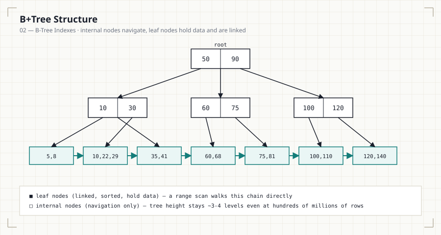

# 02 — B-Tree Indexes

## Introduction

The B-Tree (and its variant, the B+Tree) is the default index structure in
almost every relational database. This file explains why that structure
was chosen, how it's shaped, and how MySQL, PostgreSQL, SQL Server, and
Oracle each implement it slightly differently.

## Learning Objectives

- Explain why B-Trees are the default structure for general-purpose
  indexing (as opposed to hash tables)
- Distinguish a B-Tree from a B+Tree
- Describe how a B+Tree lookup, range scan, and insert work
- Identify which engines use B-Tree vs. B+Tree internally

## Business Motivation

A reporting dashboard filters orders by a date range:

```sql
SELECT * FROM orders
WHERE order_date BETWEEN '2026-01-01' AND '2026-01-31';
```

A hash index could resolve `order_date = X` in O(1), but it cannot answer
a **range** query at all — hash structures have no concept of "next
value." B+Trees preserve sorted order, so a range scan is a single
sequential walk once the starting point is found. This is why B+Trees,
not hash tables, are the default index structure in production databases.

## Why This Exists

Databases need a structure that supports equality lookups, range scans,
and ordered traversal, all while staying balanced as data grows and
minimizing disk I/O (each tree level read is typically one disk page
read). B-Trees satisfy all three; B+Trees improve on them for range scans
specifically by chaining leaf nodes together.

## Production Use Cases

- Date-range reporting (`BETWEEN`, `>`, `<` on timestamps)
- Alphabetical customer/product search (`LIKE 'Sm%'` prefix search)
- Pagination (`ORDER BY id LIMIT 50 OFFSET 100`)
- Any primary key lookup

## Architecture Discussion

**B-Tree**: a balanced tree where every node holds both keys and data
(or data pointers), and internal nodes participate in the search.

**B+Tree**: only leaf nodes hold data; internal nodes hold keys used
purely for navigation. Crucially, leaf nodes are linked together in a
sorted linked list, so once you reach the first matching leaf, a range
scan is a straight walk forward — no need to revisit internal nodes.

Nearly every production RDBMS index (MySQL InnoDB, PostgreSQL default
`btree` access method, SQL Server clustered/non-clustered indexes, Oracle
default indexes) is a B+Tree despite frequently being called "B-Tree" in
documentation and tooling.

## Syntax

```sql
-- MySQL: BTREE is the default and typically doesn't need to be stated
CREATE INDEX idx_orders_order_date
    ON orders (order_date)
    USING BTREE;

-- PostgreSQL: btree is also the default access method
CREATE INDEX idx_orders_order_date
    ON orders USING btree (order_date);
```

## Syntax Breakdown

- `USING BTREE` is explicit but redundant in MySQL for InnoDB tables —
  InnoDB only supports BTREE and (separately) full-text/spatial indexes;
  the clause matters more when working with the MEMORY engine, which also
  supports HASH.
- PostgreSQL's `USING btree` follows the same logic — stating it is
  optional but self-documenting.

## Visual Explanation



```
                    [ 50 | 90 ]                 <- root (internal node)
                   /     |     \
          [10|30]     [60|75]    [100|120]      <- internal nodes
          /  |  \      /  |  \      /  |  \
       leaf leaf leaf ...                        <- leaf nodes (linked →)

Leaf nodes: [5,8]→[10,22,29]→[35,41]→[60,68]→[75,81]→[100,110]→...
             ─────────────────────────────────────────────────►
             sorted, linked — a range scan walks this chain directly
```

## ASCII Diagram

```
Point lookup (order_date = '2026-01-15'):
  root → internal node → leaf node → found, stop.
  O(log n) disk reads (tree height, typically 3-4 levels
  even at hundreds of millions of rows)

Range scan (order_date BETWEEN '2026-01-01' AND '2026-01-31'):
  root → internal node → first matching leaf
       → follow leaf-to-leaf links until out of range
  O(log n) to find start + O(k) to walk k matching rows
```

## Execution Flow

1. Start at the root node.
2. Compare the search key against the node's keys to choose a child
   pointer.
3. Descend one level; repeat until a leaf node is reached.
4. For equality: return the match at the leaf.
5. For a range: return the current leaf's matches, then follow the
   leaf-link pointer to the next leaf and repeat until out of range.

## Engineering Notes

Tree height stays small even at huge scale because each node holds many
keys (determined by page size — typically hundreds of keys per 16KB
InnoDB page), so a B+Tree over 100 million rows is usually only 3-4 levels
deep. This is why index lookups stay fast as tables grow — the cost grows
logarithmically, not linearly.

## Performance Notes

- Insertions and deletions may trigger node splits or merges to keep the
  tree balanced — this is part of the write overhead discussed in
  File 06.
- Sequential inserts on an auto-incrementing key are cheap (append to the
  rightmost leaf); random-order inserts on a UUID primary key cause
  scattered page writes and more frequent splits — a known operational
  pain point when choosing UUID vs. auto-increment primary keys.

## Storage Considerations

Every level of the tree is stored on disk as pages. A wider tree (more
keys per node) means fewer levels and fewer disk reads per lookup — this
is why database page sizes (commonly 8-16KB) are tuned for this trade-off
rather than left arbitrary.

## Optimizer Notes

The optimizer estimates cost partly from expected tree height and page
reads. A range query's estimated cost accounts for both the descent to
the starting leaf and the estimated number of leaf pages that must be
walked — this is where selectivity estimates (File 07) directly affect
whether the optimizer prefers this index or a full scan.

## ANSI SQL Notes

As with all indexing behavior, B-Tree structure is implementation detail,
not part of the ANSI standard — the standard only guarantees result
correctness, not the retrieval mechanism.

## MySQL Notes

- InnoDB's primary key index is a **clustered** B+Tree — leaf nodes store
  the full row, not just a pointer to it (see File 04).
- Secondary indexes in InnoDB store the primary key value at the leaf,
  requiring a second lookup into the clustered index to fetch full rows
  (unless the secondary index is covering — File 05).

## PostgreSQL Notes

- PostgreSQL's default `btree` access method is a B+Tree variant; leaf
  entries store a TID pointing to the row's physical heap location.
- PostgreSQL tables are not clustered by default, so even a primary key
  lookup involves an index-to-heap fetch unless `CLUSTER` has been run
  (a one-time physical reorder, not an ongoing guarantee).

## SQL Server Notes

- A clustered index's leaf level **is** the data (same model as InnoDB);
  a table can have at most one clustered index.
- Non-clustered indexes store the clustering key (or a row ID if the
  table is a heap) at the leaf.

## Oracle Notes

- Oracle's default B-Tree index leaf nodes store a ROWID pointing to the
  physical block/row location, unless the table is an Index-Organized
  Table (IOT).

## Edge Cases

- Extremely low-cardinality columns still perform poorly with a B-Tree
  even though the structure itself is efficient — the bottleneck is
  selectivity, not tree shape (see File 07).
- Very large keys (e.g., indexing a long VARCHAR without a prefix limit)
  reduce how many keys fit per page, increasing tree height and page
  reads.

## Best Practices

- Prefer narrow, sequential key types (integers, well-chosen composite
  keys) for primary keys to minimize page splits.
- Index columns used in range queries and `ORDER BY`, not just equality
  filters — B+Trees are what make both fast.

## Anti-patterns

- Using random UUIDs as a clustered/primary key on a high-write table
  without understanding the page-split cost.
- Indexing a large free-text VARCHAR column directly instead of using a
  prefix index or full-text index.

## Common Mistakes

- Assuming all indexes are hash-based and therefore can't help with range
  queries — B+Trees are the default precisely because they can.
- Confusing "B-Tree" and "B+Tree" — nearly every production index you'll
  encounter is technically the latter.

## Interview Questions

1. Why do relational databases default to B+Trees instead of hash indexes
   for general-purpose indexing?
2. What is the practical difference between a B-Tree and a B+Tree?
3. Why does a sequential auto-increment primary key tend to perform
   better on writes than a random UUID primary key?
4. Explain why tree height stays roughly constant (3-4 levels) even as a
   table grows into the hundreds of millions of rows.

## Summary

B+Trees are the default index structure because they support equality
lookups, range scans, and ordered traversal efficiently, while staying
balanced and shallow (O(log n)) as data grows. Their linked leaf nodes are
what make range scans fast — a property hash indexes fundamentally can't
offer.

## Practice

See [12_PRACTICE_PROBLEMS.md](12_PRACTICE_PROBLEMS.md), Intermediate
section, Problems 1–3.

## Further Reading

See [resources/documentation.md](resources/documentation.md).
