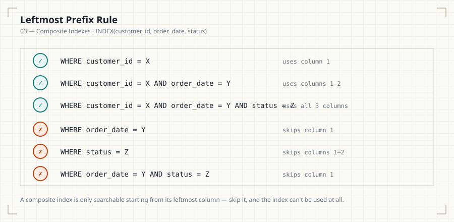

# 03 — Composite Indexes

## Introduction

Most production queries filter on more than one column. A composite
(multi-column) index can serve several of these queries at once — but
only if its column order matches how the query filters. This file covers
that ordering rule in depth, since getting it wrong is one of the most
common indexing mistakes in production systems.

## Learning Objectives

- Build a composite index and explain what its physical sort order is
- State and apply the leftmost prefix rule
- Predict, for a given composite index, which query shapes can and
  cannot use it
- Choose column order deliberately based on query patterns

## Business Motivation

A support dashboard queries orders by customer, then by date, then by
status:

```sql
SELECT * FROM orders
WHERE customer_id = 88291
  AND order_date > '2026-01-01'
  AND status = 'completed';
```

Three single-column indexes exist as an option, but MySQL can typically
use only one index per table per query block efficiently (barring index
merge, which has its own overhead). A single composite index ordered
`(customer_id, order_date, status)` can serve this exact filter pattern in
one seek — this is the entire motivation for composite indexes.

## Why This Exists

A composite index is sorted first by its first column, then by its second
column *within* each value of the first, and so on. This nested sort
order means the index can only be searched efficiently starting from its
leftmost column — you cannot binary-search a structure sorted by
`(customer_id, order_date)` using only `order_date`, for the same reason
you can't look up a phone book by first name when it's sorted by last
name.

## Production Use Cases

- Multi-tenant SaaS: `(tenant_id, created_at)` — nearly every query in a
  multi-tenant system filters by tenant first.
- Order search: `(customer_id, order_date, status)`.
- Audit logs: `(user_id, event_type, timestamp)`.

## Architecture Discussion

```
INDEX (customer_id, order_date, status)

Sorted as:
  customer_id=4471,  order_date=2026-01-02, status='completed'
  customer_id=4471,  order_date=2026-01-05, status='pending'
  customer_id=4471,  order_date=2026-01-09, status='completed'
  customer_id=88291, order_date=2026-01-01, status='completed'
  customer_id=88291, order_date=2026-01-03, status='cancelled'
  customer_id=91002, order_date=2026-01-01, status='pending'
```

Notice: within `customer_id`, rows are sorted by `order_date`; within
each `(customer_id, order_date)` pair, by `status`. This is why the
index is only directly searchable starting from `customer_id`.

## Syntax

```sql
CREATE INDEX idx_orders_customer_date_status
    ON orders (customer_id, order_date, status);
```

## Syntax Breakdown

- Column order in `CREATE INDEX` is not stylistic — it *is* the physical
  sort order and directly determines which query shapes benefit.
- There is no syntax to declare "any order" — the order you write is the
  order the index is built in.

## Visual Explanation — The Leftmost Prefix Rule



```
INDEX(customer_id, order_date, status)

✓ WHERE customer_id = X                                   -- uses col 1
✓ WHERE customer_id = X AND order_date = Y                -- uses cols 1-2
✓ WHERE customer_id = X AND order_date = Y AND status = Z -- uses all 3
✗ WHERE order_date = Y                                    -- skips col 1
✗ WHERE status = Z                                        -- skips cols 1-2
✗ WHERE order_date = Y AND status = Z                     -- skips col 1
```

## ASCII Diagram

```
                    customer_id (sorted)
                    /        |        \
              4471        88291       91002
              /  \          |  \
        order_date      order_date  ...
        (sorted within  (sorted within
         customer_id     customer_id
         =4471)           =88291)
```

Each level of sort only exists **within** the level above it — you must
enter the tree from the top (leftmost column) to benefit from any of it.

## Execution Flow

1. Optimizer inspects the `WHERE` clause for a contiguous prefix of the
   composite index's column list, starting from column 1.
2. It seeks to the matching prefix range in the index.
3. Any trailing columns of the index that also appear as equality filters
   in the query are used to narrow the seek further within that range.
4. Any query column not covered by the prefix falls back to a filter
   applied after retrieval (or the index isn't used at all for that
   predicate).

## Engineering Notes

Equality columns should generally precede range columns in a composite
index. `(customer_id, status, order_date)` for a query filtering
`customer_id = X AND status = 'completed' AND order_date > Y` lets the
index narrow by two equalities before applying the range — placing
`order_date` earlier would end the useful sort narrowing at the first
range predicate, since everything after a range column in the index
can't be used for further seeking within that same lookup.

## Performance Notes

- A composite index that matches a query's full filter prefix performs
  identically to a purpose-built single-column index would for a simpler
  query — the "extra" columns cost nothing when unused, but they must be
  present and correctly ordered to help.
- Over-wide composite indexes (5+ columns) increase storage and write
  cost for diminishing returns — most production composite indexes are
  2-4 columns.

## Storage Considerations

A composite index stores all indexed columns' values at every leaf entry,
not just the first — a 3-column composite index on large VARCHAR columns
can be significantly larger than a single-column index on the same table.

## Optimizer Notes

MySQL 8.0+ can sometimes use **index merge** to combine two separate
single-column indexes for a query, but this is generally more expensive
than a single well-ordered composite index and should be treated as a
fallback the optimizer reaches for, not a design strategy to rely on.

## ANSI SQL Notes

As with all index structures, composite index behavior is
implementation-specific; the standard has no concept of "leftmost
prefix" since it doesn't define physical access paths at all.

## MySQL Notes

- MySQL has no index skip scan capability — unlike Oracle and
  PostgreSQL (below), the leftmost prefix rule is not a heuristic
  MySQL can work around; a predicate that omits the leading column
  of a composite index cannot use that index at all, full stop. Design
  composite indexes around this constraint rather than expecting the
  optimizer to compensate for it.

## PostgreSQL Notes

- PostgreSQL follows the same leftmost prefix logic for standard `btree`
  composite indexes.

## SQL Server Notes

- SQL Server refers to non-leading composite index columns as
  "included" only when explicitly using `INCLUDE` (File 05) — a plain
  composite index follows the same leftmost rule as MySQL/PostgreSQL.

## Oracle Notes

- Oracle's composite B-Tree indexes follow the identical leftmost prefix
  principle; Oracle additionally offers **index skip scan** as a distinct,
  more mature optimizer feature for some non-leading-column queries.

## Edge Cases

- A query filtering only on the second and third columns of a composite
  index (skipping the first) generally cannot use that index at all,
  regardless of how selective those columns are.
- `ORDER BY` can sometimes be satisfied by a composite index's trailing
  columns even without a filter on them, but only if the leading columns
  are constrained by equality predicates first.

## Best Practices

- Order composite index columns as: equality filters first, then a
  single range filter, then columns needed only for `ORDER BY` or
  covering (File 05).
- Design composite indexes around actual query patterns, not table
  schema order.

## Anti-patterns

- Creating a composite index in column-alphabetical or table-definition
  order instead of query-access order.
- Assuming a composite index helps every query that references any of
  its columns.

## Common Mistakes

- Placing a range-filtered column before an equality-filtered column.
- Not realizing that `WHERE status = Z` alone gets zero benefit from
  `INDEX(customer_id, order_date, status)`.

## Interview Questions

1. Given `INDEX(a, b, c)`, which of these queries can use the index, and
   how much of it: `WHERE a = 1`, `WHERE b = 2`, `WHERE a = 1 AND c = 3`,
   `WHERE a = 1 AND b = 2 AND c = 3`?
2. Why should equality-filtered columns generally precede range-filtered
   columns in a composite index?
3. You have three single-column indexes and query performance is still
   poor on a query filtering all three columns together. What would you
   investigate?

## Summary

A composite index is one physical structure, sorted by its columns in
declared order, nested left to right. The leftmost prefix rule follows
directly from that physical sort: the index is only searchable starting
from its first column, and a well-designed composite index should mirror
actual query filter patterns — equality columns first, then at most one
range column, then any trailing columns needed for ordering or covering.

## Practice

See [12_PRACTICE_PROBLEMS.md](12_PRACTICE_PROBLEMS.md), Intermediate
section, Problems 4–7.

## Further Reading

See [resources/documentation.md](resources/documentation.md).
