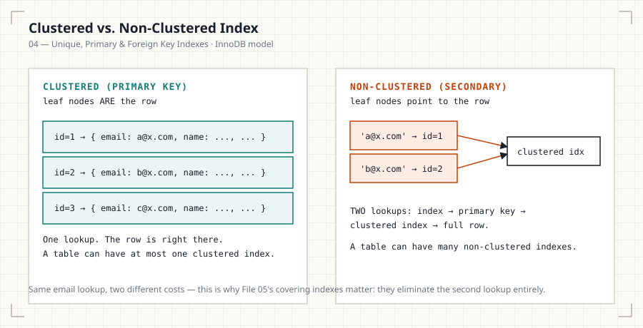

# 04 — Unique, Primary & Foreign Key Indexes

## Introduction

Primary keys, unique constraints, and foreign keys are enforced using
indexes under the hood — they aren't just logical constraints, they're
physical structures with real performance implications. This file covers
what each one actually builds, and where their behavior diverges from a
plain secondary index.

## Learning Objectives

- Explain how a primary key constraint is implemented as an index
- Explain how a unique constraint differs from a unique index
- Explain why foreign keys generally require a supporting index
- Predict the indexing consequences of adding or removing each constraint

## Business Motivation

A `customers` table with no index on `email` allows two customers to
register with the same email — a data integrity bug that surfaces as
duplicate accounts, split order histories, and support tickets. A unique
index on `email` prevents the bug at the database layer, not just in
application code (which can be bypassed by a second write path, a script,
or a race condition).

## Why This Exists

Constraints need enforcement mechanisms. A primary key constraint
requires the database to check every insert against every existing value
for uniqueness (and reject NULLs) — the only structure that makes that
check fast is an index. The same logic applies to unique constraints.
Foreign keys require checking that a referenced value exists in the
parent table on every insert/update — again, expensive without an index.

## Production Use Cases

- Primary key: `order_id` — the canonical row identifier.
- Unique index: `customers.email`, `users.username` — enforce one row per
  real-world entity.
- Foreign key: `orders.customer_id → customers.id` — enforce referential
  integrity and speed up join queries.

## Architecture Discussion

- **Primary key** — In MySQL InnoDB, the primary key *is* the clustered
  index: the table's rows are physically stored in primary key order,
  and every secondary index stores the primary key value as its pointer
  back to the row.
- **Unique index** — A standard B+Tree index with a uniqueness check
  applied on every write. A unique **constraint** and a unique **index**
  are effectively the same implementation in MySQL/PostgreSQL — the
  constraint is enforced by the index.
- **Foreign key** — A logical constraint checked against the parent
  table's primary/unique key. MySQL InnoDB requires an index on the
  foreign key column automatically if one doesn't already exist,
  precisely because the constraint check would otherwise be a full
  table scan on every write.

## Production Use Cases (continued)

- Composite unique constraints: `UNIQUE(tenant_id, email)` — one email
  per tenant, not globally unique.

## Syntax

```sql
-- Primary key (also creates the clustered index in InnoDB)
CREATE TABLE customers (
    id    BIGINT UNSIGNED PRIMARY KEY AUTO_INCREMENT,
    email VARCHAR(255) NOT NULL,
    UNIQUE KEY uq_customers_email (email)
);

-- Foreign key — MySQL auto-creates a supporting index if absent
ALTER TABLE orders
    ADD CONSTRAINT fk_orders_customer
    FOREIGN KEY (customer_id) REFERENCES customers (id);
```

## Syntax Breakdown

- `PRIMARY KEY` on `id` both enforces uniqueness/non-null and determines
  physical row storage order in InnoDB.
- `UNIQUE KEY uq_customers_email (email)` creates a secondary unique
  index — distinct from the clustered primary key index.
- The `FOREIGN KEY` clause enforces referential integrity; MySQL will
  silently create `customer_id` an index if no compatible one exists,
  since InnoDB requires it for the constraint check.

## Visual Explanation



```
customers (InnoDB clustered on id):
  id=1 → { email: 'a@x.com', ... }   (full row stored at leaf)
  id=2 → { email: 'b@x.com', ... }

uq_customers_email (secondary unique index):
  'a@x.com' → id=1
  'b@x.com' → id=2
  (lookup by email → get id → second lookup into clustered index)
```

## ASCII Diagram

```
        Write: INSERT INTO orders (customer_id, ...) VALUES (999, ...)
                              │
                 ┌────────────┴────────────┐
                 │ FK constraint check:      │
                 │ does customers.id = 999   │
                 │ exist?                    │
                 └────────────┬────────────┘
                    Indexed lookup on customers.id
                    (fast — O(log n), not O(n))
```

## Execution Flow

1. On `INSERT`/`UPDATE` of a unique-constrained column, the engine seeks
   the existing index for the new value before committing — a match
   raises a duplicate-key error.
2. On `INSERT`/`UPDATE` of a foreign-key column, the engine seeks the
   parent table's primary/unique index for the referenced value — a miss
   raises a constraint violation.
3. Both checks are index seeks, not scans, provided the required index
   exists.

## Engineering Notes

A foreign key without a supporting index on the *child* table's column
(the referencing column, not the referenced one) still enforces
correctness but does so by scanning — MySQL InnoDB prevents this
specific case by auto-creating an index, but not every engine or every
constraint type does this automatically. Always verify.

## Performance Notes

- Uniqueness checks add write overhead: every insert must seek the index
  before it can proceed, not just append.
- Missing an index to support a foreign key check is one of the most
  common causes of slow bulk inserts/deletes in production — deleting a
  parent row can trigger a full scan of the child table to verify no
  orphaned references remain, unless that child column is indexed.

## Storage Considerations

In InnoDB, the clustered primary key index *is* the table — there's no
additional storage cost beyond the table itself. Every secondary index
(including unique ones) is additional storage, sized by however many
columns it covers.

## Optimizer Notes

Foreign key columns are frequently join columns — the same index that
supports the constraint check also accelerates
`JOIN customers ON orders.customer_id = customers.id`, which is why
"index your foreign keys" is close to a universal rule, not just a
constraint-performance detail.

## ANSI SQL Notes

`PRIMARY KEY`, `UNIQUE`, and `FOREIGN KEY` are all ANSI SQL standard
constraint declarations — the standard mandates their logical behavior
but not how they're implemented internally.

## MySQL Notes

- InnoDB requires `PRIMARY KEY` to exist for optimal storage; a table
  without an explicit primary key gets an invisible auto-generated
  clustering key, which loses the benefit of clustering on a
  business-relevant column.
- InnoDB auto-creates an index on a foreign key column if none exists.

## PostgreSQL Notes

- PostgreSQL does **not** auto-create an index on a foreign key's
  referencing column — this is a common production gap; you must add it
  explicitly.

## SQL Server Notes

- A `PRIMARY KEY` in SQL Server defaults to creating a **clustered**
  index unless `NONCLUSTERED` is explicitly specified.

## Oracle Notes

- Oracle also does not auto-index foreign key columns — explicit
  indexing is required and is a standard part of Oracle schema review
  checklists.

## Edge Cases

- Composite unique constraints allow duplicate values in each individual
  column as long as the combination is unique.
- NULLs are treated as distinct from each other by unique indexes in
  MySQL/PostgreSQL — multiple NULLs are allowed in a UNIQUE column,
  which surprises engineers coming from a purely mathematical notion of
  uniqueness.

## Best Practices

- Always index foreign key columns explicitly — don't rely on
  engine-specific auto-creation behavior.
- Choose primary keys that align with your dominant access pattern in
  InnoDB, since the primary key determines physical row order.

## Anti-patterns

- Foreign keys with no supporting index on PostgreSQL/Oracle/SQL Server.
- Using a large, randomly-ordered column (e.g., a UUID) as an InnoDB
  primary key without accounting for the page-split cost from File 02.

## Common Mistakes

- Assuming all databases auto-index foreign keys the way MySQL InnoDB
  does.
- Forgetting that a `UNIQUE` constraint allows multiple NULLs.

## Interview Questions

1. In InnoDB, what physically *is* the primary key index?
2. Why does a foreign key without a supporting index cause slow deletes
   on the parent table?
3. Does PostgreSQL auto-create an index for a foreign key's referencing
   column? What are the operational implications if you forget?
4. Can a `UNIQUE` column contain more than one NULL value? Why?

## Summary

Primary keys, unique constraints, and foreign keys are all enforced via
indexes, not free-standing logical rules. In InnoDB, the primary key
defines physical row storage; unique constraints are index-backed
uniqueness checks; foreign keys require an index on the referencing
column to avoid full scans on every write and delete — a requirement
MySQL enforces automatically but PostgreSQL, SQL Server, and Oracle do
not.

## Practice

See [12_PRACTICE_PROBLEMS.md](12_PRACTICE_PROBLEMS.md), Intermediate
section, Problems 8–9.

## Further Reading

See [resources/documentation.md](resources/documentation.md).
