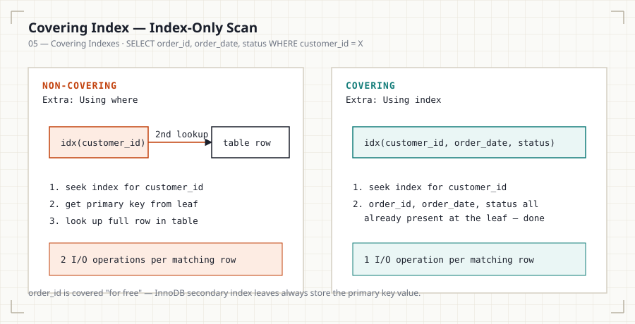

# 05 — Covering Indexes

## Introduction

A covering index doesn't just help the database *find* rows — it can let
the database avoid touching the table at all. This file explains
index-only scans, why they're dramatically faster, and how to design a
composite index that covers a specific query.

## Learning Objectives

- Define a covering index and an index-only scan
- Read `EXPLAIN` output to confirm whether a query is index-only
- Design a composite index that covers a specific SELECT list
- Explain the trade-off covering indexes make (storage vs. read speed)

## Business Motivation

A dashboard runs this exact query thousands of times per hour:

```sql
SELECT order_id, order_date, status
FROM orders
WHERE customer_id = 88291;
```

An index on `customer_id` alone still requires a second lookup into the
table (or clustered index) to fetch `order_date` and `status` for every
matching row. If the index instead includes all three columns, the
database can answer the entire query from the index alone — no table
access required. At high query volume, this is the difference between
acceptable and unacceptable dashboard latency.

## Why This Exists

Secondary indexes normally store just enough to locate the full row (a
primary key value in InnoDB, a TID in PostgreSQL). If every column the
query needs is already present in the index itself, that second lookup
is unnecessary — this is what "covering" means, and the resulting plan
is called an **index-only scan**.

## Production Use Cases

- High-frequency dashboard queries with a small, fixed SELECT list.
- API endpoints returning a lean DTO rather than `SELECT *`.
- Aggregate queries (`COUNT`, `SUM`) that only need indexed columns.

## Architecture Discussion

```
INDEX (customer_id, order_date, status)   <- from File 03

SELECT order_id, order_date, status FROM orders WHERE customer_id = X;
```

Wait — `order_id` isn't in the index definition above as a value column,
but in InnoDB it IS present implicitly: every secondary index leaf
entry includes the primary key value (needed to locate the full row if
required). So this composite index already covers `order_id`,
`order_date`, and `status` — it satisfies the whole query from the index
alone.

## Syntax

```sql
-- MySQL: composite index that happens to cover the query
CREATE INDEX idx_orders_customer_date_status
    ON orders (customer_id, order_date, status);

-- SQL Server: explicit INCLUDE for non-key covering columns
CREATE INDEX idx_orders_customer
    ON orders (customer_id)
    INCLUDE (order_date, status);

-- PostgreSQL: equivalent explicit INCLUDE (v11+)
CREATE INDEX idx_orders_customer
    ON orders (customer_id)
    INCLUDE (order_date, status);
```

## Syntax Breakdown

- MySQL has no `INCLUDE` clause — you achieve covering purely through
  composite column order, which is why File 03's leftmost prefix design
  and File 05's covering design are really the same underlying tool used
  for two purposes.
- SQL Server/PostgreSQL's `INCLUDE` adds columns to the leaf level
  **without** making them part of the searchable key — useful when you
  want covering without affecting sort order or leftmost-prefix
  behavior.

## Visual Explanation



```
Non-covering index lookup:
  index seek → get primary key → SECOND lookup into table/clustered
  index to fetch remaining columns              (2 I/O operations)

Covering index lookup:
  index seek → all needed columns already at the leaf → done
                                                  (1 I/O operation)
```

## ASCII Diagram

```
EXPLAIN output, Extra column:

  "Using where"                → normal filter, may still hit table
  "Using index"                → COVERING — index-only scan, no
                                   table access required
  "Using index condition"      → index condition pushdown, still
                                   touches table for final columns
```

## Execution Flow

1. Optimizer checks whether every column referenced in the SELECT list,
   WHERE clause, and any JOIN/ORDER BY is present in a single candidate
   index.
2. If yes, and that index also serves the WHERE clause efficiently, the
   optimizer marks the plan as index-only and skips the base table
   entirely.
3. If any referenced column is missing from the index, the engine falls
   back to a normal index-then-table-lookup plan.

## Engineering Notes

`SELECT *` defeats covering indexes almost by definition — the wider the
SELECT list, the less likely any reasonably-sized index covers it. This
is one of the concrete performance reasons (beyond general hygiene) to
select only the columns you actually need.

## Performance Notes

- Index-only scans avoid random I/O into the table entirely, which is
  often the single biggest win available for a hot, narrow, high-volume
  query.
- The gain is largest when the table doesn't fit comfortably in buffer
  pool/cache — under full cache, the difference shrinks but doesn't
  disappear (fewer cache lookups is still cheaper).

## Storage Considerations

Covering indexes are wider than the minimal index needed just for
filtering, so they cost more disk space and more write overhead per
insert/update — this is the direct trade-off against read speed, and
should be a deliberate choice for specific hot queries, not a blanket
strategy.

## Optimizer Notes

MySQL's `EXPLAIN` shows `Using index` in the `Extra` column specifically
to signal an index-only scan — this is the exact string to check for
when validating that a covering index design is actually working as
intended.

## ANSI SQL Notes

Covering indexes are purely a physical optimization; there is no
standard SQL concept for them — the standard only defines what a query
returns, and covering never changes that, only how cheaply it's
produced.

## MySQL Notes

- No `INCLUDE` syntax — achieve covering via composite column ordering.
- Confirm with `EXPLAIN ... \G` and check `Extra: Using index`.

## PostgreSQL Notes

- `INCLUDE` (v11+) lets you add covering columns without affecting the
  key's sort/search behavior — useful when the covering columns
  shouldn't influence leftmost-prefix matching.
- Confirm with `EXPLAIN` and look for `Index Only Scan`.

## SQL Server Notes

- `INCLUDE` is the idiomatic way to build a covering index; SQL Server's
  execution plan explicitly labels the operator as an **Index Seek**
  with no corresponding **Key Lookup** when covering succeeds.

## Oracle Notes

- Oracle covering behavior is achieved through composite index design,
  similar to MySQL; look for `INDEX (FAST FULL SCAN)` or the absence of
  a `TABLE ACCESS BY INDEX ROWID` step in the execution plan.

## Edge Cases

- Adding one extra column to a SELECT list that isn't in the covering
  index silently drops the index-only optimization — always re-check
  `EXPLAIN` after query changes, not just after index changes.
- Very wide covering indexes can occasionally be *slower* to scan than a
  narrower index plus a table lookup, if the covering index itself no
  longer fits efficiently in cache.

## Best Practices

- Design covering indexes around specific, known-hot query shapes — not
  speculatively.
- Re-verify covering behavior with `EXPLAIN` whenever the query's SELECT
  list changes.

## Anti-patterns

- Adding covering columns to every index "for safety," inflating storage
  and write cost with no measured benefit.
- Using `SELECT *` on a table with a carefully designed covering index,
  which defeats the design.

## Common Mistakes

- Assuming any index containing the WHERE columns is automatically
  covering — covering requires *every* referenced column, including the
  SELECT list, to be present.
- Not checking `Extra: Using index` and assuming a plan is index-only
  because an index was used at all.

## Interview Questions

1. What is the difference between an index being *used* and a query
   being *covered*?
2. Why does `SELECT *` tend to prevent covering-index optimization?
3. How would you confirm, using `EXPLAIN`, whether a query is actually
   achieving an index-only scan in MySQL? In PostgreSQL?
4. What's the storage trade-off of designing a covering index?

## Summary

A covering index contains every column a query needs, letting the engine
answer the query from the index alone — an index-only scan — without
touching the underlying table. This is one of the most impactful
optimizations available for narrow, high-frequency queries, at the cost
of additional index storage and write overhead. `EXPLAIN`'s `Using
index` (MySQL) or `Index Only Scan` (PostgreSQL) confirms whether it's
actually happening.

## Practice

See [12_PRACTICE_PROBLEMS.md](12_PRACTICE_PROBLEMS.md), Advanced
section, Problems 1–2.

## Further Reading

See [resources/documentation.md](resources/documentation.md).
