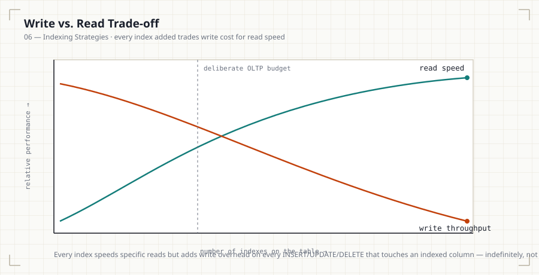
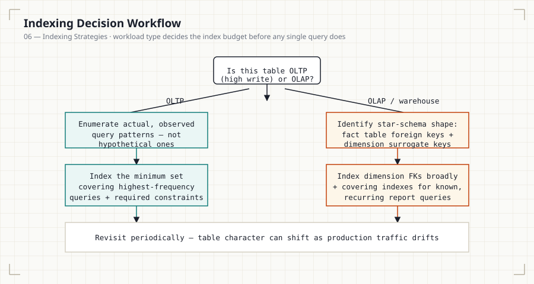
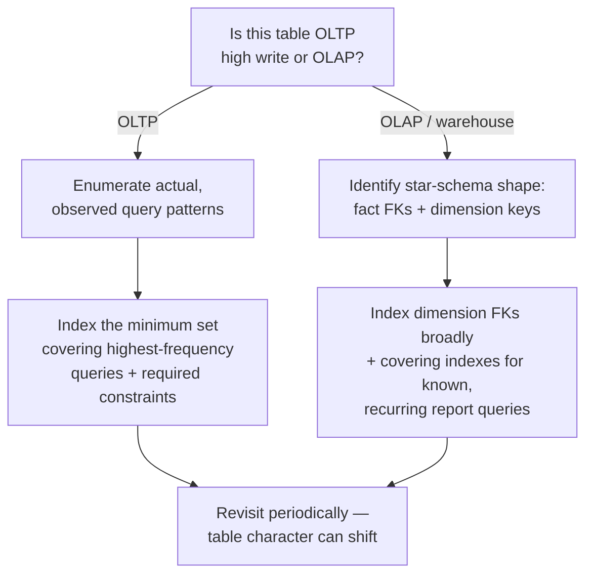

# 06 — Indexing Strategies

## Introduction

Every prior file covered a specific index type. This file covers
**strategy**: how many indexes a table should have, how that answer
changes between transactional and analytical systems, and when adding an
index is the wrong move.

## Learning Objectives

- Explain the read/write trade-off every index makes
- Contrast indexing strategy for OLTP vs. OLAP/warehouse workloads
- Apply indexing principles to star schema fact and dimension tables
- Identify when NOT to add an index

## Business Motivation

An OLTP order-processing table (thousands of writes per minute) and an
OLAP nightly-batch reporting table (millions of rows, read-only during
business hours) have opposite indexing priorities. Applying the same
"index everything queried" rule to both is a common, costly mistake —
the OLTP table's write throughput can collapse under index maintenance
overhead, while the OLAP table can safely carry far more indexes since
writes are rare and batched.

## Why This Exists

Every index added to a table is additional work on every `INSERT`,
`UPDATE`, and `DELETE` that touches an indexed column. The question isn't
"would this index help some query" — nearly any index helps some query —
it's "does this query's importance justify the write cost this index
adds, forever, on this specific table."

## Production Use Cases

- OLTP: `orders`, `payments`, `sessions` — high write frequency, indexes
  kept minimal and purpose-built.
- OLAP/warehouse: `fact_sales`, `dim_customer` — write-light (batch
  loaded), read-heavy, indexes and even redundant covering indexes are
  comparatively cheap to maintain.

## Architecture Discussion — When Indexes Help

- High-selectivity `WHERE`/`JOIN` columns on large tables.
- Columns driving frequent `ORDER BY`/`LIMIT` pagination.
- Foreign key columns (File 04).

## Architecture Discussion — When Indexes Hurt

- **Write amplification**: every indexed column adds an index-page write
  to every insert/update/delete — five indexes means five extra
  structures to maintain per write, not one.
- **Insert performance**: high-frequency insert tables (event logs,
  sessions) suffer disproportionately from excess indexing.
- **Storage overhead**: each index is a full additional structure sized
  by its columns × row count.
- **Optimizer confusion**: too many overlapping indexes can occasionally
  lead the optimizer to a worse plan choice due to increased plan-space
  complexity and imperfect statistics.

## Production Use Cases (continued) — OLTP vs. OLAP Design

**OLTP** (Online Transaction Processing):
- Prioritize write throughput; index only columns backing real, frequent
  queries and constraints.
- Favor narrow, purpose-built composite indexes over broad ones.

**OLAP / Warehouse**:
- Prioritize query flexibility and read speed; writes happen in
  controlled batch windows, so index maintenance cost is amortized and
  less operationally painful.
- **Star schema** convention: fact tables (e.g., `fact_sales`) are
  typically indexed on foreign keys to dimension tables plus the date
  key; dimension tables (e.g., `dim_customer`, `dim_product`) are
  typically indexed on their surrogate key (primary) and commonly
  filtered natural-key columns.

## Syntax

```sql
-- OLTP: minimal, purpose-built
CREATE INDEX idx_orders_customer_id ON orders (customer_id);

-- OLAP/star schema: fact table indexed on all dimension FKs + date key
CREATE INDEX idx_fact_sales_customer ON fact_sales (customer_key);
CREATE INDEX idx_fact_sales_product  ON fact_sales (product_key);
CREATE INDEX idx_fact_sales_date     ON fact_sales (date_key);
```

## Syntax Breakdown

- The OLTP example intentionally has one index for one clearly justified
  access pattern.
- The star-schema example intentionally indexes every foreign key on the
  fact table — in warehouse contexts, ad hoc analytical joins across any
  dimension are expected, and batch-load write patterns tolerate the
  added maintenance cost.

## Visual Explanation



```
OLTP table (orders): writes constantly, indexes MINIMAL
  [PK] [FK: customer_id] [maybe 1 more purpose-built index]

OLAP fact table (fact_sales): writes in nightly batch, indexes LIBERAL
  [PK] [FK: customer_key] [FK: product_key] [FK: date_key]
  [maybe covering indexes for known report queries too]
```

## ASCII Diagram — Star Schema

```
                dim_customer
                     │
dim_product ──── fact_sales ──── dim_date
                     │
                dim_store

fact_sales columns:  customer_key, product_key, date_key, store_key,
                      quantity, revenue
Indexes: one per foreign key (surrogate key columns), enabling fast
joins from the fact table out to any dimension independently.
```

## Execution Flow



<details>
<summary>Mermaid version (renders inline on GitHub without loading the SVG)</summary>


</details>

1. Identify the workload type for the table (OLTP vs. OLAP) — this
   determines the acceptable index budget before looking at any specific
   query.
2. Enumerate actual, observed query patterns (not hypothetical ones).
3. For OLTP: index the minimum set that covers the highest-frequency,
   highest-cost queries and required constraints.
4. For OLAP: index dimension foreign keys broadly, and add covering
   indexes for known recurring report queries.

## Engineering Notes

"Index everything you might query" is OLAP-appropriate thinking applied
incorrectly to an OLTP table. The single most common indexing mistake
in production transactional systems is over-indexing a hot write table
because a reporting query occasionally runs against it — that query
usually belongs on a read replica or a warehouse copy, not driving the
primary table's index design.

## Performance Notes

- On a write-heavy OLTP table, benchmark index additions against actual
  write throughput, not just the target read query's speedup.
- On an OLAP table, the real cost ceiling is usually load-window
  duration, not per-index overhead — budget accordingly.

## Storage Considerations

Warehouse fact tables are typically large; broad indexing has a real
storage cost. This is usually an acceptable trade against query
flexibility for analytics, but should still be a deliberate budget
decision, not unlimited.

## Optimizer Notes

Statistics matter more, not less, in OLAP systems — after every batch
load, `ANALYZE` should run before reports depend on fresh data, since
the optimizer's row estimates directly drive plan quality on large
aggregate queries.

## ANSI SQL Notes

Indexing strategy is entirely outside the ANSI standard's scope — the
standard has no concept of workload type.

## MySQL Notes

- InnoDB's clustered primary key structure means OLTP tables benefit
  disproportionately from a well-chosen primary key aligned to the
  dominant write/read pattern (often an auto-increment ID).

## PostgreSQL Notes

- `pg_stat_user_indexes` lets you directly observe index usage counts in
  production — critical for identifying unused indexes to drop on
  write-heavy tables.

## SQL Server Notes

- SQL Server's `sys.dm_db_index_usage_stats` serves the same
  unused-index-detection purpose.

## Oracle Notes

- Oracle's `v$object_usage` (with index monitoring enabled) provides
  equivalent visibility into whether an index is actually being used.

## Edge Cases

- A table can shift character over its lifetime (a table that starts
  OLTP-only later gets heavy reporting traffic) — indexing strategy
  should be revisited periodically, not set once at table creation.
- Partitioned tables change the indexing calculus further — a
  partition-local index can be far cheaper to maintain than a
  full-table index (covered conceptually; partitioning itself is out of
  this module's scope).

## Best Practices

- Periodically audit index usage in production (`pg_stat_user_indexes`,
  MySQL Performance Schema, SQL Server DMVs) and drop unused indexes.
- Treat every new index as a deliberate cost/benefit decision, backed by
  an actual query, not a hypothetical one.

## Anti-patterns

- Copying an OLAP indexing strategy onto an OLTP table because "more
  indexes can't hurt."
- Never revisiting index usage after initial schema design — production
  query patterns drift.

## Common Mistakes

- Adding an index for a one-off report query on a hot OLTP table without
  considering a read replica instead.
- Assuming index storage cost is negligible on very large warehouse
  fact tables.

## Interview Questions

1. Why does the "right number of indexes" differ between an OLTP orders
   table and an OLAP fact table?
2. Describe the indexing strategy you'd apply to a star schema fact
   table versus its dimension tables.
3. How would you identify and safely remove an unused index in
   production?
4. A reporting query is slowing down a high-write OLTP table. What are
   your options beyond adding an index?

## Summary

Every index trades write cost for read speed — the right amount of
indexing depends entirely on workload type. OLTP tables should carry the
minimum index set that supports real, frequent queries and constraints;
OLAP/warehouse tables, especially star-schema fact tables, can typically
support broader indexing since writes are batched and read flexibility
is the priority. Auditing actual index usage in production, not
assumption, should drive ongoing decisions.

## Practice

See [12_PRACTICE_PROBLEMS.md](12_PRACTICE_PROBLEMS.md), Advanced
section, Problems 3–5.

## Further Reading

See [resources/documentation.md](resources/documentation.md).
