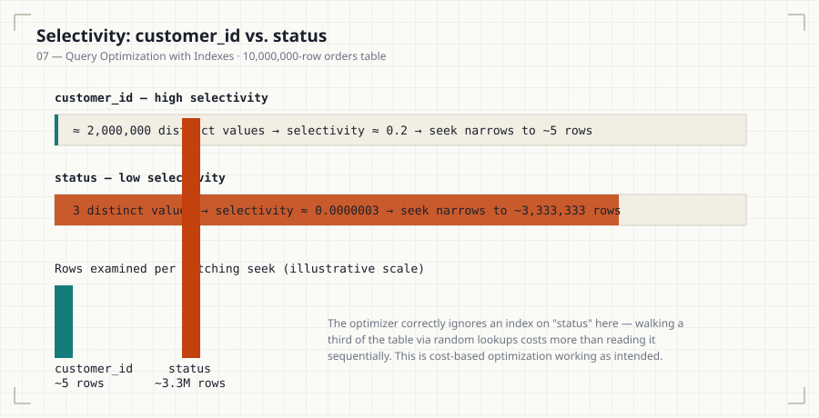
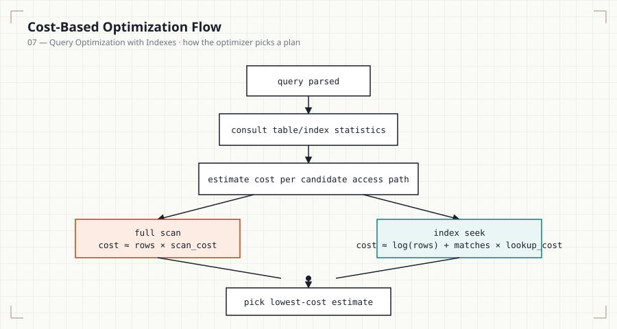
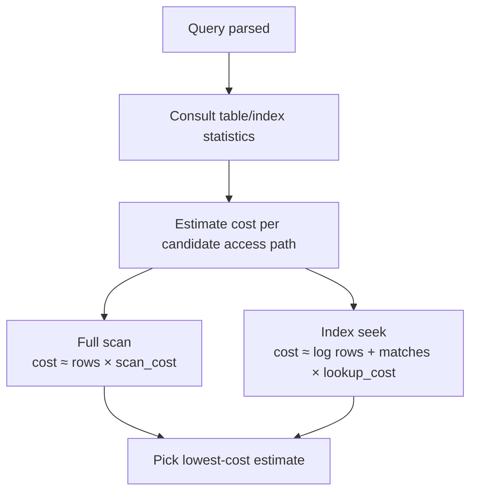

# 07 — Query Optimization with Indexes

## Introduction

Files 01-06 covered what indexes are and how to design them. This file
covers how the query optimizer actually decides whether to use one —
selectivity, statistics, histograms, predicate pushdown, and the hints
available when the optimizer gets it wrong.

## Learning Objectives

- Define selectivity and cardinality, and explain their relationship to
  index usefulness
- Explain how table/index statistics inform the optimizer's cost model
- Explain what predicate pushdown is and why it matters
- Use optimizer hints responsibly, understanding their risk

## Business Motivation

Two columns, both indexed: `status` (3 possible values, roughly even
distribution) and `order_id` (unique per row). A query filtering on
`status = 'completed'` and one filtering on `order_id = 12345` have
indexes available for both — but the optimizer will use one and ignore
the other, and understanding *why* is the difference between predicting
production query performance and being surprised by it.

## Why This Exists

An index's existence doesn't guarantee it's fast — its usefulness
depends entirely on how well it narrows the result set for a given
query. This is what selectivity and cardinality measure, and it's the
core input to the optimizer's cost-based decision.

## Production Use Cases

- Deciding whether to index a status/category/boolean column at all.
- Diagnosing a query that "should" use an index but doesn't.
- Investigating a query that used an index and got *slower*, not faster
  (stale statistics).

## Architecture Discussion

**Cardinality**: the number of distinct values in a column.
**Selectivity**: cardinality relative to row count — `selectivity =
distinct_values / total_rows`. A selectivity close to 1 means almost
every row is unique (great for indexing); close to 0 means few distinct
values relative to row count (poor for indexing in isolation).

```
customer_id on a 10M-row orders table: ~2M distinct customers
  selectivity ≈ 2,000,000 / 10,000,000 = 0.2   -- reasonably selective

status on the same table: 3 distinct values
  selectivity ≈ 3 / 10,000,000 ≈ 0.0000003     -- very poor selectivity
```

## Production Use Cases (continued)

- **Predicate pushdown**: filtering as early and as close to the storage
  layer as possible, rather than pulling all rows up to the application
  or a later query stage before filtering. An index seek is the most
  extreme form of predicate pushdown — the filter is applied by the
  storage engine before rows are even materialized.

## Syntax

```sql
-- View the optimizer's estimated statistics for a table
SHOW TABLE STATUS LIKE 'orders';

-- Force a statistics refresh after major data changes
ANALYZE TABLE orders;

-- Inspect selectivity of a specific column via cardinality estimate
SHOW INDEX FROM orders WHERE Column_name = 'status';
```

## Syntax Breakdown

- `SHOW TABLE STATUS` surfaces `Rows` (an estimate, not exact for
  InnoDB) — used by the optimizer as a baseline for scan cost.
- `ANALYZE TABLE` recomputes index cardinality estimates — essential
  after bulk loads, large deletes, or any operation that shifts data
  distribution significantly.
- `SHOW INDEX`'s `Cardinality` column is the engine's current estimate of
  distinct values for that index — directly feeds selectivity
  calculations.

## Visual Explanation



```
High selectivity column (customer_id):
  Index seek narrows 10,000,000 rows → ~5 rows.  Clear win.

Low selectivity column (status, 3 values):
  Index seek narrows 10,000,000 rows → ~3,333,333 rows.
  Optimizer correctly prefers a full scan — reading a third of the
  table via random index lookups costs MORE than reading it
  sequentially.
```

## ASCII Diagram



<details>
<summary>Mermaid version (renders inline on GitHub without loading the SVG)</summary>


</details>

```
                Optimizer cost comparison
                ┌─────────────────────────┐
                │ cost(full scan)          │
                │   ≈ rows × scan_cost     │
                ├─────────────────────────┤
                │ cost(index seek)         │
                │   ≈ log(rows) + matches  │
                │       × lookup_cost      │
                └─────────────────────────┘
                  optimizer picks the lower estimate
```

## Execution Flow

1. Optimizer consults table/index statistics (row counts, cardinality,
   histograms where available) for every candidate access path.
2. It estimates the number of matching rows (selectivity × total rows)
   for each candidate.
3. It computes an estimated cost per path using engine-specific cost
   constants (I/O cost, CPU cost).
4. It selects the lowest estimated cost — this is the query plan.
5. Predicate pushdown is applied wherever possible within the chosen
   plan, filtering as early as the storage layer allows.

## Engineering Notes

Statistics are **estimates**, sampled periodically, not recalculated on
every query. After a large bulk load, delete, or significant data skew
change, stale statistics can cause the optimizer to pick a badly wrong
plan — this is one of the most common causes of "this query used to be
fast" production incidents, and `ANALYZE TABLE` / `VACUUM ANALYZE` is
frequently the fix.

## Performance Notes

- Histograms (MySQL 8.0+, PostgreSQL, SQL Server, Oracle all support
  them) improve on plain cardinality by capturing value *distribution*,
  not just distinct count — critical for skewed columns where most rows
  share a few common values but a long tail of rare ones exists.
- A column that's low-selectivity overall can still be highly selective
  for specific, rare values — histograms let the optimizer exploit that
  where simple cardinality estimates cannot.

## Storage Considerations

Histograms and extended statistics add metadata storage, but it is
negligible compared to the index/table storage itself — there's little
reason not to maintain them on any actively queried column.

## Optimizer Notes

**Optimizer hints** (`FORCE INDEX`, `USE INDEX`, `IGNORE INDEX` in
MySQL; `pg_hint_plan` extension in PostgreSQL) let you override the
optimizer's choice. They are an escape hatch, not a design tool — a hint
that's correct today can become actively harmful as data grows and the
genuinely optimal plan changes, because a hint doesn't adapt the way the
cost-based optimizer does.

## ANSI SQL Notes

Optimizer behavior, statistics, and hints are entirely
implementation-specific; the ANSI standard defines none of this.

## MySQL Notes

- `ANALYZE TABLE` refreshes cardinality statistics.
- `FORCE INDEX (idx_name)` and `IGNORE INDEX (idx_name)` are available
  directly in query syntax for testing/overriding optimizer choices.

## PostgreSQL Notes

- `ANALYZE` (often paired with `VACUUM ANALYZE`) refreshes planner
  statistics, including histograms via `default_statistics_target`.
- No built-in hint syntax in core PostgreSQL — the project has
  historically discouraged them in favor of trusting/fixing the
  cost-based optimizer; `pg_hint_plan` is a well-known third-party
  extension for cases where hints are still needed.

## SQL Server Notes

- `UPDATE STATISTICS` refreshes the optimizer's statistics.
- Query hints (`OPTION (FORCESEEK)`, etc.) and plan guides are available
  for advanced override cases.

## Oracle Notes

- `DBMS_STATS.GATHER_TABLE_STATS` refreshes statistics, including
  histograms.
- Oracle has one of the most mature optimizer hint systems
  (`/*+ INDEX(...) */` syntax) among major RDBMSs.

## Edge Cases

- A column can have good *overall* selectivity but poor selectivity for
  the *specific* value in a given query (e.g., a "default" or "unknown"
  category value that dominates the distribution) — histograms exist
  specifically to catch this case.
- Multi-column correlation (e.g., `city` and `zip_code` correlate
  heavily) can mislead cost estimates that assume column independence —
  extended statistics (PostgreSQL, MySQL 8.0+) exist to address this.

## Best Practices

- Run `ANALYZE`/`UPDATE STATISTICS` after any bulk data operation.
- Treat optimizer hints as a temporary, monitored fix, not a permanent
  design choice — revisit them periodically.

## Anti-patterns

- Hinting a query once and never revisiting the hint as data grows.
- Assuming a column's selectivity from intuition instead of checking
  `SHOW INDEX` / `pg_stats`.

## Common Mistakes

- Forgetting to `ANALYZE` after a large data load and being surprised by
  a sudden plan regression.
- Indexing a column purely because it appears in a `WHERE` clause,
  without checking its selectivity first.

## Interview Questions

1. Define selectivity and explain why a boolean column is usually a
   poor indexing candidate on its own.
2. Why can stale statistics cause a previously fast query to suddenly
   become slow, with no code or data schema changes?
3. What is predicate pushdown, and how does an index seek relate to it?
4. When would you reach for an optimizer hint, and what's the risk of
   leaving one in place indefinitely?

## Summary

The optimizer's index-vs-scan decision is a cost estimate built from
selectivity, cardinality, and (where available) histograms — not a fixed
rule. Low-selectivity columns are poor indexing candidates in isolation;
stale statistics are a common, often-overlooked cause of sudden plan
regressions; and optimizer hints are a monitored escape hatch, not a
permanent substitute for good index design and fresh statistics.

## Practice

See [12_PRACTICE_PROBLEMS.md](12_PRACTICE_PROBLEMS.md), Advanced
section, Problems 6–8.

## Further Reading

See [resources/documentation.md](resources/documentation.md).
