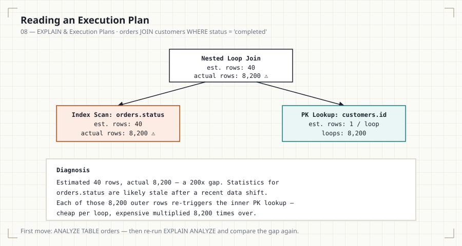
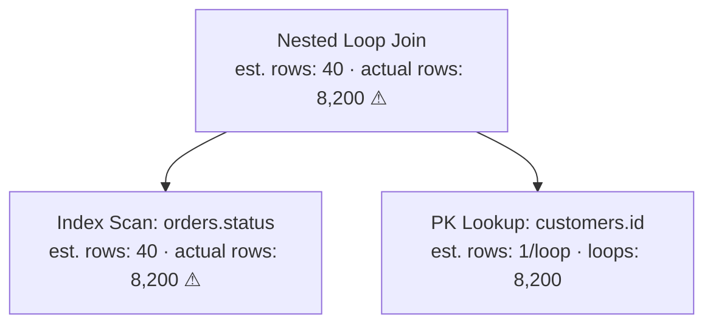

# 08 — EXPLAIN & Execution Plans

## Introduction

Every prior file has referenced `EXPLAIN` output without fully unpacking
it. This file is the complete reference: what every column means, how to
read a plan tree, and how the same concepts map across MySQL,
PostgreSQL, SQL Server, and Oracle.

## Learning Objectives

- Read every column of MySQL's `EXPLAIN` output
- Explain the difference between `EXPLAIN` and `EXPLAIN ANALYZE`
- Interpret rows, cost, loops, and actual vs. estimated time
- Recognize the key plan operators: index scan, sequential scan, nested
  loop, hash join, merge join

## Business Motivation

A query that ran fine in staging times out in production. The schema is
identical; the row counts aren't. `EXPLAIN` (and especially `EXPLAIN
ANALYZE`) is how you find out *why* — without it, you're debugging
performance by guesswork.

## Why This Exists

The optimizer's chosen plan is invisible unless you ask for it.
`EXPLAIN` surfaces the plan without running the query; `EXPLAIN ANALYZE`
runs it and reports actual measured behavior against the plan's
estimates — the gap between the two is often the most valuable
diagnostic signal available.

## Production Use Cases

- Pre-deploy query review on any new or modified query touching a large
  table.
- Live incident debugging: "why is this query suddenly slow."
- Validating that a new index is actually being used as intended (File
  05's covering-index verification is a direct application of this).

## Architecture Discussion

`EXPLAIN` shows the **estimated** plan: what the optimizer intends to
do, based on statistics, without executing anything. `EXPLAIN ANALYZE`
**executes** the query and reports actual row counts, actual timing, and
actual loop counts alongside the original estimates — letting you spot
exactly where the optimizer's assumptions diverged from reality.

## Syntax

```sql
-- MySQL: plan only, no execution
EXPLAIN
SELECT * FROM orders WHERE customer_id = 88291;

-- MySQL 8.0.18+: adds actual execution stats
EXPLAIN ANALYZE
SELECT * FROM orders WHERE customer_id = 88291;

-- PostgreSQL: plan only
EXPLAIN
SELECT * FROM orders WHERE customer_id = 88291;

-- PostgreSQL: executes and reports actual timing/rows
EXPLAIN ANALYZE
SELECT * FROM orders WHERE customer_id = 88291;
```

## Syntax Breakdown

- `EXPLAIN` alone never executes the query — safe to run on production
  even for expensive queries.
- `EXPLAIN ANALYZE` **does execute** the query — use with caution on
  production for write-heavy or extremely expensive statements (it will
  actually perform an `UPDATE`/`DELETE` if you `EXPLAIN ANALYZE` one).

## Visual Explanation — MySQL EXPLAIN Columns

```
id  select_type  table   type  key                   rows   Extra
1   SIMPLE       orders  ref   idx_orders_customer_id 5      Using index
```

- **id** — query block identifier (matters for subqueries/unions).
- **select_type** — SIMPLE, PRIMARY, SUBQUERY, DERIVED, etc.
- **table** — which table this row of the plan refers to.
- **type** — access method: `system` > `const` > `eq_ref` > `ref` >
  `range` > `index` > `ALL` (roughly best to worst).
- **key** — the index actually chosen (NULL if none).
- **rows** — estimated rows examined.
- **Extra** — critical flags: `Using index` (covering), `Using
  filesort` (extra sort step), `Using temporary` (temp table needed).

## ASCII Diagram — Plan Tree (Join Example)



<details>
<summary>Mermaid version (renders inline on GitHub without loading the SVG)</summary>


</details>

```
EXPLAIN
SELECT o.order_id, c.email
FROM orders o
JOIN customers c ON o.customer_id = c.id
WHERE o.status = 'completed';

Plan tree (conceptual):
        Nested Loop Join
        /              \
  Index scan          Index/PK lookup
  orders.status         customers.id
  (outer, driving)      (inner, probed per outer row)
```

## Execution Flow — Reading a Plan Bottom-Up

1. Innermost/rightmost operations execute first conceptually (though
   engines render this differently — PostgreSQL nests visually,
   MySQL's tabular EXPLAIN requires reading `id`/nesting carefully).
2. Each operator's `rows` (estimated) vs. `actual rows` (with ANALYZE)
   tells you where the optimizer's model diverged from reality.
3. Large gaps between estimated and actual rows are the single strongest
   signal of a statistics problem (File 07) rather than an indexing
   problem.

## Engineering Notes

`Loops` (visible in `EXPLAIN ANALYZE` / PostgreSQL's `EXPLAIN ANALYZE`)
tells you how many times an inner plan node executed — critical for
nested loop joins, where a small per-loop cost multiplied by millions of
outer rows becomes the dominant cost of the entire query, even though
each individual loop looks cheap in isolation.

## Performance Notes

- **Nested Loop Join**: efficient when the outer side is small and the
  inner side has a supporting index — expensive when the outer side is
  large.
- **Hash Join**: builds an in-memory hash table from one side; strong
  for large, unindexed equi-joins, weak on memory-constrained systems
  with very large inputs.
- **Merge Join**: requires both inputs sorted (often via an index);
  efficient for large, pre-sorted equi-joins.

## Storage Considerations

Plans themselves aren't stored persistently in MySQL/PostgreSQL by
default (unlike SQL Server's plan cache) — every `EXPLAIN` reflects
current statistics at call time, which is exactly why stale statistics
(File 07) matter operationally.

## Optimizer Notes

`cost` (PostgreSQL's `EXPLAIN` shows startup cost and total cost in
arbitrary units, not milliseconds) is a relative number for comparing
candidate plans — it is not directly a time prediction, which is why
`EXPLAIN ANALYZE`'s actual `time` figures matter for real diagnosis.

## ANSI SQL Notes

`EXPLAIN` syntax and output format are entirely vendor-specific; the
ANSI standard has no `EXPLAIN` concept at all.

## MySQL Notes

- `EXPLAIN FORMAT=JSON` gives a much more detailed, machine-readable
  plan including per-step cost estimates.
- `EXPLAIN ANALYZE` (8.0.18+) returns a tree-formatted plan with actual
  timing embedded per node, replacing the older tabular-only output for
  this use case.

## PostgreSQL Notes

- `EXPLAIN (ANALYZE, BUFFERS)` additionally reports actual disk/cache
  buffer hits — extremely useful for diagnosing whether a query is
  I/O-bound or CPU-bound.
- Plan nodes are rendered as an indented tree by default, generally
  more human-readable than MySQL's tabular format.

## SQL Server Notes

- "Actual Execution Plan" (graphical, in SSMS) is the equivalent of
  `EXPLAIN ANALYZE` — includes actual vs. estimated row counts directly
  on each operator icon.

## Oracle Notes

- `EXPLAIN PLAN FOR <query>` followed by
  `SELECT * FROM TABLE(DBMS_XPLAN.DISPLAY)` is the standard two-step
  Oracle workflow for plan-only inspection.
- `DBMS_XPLAN.DISPLAY_CURSOR` shows actual execution statistics for a
  query that has already run, analogous to `EXPLAIN ANALYZE`.

## Edge Cases

- A query wrapped in a transaction that's rolled back after `EXPLAIN
  ANALYZE` still had real side effects during execution (locks
  acquired, triggers fired) — `EXPLAIN ANALYZE` is not a safe dry-run
  mechanism for write statements.
- Plans can differ between a cold cache and a warm cache — a plan
  captured immediately after a deploy may not represent steady-state
  production behavior.

## Best Practices

- Use plain `EXPLAIN` first on production for any expensive-looking
  query; reserve `EXPLAIN ANALYZE` for read-only statements or a safe
  staging replica.
- Compare estimated vs. actual rows as the first diagnostic step for any
  unexpectedly slow query.

## Anti-patterns

- Running `EXPLAIN ANALYZE` on a production `DELETE`/`UPDATE` without
  wrapping it in a transaction you intend to roll back — and even then,
  side effects like triggers and locks still occur.
- Reading only the `type`/access-method column and ignoring `Extra`
  (MySQL) or the buffers/timing detail (PostgreSQL).

## Common Mistakes

- Treating estimated `rows`/`cost` as a direct time prediction.
- Not noticing `Using filesort` or `Using temporary` in MySQL's `Extra`
  column — both indicate expensive steps beyond the index access itself.

## Interview Questions

1. What is the difference between `EXPLAIN` and `EXPLAIN ANALYZE`, and
   when would you avoid running the latter in production?
2. In MySQL's `EXPLAIN` output, what does `Using filesort` in the Extra
   column tell you, and why is it a signal to investigate?
3. Compare Nested Loop, Hash, and Merge joins — under what conditions is
   each typically preferred by the optimizer?
4. You see a large gap between estimated and actual row counts in an
   `EXPLAIN ANALYZE` plan. What does that suggest, and what's your next
   step?

## Summary

`EXPLAIN` reveals the optimizer's intended plan without running the
query; `EXPLAIN ANALYZE` runs it and reports actual measured behavior
alongside the original estimates. Reading a plan means understanding
access type (index vs. scan), join strategy (nested loop, hash, merge),
and the gap between estimated and actual rows — that gap is usually the
fastest path to diagnosing a real production performance problem.

## Practice

See [12_PRACTICE_PROBLEMS.md](12_PRACTICE_PROBLEMS.md), Production
Debugging section, Problems 1–4.

## Further Reading

See [resources/documentation.md](resources/documentation.md).
