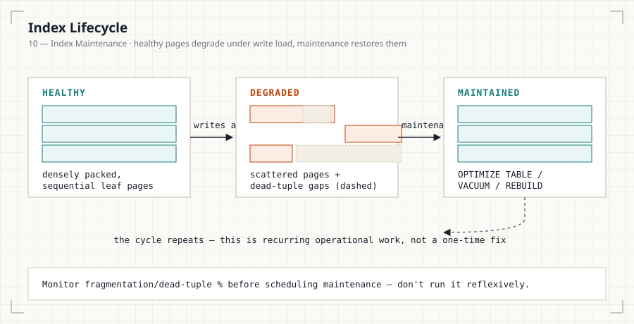

# 10 — Index Maintenance, Redundancy & Myths

## Introduction

Every prior file treated indexing as a design-time decision: create the
right index, verify it with `EXPLAIN`, move on. In production, an index is
not a static artifact — it degrades under write load, can become
redundant as schemas evolve, and is surrounded by more confidently-stated
folklore than almost any other database topic. This file covers what
happens to an index *after* it's created: how it degrades, how to keep it
healthy, how to spot when you have too many of them, and which commonly
repeated claims about indexing are simply wrong.



## Learning Objectives

- Explain why indexes degrade over time even with no schema changes
- Run and interpret the maintenance commands for MySQL, PostgreSQL, SQL
  Server, and Oracle
- Identify redundant and overlapping composite indexes
- Refute five commonly repeated indexing myths with the specific reasoning
  that makes each one wrong

## Business Motivation

A `transactions` table (File 09's banking case study) takes thousands of
inserts and updates daily against its `(account_id, occurred_at)` index.
Eighteen months in, with no code changes and no data growth beyond
expected volume, query latency against that index has crept up 40%. This
is index bloat/fragmentation — a maintenance problem, not a design
problem — and no amount of re-reading Files 02-08 will fix it, because
those files are about choosing the right index, not keeping one healthy.

## Why Indexes Degrade

A B+Tree (File 02) stays balanced through page splits and merges as data
is inserted, updated, and deleted. Over many write cycles, this produces:

- **Fragmentation**: logically sequential leaf pages become physically
  scattered on disk, turning what should be a sequential read into a
  series of random ones.
- **Bloat**: deleted or updated rows leave behind "dead" space in pages —
  MySQL InnoDB and PostgreSQL both use MVCC (multi-version concurrency
  control), meaning an `UPDATE` doesn't overwrite a row in place, it
  writes a new version and marks the old one for later cleanup. Until
  that cleanup happens, the index carries dead entries that still cost
  I/O to skip over.
- **Stale statistics**: covered in File 07 — a distinct but related
  problem; statistics drift even without any structural degradation.

## Architecture Discussion

Fragmentation and bloat are consequences of how B+Trees handle
in-place modification (File 02's page-split mechanics) combined with how
each engine handles row versioning:

- **MySQL InnoDB**: `UPDATE`/`DELETE` mark rows for purge; a background
  purge thread reclaims space, but heavy write tables can outpace it.
- **PostgreSQL**: MVCC means every `UPDATE` is physically an insert of a
  new row version plus a tombstone on the old one — `VACUUM` is not
  optional maintenance, it's a required part of PostgreSQL's storage
  model working correctly at all.
- **SQL Server / Oracle**: similar page-split and dead-space dynamics,
  addressed via `ALTER INDEX ... REBUILD/REORGANIZE` and
  `ALTER INDEX ... REBUILD`, respectively.

## Syntax

```sql
-- MySQL: rebuild a table (and all its indexes) to remove fragmentation
OPTIMIZE TABLE transactions;

-- MySQL: refresh cardinality/statistics without a full rebuild
ANALYZE TABLE transactions;

-- PostgreSQL: reclaim dead tuple space
VACUUM (ANALYZE) transactions;
-- PostgreSQL: rebuild an index from scratch (blocking unless CONCURRENTLY)
REINDEX INDEX CONCURRENTLY idx_transactions_account_time;

-- SQL Server: rebuild vs. reorganize depending on fragmentation level
ALTER INDEX idx_transactions_account_time ON transactions REBUILD;
ALTER INDEX idx_transactions_account_time ON transactions REORGANIZE;

-- Oracle: rebuild an index online
ALTER INDEX idx_transactions_account_time REBUILD ONLINE;
```

## Syntax Breakdown

- MySQL's `OPTIMIZE TABLE` rebuilds the table and all its indexes —
  effective but locks/copies the table for InnoDB in most configurations,
  so it's a maintenance-window operation, not a casual one.
- PostgreSQL's plain `VACUUM` reclaims space for reuse but doesn't return
  it to the OS; `VACUUM FULL` does, at the cost of an exclusive lock —
  almost always avoid `VACUUM FULL` on a live production table.
- SQL Server's choice between `REBUILD` (full, more thorough, more
  locking) and `REORGANIZE` (lighter, online, less thorough) is typically
  driven by measured fragmentation percentage — reorganize under ~30%,
  rebuild above it, as a common operational rule of thumb.

## Fillfactor

`FILLFACTOR` (PostgreSQL, SQL Server) reserves empty space within each
index page at creation/rebuild time, specifically to absorb future
in-page updates without forcing an immediate page split. A table with
frequent `UPDATE`s to indexed columns benefits from a lower fillfactor
(e.g., 70-80%) traded against slightly larger initial index size; a
mostly-static or append-only table should stay near the 100% default,
since there's little future in-page modification to reserve space for.

```sql
-- PostgreSQL: reserve 20% free space per index page for future updates
CREATE INDEX idx_transactions_account_time
    ON transactions (account_id, occurred_at)
    WITH (fillfactor = 80);
```

MySQL InnoDB has no direct `FILLFACTOR` equivalent; `innodb_fill_factor`
influences page fill on some operations but is not a per-index tunable
the way PostgreSQL/SQL Server's is.

## Monitoring & Maintenance Scheduling

Maintenance should be observed and scheduled, not run reflexively:

- **MySQL**: check `information_schema.TABLES` for `DATA_FREE` (bytes
  reclaimable via `OPTIMIZE TABLE`) relative to `DATA_LENGTH`.
- **PostgreSQL**: `pg_stat_user_tables.n_dead_tup` relative to
  `n_live_tup` signals bloat; `autovacuum` is on by default and handles
  most cases — manual intervention is for tables where autovacuum can't
  keep up with write volume.
- **SQL Server**: `sys.dm_db_index_physical_stats` reports fragmentation
  percentage directly, per index.
- **Oracle**: `DBA_INDEXES`/`DBMS_STATS` combined with
  `ANALYZE INDEX ... VALIDATE STRUCTURE` for space usage.

**Scheduling**: rebuild/vacuum during low-traffic windows for any
operation with meaningful locking cost; prefer `CONCURRENTLY` (PostgreSQL)
or `ONLINE` (Oracle) variants where available and where the extra time
cost is acceptable, specifically to avoid a maintenance window at all for
tables that can't tolerate one (e.g., File 09's `audit_log`, which is
both high-write and compliance-critical to keep available).

## Duplicate & Redundant Index Analysis

A composite index `(a, b, c)` already serves any query that a
single-column index on `a`, or a composite index on `(a, b)`, would serve
— per the leftmost prefix rule (File 03). This means:

```
INDEX(a)        -- fully redundant if INDEX(a, b, c) exists
INDEX(a, b)     -- fully redundant if INDEX(a, b, c) exists
INDEX(a, b, c)  -- the superset — keep this one
INDEX(a, c)     -- NOT redundant — c is not a leftmost-reachable
                --  prefix continuation of (a, b, c) without b
```

`(a, c)` is the case that trips people up: it looks like a subset of
`(a, b, c)`'s columns, but because `c` isn't adjacent to `a` in the
composite's actual column order, a query filtering `WHERE a = ? AND c = ?`
cannot use `(a, b, c)` to seek on `c` — it can only use the `a` prefix and
must post-filter `c`, exactly as File 03 describes. `(a, c)` is a
legitimately separate, non-redundant index if that query shape is
frequent.

**Practical redundancy check**: an index is a candidate for removal if
every column-order prefix it defines is also a prefix of some other
existing index on the same table, with equal or better trailing-column
coverage. MySQL's `sys.schema_redundant_indexes` view (Performance Schema,
MySQL 8.0+) automates exactly this check.

```sql
SELECT * FROM sys.schema_redundant_indexes
WHERE table_schema = DATABASE();
```

## Index Myths

**Myth: "More indexes always improve performance."**
False — every index adds write cost (File 06) that compounds
indefinitely, not once. Past a certain point, additional indexes on a
write-heavy table make the system slower overall even as they speed up
specific reads.

**Myth: "Every column in a WHERE clause should be indexed."**
False — a low-selectivity column (File 07) indexed in isolation is
frequently ignored by the optimizer entirely, making the index pure
write overhead with zero read benefit. Selectivity, not clause
membership, determines indexing value.

**Myth: "If EXPLAIN shows the query using an index, the query is fast."**
False — File 08 covers this directly: an index can be *used* and still
be a poor plan choice if statistics are stale, if the index only narrows
the result marginally, or if the query still requires a large
`Using filesort`/`Using temporary` step downstream of the index seek.
"Uses an index" and "is fast" are correlated, not synonymous.

**Myth: "A primary key index solves every performance problem on a
table."**
False — a primary key accelerates lookups by that key alone. A table
queried predominantly by other columns (File 09's `orders.customer_id`,
for instance) gets no benefit from its primary key index for those
queries; every table's *secondary* access patterns need their own,
separately designed indexes.

**Myth: "Indexes are free once created."**
False — this is File 06's entire premise restated as a myth: every index
costs storage indefinitely and write throughput on every future
`INSERT`/`UPDATE`/`DELETE` touching its columns, forever, not just at
creation time.

## Business Scenarios

- A SaaS `audit_log` table (File 09) that cannot be pruned for compliance
  reasons needs a maintenance *schedule*, not a one-time fix — its index
  bloat is permanent unless actively managed, since the row count itself
  never shrinks.
- A banking `transactions` table's `(account_id, occurred_at)` index
  (File 09) is the highest-value candidate in that schema for fillfactor
  tuning, given its constant `INSERT` volume and time-ordered access
  pattern.
- A retail `products` table redesigned mid-year to add a new composite
  index `(category_id, price, popularity_score)` should trigger a
  redundancy check against the original `(category_id, price)` index
  (File 09) — the older index is now fully redundant and safe to drop.

## Common Mistakes

- Running `OPTIMIZE TABLE` or `VACUUM FULL` reflexively on a schedule
  without checking actual fragmentation/bloat first — both carry real
  locking cost that isn't justified on a table that isn't actually
  degraded.
- Adding a new composite index without checking whether it makes an
  existing narrower index redundant, silently doubling write cost for no
  additional read benefit.
- Treating `ANALYZE`/statistics refresh (File 07) and physical
  maintenance (this file) as the same operation — they solve different
  problems and neither substitutes for the other.

## Interview Questions

1. Why does an index degrade over time even without any schema changes?
2. What's the practical difference between `ANALYZE TABLE` and
   `OPTIMIZE TABLE` in MySQL — what does each actually fix?
3. Why is `VACUUM` not optional maintenance in PostgreSQL, unlike in most
   other engines' equivalent operations?
4. Given `INDEX(a, b, c)`, is `INDEX(a, c)` redundant? Justify your
   answer using the leftmost prefix rule.
5. Refute this claim in your own words: "the query plan shows it's using
   an index, so the query is optimized."
6. When would you choose a lower fillfactor for an index, and what are
   you trading away by doing so?

## Summary

Index health is not a one-time design decision — fragmentation and bloat
accumulate under normal write load and require engine-specific
maintenance (`OPTIMIZE TABLE`, `VACUUM`, `ALTER INDEX REBUILD`) on a
monitored, not reflexive, schedule. Composite indexes can become silently
redundant as schemas evolve, and are worth auditing directly rather than
assuming more indexes are automatically safer. Most indexing folklore
collapses under the same scrutiny this module has applied throughout:
"does this claim hold given how the optimizer actually makes decisions,"
not "does this sound like reasonable advice."

## Practice

See [12_PRACTICE_PROBLEMS.md](12_PRACTICE_PROBLEMS.md), Maintenance &
Myths section.

## Further Reading

See [resources/documentation.md](resources/documentation.md).
