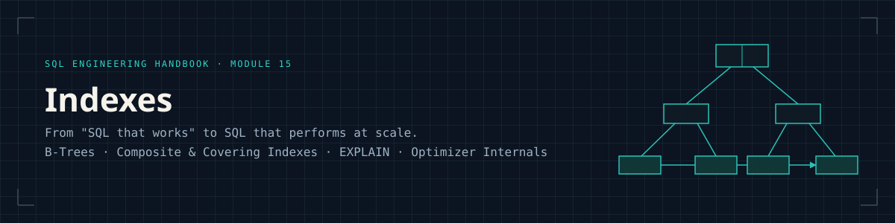
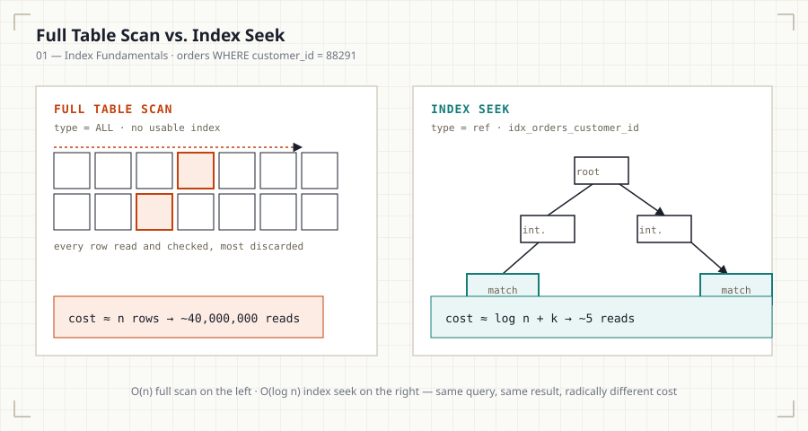

<p align="center">
  
</p>

<p align="center">
  
  
  
  
  
  
  
</p>

<p align="center"><i>Part of the <a href="../README.md">SQL Engineering Handbook</a></i></p>

---

## Why This Module Exists

Every prior module in this handbook teaches you to **write** SQL. This module
teaches you to understand what the database actually **does** when it runs
that SQL — specifically, how it decides whether to scan a table row by row
or jump directly to the rows you need, and what happens to that decision
over the months and years an index actually lives in production.

Indexes are the single biggest lever between a query that returns in 2ms and
one that times out under production load. A Data Analyst who can write a
correct `JOIN` but cannot explain why it's slow, or a Junior Data Analyst who
cannot read an `EXPLAIN` plan, will hit a ceiling fast in any real
engineering organization. This module exists to remove that ceiling.

<p align="center">
  
</p>

## Who This Is For

Aspiring Data Analysts and Analytics Engineers who have completed the core
SQL modules (00–09) and are ready to move from "SQL that works" to "SQL that
performs at scale." No prior database internals knowledge is assumed —
every structural concept (B-Trees, cost-based optimization, execution plans,
long-term index health) is built up from first principles.

## Quick Start

```bash
mysql -u root -p your_database < 00_SETUP.sql   # creates every table this module uses
mysql -u root -p your_database < 01_INDEX_FUNDAMENTALS.sql
```

Every `.sql` file from `01` through `10` runs cleanly against the schema
`00_SETUP.sql` creates — no missing-table errors, no manual setup beyond
that one file.

## What This Module Covers

| # | File | Focus | Diagram |
|---|------|-------|---------|
| 00 | [Setup](00_SETUP.sql) | Every table this module references, with keys, FKs, and sample data | — |
| 01 | [Index Fundamentals](01_INDEX_FUNDAMENTALS.md) | Full scans vs. index seeks, cost-based optimization, logical vs. physical storage | [scan vs. seek](assets/diagrams/index-scan-vs-table-scan.svg) |
| 02 | [B-Tree Indexes](02_B_TREE_INDEXES.md) | B-Tree/B+Tree structure, how MySQL/PostgreSQL/SQL Server/Oracle use them | [B+Tree](assets/diagrams/btree-structure.svg) |
| 03 | [Composite Indexes](03_COMPOSITE_INDEXES.md) | Leftmost prefix rule, column ordering strategy | [leftmost prefix](assets/diagrams/leftmost-prefix-rule.svg) |
| 04 | [Unique, Primary & Foreign Key Indexes](04_UNIQUE_PRIMARY_FOREIGN_INDEXES.md) | Constraint-backed indexes and their storage implications | [clustered vs. non-clustered](assets/diagrams/clustered-vs-nonclustered.svg) |
| 05 | [Covering Indexes](05_COVERING_INDEXES.md) | Index-only scans, included columns | [covering index](assets/diagrams/covering-index.svg) |
| 06 | [Indexing Strategies](06_INDEXING_STRATEGIES.md) | OLTP vs. OLAP design, star schema, when *not* to index | [read/write trade-off](assets/diagrams/write-vs-read-tradeoff.svg) |
| 07 | [Query Optimization with Indexes](07_QUERY_OPTIMIZATION_WITH_INDEXES.md) | Predicate pushdown, selectivity, statistics, histograms | [selectivity](assets/diagrams/index-selectivity.svg) |
| 08 | [EXPLAIN & Execution Plans](08_EXPLAIN_AND_EXECUTION_PLANS.md) | Reading `EXPLAIN` / `EXPLAIN ANALYZE` across engines | [execution plan](assets/diagrams/execution-plan.svg) |
| 09 | [Real-World Case Studies](09_REAL_WORLD_CASE_STUDIES.md) | 11 industries, each with a genuinely distinct indexing challenge — not just relabeled examples | — |
| 10 | [Index Maintenance, Redundancy & Myths](10_INDEX_MAINTENANCE.md) | Fragmentation, bloat, VACUUM/OPTIMIZE/REBUILD, duplicate-index detection, common myths refuted | [index lifecycle](assets/diagrams/index-lifecycle.svg) |
| 11 | [Interview Guide](11_INTERVIEW_GUIDE.md) | 59 production interview questions, easy → hard, FAANG-style | — |
| 12 | [Practice Problems](12_PRACTICE_PROBLEMS.md) | Beginner → production-grade debugging, optimization, and maintenance exercises | — |
| 13 | [Solutions](13_SOLUTIONS.sql) | Fully worked solutions to Module 12 | — |

Each `.md` file is paired with a `.sql` file containing the runnable,
commented queries referenced in the text. SQL is written against MySQL
8.0+ syntax first, with ANSI SQL, PostgreSQL, SQL Server, and Oracle notes
called out wherever behavior diverges.

## The Diagrams

Every diagram in this module (12 total, one per core concept) is rendered as
a standalone SVG in [`assets/diagrams/`](assets/diagrams/) and embedded
directly in its corresponding file — no external image hosting, so they
render correctly whether you're reading on GitHub, cloned locally, or in any
markdown viewer.

<p align="center">
  
  
</p>
<p align="center">
  
  
</p>

[`assets/DIAGRAM_SPECS.md`](assets/DIAGRAM_SPECS.md) documents exactly what
exists, what each diagram shows, and what was deliberately left out (and
why) — kept accurate against the actual asset folder, not aspirational.

## Build Status

✅ **Complete and release-reviewed.** All 14 files, their paired SQL, the
resource list, and every diagram are published. This module has been
through a full pre-commit engineering audit — every SQL file executes
end-to-end against `00_SETUP.sql`, every cross-reference resolves, and
every previously-flagged technical claim has been corrected or removed.

## Module Checklist

- [x] Every `.sql` file runs cleanly after `00_SETUP.sql` — zero
      missing-table errors
- [x] Every file follows the documentation template, or explicitly states
      why it doesn't (File 09)
- [x] Every diagram referenced in a file exists and is embedded, not just
      linked
- [x] Cross-engine notes (MySQL/PostgreSQL/SQL Server/Oracle) present in
      every content file
- [x] No unverifiable or vendor-marketing technical claims
- [x] Index maintenance, redundancy, and common myths covered as a
      first-class topic, not an afterthought

## How to Use This Module

1. Run [`00_SETUP.sql`](00_SETUP.sql) once, against a scratch schema.
2. Read the `.md` file for a topic before opening its `.sql` file — the
   concepts (why an index helps) matter more than the syntax (how to create
   one).
3. Run each `.sql` file and compare your `EXPLAIN` output to the one
   documented in the file — plans vary by data distribution, and seeing the
   divergence is part of the learning (see the scale note at the top of
   `00_SETUP.sql`).
4. Read [File 09](09_REAL_WORLD_CASE_STUDIES.md) for how the concepts
   combine in real schemas, then [File 10](10_INDEX_MAINTENANCE.md) for
   what happens to those indexes a year later.
5. Attempt [Module 12](12_PRACTICE_PROBLEMS.md)'s practice problems
   *before* reading [Module 13](13_SOLUTIONS.sql)'s solutions.
6. Heading to an interview? Start from [Module 11](11_INTERVIEW_GUIDE.md) —
   every question cross-references back to the file that covers it.

## Resources

Curated further reading lives in [`resources/`](resources/): recommended
[books](resources/books.md), [engineering blogs](resources/blogs.md),
[official documentation](resources/documentation.md) per engine,
[talks and lectures](resources/youtube.md), and
[interview prep](resources/interview-resources.md).
