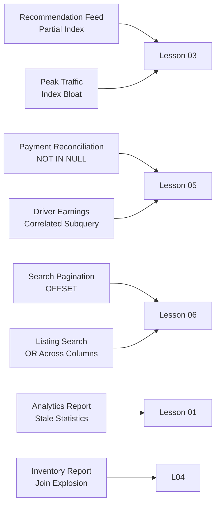

# Production-Style Incident Case Studies — Query Optimization

> **Module 16 · Query Optimization · Reference Library**
> [Home](./README.md) · [Troubleshooting](./TROUBLESHOOTING_GUIDE.md) · [Casebook](./REAL_WORLD_CASEBOOK.md) · [Lessons](./README.md#complete-topic-index)

> **Disclaimer:** These scenarios are fictionalized engineering case studies based on common production failure modes observed across the industry. Company names, metrics, architectures, and business impacts are **illustrative**. No attribution to any real company is intended unless an external source is explicitly cited.

Realistic post-mortems from high-traffic systems. Each follows SRE structure: **Architecture → Symptoms → Diagnosis → Root Cause → Fix → Business Impact → Lessons Learned**.

Map each incident to the relevant lesson before reading the fix.



---

## Incident 1: Recommendation Feed Timeout (SEV-1)

### Architecture
- **Stack**: PostgreSQL 15, PgBouncer, microservices on AWS
- **Query**: User watch-history aggregation for personalized feed ranking
- **Scale**: Large-scale streaming service, `watch_events` table with billions of rows (partitioned by month)

### Problem
Nightly batch job recomputes per-user viewing scores. After a schema migration adding `content_rating` column, the job exceeded its 4-hour SLA window.

### Symptoms
- Batch job runtime: ~4h → ~11h (exceeded SLA) *(illustrative)*
- `pg_stat_activity`: parallel workers all in `Seq Scan on watch_events`
- CPU on reader replicas: sustained 95%+

### Execution Plan *(illustrative — PostgreSQL EXPLAIN ANALYZE output)*
```text
HashAggregate  (actual time=9840000..9840000 rows=220000000)
  ->  Seq Scan on watch_events  (actual time=0.05..8200000 rows=4000000000)
        Filter: (watch_date >= '2026-01-01' AND content_rating IS NOT NULL)
        Rows Removed by Filter: 36000000000
```

### Diagnosis
Migration added `content_rating` (nullable, 60% NULL). Existing partial index on `watch_date` couldn't serve the new `IS NOT NULL` filter. Optimizer chose Seq Scan across all partitions.

### Root Cause
Non-SARGable combined filter: `content_rating IS NOT NULL` on a column without a partial index, combined with a date range that crossed partition boundaries without pruning.

### Fix *(PostgreSQL-specific — partial indexes)*
```sql
CREATE INDEX CONCURRENTLY idx_watch_events_date_rating
    ON watch_events (watch_date, content_rating)
    WHERE content_rating IS NOT NULL;

-- Rewrite to push filter into each partition explicitly
SELECT user_id, COUNT(*) AS views
FROM watch_events
WHERE watch_date >= '2026-01-01'
  AND content_rating IS NOT NULL
GROUP BY user_id;
```

### Business Impact *(illustrative)*
- Feed personalization delayed for a large user segment
- Revenue impact from stale recommendations during delay window

### Lessons Learned
- [Lesson 03](./03_SARGABILITY_AND_INDEX_USAGE.md): New nullable columns need index strategy review
- Always run `EXPLAIN ANALYZE` on batch queries after schema migrations (note: `EXPLAIN ANALYZE` executes the query — use with caution on production data)
- Partial indexes for high-selectivity IS NOT NULL filters (PostgreSQL; MySQL does not support partial indexes)

---

## Incident 2: Payment Reconciliation NULL Trap (SEV-2)

### Architecture
- **Stack**: PostgreSQL 14, application-level connection pooling
- **Query**: Find accounts with no successful payments in last 30 days
- **Scale**: Large fintech platform, hundreds of millions of payment records

### Problem
Marketing automation campaign targeting "inactive payers" sent zero emails for 3 days before anyone noticed.

### Symptoms
- Campaign query returned 0 rows (expected hundreds of thousands)
- No errors in application logs — HTTP 200 on all batch runs
- Finance team flagged discrepancy in expected vs. actual outreach volume

### Execution Plan
Not applicable — query was logically wrong, not slow.

### Diagnosis
```sql
-- The production query
SELECT account_id FROM accounts
WHERE account_id NOT IN (
    SELECT account_id FROM payments WHERE status = 'succeeded'
);
-- payments.account_id is NULL for ~12,000 orphaned payment records
```

### Root Cause
`NOT IN` with NULL in subquery result set. Three-valued logic: `x NOT IN (a, b, NULL)` evaluates to UNKNOWN for every row, not TRUE. Query silently returns zero rows.

### Fix
```sql
SELECT a.account_id FROM accounts a
WHERE NOT EXISTS (
    SELECT 1 FROM payments p
    WHERE p.account_id = a.account_id
      AND p.status = 'succeeded'
);
```

### Business Impact *(illustrative)*
- Large customer segment missed win-back campaign
- Multi-day delay in re-engagement pipeline

### Lessons Learned
- [Lesson 05](./05_SUBQUERY_AND_CTE_OPTIMIZATION.md): Never use `NOT IN` against nullable columns
- Add CI lint rule to reject `NOT IN` subqueries in production SQL
- "Returns 0 rows" is as dangerous as "times out" — validate row counts in batch jobs

---

## Incident 3: Driver Earnings Dashboard CPU Spike (SEV-1)

### Architecture
- **Stack**: MySQL 8.0, read replicas, Redis cache layer
- **Query**: Driver earnings summary with per-trip commission calculation
- **Scale**: Ride-sharing platform, millions of active drivers, hundreds of millions of trips/month

### Problem
Monday morning driver earnings dashboard (peak login window) caused a prolonged outage.

### Symptoms
- 504 Gateway Timeout on all dashboard requests
- MySQL reader CPU: 100% across multi-core replicas
- Connection pool exhausted: `Too many connections`

### Execution Plan *(illustrative — MySQL EXPLAIN ANALYZE output)*
```text
-> Nested loop inner join  (actual time=28000..28000 rows=5000000 loops=1)
    -> Index scan on trips using idx_driver_date  (rows=5000000)
    -> Dependent subquery  (actual time=0.005..0.005 rows=1 loops=5000000)
          -> Aggregate: avg(commission_rate)  (loops=5000000)
                -> Index scan on commission_tiers using idx_tier  (loops=5000000)
```

### Diagnosis
Correlated scalar subquery in SELECT list executed millions of times — once per trip row.

### Root Cause
ORM-generated view with projected correlated subquery: `(SELECT AVG(commission_rate) FROM commission_tiers WHERE tier = t.tier_id)`. SubPlan node with extremely high loop count.

### Fix
```sql
-- Pre-aggregate commission rates, then join (avoids fan-out)
WITH commission_avg AS (
    SELECT tier_id, AVG(commission_rate) AS avg_commission
    FROM commission_tiers
    GROUP BY tier_id
)
SELECT t.driver_id, t.trip_id, t.fare, ca.avg_commission
FROM trips t
JOIN commission_avg ca ON ca.tier_id = t.tier_id
WHERE t.trip_date >= CURRENT_DATE - INTERVAL 7 DAY;
```

Latency improvement was substantial in the production environment; measure the actual impact for your dataset and schema.

### Business Impact *(illustrative)*
- Drivers unable to view earnings during peak window
- Support ticket volume surged during outage window

### Lessons Learned
- [Lesson 05](./05_SUBQUERY_AND_CTE_OPTIMIZATION.md): Avoid correlated subqueries in SELECT projections at scale
- [Lesson 02](./02_EXPLAIN_AND_EXECUTION_PLANS.md): Check loop count in every plan review
- ORM-generated views need the same EXPLAIN review as hand-written SQL
- Pre-aggregate before joining to avoid fan-out when a 1-to-many relationship exists

---

## Incident 4: Search Pagination Degradation (SEV-2)

### Architecture
- **Stack**: MySQL 8.0, Elasticsearch for full-text, MySQL for metadata
- **Query**: Paginated listing for an admin panel
- **Scale**: Large-scale code hosting platform, organizations with tens of thousands of items

### Problem
Admin panel page 500+ took 30+ seconds; page 1 took 200ms. Users reported "the admin panel is broken."

### Symptoms
- Linear latency increase with page number
- `EXPLAIN`: `Using filesort` + `Using temporary` on every paginated query
- No error — just progressively slower responses

### Execution Plan *(illustrative — MySQL EXPLAIN output)*
```text
-> Sort: repos.created_at  (actual time=28000..28000 rows=10000)
    -> Index scan on repos using idx_org  (rows=50000)
          Filter: (org_id = 12345)
    Limit: 20 OFFSET 10000
```

### Diagnosis
OFFSET-based pagination on a large result set. Engine generates and discards thousands of rows before returning the page.

### Root Cause
`LIMIT 20 OFFSET 10000` — cost grows linearly with offset. No keyset pagination implemented.

### Fix
```sql
-- Keyset pagination (flat cost regardless of page depth)
SELECT repo_id, repo_name, created_at
FROM repos
WHERE org_id = 12345
  AND created_at < '2026-01-15T10:30:00'  -- cursor from previous page
ORDER BY created_at DESC
LIMIT 20;
```

Deep-page latency improved dramatically; measure the actual difference in your environment.

### Business Impact *(illustrative)*
- Admin panel unusable for large organizations
- Enterprise customer satisfaction affected

### Lessons Learned
- [Lesson 06](./06_COMMON_PERFORMANCE_ANTI_PATTERNS.md): OFFSET pagination is a time bomb for large datasets
- Always benchmark pagination at page 1 AND page 1000 during development
- Keyset pagination requires a stable, indexed sort column

---

## Incident 5: Stale Statistics Analytics Regression (SEV-2)

### Architecture
- **Stack**: PostgreSQL 15, Citus for sharding, large-scale analytics data
- **Query**: Daily traffic summary by customer zone
- **Scale**: Analytics platform processing billions of requests/day

### Problem
Daily analytics report runtime jumped significantly after a bulk data import, with no SQL changes.

### Symptoms
- Same query, same SQL, dramatically slower after bulk import
- `EXPLAIN`: estimated rows vastly different from actual rows on filtered node
- Optimizer chose Nested Loop (based on stale estimate) instead of Hash Join

### Execution Plan *(illustrative — PostgreSQL EXPLAIN ANALYZE output)*
```text
Nested Loop  (actual time=14400000..14400000 rows=3 loops=1)
  -> Seq Scan on request_logs  (estimated rows=400000, actual rows=3)
        Filter: (zone_id = 99999)
  -> Index Scan on zones  (rows=1)
```

### Diagnosis
Bulk import of billions of rows without running `ANALYZE`. Optimizer statistics still reflected pre-import distribution. Estimated 400K rows for a zone that actually had 3 rows post-filter.

### Root Cause
Stale statistics after bulk load. Optimizer chose Nested Loop expecting hundreds of thousands of outer rows; actual was 3. The plan shape wasn't wrong for the *estimated* data — it was wrong for the *actual* data.

### Fix
```sql
-- PostgreSQL
ANALYZE request_logs;
-- Re-run query: optimizer now chooses Hash Join with correct estimates

-- MySQL equivalent:
-- ANALYZE TABLE request_logs;
```

Also added post-import `ANALYZE` to the ingestion pipeline.

### Business Impact *(illustrative)*
- Customer-facing analytics dashboard stale for hours
- SLA breach for enterprise customers with real-time analytics contracts

### Lessons Learned
- [Lesson 01](./01_QUERY_EXECUTION_LIFECYCLE.md): Statistics are the optimizer's eyes
- [Lesson 02](./02_EXPLAIN_AND_EXECUTION_PLANS.md): Estimated vs. actual gap > 10× = stale stats
- Always `ANALYZE` after bulk loads — automate it in the ingestion pipeline

---

## Incident 6: Listing Search OR Predicate Regression (SEV-3)

### Architecture
- **Stack**: PostgreSQL 14, read replicas, Redis for hot listings
- **Query**: Search listings by city OR neighborhood with price filter
- **Scale**: Property marketplace with millions of active listings

### Problem
Search query for popular cities took several seconds; engineering assumed missing index.

### Symptoms
- Index on `(city, price)` existed but query still slow
- `EXPLAIN`: two scans merged with `BitmapOr`
- Index on `(neighborhood, price)` also existed but neither used efficiently

### Execution Plan *(illustrative — PostgreSQL EXPLAIN ANALYZE output)*
```text
Bitmap Heap Scan on listings  (actual time=7800..7800 rows=45000)
  Recheck Cond: ((city = 'Paris') OR (neighborhood = 'Le Marais'))
  -> BitmapOr
        -> Bitmap Index Scan on idx_city_price
        -> Bitmap Index Scan on idx_neighborhood_price
```

### Diagnosis
OR across two different indexed columns forces BitmapOr — reads both indexes, merges bitmaps, then rechecks heap. Slower than two independent index scans.

### Root Cause
OR across unrelated columns — neither single index efficiently serves the combined predicate.

### Fix
```sql
SELECT listing_id, title, price FROM listings
WHERE city = 'Paris' AND price BETWEEN 50 AND 200
UNION ALL
SELECT listing_id, title, price FROM listings
WHERE neighborhood = 'Le Marais' AND price BETWEEN 50 AND 200
  AND city <> 'Paris';
```

> **Note:** The `AND city <> 'Paris'` exclusion in the second branch prevents duplicate rows in the `UNION ALL` result. If `city` is nullable, also add `OR city IS NULL`.

Latency improvement was substantial; measure the actual difference in your environment.

### Business Impact *(illustrative)*
- Search latency affected conversion rate during peak season
- Booking rate decline during slow-search period

### Lessons Learned
- [Lesson 06](./06_COMMON_PERFORMANCE_ANTI_PATTERNS.md): OR across columns → UNION ALL
- [REWRITE_COOKBOOK.md](./REWRITE_COOKBOOK.md) — Rewrite #2
- "Index exists" ≠ "index is used efficiently for this query shape"

---

## Incident 7: Index Maintenance Incident (SEV-1)

### Architecture
- **Stack**: MySQL 8.0, primary + 4 read replicas
- **Query**: Order lookup by `shop_id` + `order_status` during peak traffic
- **Scale**: E-commerce platform, millions of merchants, massive order volume during peak sales events

### Problem
Order lookup queries that normally ran in single-digit milliseconds spiked during a peak sales event.

### Symptoms
- p99 latency on order API spiked dramatically *(illustrative)*
- Index on `(shop_id, order_status)` existed
- `SHOW INDEX FROM orders`: index pages significantly larger than normal

### Execution Plan *(illustrative — MySQL EXPLAIN output)*
```text
-> Index range scan on idx_shop_status  (actual time=5..2000 rows=50000)
    Filter: (order_status = 'pending')
    Rows examined: 5000000  (should be 50000)
```

### Diagnosis
High-volume INSERT/UPDATE during peak traffic caused index fragmentation. Index scan examined far more rows than necessary due to fragmented index pages.

### Root Cause
Over-indexing (dozens of indexes on `orders` table) combined with write-heavy peak traffic. Index maintenance overhead couldn't keep pace with insert rate.

### Fix
- Immediate: `OPTIMIZE TABLE orders` during low-traffic window
- Long-term: Reduced index count significantly (removed unused indexes identified via `sys.schema_unused_indexes`)
- Added index fragmentation monitoring alert

### Business Impact *(illustrative)*
- Checkout flow degraded during peak sales window
- Revenue impact during the degradation period

### Lessons Learned
- [Lesson 03](./03_SARGABILITY_AND_INDEX_USAGE.md): Over-indexing has write-side cost
- [PERFORMANCE_SMELLS.md](./PERFORMANCE_SMELLS.md) — Smell #47
- Monitor index fragmentation on high-write tables, especially before peak events

---

## Incident 8: Join Explosion Incident (SEV-2)

### Architecture
- **Stack**: Oracle 19c, Exadata, partitioned fact tables
- **Query**: Cross-warehouse inventory availability report
- **Scale**: Large logistics operation, hundreds of millions of SKU-location records

### Problem
Weekly inventory report exceeded its batch window after adding 2 new warehouse tables to the query.

### Symptoms
- Query plan generation alone took tens of minutes (not execution — *planning*)
- Optimizer evaluating 10! = 3,628,800 possible join orders
- Fell back to genetic/heuristic algorithm with suboptimal result

### Execution Plan *(illustrative)*
Planning time dominated total runtime. Execution time was also very high.

### Diagnosis
10-table join with no early filters. Optimizer couldn't find optimal join order within time budget.

### Root Cause
Join order explosion — too many tables joined without predicate pushdown to reduce intermediate result sizes early.

### Fix
- Broke query into 3 staged CTEs with explicit filters on each stage
- Added `LEADING` hint for critical join order on largest tables (Oracle-specific)
- Pre-aggregated inventory counts before final join

Runtime improved dramatically; measure the actual improvement for your environment.

### Lessons Learned
- [Lesson 04](./04_JOIN_OPTIMIZATION.md): Join order explosion on 8+ tables
- Push filters before joins to reduce intermediate result sizes
- Sometimes explicit query structure beats relying on optimizer heuristics

---

## Incident Response Quick Reference

| Incident | Smell | Lesson | Fix Pattern |
|---|---|---|---|
| Recommendation Feed Timeout | Non-SARGable + missing partial index | 03 | Add partial index |
| Payment Reconciliation NULL Trap | NOT IN NULL trap | 05 | NOT EXISTS |
| Driver Earnings CPU Spike | Correlated subquery in SELECT | 05 | Pre-aggregate + JOIN |
| Search Pagination Degradation | Large OFFSET pagination | 06 | Keyset pagination |
| Stale Statistics Regression | Stale statistics | 01, 02 | ANALYZE |
| Listing Search OR Regression | OR across columns | 06 | UNION ALL |
| Index Maintenance Incident | Over-indexing / bloat | 03 | Remove unused indexes |
| Join Explosion Incident | Join order explosion | 04 | Staged CTEs + hints |

---

## Related Documents

- [TROUBLESHOOTING_GUIDE.md](./TROUBLESHOOTING_GUIDE.md) — diagnostic flowchart
- [REWRITE_COOKBOOK.md](./REWRITE_COOKBOOK.md) — canonical fixes
- [07 — Query Tuning Workflow](./07_QUERY_TUNING_WORKFLOW.md) — systematic process
- [REAL_WORLD_CASEBOOK.md](./REAL_WORLD_CASEBOOK.md) — end-to-end case studies

[← Back to Module Home](./README.md)
