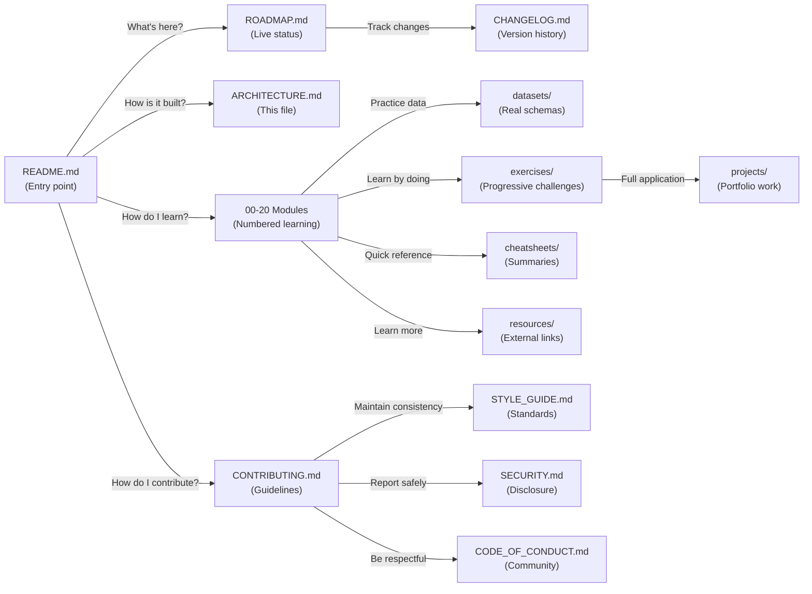

# Repository Architecture

This document explains how the SQL Engineering Handbook is organized, why it is structured this way, and how the different components interact. It is written for contributors, maintainers, and curious learners who want to understand the reasoning behind the repository design.

---

## Table of Contents

- [Repository Philosophy](#repository-philosophy)
- [Architectural Goals](#architectural-goals)
- [Repository Structure](#repository-structure)
- [Learning Architecture](#learning-architecture)
- [Module Architecture](#module-architecture)
- [Documentation Architecture](#documentation-architecture)
- [Data Architecture](#data-architecture)
- [Engineering Standards](#engineering-standards)
- [Repository Workflow](#repository-workflow)
- [Repository Dependency Diagram](#repository-dependency-diagram)
- [Contributor Workflow](#contributor-workflow)
- [Design Principles](#design-principles)

---

## Repository Philosophy

### Why This Project Exists

The SQL Engineering Handbook exists to bridge a gap in how SQL is taught. Most educational resources present SQL as a syntax-driven subject with disconnected examples. This project teaches SQL the way it is used inside real companies: starting with business problems, working toward solutions, and building a foundation for production analytics work.

This is not a cheat sheet. It is not a tutorial blog. It is an engineering handbook — built like the internal documentation of well-run data organizations.

### What Makes It Different

| Aspect | Typical SQL Resource | SQL Engineering Handbook |
|--------|---------------------|--------------------------|
| **Context** | Bare code snippets | Business problem first, SQL second |
| **Data** | One generic toy table | Multiple real-world-style datasets (HR, e-commerce, sales, finance, healthcare) |
| **Depth** | Surface explanation | Why the approach works, common mistakes, performance notes, interview follow-ups |
| **Standards** | None enforced | Consistent formatting, naming, documentation across every module |
| **Progress** | Static | Live roadmap with versioned updates |
| **Community** | Solo or closed | Public contribution process with standards |

### Educational Philosophy

The handbook teaches **reasoning before syntax**. A learner should understand *why* a query is structured a certain way before memorizing *that* it should be structured that way. This means:

- Every query answers a specific business question
- Explanations focus on the logical execution order, not memorization
- Common mistakes are documented to build intuition
- Performance considerations are noted for production awareness

### Engineering Philosophy

Code quality matters, even in educational contexts. Every SQL file is production-ready because:

- Students learn what good SQL looks like from day one
- The barrier between learning and working narrows
- Maintainability improves across the entire repository
- Interview readiness is built in, not bolted on

### Business-First Philosophy

Modules are not organized by SQL syntax. They are organized by business impact and progression of analytical power:

1. **Foundations** — Basic querying (Modules 00–02)
2. **Core SQL** — Multi-table logic and conditional logic (Modules 03–06)
3. **Analytical SQL** — Window functions, CTEs, and business analysis (Modules 07–09)
4. **Engineering SQL** — Performance, optimization, scalability (Modules 10–16)
5. **Career Ready** — Interview prep, projects, portfolio (Modules 17–20)

---

## Architectural Goals

### Scalability

The repository must grow to 21 modules without becoming confusing or unnavigable. Achieved through:

- Consistent naming: numbered prefixes (`01_`, `02_`, etc.) enforce sequential discovery
- Self-contained modules: each module is a unit that can be understood independently
- Clear documentation: README, roadmap, and contributing guide prevent confusion as contributors join

### Maintainability

Future maintainers (you, a team member, the community) must be able to understand the entire structure and add new modules without breaking existing ones. Achieved through:

- Standardized module format: every numbered module follows the same layout
- Clear architectural documentation: this file explains the reasoning
- Automated checks: `.markdownlint.json` and CI workflows enforce style
- CODEOWNERS: clear ownership prevents confusion about who reviews what

### Consistency

Every module, every query, every documentation file must feel like it was written by the same team, even as contributors grow. Achieved through:

- STYLE_GUIDE.md: single source of truth for format and tone
- Templated module structure: README → lesson files → SQL files → practice
- Automated linting: markdown and SQL formatting checked before merge
- Code review process: maintainers enforce standards in pull requests

### Discoverability

A visitor should be able to find what they need — whether sequential learning, targeted interview prep, or a specific SQL pattern. Achieved through:

- Numbered modules with clear progression
- Topic-based directories (exercises/, projects/, cheatsheets/)
- Comprehensive README with multiple entry points
- Roadmap showing what exists and what's coming

### Reusability

Code and documentation should be written once and reused across multiple contexts. Achieved through:

- Shared datasets: `datasets/` contains the truth; modules reference it
- Query templates: common patterns are extracted into reusable examples
- Cheatsheets: frequency-based summaries of completed modules
- Cross-references: related modules link to each other

### Contributor Friendliness

It should be easy to contribute. The barriers to entry should be low, but standards should be clear. Achieved through:

- CONTRIBUTING.md: step-by-step process
- Pull request templates: structure guides contributors
- Issue templates: bug reports and feature requests are standardized
- STYLE_GUIDE.md: no guessing about format

### Documentation First

Every piece of code is a statement about intent and reasoning. Documentation is not an afterthought; it is the primary artifact. Achieved through:

- README.md for every module: context before code
- Markdown guides alongside SQL: explanation is first-class
- Architecture and style guides as root-level files
- Changelog as a dependency: version history is tracked publicly

### Production-First SQL

Every query is written as if it would run in production tomorrow. Achieved through:

- ANSI-standard syntax where practical
- Database-specific notes where needed (MySQL vs. PostgreSQL)
- Performance awareness in comments
- Real data patterns, not toy examples

---

## Repository Structure

### Root-Level Files

```
├── README.md                Primary entry point; explains purpose and learning tracks
├── ROADMAP.md               Live progress tracking; what's complete, what's next
├── CHANGELOG.md             Version history; what changed and when
├── ARCHITECTURE.md          This file; explains why the repo is organized this way
├── STYLE_GUIDE.md           Standards every module and query follows
├── CONTRIBUTING.md          How to contribute and review process
├── CODE_OF_CONDUCT.md       Community standards and expectations
├── SECURITY.md              How to report security concerns
├── FAQ.md                   Frequently asked questions
├── LICENSE                  MIT License
```

Each of these files serves a specific purpose in the maintenance and growth of the repository:

- **README** is the first impression; it sets tone and expectations
- **ROADMAP** is the truth about progress; updated weekly
- **CHANGELOG** is historical tracking; every release is documented
- **ARCHITECTURE** (this file) explains the *why* behind decisions
- **STYLE_GUIDE** is the enforcement mechanism; no surprises
- **CONTRIBUTING** is the path to involvement; clear steps
- **CODE_OF_CONDUCT** sets community boundaries; non-negotiable
- **SECURITY** shows we take safety seriously; trust is built here
- **FAQ** answers common questions; reduces support burden
- **LICENSE** is legal clarity; no guessing about rights

### .github/

```
.github/
├── ISSUE_TEMPLATE/
│   ├── bug_report.md        For reporting bugs
│   ├── feature_request.md   For requesting new modules or features
│   └── documentation.md     For documentation issues
├── PULL_REQUEST_TEMPLATE.md Guides contributor PRs
├── workflows/
│   ├── lint.yml             Checks markdown and SQL formatting
│   └── ci.yml               Runs automated validations
└── CODEOWNERS              Specifies reviewers by file/directory
```

These files enforce consistency and guide the contribution process without maintainers needing to repeat themselves.

### assets/

```
assets/
├── banners/                 README banners and social images
├── diagrams/                Mermaid diagrams (roadmaps, relationships)
├── screenshots/             Step-by-step setup and usage images
├── logos/                   Project branding
└── gifs/                    Animated workflow examples
```

Visual assets support the documentation and make the repository more approachable.

### datasets/

```
datasets/
├── employee_management/     HR, hiring, departmental data
│   ├── schema.sql
│   ├── seed_data.sql
│   └── README.md
├── ecommerce/              Orders, customers, products
│   ├── schema.sql
│   ├── seed_data.sql
│   └── README.md
├── sales/                  Deals, regions, quotas
├── finance/                Budgets, expenses, revenue
├── healthcare/             Patients, treatments, providers
└── nagpurlens/             City-based tourism and business data
```

Each dataset represents a real business context. Modules reference them, exercises practice on them, and projects build with them. This centralization ensures consistency and makes dataset updates automatic across all modules.

### resources/

```
resources/
├── books.md                Recommended reading on SQL and data
├── blogs.md                Curated blog posts and articles
├── documentation.md        Official database documentation links
├── youtube.md              Video tutorials and talks
└── interview-resources.md  Interview-specific prep material
```

These files curate external learning material without duplicating it. They answer "where do I learn more?" and "what do other experts recommend?"

### cheatsheets/

```
cheatsheets/
├── joins/                  All join types in one place
├── ctes/                   CTE patterns and syntax
├── windows/                Window function reference
├── dates/                  Date function syntax by database
├── strings/                String manipulation patterns
└── aggregation/            Aggregate function reference
```

Cheatsheets are frequency-based summaries of completed modules. They are generated *after* a module is complete, not before, ensuring they reflect actual module content.

### exercises/

```
exercises/
├── beginner/               100-level challenges (Modules 01–03)
├── intermediate/           200-level challenges (Modules 04–06)
├── advanced/               300-level challenges (Modules 07–09)
└── interview/              Real interview questions and answers
```

Exercises are separate from modules but tied to them. A learner completes a module, then uses exercises to strengthen understanding. Difficulty levels match module progression.

### projects/

```
projects/
├── hr-analytics/           Employee trends, turnover, compensation
├── ecommerce/              Customer lifetime value, cohort analysis
├── pizza-sales/            Restaurant analytics, peak hours, trends
├── olist/                  Brazilian ecommerce multivendor analysis
└── nagpurlens/             Tourism and local business analytics
```

Projects are end-to-end case studies. They use completed modules and real-world datasets, forcing learners to apply concepts in context. Each project has:

- A business problem statement
- A dataset schema and seed data
- A set of questions to answer with SQL
- Expected results and notes
- Discussion of alternative approaches

### Numbered Modules (00–20)

```
00_SAMPLE_DATABASE/
01_FUNDAMENTALS/
02_AGGREGATIONS/
... (numbered up to 20)
```

Each module follows a standardized layout (see [Module Architecture](#module-architecture) below). The numbering enforces sequence and prevents alphabetical confusion.

---

## Learning Architecture

### Why Modules Are Numbered

Numbering serves multiple purposes:

1. **Sequential enforcement**: Learners follow `00 → 01 → 02` without jumping around
2. **Prerequisite clarity**: Module 05 depends on 01–04; the numbers make this obvious
3. **Consistent navigation**: No confusion about whether to read "Fundamentals" or "01_Fundamentals"
4. **Folder sorting**: Filesystem tools naturally sort by number, not alphabetically

### Learning Progression

The progression is intentional and builds on itself:

**Foundations (Modules 00–02)**
- Module 00: Sample database schema setup (prerequisite for everything)
- Module 01: Fundamentals (SELECT, WHERE, ORDER BY)
- Module 02: Aggregations (GROUP BY, HAVING, aggregate functions)

*Why this order?* SELECT and WHERE are the foundation; aggregations build directly on them.

**Core SQL (Modules 03–06)**
- Module 03: Joins (combining tables)
- Module 04: CASE WHEN (conditional logic)
- Module 05: Subqueries (nested queries)
- Module 06: CTEs (readable subqueries)

*Why this order?* JOINs are the next capability after filtering. CASE WHEN is simpler than subqueries. Subqueries lead naturally to CTEs.

**Analytical SQL (Modules 07–09)**
- Module 07: Window Functions (analytical power)
- Module 08: Window Function Business Cases (applied window functions)
- Module 09: Date Functions (time-based analysis)

*Why this order?* Window functions are the most complex core concept; business cases show their power before moving to supporting functions.

**Engineering SQL (Modules 10–16)**
- Module 10: String Functions (data manipulation)
- Module 11: NULL Handling & Data Cleaning (real-world complexity)
- Module 12: Advanced Aggregations (edge cases)
- Module 13: Set Operators (combining result sets)
- Module 14: Views (code organization)
- Module 15: Indexes (performance)
- Module 16: Query Optimization (engineering concern)

*Why this order?* String functions and NULL handling unlock practical data work. Set operators extend aggregations. Views and indexes are organizational; optimization is the capstone.

**Career Ready (Modules 17–20)**
- Module 17: SQL Interview Questions (targeted prep)
- Module 18: SQL Business Case Studies (comprehensive projects)
- Module 19: SQL Projects (portfolio building)
- Module 20: SQL Cheatsheet (quick reference)

*Why this order?* Interview questions are narrowly scoped. Case studies and projects are broader. Cheatsheet is the final reference.

### Dependency Graph

```
00 (Sample Database)
   ├→ 01 (Fundamentals)
   │  ├→ 02 (Aggregations)
   │  │  ├→ 03 (Joins)
   │  │  │  ├→ 04 (CASE WHEN)
   │  │  │  ├→ 05 (Subqueries)
   │  │  │  │  └→ 06 (CTEs)
   │  │  │  │     └→ 07 (Window Functions)
   │  │  │  │        └→ 08 (Window Business Cases)
   │  │  │  │           └→ 09 (Date Functions)
   │  │  │  │              ├→ 10 (String Functions)
   │  │  │  │              ├→ 11 (NULL Handling)
   │  │  │  ├→ 12 (Advanced Aggregations)
   │  │  │  ├→ 13 (Set Operators)
   │  │  │  └→ 14-16 (Views, Indexes, Optimization)
   │  └→ 17-20 (Interview, Case Studies, Projects, Cheatsheet)
```

A learner does not need to complete all of 01–09 before starting a project, but they should complete 01–03 before attempting 04. The ROADMAP shows estimated time and prerequisites.

---

## Module Architecture

### Why Modules Follow a Standard Layout

Standardization solves multiple problems:

1. **Predictability**: A learner knows where to find what
2. **Consistency**: Every module feels like it was written by the same team
3. **Maintainability**: New contributors can follow a template
4. **Scalability**: 21 modules do not feel overwhelming if they are all structured the same way

### Standard Module Layout

Every numbered module contains:

```
NN_MODULE_NAME/
├── README.md               Learning objectives, overview, topics
├── 01_TOPIC_NAME.md        First concept explanation and syntax
├── 01_TOPIC_NAME.sql       First concept example queries
├── 02_TOPIC_NAME.md        Second concept explanation
├── 02_TOPIC_NAME.sql       Second concept examples
├── ... (additional topic pairs)
└── PRACTICE.md             Practice problems and solutions
```

### README Standards (Per Module)

Every module README contains these sections in order:

1. **Module title and number** — e.g., "# 01 — SQL Fundamentals"
2. **Badges** — Level, estimated time, topic count, status
3. **Table of Contents** — Clickable navigation
4. **Overview** — One paragraph explaining what the module teaches
5. **Learning Objectives** — Checkbox list of concrete skills
6. **Topics Covered** — Table of topics with file links
7. **Folder Structure** — Directory listing showing organization
8. **Recommended Learning Order** — Why topics are in this sequence
9. **Skills Developed** — What a learner can do after completion
10. **Real-World Applications** — Who uses these skills in industry
11. **Best Practices** — Standard approaches and anti-patterns
12. **Prerequisites** — What must be completed first
13. **How to Use This Module** — Step-by-step instructions
14. **Next Section** — Link to the following module

This structure is consistent across all modules, making navigation predictable.

### Concept File Standards (.md files)

Each concept file (e.g., `01_SELECT.md`) contains:

1. **Concept name as H1** — e.g., "# SELECT"
2. **Purpose statement** — One sentence on why this concept matters
3. **Syntax box** — ANSI-standard syntax with database-specific notes
4. **Common use case** — Real scenario where this is used
5. **Examples with explanations** — 2–3 worked examples
6. **Common mistakes** — Anti-patterns and why they fail
7. **Performance notes** — Cost considerations for large datasets
8. **Interview follow-ups** — Questions typically asked
9. **Further reading** — Links to external resources

### SQL File Standards (.sql files)

Each paired SQL file contains:

1. **File header comment** — Module, concept, business context
2. **Database setup** — Which dataset to use
3. **Annotated examples** — Queries with inline comments explaining logic
4. **Expected output** — What results should be returned
5. **Practice challenges** — Variations to try
6. **Performance notes** — Indexed columns, execution time estimates

SQL files are executable as-is. Comments serve learners and maintainers equally.

### Practice File Standards

Each module ends with a `PRACTICE.md` file containing:

1. **Easy challenges** (1–2 difficulty)
2. **Medium challenges** (2–3 difficulty)
3. **Hard challenges** (3+ difficulty)
4. **Solutions** — With explanations of approach
5. **Discussion points** — Why certain solutions are better

---

## Documentation Architecture

### Why These Specific Documents Exist

The repository maintains these documentation files at the root level:

| File | Purpose | Audience |
|------|---------|----------|
| **README.md** | First impression; entry points and overview | Everyone |
| **ROADMAP.md** | Live progress; what's done, what's next | Contributors, learners checking status |
| **ARCHITECTURE.md** | This file; explains design decisions | Maintainers, advanced learners |
| **STYLE_GUIDE.md** | Format and tone standards | Contributors, reviewers |
| **CONTRIBUTING.md** | How to contribute and PR process | Potential contributors |
| **CODE_OF_CONDUCT.md** | Community standards and behavior | Everyone |
| **SECURITY.md** | How to report security issues | Everyone (especially security researchers) |
| **FAQ.md** | Common questions and answers | Learners with setup or usage issues |
| **CHANGELOG.md** | Version history and releases | Anyone tracking project maturity |

Each document is one source of truth. There is no duplication or contradiction between them.

### Maintenance Workflow for Documentation

1. **README** is updated when new modules ship (added to roadmap section)
2. **ROADMAP** is updated weekly to reflect progress
3. **CHANGELOG** is updated on every release (semantic versioning)
4. **STYLE_GUIDE** is updated when standards change (rare, documented in PR)
5. **CONTRIBUTING** is updated when the process changes
6. **ARCHITECTURE** is updated when fundamental structure changes
7. **FAQ** grows as common questions emerge

---

## Data Architecture

### Why Real-World Datasets Matter

Using toy datasets (a single `employees` table with 10 rows) teaches bad habits. Real data is:

- Multi-table (orders, customers, products, payments)
- Messy (NULLs, duplicates, inconsistencies)
- Contextual (foreign keys, business rules)
- Varied (different industries have different patterns)

By practicing on real-world-style datasets, learners:

1. Transfer skills directly to their jobs
2. Learn to join multiple tables, not just one
3. Encounter real data problems (NULLs, inconsistencies)
4. See how different industries organize data

### Supported Industries in Datasets

| Industry | Dataset | Represents |
|----------|---------|------------|
| **HR & Staffing** | employee_management | Hiring, departments, compensation |
| **Retail & Ecommerce** | ecommerce | Orders, customers, products, inventory |
| **B2B Sales** | sales | Deals, regions, quotas, territories |
| **Finance** | finance | Budgets, expenses, revenue, GL |
| **Healthcare** | healthcare | Patients, treatments, providers |
| **Tourism & Local Business** | nagpurlens | City businesses, tourism data |

Each dataset is documented in `datasets/[name]/README.md` with:

- Table relationships (ER diagram)
- Column descriptions and data types
- Sample data (first 10 rows)
- Business context and use cases

### Dataset Reuse Across Modules

A single dataset (e.g., `ecommerce`) is used in:

- **Module 03** (Joins with orders + customers tables)
- **Module 08** (Window functions with revenue by customer)
- **Project: ecommerce** (full customer lifetime value analysis)
- **Exercises: intermediate** (multi-table challenges)
- **Cheatsheet: joins** (example code)

This reuse means:

- Learners become familiar with realistic data
- Queries are consistent (same column names, relationships)
- Maintenance is centralized (fix schema once, all modules update)

---

## Engineering Standards

### Consistency Across All Artifacts

Every query, every markdown file, every code block must feel like part of one coherent resource.

**SQL formatting** is consistent:
- Keywords uppercase (SELECT, WHERE, GROUP BY)
- Indentation 4 spaces
- One clause per line (WHERE, JOIN, GROUP BY each on their own line)
- Meaningful table aliases (not `a`, `b`, `t1`)
- Comments explain the *why*, not the *what*

**Markdown formatting** is consistent:
- Heading hierarchy: H1 (module) → H2 (sections) → H3 (subsections)
- Spacing: blank line before and after code blocks
- Tables: for comparisons and structured data
- Links: always include context in link text

**Naming conventions** are enforced:
- Directories: `NN_MODULE_NAME` (zero-padded numbers)
- Files: concept name in snake_case (e.g., `01_SELECT.md`)
- Variables in SQL: lowercase with underscores (`employee_id`, `hire_date`)

### Naming Conventions in Detail

#### Folder Naming

- **Numbered modules**: `NN_MODULE_NAME` (e.g., `01_FUNDAMENTALS`, `17_SQL_INTERVIEW_QUESTIONS`)
- **Support directories**: lowercase with underscores (e.g., `datasets`, `resources`, `cheatsheets`)
- **GitHub workflows**: kebab-case (e.g., `lint.yml`, `validate-sql.yml`)

#### File Naming

- **Module files**: `NN_TOPIC_NAME.md` and `NN_TOPIC_NAME.sql` (e.g., `01_SELECT.md`, `01_SELECT.sql`)
- **Dataset files**: `schema.sql`, `seed_data.sql`, `README.md`
- **Assets**: descriptive names (e.g., `readme-banner.png`, `sql-roadmap.png`)

#### Variable Naming in SQL

- **Tables**: Plural noun in lowercase (e.g., `employees`, `orders`, `customers`)
- **Columns**: Singular, descriptive, lowercase (e.g., `employee_id`, `order_date`, `customer_name`)
- **Aliases**: Abbreviated table name or context (e.g., `e` for `employees`, `c` for `customers`)
- **CTEs**: Descriptive noun or action (e.g., `active_users`, `monthly_totals`)

### Documentation Quality Metrics

Every module must meet these standards:

1. **Completeness**: All sections present, no placeholders
2. **Correctness**: Queries run and produce expected output
3. **Clarity**: Explanations are concise but thorough
4. **Consistency**: Tone and format match other modules
5. **Testability**: SQL can be executed against provided datasets
6. **Discoverability**: Links work, references are accurate

---

## Repository Workflow

### Visitor Flow

```
visitor lands on GitHub
    ↓
README.md (first impressions)
    ↓
Decision point (goals?)
    ├→ Sequential learner → Start 00_SAMPLE_DATABASE
    ├→ Interview prep → 17_SQL_INTERVIEW_QUESTIONS (or exercises/interview)
    ├→ Desk reference → Use search/roadmap to find pattern
    └→ Curious → ARCHITECTURE.md (this file)
    ↓
Pick entry point
    ↓
Module README (context and topics)
    ↓
Concept markdown files (learn)
    ↓
Concept SQL files (practice)
    ↓
PRACTICE.md (test understanding)
    ↓
Next module or project
```

Every path is intentional. The README lists these paths explicitly so visitors choose without confusion.

### Contribution Flow

```
potential contributor
    ↓
README (see this is open source)
    ↓
CONTRIBUTING.md (understand process)
    ↓
Choose work (new module, fix, dataset, exercise)
    ↓
Fork & create branch
    ↓
Follow STYLE_GUIDE.md
    ↓
Open pull request with template
    ↓
Reviewer (maintainer) checks:
    ├→ STYLE_GUIDE compliance
    ├→ SQL runs without error
    ├→ Explanation is clear
    ├→ Links are valid
    ├→ No duplicate content
    └→ Consistency with rest of repo
    ↓
Address feedback
    ↓
Approved → Merge
    ↓
Close related issues
    ↓
Update ROADMAP.md
    ↓
Bump version in CHANGELOG.md
```

This workflow prevents chaos as contributors grow.

---

## Repository Dependency Diagram



Every file serves a purpose in the ecosystem. New contributors should understand this dependency.

---

## Contributor Workflow

### Before You Start

1. Read `CONTRIBUTING.md` — understand the process
2. Read `STYLE_GUIDE.md` — understand the standards
3. Review a completed module as an example
4. Check `ROADMAP.md` to see what is already in progress (avoid duplicating work)

### Creating a New Module

1. **Create the directory** — `NN_MODULE_NAME` with correct numbering
2. **Write the README.md** — Follow the module README template
3. **Write concept markdown files** — One per concept (e.g., `01_SELECT.md`)
4. **Write concept SQL files** — Matching numbered SQL files with runnable examples
5. **Write PRACTICE.md** — Practice problems and solutions
6. **Test the SQL** — Execute every query against the actual datasets
7. **Cross-link** — Update README.md references in adjacent modules
8. **Update ROADMAP.md** — Mark the module as in progress, then complete
9. **Update CHANGELOG.md** — Note the module in the latest release section

### Adding to an Existing Module

1. **Understand the structure** — How the existing module is organized
2. **Decide on fit** — Should this be a new concept or part of an existing one?
3. **Follow the format** — Matching the tone, explanation depth, and SQL style
4. **Test thoroughly** — SQL must run against the right datasets
5. **Update the module README** — Add the new concept to the topics table
6. **Update PRACTICE.md** — Add challenges that use the new concept
7. **Get review** — Maintainers will check for consistency

### Fixing a Bug or Improving Content

1. **Create an issue** — Describe the problem or improvement
2. **Create a branch** — `git checkout -b fix/issue-name`
3. **Make the change** — Update the file(s)
4. **Test if applicable** — Verify queries still run, links work, etc.
5. **Create a pull request** — Use the template and reference the issue
6. **Address feedback** — Maintainers will review for consistency and accuracy

### Pull Request Review Checklist

Reviewers check for:

- **Formatting**: STYLE_GUIDE.md is followed
- **SQL correctness**: Queries run without error on the target dataset
- **Explanation quality**: Clear, concise, avoids jargon when possible
- **Consistency**: Tone and examples match existing modules
- **Links and references**: All links valid, no broken cross-references
- **No duplication**: Content is not repeated elsewhere
- **Completeness**: All required sections present (for new modules)

---

## Design Principles

### Teach Reasoning

Never ask a learner to memorize syntax. Teach them *why* the syntax exists and when to use it. A learner who understands the logical execution order of a SQL query can construct queries in contexts they have never seen before.

### Teach Engineering

SQL is not just syntax. It is a tool for building systems. Every module touches on:

- Readability: Are variable names clear?
- Maintainability: Can someone else understand this code?
- Performance: Will this query scale to 1 billion rows?
- Correctness: Are edge cases (NULLs, duplicates) handled?

### Teach Business

Every query is answering a business question. Before writing SQL, learners should be able to articulate:

- What business problem does this solve?
- What data is needed to answer it?
- What is success?

This grounds SQL in reality, not in abstract syntax.

### Teach Production SQL

Production SQL is different from tutorial SQL. Tutorial code prioritizes brevity; production code prioritizes clarity and maintainability. Every example in this handbook is production-ready.

### Consistency Over Creativity

Consistency matters more than individual creativity. A repository that feels like one coherent resource is more valuable than a repository where every author has their own style. We enforce standards not to stifle, but to scale.

### Documentation First

Write the documentation first. Write the SQL second. If you cannot explain a concept clearly, you do not understand it well enough. This inversion of typical priorities makes the entire repository stronger.

---

## Maintenance and Growth

### Regular Maintenance Tasks

- **Weekly**: Update ROADMAP.md with progress
- **Per PR**: Enforce STYLE_GUIDE.md compliance
- **Per release**: Update CHANGELOG.md
- **Monthly**: Review open issues for patterns
- **Quarterly**: Audit links and update broken references
- **Annually**: Review ARCHITECTURE.md and STYLE_GUIDE.md for relevance

### Adding New Modules

1. Reserve the module number in ROADMAP.md (mark as "Planned")
2. Follow the standard layout (README + concept files + SQL files + practice)
3. Use one of the established datasets, or create a new one if needed
4. Ensure the module number reflects its logical position (e.g., string functions come after basics, before performance optimization)
5. Announce the new module in discussions before creating the PR

### Evolving Standards

If STYLE_GUIDE.md or ARCHITECTURE.md needs to change:

1. Open an issue proposing the change
2. Discuss with maintainers and community
3. If approved, update the guide
4. Create a retroactive PR addressing existing modules (or schedule this for a future release)
5. Document the change in CHANGELOG.md

The goal is stability with room for improvement.

---

## Conclusion

The SQL Engineering Handbook is built to be:

- **Accessible**: Easy to start, regardless of prior knowledge
- **Scalable**: Growth to 21 modules without becoming overwhelming
- **Maintainable**: Clear structure and standards for contributors
- **Professional**: Production-quality code and documentation
- **Honest**: Clear about what is complete and what is coming

This architecture enables all of these properties to coexist.

---

<p align="center">
  <i>For questions about this document, open an <a href="https://github.com/theammarngp-makes/SQL-Engineering-Handbook/issues">issue</a> or start a <a href="https://github.com/theammarngp-makes/SQL-Engineering-Handbook/discussions">discussion</a>.</i>
</p>
