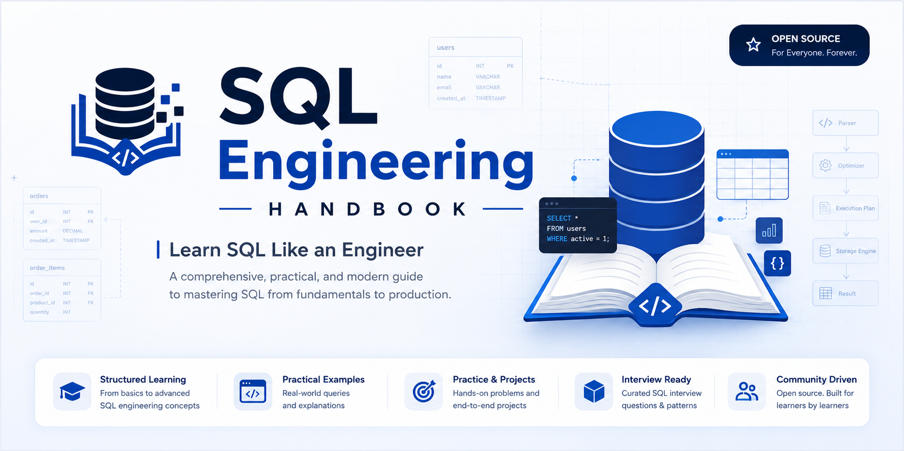

<p align="center">
  
</p>

<h1 align="center">SQL Engineering Handbook</h1>

<p align="center">
  <b>A production-style SQL curriculum — from your first SELECT to analytics engineering, interview prep, and real business case studies.</b>
</p>

<p align="center">
  
</p>

<p align="center">
  
  
  
  
  
  
  
</p>

<p align="center">
  <a href="#who-this-is-for">Who It's For</a> ·
  <a href="#what-makes-it-different">Why Different</a> ·
  <a href="#learning-roadmap">Roadmap</a> ·
  <a href="#repository-structure">Structure</a> ·
  <a href="#quick-start">Quick Start</a> ·
  <a href="#documentation-hub">Docs</a> ·
  <a href="#contributing">Contributing</a> ·
  <a href="#faq">FAQ</a>
</p>

---

## Who This Is For

If you're an aspiring or practicing **Data Analyst** or **Analytics Engineer** who wants a structured path from SQL fundamentals to real business analytics — not another disconnected list of `.sql` files — this handbook is built for you.

> **Honest status:** Modules **00–09** (Foundations → Date Functions) are complete and stable today. Modules **10–20**, plus `datasets/`, `projects/`, `exercises/`, and `cheatsheets/`, are actively being built module by module. Live status always lives in [`ROADMAP.md`](ROADMAP.md) — this README won't claim more than what's actually shipped.

---

## What Makes It Different

| | Typical SQL repo | SQL Engineering Handbook |
|---|---|---|
| 🗄️ Data | One generic sample table | Real-world-style datasets across HR, e-commerce, sales, finance, healthcare |
| 📖 Context | Bare query, no explanation | Business problem stated before every solution |
| ⚠️ Failure modes | Rarely documented | Common mistakes called out per pattern |
| 🎯 Interview angle | Absent | Dedicated interview-prep module + question bank |
| 📅 Progress | Static snapshot | Public roadmap, versioned via [`CHANGELOG.md`](CHANGELOG.md) |
| 🤝 Contribution | Solo repo | Structured community process via [`CONTRIBUTING.md`](CONTRIBUTING.md) |

---

## Feature Highlights

<table>
<tr>
<td width="33%" valign="top">

### 🏗️ Production SQL
Every completed module follows one format: **business context → SQL solution → explanation → common mistakes → interview follow-ups → practice challenge.**

</td>
<td width="33%" valign="top">

### 📊 Real Datasets
Practice is built around real-world-style datasets (HR, e-commerce, sales, finance, healthcare) instead of one toy table, so the SQL transfers directly to a job.

</td>
<td width="33%" valign="top">

### 🎯 Interview Ready
`17_SQL_INTERVIEW_QUESTIONS/` and `exercises/interview/` target the questions that come up most. Until they ship, `08_WINDOW_BUSINESS_CASES/` is the closest match.

</td>
</tr>
<tr>
<td width="33%" valign="top">

### 🧠 Analytics Engineering
Modules progress from syntax → analytical SQL (windows, CTEs) → engineering concerns (views, indexes, query optimization).

</td>
<td width="33%" valign="top">

### 🧪 Exercises & Projects
`exercises/` (beginner → interview) and `projects/` (HR analytics, e-commerce, pizza sales, Olist, NagpurLens) turn concepts into a portfolio.

</td>
<td width="33%" valign="top">

### 📚 Documentation Quality
Architecture, style guide, roadmap, and changelog are first-class files — not afterthoughts — so the repo stays maintainable as it grows.

</td>
</tr>
</table>

---

## Learning Roadmap

```mermaid
flowchart LR
    subgraph Foundations
    A[00 Sample Database] --> B[01 Fundamentals]
    B --> C[02 Aggregations]
    C --> D[03 Joins]
    end
    subgraph Core_SQL[Core SQL]
    D --> E[04 CASE WHEN]
    E --> F[05 Subqueries]
    F --> G[06 CTEs]
    end
    subgraph Analytical_SQL[Analytical SQL]
    G --> H[07 Window Functions]
    H --> I[08 Window Business Cases]
    I --> J[09 Date Functions]
    end
    subgraph Engineering_SQL[Engineering SQL]
    J --> K[10-13 Strings, Nulls, Advanced Aggs, Set Ops]
    K --> L[14-16 Views, Indexes, Query Optimization]
    end
    subgraph Career_Ready[Career Ready]
    L --> M[17 Interview Questions]
    M --> N[18 Business Case Studies]
    N --> O[19 Projects]
    O --> P[20 Cheatsheet]
    end
```



<details>
<summary><b>Full module-by-module status</b></summary>
<br>

| # | Module | Status |
|---|---|---|
| 00 | Sample Database | ✅ Complete |
| 01 | Fundamentals | ✅ Complete |
| 02 | Aggregations | ✅ Complete |
| 03 | Joins | ✅ Complete |
| 04 | Subqueries | ✅ Complete |
| 05 | CASE WHEN | ✅ Complete |
| 06 | CTEs | ✅ Complete |
| 07 | Window Functions | ✅ Complete |
| 08 | Window Function Business Cases | ✅ Complete |
| 09 | Date Functions | ✅ Complete |
| 10 | String Functions | ✅ Complete |
| 11 | NULL Handling & Data Cleaning | ✅️ Complete |
| 12 | Advanced Aggregations | ✅️ Complete |
| 13 | Set Operators | ✅️ Complete |
| 14 | Views | 🔄 In Progress |
| 15 | Indexes | 🔄 In Progress |
| 16 | Query Optimization | 🔄 In Progress |
| 17 | SQL Interview Questions | 🔄 In Progress |
| 18 | SQL Business Case Studies | 🔄 In Progress |
| 19 | SQL Projects | 🔄 In Progress |
| 20 | SQL Cheatsheet | 🔄 In Progress |

**Legend:** ✅ Complete &nbsp;·&nbsp; 🔄 In Progress &nbsp;·&nbsp; 📋 Planned

Live tracking always in [`ROADMAP.md`](ROADMAP.md).
</details>

---

## Repository Structure

```text
SQL-Engineering-Handbook/
│
├── README.md                          You are here
├── ROADMAP.md                         Live module-by-module progress
├── CHANGELOG.md                       Version history
├── ARCHITECTURE.md                    Why the repo is organized this way
├── STYLE_GUIDE.md                     Format every module/query follows
├── CONTRIBUTING.md                    How to contribute
├── CODE_OF_CONDUCT.md                 Community standards
├── SECURITY.md                        How to report security concerns
├── FAQ.md                             Common questions
├── LICENSE                            MIT
│
├── .github/                           Issue/PR templates, CI workflows, CODEOWNERS
│   ├── ISSUE_TEMPLATE/
│   ├── workflows/
│   ├── PULL_REQUEST_TEMPLATE.md
│   └── CODEOWNERS
│
├── assets/                            Banners, diagrams, screenshots, logos
│   ├── banners/
│   ├── diagrams/
│   ├── screenshots/
│   ├── logos/
│   └── gifs/
│
├── datasets/                          Real-world practice datasets
│   ├── employee_management/
│   ├── ecommerce/
│   ├── sales/
│   ├── finance/
│   ├── healthcare/
│   └── nagpurlens/
│
├── resources/                         Curated external learning material
│   ├── books.md
│   ├── blogs.md
│   ├── documentation.md
│   ├── youtube.md
│   └── interview-resources.md
│
├── cheatsheets/                        Quick-reference syntax guides
│   ├── joins/
│   ├── ctes/
│   ├── windows/
│   ├── dates/
│   ├── strings/
│   └── aggregation/
│
├── exercises/                          Practice problems by difficulty
│   ├── beginner/
│   ├── intermediate/
│   ├── advanced/
│   └── interview/
│
├── projects/                           End-to-end portfolio projects
│   ├── hr-analytics/
│   ├── ecommerce/
│   ├── pizza-sales/
│   ├── olist/
│   └── nagpurlens/
│
├── 00_SAMPLE_DATABASE/                 ✅ Practice schema + seed data
├── 01_FUNDAMENTALS/                    ✅ SELECT, WHERE, ORDER BY, LIMIT
├── 02_AGGREGATIONS/                    ✅ GROUP BY, HAVING, aggregate functions
├── 03_JOINS/                           ✅ Inner, Left, Right, Full, Cross
├── 04_CASE_WHEN/                       ✅ Conditional logic & transforms
├── 05_SUBQUERIES/                      ✅ Scalar, inline, correlated
├── 06_CTEs/                            ✅ Common Table Expressions & recursion
├── 07_WINDOW_FUNCTIONS/                ✅ ROW_NUMBER, RANK, LAG/LEAD
├── 08_WINDOW_BUSINESS_CASES/           ✅ Applied window function scenarios
├── 09_DATE_FUNCTIONS/                  ✅ Date arithmetic, formatting, ranges
├── 10_STRING_FUNCTIONS/                🔄 In progress
├── 11_NULL_HANDLING_AND_DATA_CLEANING/ 🔄 In progress
├── 12_ADVANCED_AGGREGATIONS/           🔄 In progress
├── 13_SET_OPERATORS/                   🔄 In progress
├── 14_VIEWS/                           🔄 In progress
├── 15_INDEXES/                         🔄 In progress
├── 16_QUERY_OPTIMIZATION/              🔄 In progress
├── 17_SQL_INTERVIEW_QUESTIONS/         🔄 In progress
├── 18_SQL_BUSINESS_CASE_STUDIES/       🔄 In progress
├── 19_SQL_PROJECTS/                    🔄 In progress
└── 20_SQL_CHEATSHEET/                  🔄 In progress
```

Every numbered module is self-contained: read its own README, run its queries against the relevant dataset, then attempt the practice challenge at the end. See [`ARCHITECTURE.md`](ARCHITECTURE.md) for the reasoning behind this layout.

---

## Quick Start

```bash
# 1. Clone the repository
git clone https://github.com/theammarngp-makes/SQL-Engineering-Handbook.git
cd SQL-Engineering-Handbook

# 2. Load a practice dataset (start with the core sample database)
mysql -u root -p < 00_SAMPLE_DATABASE/schema.sql

# 3. Start with Fundamentals, or jump to any completed module
cd 01_FUNDAMENTALS
```

**Database:** MySQL 8.0+. Queries are ANSI-standard where possible, with MySQL-specific notes called out — most run on PostgreSQL with minor syntax changes.

---

## Learning Tracks

<details>
<summary><b>📘 Sequential learner</b> — go module by module</summary>
<br>

Work straight through `00_SAMPLE_DATABASE` → `09_DATE_FUNCTIONS` (currently complete), then continue into `10`–`20` as they release. No prior SQL knowledge assumed.
</details>

<details>
<summary><b>🎯 Interview sprint</b> — targeted prep</summary>
<br>

Once live, `17_SQL_INTERVIEW_QUESTIONS/` and `exercises/interview/` will be the fastest path. Until then, `07_WINDOW_FUNCTIONS/` and `08_WINDOW_BUSINESS_CASES/` cover the most commonly tested interview topic.
</details>

<details>
<summary><b>📚 Desk reference</b> — search when you need a pattern</summary>
<br>

Bookmark the repo and jump directly to the numbered module matching the syntax you need on the job.
</details>

---

## Sample Query

**Salary ranking with window functions** *(from `07_WINDOW_FUNCTIONS/`)*

```sql
SELECT
    emp_id,
    emp_name,
    salary,
    RANK() OVER (ORDER BY salary DESC) AS salary_rank,
    LAG(salary) OVER (ORDER BY salary DESC) AS prev_salary
FROM employees;
```

Every completed module follows this format: business context → SQL solution → explanation → common mistakes → interview follow-ups → practice challenge.

---

## Documentation Hub

| Doc | Purpose |
|---|---|
| [`ROADMAP.md`](ROADMAP.md) | Live module-by-module progress and what's next |
| [`ARCHITECTURE.md`](ARCHITECTURE.md) | How the repo, datasets, and modules are structured and why |
| [`STYLE_GUIDE.md`](STYLE_GUIDE.md) | Format every module and query follows |
| [`CHANGELOG.md`](CHANGELOG.md) | Version history of the handbook |
| [`FAQ.md`](FAQ.md) | Common questions about setup and usage |
| [`CONTRIBUTING.md`](CONTRIBUTING.md) | How to contribute |
| [`SECURITY.md`](SECURITY.md) | How to report security concerns |
| [`CODE_OF_CONDUCT.md`](CODE_OF_CONDUCT.md) | Community standards |

**GitHub features:** [Issues](https://github.com/theammarngp-makes/SQL-Engineering-Handbook/issues) for bugs and requests · [Discussions](https://github.com/theammarngp-makes/SQL-Engineering-Handbook/discussions) for questions about a specific query or module.

---

## Contributing

This project is being built module by module, and contributions are genuinely welcome — new queries, dataset additions, exercises, corrections, or documentation improvements.

1. Fork the repository
2. Create a feature branch
3. Follow the format in [`STYLE_GUIDE.md`](STYLE_GUIDE.md)
4. Open a pull request using the template in [`.github/PULL_REQUEST_TEMPLATE.md`](.github/PULL_REQUEST_TEMPLATE.md)

Full standards live in [`CONTRIBUTING.md`](CONTRIBUTING.md). Please review the [`CODE_OF_CONDUCT.md`](CODE_OF_CONDUCT.md) before participating.

- 🐛 Found a bug? [Open an issue](https://github.com/theammarngp-makes/SQL-Engineering-Handbook/issues)
- 💬 Question about a query? Start a [Discussion](https://github.com/theammarngp-makes/SQL-Engineering-Handbook/discussions)
- 🔐 Security concern? See [`SECURITY.md`](SECURITY.md)

---

## FAQ

**Is this finished?**
No — and it says so on purpose. Modules 00–09 are complete and stable. 10–20, plus datasets, exercises, projects, and cheatsheets, are actively being built. Check [`ROADMAP.md`](ROADMAP.md) for live status.

**Do I need MySQL specifically?**
Queries are ANSI-standard where possible, with MySQL-specific notes called out. Most run on PostgreSQL with minor syntax changes.

**Is this beginner-friendly?**
Yes — start at `01_FUNDAMENTALS/`. It assumes no prior SQL knowledge.

**Can I use this for interview prep only?**
That's the goal of `17_SQL_INTERVIEW_QUESTIONS/` and `exercises/interview/` once live; until then, `08_WINDOW_BUSINESS_CASES/` is the closest match.

More in [`FAQ.md`](FAQ.md).

---

## License

Licensed under the **MIT License**. See [`LICENSE`](LICENSE) for details.

---

## ✍️ About the Author
 
<table>
<tr>
<td width="90"></td>
<td>
<b>Mohammad Ammar</b> — Co-Founder @ <a href="https://github.com/Apex-Analyticx-group">Apex Analyticx</a>, Data Analytics Engineer, author of the <a href="https://github.com/theammarngp-makes/SQL-Engineering-Handbook">SQL Engineering Handbook</a> (20+ modules). Based in Nagpur, India.
</td>
</tr>
</table>

[](https://theammarngp-makes.github.io)
[](https://www.linkedin.com/in/mohammad-ammar-ngp/)
[](https://x.com/theammarngp)
[](mailto:theammarngp@gmail.com)
 
---
---

<p align="center">
  This handbook is built in public and updated regularly. If it's useful to you, starring the repo helps more learners find it — and following along tracks its progress from here to a full 21-module release.
</p>


