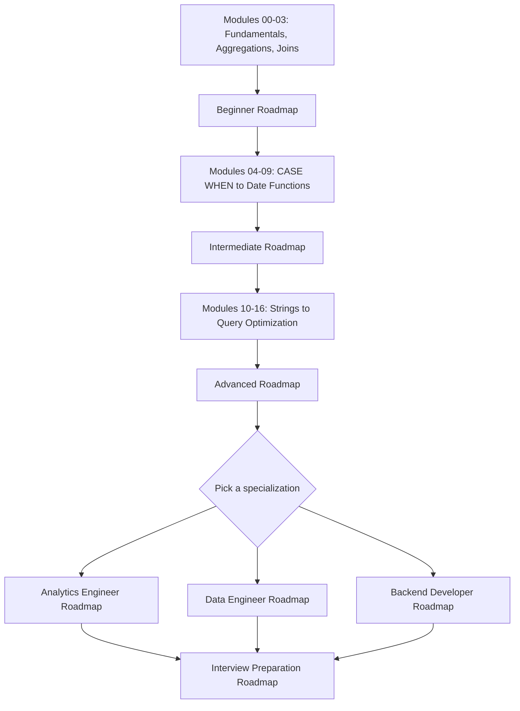

# 📚 Resources Library

*Part of the [SQL Engineering Handbook](../README.md) — the curated external learning collection that picks up where the Handbook's own modules leave off.*

> [!NOTE]
> All 13 files in this library are now in place. Root documentation and platform links were checked against current sources where it mattered most (official docs, vendor rebrands); well-established books, blogs, and communities relied on strong existing knowledge rather than an individual fetch per entry — see the note at the end of [Summary](#summary) for what that means in practice.

---

## Table of Contents

- [Introduction](#introduction)
- [Purpose of the Resources Library](#purpose-of-the-resources-library)
- [How to Use These Resources](#how-to-use-these-resources)
- [Learning Philosophy](#learning-philosophy)
- [Recommended Learning Path](#recommended-learning-path)
- [Who This Collection Is For](#who-this-collection-is-for)
- [Role-Based Roadmaps](#role-based-roadmaps)
  - [Beginner Roadmap](#beginner-roadmap)
  - [Intermediate Roadmap](#intermediate-roadmap)
  - [Advanced Roadmap](#advanced-roadmap)
  - [Analytics Engineer Roadmap](#analytics-engineer-roadmap)
  - [Data Engineer Roadmap](#data-engineer-roadmap)
  - [Backend Developer Roadmap](#backend-developer-roadmap)
  - [Interview Preparation Roadmap](#interview-preparation-roadmap)
- [How Resources Were Selected](#how-resources-were-selected)
  - [Resource Card Template](#resource-card-template)
- [Quality Standards](#quality-standards)
- [Contribution Guidelines](#contribution-guidelines)
- [Folder Structure](#folder-structure)
- [Summary](#summary)
---

| Resource Library File | Description | Link |
| :--- | :--- | :--- |
| 📖 **Books** | Curated list of essential SQL & database architecture books | [`books.md`](./books.md) |
| ✍️ **Blogs** | Official vendor blogs and real-world engineering postmortems | [`blogs.md`](./blogs.md) |
| 📑 **Documentation** | Primary dialect docs for Postgres, MySQL, Snowflake, BigQuery, etc. | [`documentation.md`](./documentation.md) |
| 🎥 **YouTube Channels** | Curated playlists and video tutorials for all skill levels | [`youtube.md`](./youtube.md) |
| 🎯 **Interview Resources** | Staged 30/60/90-day interview roadmaps & technical prep | [`interview-resources.md`](./interview-resources.md) |
| 📰 **Newsletters** | Weekly digests, dbt updates, and Postgres Weekly | [`newsletters.md`](./newsletters.md) |
| 🎓 **Courses** | Free and paid structured SQL learning paths | [`courses.md`](./courses.md) |
| 📊 **Datasets** | Real-world public datasets for query practice | [`datasets.md`](./datasets.md) |
| 🛠️ **Playgrounds** | Browser-based SQL execution sandboxes and DB clients | [`playgrounds.md`](./playgrounds.md) |
| 📜 **Certifications** | Industry-recognized database and cloud certifications | [`certifications.md`](./certifications.md) |
| 🌐 **Communities** | Slack groups, Discord servers, Reddit, and developer forums | [`communities.md`](./communities.md) |
| 🧰 **Awesome Tools** | DB clients, ERD diagram tools, formatters, and query editors | [`awesome-tools.md`](./awesome-tools.md) |

---

## Introduction

The 00–20 modules in this repository teach SQL by having you run real queries against real schemas and defend real business decisions. That's the "how." This folder is the "then what" — where to go once a module is finished and you want the official word on a feature, a book-length treatment of a topic a module `README` can't fully cover, or a mock interview to prove you actually learned it.

Nothing here duplicates the Handbook's own content. Think of it as what a senior engineer on your team would send you in a DM if you asked, "where did you actually learn this."

## Purpose of the Resources Library

The modules answer *"how do I write this query."* This folder answers three questions a repo of exercises can't fully answer on its own:

- **"Is this really how the database works, or just how this repo teaches it?"** — answered by pointing at the official documentation for the dialect in question, not a paraphrase of it.
- **"I finished the module — where's the deeper, book-length version of this topic?"** — answered by a curated reading list, organized so you're not guessing which of fifty SQL books is worth your time.
- **"How do I prove I can do this under interview pressure?"** — answered by a dedicated, staged interview-prep path.

If a topic is already taught end-to-end in a module, this library points *past* it — toward primary sources, alternate explanations, and the parts of the job (interviews, performance tuning, warehouse design) that go beyond what any single repository can hold.

## How to Use These Resources

- **Don't start here.** Start with [`00_SAMPLE_DATABASE`](../00_SAMPLE_DATABASE/) and work through the modules in order. Come back to this folder when a module raises a question it doesn't fully answer itself.
- **Match the roadmap to your actual goal**, not to how impressive the full list looks. A backend developer and an analytics engineer need depth in different places — see [Role-Based Roadmaps](#role-based-roadmaps).
- **Check Difficulty and Estimated Time before committing.** Every resource card in the other files states both, specifically so a resource fits into a real week instead of an idealized one.
- **Treat "Free or Paid" as a real filter.** A paid resource is only listed when nothing free covers the same ground as well — no roadmap here requires spending money.
- **Use the `Related SQL Handbook Modules` field** on each card to jump back into this repo's own exercises once the theory makes sense.

## Learning Philosophy

This library is curated under the same rule the Handbook's modules follow: **a business question first, the syntax second.** A resource that teaches `RANK()` by ranking an arbitrary list of numbers is worth less than one that teaches it by finding each region's top-3 salespeople — even if the SQL on the page is identical.

Three things follow from that:

1. **Primary sources over paraphrase.** Official documentation is preferred over a tutorial that repeats the documentation with extra ads around it.
2. **Depth over breadth, sequenced.** The roadmaps below are ordered on purpose — advanced material assumes the intermediate material is comfortable, not just "read once."
3. **Evergreen over trending.** A resource earns its spot because the ideas hold up, not because it's new. Where recency genuinely matters (a cloud platform's current feature set, say), that's called out explicitly on the card.

## Recommended Learning Path



The path is linear through **Beginner → Intermediate → Advanced**, then branches by role. You don't need all three specializations — pick the one that matches where you're headed, and only detour into the others if a specific job description asks for it.

## Who This Collection Is For

| Reader | What You'll Get Here |
|---|---|
| Learners who've finished modules 00–03 and want to keep momentum | A structured next step instead of a random search |
| Career switchers targeting a Data Analyst / Data Scientist role | A path that lines up with what that interview loop actually tests |
| Analytics engineers | Warehouse, dbt, and modeling depth past what one repo's schema can show |
| Data engineers | Distributed-SQL and platform documentation (Spark, BigQuery, Redshift) |
| Backend / software engineers who touch SQL occasionally | Transactions, indexing, and schema-design material scoped to "enough to be dangerous safely" |
| Anyone with a SQL interview in the next 30–90 days | A staged plan in [`interview-resources.md`](interview-resources.md), not just a question bank |
| Contributors | A documented [Resource Card Template](#resource-card-template) and [Contribution Guidelines](#contribution-guidelines) so additions stay consistent |

## Role-Based Roadmaps

Each roadmap assumes the previous one is solid — Intermediate assumes Beginner is comfortable, and so on. The three specializations assume Advanced is done; pick one rather than doing all three back to back.

### Beginner Roadmap

**Goal:** read and write correct, simple SQL against a real schema.

| Handbook Modules (this repo) | Go Deeper in This Library | Est. Time |
|---|---|---|
| [`00_SAMPLE_DATABASE`](../00_SAMPLE_DATABASE/), [`01_FUNDAMENTALS`](../01_FUNDAMENTALS/), [`02_AGGREGATIONS`](../02_AGGREGATIONS/), [`03_JOINS`](../03_JOINS/) (inner/left) | [`documentation.md`](documentation.md) → your chosen dialect's official docs · [`books.md`](books.md) → *Essential Beginner Books* · [`youtube.md`](youtube.md) → *SQL Fundamentals* | 3–4 weeks |

**Exit criteria:** you can independently answer a business question with a `SELECT`, aggregate it, and join two tables without checking a syntax reference.

### Intermediate Roadmap

**Goal:** comfortable with multi-table logic, conditional transforms, and reusable query building blocks.

| Handbook Modules (this repo) | Go Deeper in This Library | Est. Time |
|---|---|---|
| [`03_JOINS`](../03_JOINS/) (right/full/cross), [`04_CASE_WHEN`](../04_CASE_WHEN/), [`05_SUBQUERIES`](../05_SUBQUERIES/), [`06_CTEs`](../06_CTEs/), [`07_WINDOW_FUNCTIONS`](../07_WINDOW_FUNCTIONS/), [`08_WINDOW_BUSINESS_CASES`](../08_WINDOW_BUSINESS_CASES/), [`09_DATE_FUNCTIONS`](../09_DATE_FUNCTIONS/) | [`books.md`](books.md) → *Intermediate Books* · [`blogs.md`](blogs.md) → analytics-engineering posts · [`documentation.md`](documentation.md) → window function references | 5–6 weeks |

**Exit criteria:** you can write a CTE-based query using window functions to answer a layered business question, the way it's actually done on a data team.

### Advanced Roadmap

**Goal:** understand what the database is doing under the query, not just what the query returns.

| Handbook Modules (this repo) | Go Deeper in This Library | Est. Time |
|---|---|---|
| [`10_STRING_FUNCTIONS`](../10_STRING_FUNCTIONS/) through [`16_QUERY_OPTIMIZATION`](../16_QUERY_OPTIMIZATION/) *(in progress — see [`ROADMAP.md`](../ROADMAP.md))* | [`books.md`](books.md) → *Database Internals, Query Optimization, Performance Tuning* · [`documentation.md`](documentation.md) → `EXPLAIN` / `EXPLAIN ANALYZE` sections · [`blogs.md`](blogs.md) → engineering blogs' performance postmortems | 6–8 weeks |

**Exit criteria:** you can read an execution plan, explain why a query is slow, and fix it with an index or a rewrite.

### Analytics Engineer Roadmap

**Goal:** turn raw tables into trusted, tested, documented models.

| Handbook Modules (this repo) | Go Deeper in This Library | Est. Time |
|---|---|---|
| [`06_CTEs`](../06_CTEs/), [`08_WINDOW_BUSINESS_CASES`](../08_WINDOW_BUSINESS_CASES/), [`12_ADVANCED_AGGREGATIONS`](../12_ADVANCED_AGGREGATIONS/), [`18_SQL_BUSINESS_CASE_STUDIES`](../18_SQL_BUSINESS_CASE_STUDIES/), plus [`projects/nagpurlens`](../projects/nagpurlens/) and [`projects/olist`](../projects/olist/) | [`blogs.md`](blogs.md) → dbt Blog, Snowflake Blog · [`documentation.md`](documentation.md) → dbt Documentation · [`books.md`](books.md) → *Analytics Engineering, Data Warehousing, Data Modeling* | 4–5 weeks on top of Intermediate |

**Exit criteria:** you can design a star schema, write a dbt-style modeled query, and defend a metric definition in a review.

### Data Engineer Roadmap

**Goal:** SQL that runs well at scale, across distributed engines, inside a pipeline.

| Handbook Modules (this repo) | Go Deeper in This Library | Est. Time |
|---|---|---|
| [`13_SET_OPERATORS`](../13_SET_OPERATORS/), [`14_VIEWS`](../14_VIEWS/), [`15_INDEXES`](../15_INDEXES/), [`16_QUERY_OPTIMIZATION`](../16_QUERY_OPTIMIZATION/), [`19_SQL_PROJECTS`](../19_SQL_PROJECTS/) | [`documentation.md`](documentation.md) → Apache Spark SQL, BigQuery, Redshift docs · [`books.md`](books.md) → *Database Internals, Data Warehousing* · [`blogs.md`](blogs.md) → Netflix / Uber / Airbnb engineering blogs | 5–6 weeks on top of Intermediate |

**Exit criteria:** you can reason about partitioning and distributed joins, and explain why the same query behaves differently on a 10-row table versus a 10-billion-row table.

### Backend Developer Roadmap

**Goal:** use SQL safely inside an application — transactions, integrity, concurrency.

| Handbook Modules (this repo) | Go Deeper in This Library | Est. Time |
|---|---|---|
| [`11_NULL_HANDLING_AND_DATA_CLEANING`](../11_NULL_HANDLING_AND_DATA_CLEANING/), [`14_VIEWS`](../14_VIEWS/), [`15_INDEXES`](../15_INDEXES/), schema-design practice in [`datasets/employee_management`](../datasets/employee_management/) | [`documentation.md`](documentation.md) → your dialect's transactions/locking docs · [`books.md`](books.md) → *Database Design, Reference Books* · [`blogs.md`](blogs.md) → PostgreSQL/MySQL official blogs | 4 weeks on top of Intermediate |

**Exit criteria:** you can design a normalized schema, wrap a multi-step write in a transaction, and explain an isolation level out loud.

### Interview Preparation Roadmap

**Goal:** perform, under time pressure, everything above.

| Handbook Modules (this repo) | Go Deeper in This Library | Est. Time |
|---|---|---|
| [`17_SQL_INTERVIEW_QUESTIONS`](../17_SQL_INTERVIEW_QUESTIONS/), [`exercises/interview`](../exercises/interview/), [`20_SQL_CHEATSHEET`](../20_SQL_CHEATSHEET/) | [`interview-resources.md`](interview-resources.md) — full roadmap with 30/60/90-day plans *(next up in this library)* | 2–4 weeks, intensive |

**Exit criteria:** you can solve a fresh SQL question on a shared screen, out loud, in under 15 minutes.

## How Resources Were Selected

Selection followed a strict pecking order:

1. **Official documentation** for the technology in question — PostgreSQL, MySQL, Snowflake, BigQuery, dbt, and so on — because it's the only source guaranteed to stay correct as the product changes.
2. **Books from technical publishers** (O'Reilly, No Starch Press, Manning, Apress, Pragmatic Bookshelf) or self-published authors with a verifiable engineering track record, over generic "Learn SQL in 30 Days" titles.
3. **Engineering blogs from companies that run these databases at the scale being discussed** — a company's own post on a real performance incident carries more weight than a marketing blog's listicle.
4. **YouTube channels and creators with an actual teaching track record**, not just view counts.
5. **Everything else is excluded, not just deprioritized.** If a resource can't clear the first four tiers, it doesn't appear here, even if it's popular.

### Resource Card Template

Every entry in [`books.md`](books.md), [`blogs.md`](blogs.md), [`documentation.md`](documentation.md), [`youtube.md`](youtube.md), and [`interview-resources.md`](interview-resources.md) follows the same thirteen-field card, so you can compare resources at a glance instead of reading five different formats:

| Field | What It Tells You |
|---|---|
| Title | The resource's actual name |
| Author / Organization | Who wrote or maintains it |
| Category | Which shelf it belongs on (e.g. Query Optimization, Data Warehousing) |
| Difficulty | Beginner / Intermediate / Advanced |
| Best For | The one situation this resource is the right answer to |
| Why It Is Recommended | The specific reason it beat the alternatives |
| Key Topics Covered | What you'll actually learn |
| Estimated Time | Sized honestly — hours, days, or weeks |
| Official Website | Verified, current link (if applicable) |
| Free or Paid | No surprises |
| Prerequisites | What to finish first |
| Who Should Read It | The reader profile it's built for |
| Related SQL Handbook Modules | Which `0X_MODULE` folders in this repo pair with it |

## Quality Standards

Every resource that makes it into this library has to survive this checklist. If the honest answer to any of these is "no," it doesn't get added, or it gets fixed first.

- **Official or primary source first** — vendor documentation and primary technical writing outrank tutorials and course marketplaces.
- **Still maintained, or a deliberate classic** — either actively updated, or old enough that the ideas are timeless and that's stated explicitly.
- **Earns its slot over what's already listed** — no two resources cover the same ground without a stated reason both are worth keeping.
- **Comes with the full [Resource Card Template](#resource-card-template)**, not just a name and a link.
- **Free/Paid is disclosed up front**, and a paid resource is only listed if nothing free covers the same ground as well.
- **Would survive a link check today** — no archived pages, no dead redirects, no "used to be free" surprises.

## Contribution Guidelines

This library accepts contributions the same way the rest of the Handbook does — see [`../CONTRIBUTING.md`](../CONTRIBUTING.md) for the full process. On top of that, a resource PR specifically needs:

- All 13 fields from the [Resource Card Template](#resource-card-template) filled in — not left as `TBD`
- A one-sentence answer to *"why this, and why now"* — what gap it fills that nothing else here fills
- A live link, checked the day of submission
- Placement in the correct file and category — see [Folder Structure](#folder-structure)
- Disclosure if you're the author or maintainer of the resource being added

> [!TIP]
> Found a broken link in an already-merged file? That's a faster PR than adding a new resource — fix the URL, or if the resource is genuinely gone, swap in the closest current equivalent and say so in the PR description.

## Folder Structure

```
resources/
│
├── README.md                 ✅  You are here — navigation, philosophy, roadmaps
├── [books.md](books.md)                  ✅  Books with full annotations, by category
├── [blogs.md](blogs.md)                  ✅  Official + engineering blogs worth following
├── [documentation.md](documentation.md)          ✅  Official documentation index, per dialect/platform
├── [youtube.md](youtube.md)                ✅  Curated channels and playlists
├── [interview-resources.md](interview-resources.md)    ✅  Interview roadmap + 30/60/90-day plans
├── [newsletters.md](newsletters.md)            ✅  Curated newsletters (dbt, Postgres Weekly, etc.)
├── [courses.md](courses.md)                ✅  Free and paid SQL courses
├── [datasets.md](datasets.md)               ✅  Public datasets for practice
├── [playgrounds.md](playgrounds.md)            ✅  Online SQL playgrounds and sandboxes
├── [certifications.md](certifications.md)         ✅  Recognized SQL / database certifications
├── [communities.md](communities.md)            ✅  Discord, Slack, Reddit, forums, mailing lists
└── [awesome-tools.md](awesome-tools.md)          ✅  SQL editors, ERD tools, database clients, formatters
```

**Legend:** ✅ Available — all 13 files are built. The core six ([`books.md`](books.md) → [`interview-resources.md`](interview-resources.md)) use the full [Resource Card Template](#resource-card-template); the second wave ([`newsletters.md`](newsletters.md) → [`awesome-tools.md`](awesome-tools.md)) uses a lighter table format proportional to their original one-line specs.

> [!IMPORTANT]
> The original folder listing had [`newsletters.md`](newsletters.md) twice, with two slightly different descriptions ("curated newsletters" and "weekly learning resources"). Merged into a single entry above. If a second, distinct file was actually intended — e.g. a reading-newsletters list separate from a weekly-digest tracker — flag it and it'll get split back out.

## Summary

This file is the map, not the territory. The resource cards themselves live in the twelve files listed in [Folder Structure](#folder-structure) above — six built to the full [Resource Card Template](#resource-card-template), seven built to a lighter table format proportional to their original one-line specs.

Pair this library with the Handbook's own [`00_SAMPLE_DATABASE`](../00_SAMPLE_DATABASE/) onward, and you've got both the practice reps and the depth to back them up. Changes to this library are tracked in [`../CHANGELOG.md`](../CHANGELOG.md) alongside the rest of the Handbook.

**On verification, honestly:** root domains for official documentation, and any resource whose current status was genuinely uncertain (e.g. Mode Analytics' SQL tutorial migrating under the ThoughtSpot brand), were checked directly. The remaining few hundred entries — well-established published books, long-standing vendor and engineering blogs, well-known platforms and communities — were written from strong existing knowledge rather than an individual fetch per entry, since checking all of them individually wasn't practical in one pass. That's a reasonable bar for a first draft, not a substitute for the normal open-source cycle: if something's stale or a detail's off, it's a fast PR — see [Contribution Guidelines](#contribution-guidelines).

---

*Questions, or a resource to suggest? Open an issue using the templates in [`.github/ISSUE_TEMPLATE`](../.github/ISSUE_TEMPLATE/), or check [`../FAQ.md`](../FAQ.md).*

